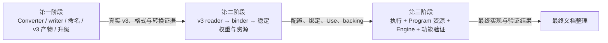

# 模型与权重重构执行总计划

> 状态：三个实施阶段已完成。第三阶段与全链路两轮审查均已闭合；后续单独整理长期文档。
> 本文及各阶段计划是临时工作文档，完成整个重构后清理。

本计划将[重构纲领](model-weight-execution.md)与已审查的模块合同组织为可执行阶段。
核心完成目标是：已有架构、配置和物理表示能力下，新的训练实例或混合 recipe 通过数据接入，
不再要求完整权重 profile、复制计算图或 checkpoint 专属执行注册。

实施分为三个阶段，最后单独整理文档。引擎侧占第二、第三阶段；阶段内部按依赖推进，
中间可以出现编译失败、功能暂时不可用和接口不匹配。全部阶段共同完成一次产品合同切换。

## 1. 执行依据与核心要求

### 1.1 目标合同

| 合同 | 负责的事实 |
|---|---|
| [重构纲领](model-weight-execution.md) | 解耦目标、所有权、固定执行与优化边界 |
| [模型公共合同](model-contracts.md)、[Qwen3.5 合同](qwen3_5-model-contracts.md) | 固定数学、小的 config、逻辑参数、组件及状态语义 |
| [v3 容器规范](artifact-container.md) | 文件、目录、对象、Binding、Use、资源与格式名称 |
| [权重转换](weight-conversion.md) | 源适配、recipe、方法、writer 与转换证据 |
| [权重加载](weight-loading.md) | 需求收集、语义绑定、物化、稳定引用及原生参数 |
| [模型运行时](model-runtime.md)、[Program 资源](program-resources.md) | 实际调用、配置接入、容量、生命周期、Graph 与 Engine 接入 |
| [引擎代码组织决策](2026-09-14-engine-code-organization.md) | 第二、第三阶段共用的最终目录、文件职责、构建依赖及实现核对 |

执行计划规定工作顺序、阶段结果和证据，不复制上述字段、公式及接口合同。本轮新确定的
执行安排以本文和阶段计划为准，包括第一阶段同步代码格式名称、独立单文件升级脚本，
以及最后集中整理长期文档。

### 1.2 直接达到最终目标

- 以最终职责和数据合同实现模块，替换时移除其旧入口、别名、完整 profile 和相关测试约束。
- 尚未接通的消费者按目标接口继续修改。中间不为保持编译或运行增加兼容 wrapper、双版本
  runtime、旧 inventory 转接层或临时执行分支。
- 阶段拆分用于安排工作、检查局部结果和定位问题，不要求每个中间状态具备完整产品功能。
  局部模块已经可检查的正确性仍须建立，整体不可编译不能掩盖该模块自身的问题。
- 离线对照材料按当前核对需要保留，完成核对后清理副本与临时工具。新运行时最终只接受 v3，
  V2 支持留在本次交付的离线升级脚本中。

所属阶段计划只记录有交接价值的完成结果、检查结论、尚未接通的边界及依赖。阶段收尾时
移除过时待办与中间状态。对于检查失败，区分实现缺陷和明确尚未迁移的消费者。

### 1.3 代码质量随实现交付

每项工作同时完成职责、依赖方向、所有权、命名、错误上下文和格式。需要改造的代码按目标
重写；已有算法、物理工具和执行机制按具体能力复用。

C++/CUDA 遵循仓库 [.clang-format](../../.clang-format)，Python 使用明确的数据与方法边界、
一致的类型表达和清理责任。重命名同步文件、符号、include、构建目标、测试及实际调用方。
旧的输入假设、重复实现和未使用代码随所属改造清理，代码质量不延后到最终文档步骤。

各阶段随模块改造审查现有测试，按仍有效的行为与独立证据决定保留、重写、合并或删除。
不为保住不合理的测试改变目标设计、恢复旧约束或扩展功能；合理测试揭示的实现缺陷仍须修复。

### 1.4 文档和中间记录

前三阶段的进度、临时限制、命令和结果只写入本组执行计划及其引用的本地结果文件。
README、用户指南、长期维护文档和文档导航在最后统一整理。

必要的代码内接口说明、测试 fixture、构建规则和可执行 `--help` 随代码更新。若实现发现目标
合同有实质错误，先明确其影响，修正相应权威；不把阶段状态写成长期合同。文档入口替换产生的
失效链接只做必要修复。

## 2. 阶段安排与交接

| 阶段 | 范围与主要特点 | 阶段交付 | 当前状态 |
|---|---|---|---|
| 第一阶段：Converter 与 v3 产物 | 生产侧完整重写；同步格式命名；能独立于新引擎工作 | 新 converter/writer、官方 v3、升级脚本、等价和转换证据 | [已完成并验收](2026-09-13-model-weight-refactor-phase-1.md) |
| 第二阶段：引擎权重加载链 | 先 reader，再 binder，接通物化与稳定数据；按目标重写协调接口 | 真实 v3 到正确绑定、Use、资源和 owning backing | [实施与阶段验证已完成](2026-09-14-model-weight-refactor-phase-2.md#8-阶段交接结果2026-09-14) |
| 第三阶段：引擎整体接入 | 固定执行、资源准备和 Engine 同时改用新输入，复用现有机制 | 现有适用功能和核心解耦目标通过验证，旧合同移除 | [实施、验证及两轮审查已完成](2026-09-14-model-weight-refactor-phase-3.md#8-实施中的决策与工作记录) |
| 最终文档整理 | 以已完成实现核对所有受影响的长期说明 | 唯一现行合同、可用命令与导航，清理临时计划 | 实施完成后安排 |

第二阶段已按[详细计划](2026-09-14-model-weight-refactor-phase-2.md)交付加载链。
第三阶段承接实际 Model 接口，按[详细执行计划](2026-09-14-model-weight-refactor-phase-3.md)
组织固定执行、资源、Engine 接入与验证，内部工作块共同完成一次引擎切换。

### 2.1 第一阶段的边界

完整实现 Python 源访问、架构适配、recipe、转换方法协调、v3 writer 和 inspector，移除旧的
顶层转换组织及固定 Frontend 哈希约束。数值算法和已量化来源处理按现有能力复用。

同期将权重格式名称在 Python/C++ 及其代码消费者中统一，例如 W8 权重改名为 Q8；已有
codec/layout 数值和字节含义保持。生成当前五份官方产物，以及验证可选组件和混合组合所需
的少量产物。独立单文件脚本支持已知官方 v2 输入，升级验证以与直接生成 v3 的等价比较为准。

阶段交付证明数据生产正确。新的 C++ reader、完整 Engine 执行和端到端性能资格由后续阶段
建立。它们不构成第一阶段维持旧 runtime 或扩展 converter 检查的理由。

### 2.2 第二阶段的边界

实现顺序是通用 v3 reader、直接语义 binder、物化与稳定模型数据交付。检查 Python writer
与 C++ reader 的合同一致性，落实配置、逻辑覆盖、parent/view、Use、组件需求及实际驻留。

复用文件 I/O、编码几何、plane/view、有界 staging、完成事件及原始上传。交付对象的所有权
须足以脱离 reader 和加载临时数据；依赖 Program 地址或当前 shape 的部分留在真实准备位置。
目录重组随加载模块落到最终职责。具体工作块、独立构建、真实输入和检查边界见
[第二阶段执行计划](2026-09-14-model-weight-refactor-phase-2.md)。

### 2.3 第三阶段的边界

已有层循环、固定融合、闭合 Op、Program 状态事务、调度与 Graph 是接入基础。执行选择改为
架构/config，实际调用和资源查询消费同源绑定与 Use，统一原生许可解释，完成 Engine/Frontend
构造、所选组件资源和身份用途的整理。

该阶段同时承担完整功能验证和旧路径移除。执行与资源准备相互依赖，作为一个阶段贯通。
主要实施由主 agent 完成；随后使用多名 subagent，先全面审查第三阶段任务，修复并复查
通过后，再审查第一至第三阶段的整个重构全链路。两轮均由主 agent 核实、修复并汇总。
具体职责落点、联调顺序、真实产物、验证安排和收尾要求见
[第三阶段执行计划](2026-09-14-model-weight-refactor-phase-3.md)。

## 3. 整个重构的完成依据

### 3.1 核心解耦

至少用实际结果证明下列变化通过同一数据链完成：

- 已有配置的不同训练实例及未登记的实例名称接入相同架构实现。
- 已有格式能力组成新的混合 recipe，绑定、固定调用及资源需求来自实际参数。
- Text 必需；可选组件及 proposal 私有数据按声明和启动选择参与转换、加载与准备。
- 合法但缺少实现的组合由真实消费者报告不支持；数据检查、Op 资格和运行准备分别履行合同。

模型数学继续写在固定代码中，保持专用化、融合和 CUDA Graph。新增数学、codec/layout 或 Op
能力仍按其真实实现扩展。本次支持范围以当前五份官方产物及其已有功能为基线。

### 3.2 现有能力与数值、性能

五份当前官方产物覆盖其原有 Text、Vision、MTP 和评分能力；35B-A3B 保留 DFlash，当前
Qwen3.8 两份产物保留 DFlash2。已有 prefix、batch、状态恢复、停止/提交、KV 存储、Graph、
采样模式和产品协议在适用路径上验证。

转换的编码数据与精确变换采用精确比较。现有 Op 资格按实际复用范围承接，发生算术路线或
数值边界变化的部分补充独立 oracle。真实 artifact 的执行检查显式指定文件，跳过不计为通过。
GPU 集成验证串行进行。

端到端比较使用有代表性的相同 workload，检查 prefill、decode、批处理及资源占用。优先复用
已有证据；有未解释的差异时再定向调查。后续阶段计划确定具体用例，不把全部选项的笛卡尔积
作为默认工作量。

### 3.3 最终代码与文档

前三阶段结束时，生产代码、工具、构建和测试已采用最终接口，受影响的旧实现和兼容入口
已经移除；运行时只加载 v3，官方产物和独立升级脚本可交付。

最后核对长期目标文档与实际实现，整理使用说明、命令、相关 artifact/格式/Engine 文档、
导航及必要的项目规则。实际功能范围以完成的实现和验证结果为准。

## 4. 计划维护与生命周期

总计划保存阶段边界和共同要求；阶段计划保存本阶段详细任务、检查结果及交接。
状态只在所属位置更新，字段和数学规则继续引用其模块权威。本计划接替已完成的文档编写计划。

阶段交付时说明：已经达到的结果、真实产物及证据位置、尚未验证的范围，以及会影响下一阶段
设计的具体问题。接口已经确定的部分按实际代码交接，新的架构决策在展开后续计划时讨论。

阶段计划保留至整体文档整理，以便核对前后交接；整个重构完成或放弃后，清理总计划、各阶段
计划及临时导航。独立升级脚本是面向已有用户的交付物，其保留不依赖这些工作计划。
