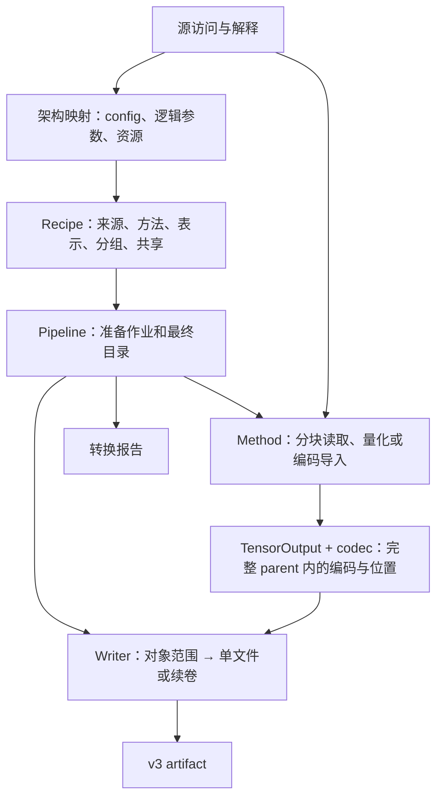

# 重构第一阶段交付：Converter、格式命名与 v3 产物

> 状态：已完成并通过功能验收，2026-09-14 收尾。
> 本文保存第一阶段交付和后续输入；与[执行总计划](2026-09-13-model-weight-refactor-execution-plan.md)
> 一起保留至整个重构的最终文档整理。

本阶段完成 Python 生产侧的重写、Python/C++ 权重格式命名统一、五份官方 v3 的直接生成和
已知官方 v2 的独立升级工具。新 converter 和升级脚本均已通过功能验收。

C++ v3 reader、binder、Program/Engine 接入由第二、第三阶段承担。目前的 C++ 引擎尚不能
消费这些 v3；生产侧验收与后续引擎功能、数值和性能验收分别成立。

## 1. 已完成的结果

| 交付 | 最终结果 |
|---|---|
| 新 converter | 显式来源、架构映射、可选组件、recipe、用户方法、作业生成和转换报告已贯通 |
| V3 文件工具 | 标准库 reader/writer/inspector；单文件与续卷、跨文件对象、区域写入与完整性检查 |
| 格式命名 | V3 持久名称和对应 Python/C++ 标识符、文件、include、构建、测试、benchmark 已统一 |
| 官方产物 | 当前五份官方 artifact 经新 converter 从 checkpoint 直接生成，保留既有数值方法与组件 |
| 离线升级 | 单文件标准库脚本覆盖七类已知 v2 输入，与对应直接生成 v3 的等价核对全部通过 |
| 扩展用例 | 真实 Text-only 混合产物，以及自定义方法、资源覆盖、分片和 DFlash2 query/context 小用例 |
| 质量与整理 | 职责清晰的 Python 模块、44 个保留行为测试、原路径 v3、已清理的临时材料 |

实现沿用[模型公共合同](model-contracts.md)、[Qwen3.5 合同](qwen3_5-model-contracts.md)、
[v3 容器规范](artifact-container.md)和[转换合同](weight-conversion.md)。旧的 checkpoint 专属
converter 入口、完整 inventory 协调、Frontend 精确哈希约束和相关测试已移除。

数值能力覆盖 BF16、必要的 FP32/INT32、Q4/Q5/Q6/Q8、BF16 到逐行 FP8，以及当前已量化
FP8/NVFP4 来源的保值导入、解码与布局转换。完整 BF16→NVFP4 量化和校准属于后续独立能力。

Text 必需，Vision、MTP、DFlash、DFlash2 和 proposal 私有数据按所选范围生成。Recipe 可以
选择合法但当前缺少 Op 的组合；converter 负责来源、数值方法和目标编码，不建立引擎支持表。
Use 明确保存 A16Only、AllowA8、AllowA4，AllowA4 包含 A16/A8/A4；辅助值按使用位置绑定。

自定义 chat template 已能作为最终资源写入容器。运行时的模板识别、渲染和采样行为仍按
[已有迁移范围](model-runtime.md#6-engine-与-frontend-接入)接入。

## 2. 最终代码组织与数据流

### 2.1 转换侧

| 代码 | 职责 |
|---|---|
| [__main__.py](../../tools/convert/__main__.py) | CLI、显式来源、官方或用户 recipe 函数加载 |
| [sources/safetensors.py](../../tools/convert/sources/safetensors.py) | 文件头、索引、分块读取和直接 tensor 引用 |
| [sources/logical.py](../../tools/convert/sources/logical.py) | 惰性逻辑值、编码行引用、切片、转置和行重排 |
| [sources/compressed_tensors.py](../../tools/convert/sources/compressed_tensors.py) | 当前源 FP8/NVFP4 的字段、codes/scales 和 divisor 解释 |
| [model.py](../../tools/convert/model.py)、[qwen3_5.py](../../tools/convert/qwen3_5.py) | 逻辑参数及架构适配；精简 config、源轴映射、候选 packing groups |
| [recipe.py](../../tools/convert/recipe.py)、[official_recipes.py](../../tools/convert/official_recipes.py) | 表示和方法选择、顺序覆盖、分组/拆分/共享，以及官方具体分配 |
| [methods.py](../../tools/convert/methods.py) | 用户方法接口、内置方法适配、输入遍历、分块生成和辅助值 |
| [quantization/groupwise.py](../../tools/convert/quantization/groupwise.py) | Q4/Q5/Q6/Q8 共用的分组整数量化算法 |
| [quantization/fp8_row.py](../../tools/convert/quantization/fp8_row.py) | BF16 到 E4M3FN codes 与 BF16 row scales 的数值算法 |
| [resources.py](../../tools/convert/resources.py)、[proposal.py](../../tools/convert/proposal.py) | 最终资源和 token 域；频率 shortlist 与 indexed proposal head |
| [pipeline.py](../../tools/convert/pipeline.py) | 固定作业、协调生成/写入、记录转换报告 |

量化文件按算法族组织：四种分组整数共用参数化算法，逐行 FP8 有独立的舍入规则。
已量化来源解释与目标量化分开；用户可直接构造逻辑来源或提供方法函数，复用目标输出接口。

### 2.2 Artifact 侧

| 代码 | 职责 |
|---|---|
| [formats.py](../../tools/artifact/formats.py)、[layouts.py](../../tools/artifact/layouts.py) | 持久数值格式及 shape、plane、offset、padding、encoded size |
| [codecs/](../../tools/artifact/codecs/__init__.py) | direct、row_split、fp8_row、nvfp4 的精确编码/解码及布局变换 |
| [tensor_output.py](../../tools/artifact/tensor_output.py) | 将 typed values 或 codes/scales 分块放到完整 parent 的正确位置 |
| [schema.py](../../tools/artifact/schema.py) | 目录记录、对象、Binding/Use 引用和结构检查 |
| [framing.py](../../tools/artifact/framing.py) | Reader/writer 共用的文件头和文件对齐常量 |
| [reader.py](../../tools/artifact/reader.py)、[writer.py](../../tools/artifact/writer.py) | 文件集合、范围读写、分片、覆盖检查和最终发布 |
| [file_io.py](../../tools/artifact/file_io.py)、[inspect.py](../../tools/artifact/inspect.py) | 底层文件操作与容器检查命令 |

Reader、writer、inspector、目录和几何模块只依赖标准库。Codec 与 tensor output 显式引入
数值库；artifact 不反向依赖模型或 recipe。各包入口注释记录职责和依赖方向。



分组整数的 scale 舍入、code 选择、源 cast、packing、padding 和 NVFP4 swizzle 沿用已验证
实现。代码重命名和模块搬移保持这些数值边界。权重格式 W8 已改名为 Q8，执行精度 W8A8
与 KV INT8 继续按各自含义保留。

## 3. 实际产物与使用入口

### 3.1 官方 v3

以下五份文件均为新 converter 的直接生成结果，保持既有路径；每份保留相邻的
`<文件名>.conversion.json`。它们均为单文件，包含 Text、Vision、MTP 和 proposal。

| 路径 | Recipe 名称 | 额外组件 |
|---|---|---|
| `out/qwen3_6_27b.ninfer` | `qwen3_6_27b` | 无 |
| `out/qwen3_6_27b_nvfp4.ninfer` | `qwen3_6_27b_nvfp4` | 无 |
| `out/qwen3_8_27b.ninfer` | `qwen3_8_27b` | DFlash2 |
| `out/qwen3_8_27b_nvfp4.ninfer` | `qwen3_8_27b_nvfp4` | DFlash2 |
| `out/qwen3_6_35b_a3b.ninfer` | `qwen3_6_35b_a3b` | DFlash |

源根目录为 `/home/neroued/models/llm/qwen/`，实际来源记录在转换报告中：

| Recipe | 根目录下的来源 |
|---|---|
| `qwen3_6_27b` | `Qwen3.6-27B/base-hf-bf16` |
| `qwen3_6_27b_nvfp4` | 上述 BF16 源；`quantized=Qwen3.6-27B/vllm-nvfp4-bf16` |
| `qwen3_8_27b` | `Qwen3.8-27B/base-hf-bf16`；`dflash2=Qwen3.8-27B/dflash2` |
| `qwen3_8_27b_nvfp4` | 上述 BF16、DFlash2 源；`quantized=Qwen3.8-27B/vllm-nvfp4-fp8` |
| `qwen3_6_35b_a3b` | `Qwen3.6-35B-A3B/base-hf-bf16`；`dflash=Qwen3.6-35B-A3B/dflash-bf16` |

Proposal 使用 `tools/freq_corpus/fixtures/ranking/ranking.train.counts.i64`，默认 131072 行。
运行所需事实已进入 v3；`.conversion.json` 提供来源、方法、组件和生成环境等 provenance。

### 3.2 转换与检查入口

维护者解释器为 `/home/neroued/miniconda3/envs/py311/bin/python`。在仓库根目录运行，
`--recipe` 接受上表中的名字或 `file.py[:function]`；`--override` 可在官方分配后覆盖局部选择。
`--components` 默认仅 text，`--proposal` 显式加入 proposal，`--resource ROLE=PATH` 覆盖资源。

例如，生成包含全部现有组件的 Qwen3.8 NVFP4/FP8 产物：

```bash
/home/neroued/miniconda3/envs/py311/bin/python -m tools.convert \
  --model /home/neroued/models/llm/qwen/Qwen3.8-27B/base-hf-bf16 \
  --source quantized=/home/neroued/models/llm/qwen/Qwen3.8-27B/vllm-nvfp4-fp8 \
  --source dflash2=/home/neroued/models/llm/qwen/Qwen3.8-27B/dflash2 \
  --recipe qwen3_8_27b_nvfp4 \
  --components text,vision,mtp,dflash2 --proposal \
  --out /path/to/output.ninfer
```

输出及相邻报告路径必须尚不存在。默认文件上限为 32,000,000,000 字节，计入 framing；
续卷按 `<入口完整文件名>.part-0001` 起命名，读取侧按 files 表定位。`--max-file-bytes` 可
调整上限，`--device` 和 `--rows-per-chunk` 控制转换执行。

```bash
/home/neroued/miniconda3/envs/py311/bin/python -m tools.artifact.inspect out/qwen3_6_27b.ninfer
```

### 3.3 后续验收用例与本地整理

以下路径相对于 `out/refactor-cases/`，各用例的 recipe、报告及必要小来源随文件保留：

| 路径 | 已表达的行为及后续用途 |
|---|---|
| `qwen3_6_27b_text_mixed.ninfer` | 真实 BF16 来源的 Text-only；Q8 embedding/head、第 3 层 BF16 attention，其余沿原 recipe；无 Vision/spec/proposal |
| `custom_method/custom.ninfer` 及三份续卷 | 用户来源/方法、模板覆盖、四种格式的独立 attention parent，16 KiB 文件上限 |
| `dflash2_query_context.ninfer` | 小合成 Text/DFlash2；query K 为 Q8、context K 独立 BF16，query/context V 共享 Q8 区域 |

小合成用例用于容器和绑定验证，其 kernel shape 尚未取得引擎资格。真实混合产物的完整执行
同样交由引擎阶段验证。

`out/` 只保留上述官方 v3、相邻报告和 `refactor-cases/`。原 v2、升级副本、两份早期直接生成
对照、备份、日志、临时比较脚本和工具安装目录均已清理。大产物和本地验收材料按仓库规则
不纳入 Git；官方转换方法、升级工具和长期行为测试纳入代码交付。

## 4. V2 升级与已经完成的等价核对

[upgrade_ninfer_v2_to_v3.py](../../tools/upgrade_ninfer_v2_to_v3.py) 是可单独复制和分发的
标准库脚本，内置当前官方输入的元数据与映射，运行不依赖仓库 Python 包、源 checkpoint 或 GPU：

```bash
/home/neroued/miniconda3/envs/py311/bin/python tools/upgrade_ninfer_v2_to_v3.py \
  /path/to/input-v2.ninfer /path/to/output-v3.ninfer
```

升级保持原权重格式含义、数值、完整逻辑 payload 和原间隙，只重新组织 framing 与元数据。
脚本根据 v2 identity 和实际目录识别五份当前产物，以及两份尚无 DFlash2 的早期 Qwen3.8
产物；早期输入不会被补入未携带的组件。

七类输入均已完成升级，并与相同源、方法、组件及资源选择下直接生成的 v3 核对通过：

- 架构/config、组件、proposal、逻辑行序、parent 分组与共享关系一致。
- 对应权重 parent 的 shape、format/layout、codes/high bits/scales、divisor 和内部 padding 一致。
- Use 许可、按引用解析的辅助数值，以及对应资源角色的字节一致；FP32 scalar 比较实际 word。

对象 ID、对象间偏移、文件分段、artifact ID 和 provenance 可以不同。前三类输入采用分块
字节比较，后四类采用对应 payload 的 SHA-256；元数据与引用关系另行核对。这验证了相应
编码及语义关系的等价，比较完整文件的 SHA-256 不适用于两个合法但 framing 不同的产物。

该一次性升级工具不建立长期测试套件；临时比较工具及其测试已移除。升级脚本继续供已有
用户使用，后续正常运行时只接受 v3。

## 5. 验证结果与下一阶段交接

### 5.1 已完成验证

| 范围 | 证据与结果 |
|---|---|
| Python 行为 | Python 3.11.14，`python -B -m pytest -q tests`：44 个用例全部通过 |
| 数值、布局和映射 | 保留的测试使用已知 words/bytes、独立解码和有辨识度的行数据，覆盖舍入、padding、FP8/NVFP4 导入、Q/gate/GDN/expert 映射 |
| Recipe 与文件流程 | 混合/行覆盖、分组/共享、Use 辅助值、组件省略、自定义方法/资源、单文件/分片及发布失败清理通过 |
| 真实转换与升级 | 五份当前官方直接生成成功；七类 v2 与对应直接生成 v3 的等价核对通过 |
| C++ 格式命名 | Core/Op 库、四个 Q8 测试及相关 benchmark 构建成功；四个 Q8 数值测试通过 |
| 文件核心依赖 | 禁用 site packages 后 reader/writer/inspector 可导入，并成功读取真实 v3 |
| 代码质量 | Python 3.11 语法、Black 格式和 diff 检查通过；C++ 变更按项目 clang-format 整理 |
| 媒体输入回归 | `ninfer_media_decode_test` 构建和测试通过 |

Python 测试审查由 83 个用例精简为 44 个：artifact/converter 43 个，benchmark 指标 1 个。
保留行为、数值与真实回归保护，删除重复实现、固定内部组织和低收益枚举，强化仅检查 shape
或自洽结果的旧用例。临时脚本不添加测试，后续测试继续围绕长期维护的行为选取。

真实转换报告记录 PyTorch `2.11.0.dev20260210+cu128`、其 CUDA runtime 12.8，设备为 RTX 5090。
C++ 工具链为 CUDA 13.1，目标 `sm_120a`；相关数值验证与既有代码复用范围一致。
四个 C++ 测试为 `ninfer_linear_q8_a16_test`、`ninfer_linear_add_q8_a16_test`、
`ninfer_linear_pair_q8_a16_test`、`ninfer_linear_swiglu_q8_a16_test`，可通过对应构建目标和
`ctest --test-dir build --output-on-failure -R '^ninfer_linear(_add|_pair|_swiglu)?_q8_a16_test$'`
运行。这里没有新增端到端性能结论。

### 5.2 下一阶段输入

第二阶段接收已固定的 v3 合同、上述 Python writer/reader、五份官方产物及三组本地用例，
据此讨论 C++ reader、语义 binder、物化和稳定权重数据的详细计划。本阶段没有阻塞下一阶段
设计的未决事项。

完整推理与评分、所选 Vision/spec、批处理、prefix reuse、状态事务、资源容量和 CUDA Graph
尚待引擎接入后验证；现有执行能力沿已审查合同复用。长期产品说明、格式文档和命令导航在
整个原子切换完成后统一整理。本记录收敛交付结果，后续进展记入相应阶段计划。
