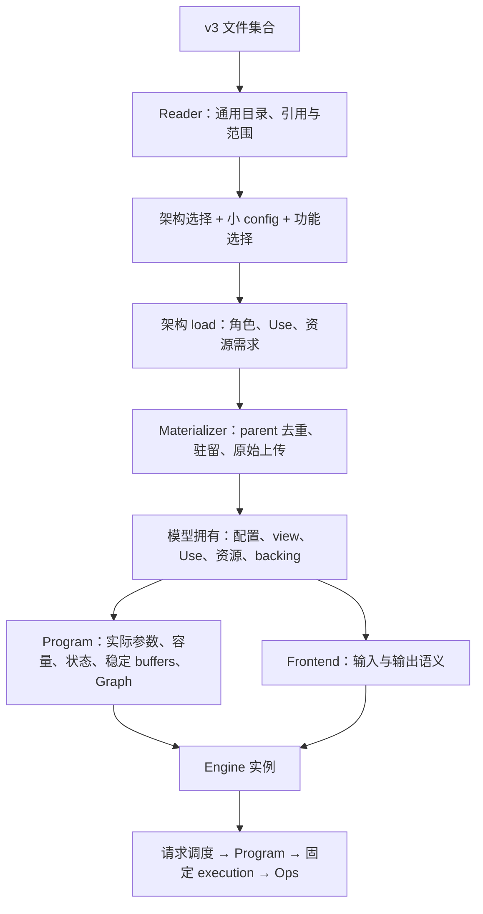
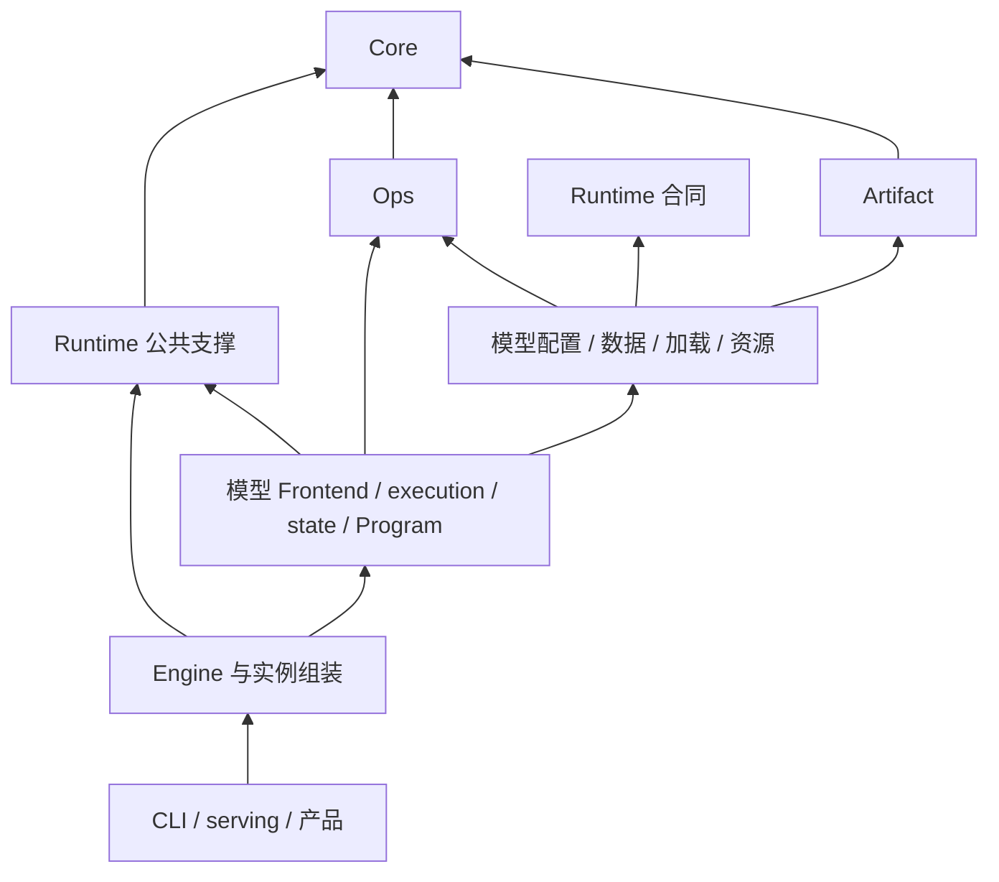

# 引擎重构：全局代码组织决策与实现核对

> 状态：目录和职责边界已确认，加载模块已按第二阶段落地；执行与 Engine 整理留在第三阶段。
> 本文服务于第二、第三阶段的共同设计；实现核对基于第一阶段收尾后的代码。
> 新架构推演用于检查扩展边界，不增加本次模型支持范围。

本次确定整个引擎的最终组织，再据此划分加载与执行接入工作。目录跟随长期职责：容器负责
表达与读取数据，模型负责数学和固定执行，Program 管理该执行的资源与状态，Engine 管理请求。
同架构换训练权重或组合已有格式，改变实例数据，不新增一套目录、完整 profile 或执行注册。

领域与数值合同继续由[重构纲领](model-weight-execution.md)、[模型合同](model-contracts.md)、
[容器](artifact-container.md)、[加载](weight-loading.md)、[模型运行时](model-runtime.md)和
[Program 资源](program-resources.md)拥有。本文记录代码落点、依赖与实施约束。
整个重构完成后，将最终源码导航归入维护文档，再清理这份工作决策记录。

## 1. 已确认的全局选择

| 选择 | 最终组织及含义 |
|---|---|
| 按数学架构组织模型 | `src/models/qwen3_5/` 承接当前 Dense/MoE 的共享部分与各自实现；release 和尺寸不再各自成为完整 package |
| 标准身份与代码共享分别处理 | 沿用 `Qwen3_5ForCausalLM`、`Qwen3_5MoeForCausalLM` 等上游名称；共用目录仍明确区分 Dense/MoE 数学 |
| 模型拥有完整实现 | 配置、只读数据、加载、Frontend、计算、状态和 Program 在同一架构目录下，内部按实际职责拆分 |
| 公共运行控制集中 | `runtime/contract/` 放协作合同，`runtime/engine/` 放请求控制和公共资源政策；架构内使用 `program/` 表达具体执行责任 |
| 维持有效的底层分工 | Core 保留物理原语，Ops 保留闭合数学及原生分派，Artifact 保留通用数据机制 |
| 内部头文件直接表达归属 | 模型使用 `models/qwen3_5/...` include，移除当前模型 `export/ninfer/targets/...` 和笼统的 `impl/` 外壳 |
| 保留当前 Op 文件组织 | 合同仍在 `include/ninfer/ops/`，实现仍在 `src/ops/`；复杂 Op 按自身数学和实现路径组织 |

以下文件树确定职责落点。相邻的小实现可以合并，复杂实现可以在所属目录内继续拆分；
新增文件应有实际消费者。模板实现可以保留在头文件或 `*_impl.h`，由有限入口显式实例化。
这不要求把全部模板改为普通 `.cpp`，也不要求每个未来架构建立全部子目录。

## 2. 公共设施与接口

### 2.1 顶层

```text
include/ninfer/
  engine.h                         产品 Engine 接口
  types.h                          产品输入、选项和结果
  ops/                             仓库内闭合 Op 合同

src/
  core/                            物理数据、分配、传输与设备原语
  artifact/                        通用容器读取、绑定设施与物化
  ops/                             闭合 Op 实现
  models/                          架构定义、加载、Frontend、执行与 Program
  runtime/
    contract/                      跨架构运行协作合同
    engine/                        请求控制、资源政策与实例组装
  text/                            已有的通用文本基础，例如 Unicode
  media/                           通用媒体解码
  product/                         产品输入获取及公共产品设施
  serve/                           协议与传输
```

CLI、服务和评分仍经过公开 Engine。模型 Frontend 处理输入的模型语义，产品层取得媒体，
服务层解释协议。此次目录整理沿用现有产品行为，包括模板的现有识别与渲染能力。

### 2.2 Core 与 Artifact

```text
src/core/
  tensor.h/.cpp                    激活等普通 Tensor
  weight.h                         权重格式、layout 与基础物理记录
  weight_view.h/.cpp                完整 parent 与逻辑区域的物理寻址
  ...                              arena、device、KV、state、Graph 等现有原语

src/artifact/
  framing.h                        v3 文件头与 framing 常量
  schema.h/.cpp                    目录记录、ID/引用、对象与 Binding/Use 描述
  formats.h/.cpp                   持久格式名称及已知编码解释
  layouts.h/.cpp                   编码几何、plane、padding 与 stride
  file_io.h/.cpp                   文件集合、范围读取与 I/O
  reader.h/.cpp                    目录解析、通用结构与引用检查
  binder.h/.cpp                    逻辑需求的通用查询、覆盖检查、依赖收集
  views.h/.cpp                     对象句柄和 backing 到稳定物理 view
  materializer.h/.cpp              驻留计划、所有权、分配、上传、完成与统计
```

`weight.h` 从当前 `tensor.h` 分出权重专属定义。Core 的权重描述只涉及格式、几何、planes、
parent 与区域，不带 JSON、artifact 对象名、模型角色或 source 信息。
`artifact/layouts` 承接当前 `storage_layouts` 的编码几何，物理寻址中可共用的计算归 Core；
同一 plane 公式由一个实现提供，Artifact 和 Op 分别检查自己的输入合同。

两个 view 文件有不同输入：`artifact/views` 将对象引用解析为已驻留的地址；
`core/weight_view` 在已知 parent 的物理描述上解释区域。后者可被 Op 和独立测试直接使用，
不要求先构造容器。完整对象尺寸、view 逻辑形状、plane 区间分别保留。

通用 binder 提供机制；某架构需要哪些角色、shape 和 Use，写在该架构的 `load/`。
Materializer 消费独立的驻留计划，不依赖架构 binder 的临时对象。对象句柄、放置记录与拥有
存储的结果分别定义，读取、需求收集和地址绑定不会形成反向依赖。

Op 参数准备属于相应 Op。模型 `load/prepare.cpp` 调用它，补充组件、层和用途的诊断上下文；
Artifact 保持对 Core 和通用数据合同的依赖，融合选择由模型 execution 拥有。
只能在 Program 地址确定后完成的准备，留在
Program 的真实准备位置。支持判断仍发生在实际准备、workspace 查询、warmup 或调用处。

## 3. 一个架构的完整组织

```text
src/models/
  registry.h/.cpp                   标准架构名到已编译实现的唯一选择
  load_options.h                    与加载有关的功能选择

  qwen3_5/
    config.h/.cpp                   小的实例配置与派生数学几何
    model.h/.cpp                    只读模型实例及存储所有权
    weights.h                       稳定的层/组件权重记录与 Use
    load.h/.cpp                     架构加载协调入口
    load/
      bindings.h                   加载期间的角色、句柄与构造记录
      text.cpp                     Text 逻辑需求与绑定
      vision.cpp                   Vision 需求与绑定
      mtp.cpp                      MTP 需求与绑定
      dflash.cpp                   DFlash 需求与绑定
      dflash2.cpp                  DFlash2 需求与绑定
      resources.cpp                按角色取得 Frontend/语义资源
      prepare.cpp                  调用原生参数准备、形成只读结果

    frontend/
      frontend.h/.cpp              模型输入输出门面
      resources.h/.cpp             已取得的只读资源与解析结果
      tokenizer.h/.cpp             本架构的 tokenizer 语义
      chat_template.h/.cpp         现有模板识别与渲染
      prepared_prompt.h            语义输入、位置与媒体对应
      prompt.cpp                   语义输入的构造
      output_session.h/.cpp        增量输出、停止与格式语义
      processor.h/.cpp             已启用 Vision 的预处理语义
      media_cache.h/.cpp           本架构的媒体复用
      tool_call_parser.h/.cpp      工具调用文本解释
      digest.h/.cpp                Frontend 内容身份计算

    execution/
      text.*                      层循环与固定阶段调用
      attention.*                 Attention 的固定实现
      gdn.*                       GDN 的固定实现
      dense.*                     Dense FFN
      moe.*                       MoE FFN
      vision.*                    Vision tower 与 merger
      mtp.*                       MTP 数学调用
      dflash.*                    DFlash 数学调用
      dflash2.*                   DFlash2 数学调用
      workspace.h                 执行与容量共用的临时布局写法

    state/
      topology.h                  实例的状态组成及索引
      decoder_state.h/.cpp        KV/GDN 等状态的语义组合与视图
      state_image.h/.cpp          完整可恢复状态的描述、布局与操作

    program/
      program.h                   提供给 Engine 的架构运行接口
      program_impl.*              实例实现与协调
      prefill.*                   Prefill 执行和阶段推进
      decode.*                    Decode 执行和批次推进
      scoring.*                   离线评分
      round_buffers.*             稳定的轮次输入、输出与临时记录
      prefix_identity.*           已提交前缀的执行来源与等价关系
      graphs.*                    实际捕获、更新、重放与图实例
      speculative/
        mtp.*                     MTP 轮次及接受/提交
        masked_draft.*            DFlash/DFlash2 共用的轮次事务
        target_verification.*     Target 验证及提交配合
      planning/
        startup.*                 由实际模型和启动选项形成容量
        request_plan.*            请求可行性与资源计划
        pressure_planner.*        本架构可执行的压力处理方案
      storage/
        state_store.*             状态槽、镜像与副本所有权
        kv_store.*                逻辑 KV 与 device 驻留管理
        host_kv_store.*           Host KV 驻留管理
        continuations.*           Continuation 与 checkpoint 的所有权
        transitions.*             状态迁移、复制和事务执行
```

### 3.1 数据与计算

`config` 保存必要的实例参数，并计算 attention/GDN compact 索引、投影宽度和状态几何。
`weights` 保存实际 parent/view、各 Use 及相应原生参数记录，按逻辑层和组件组织。
`model` 集中拥有这些只读记录和 backing。执行头文件引用稳定数据，不引用加载工作表。

Dense/MoE 在 FFN 数学和专用叶子上分开；确有相同语义的层循环、Frontend、Program 算法
可以共用。维度适合数据驱动的部分由 config 提供；head/tile 或固定 shape 的专用化仍直接
编译。每个专用化覆盖其真实几何，格式分配留在相应层的实际参数中。

跨 Op 的融合写法留在 `execution`：例如普通 GDN 与投影/卷积/快照融合路径，是维护者
编写的有限实现。Op 准备只处理自身原生输入。执行及其 workspace 计算消费同一份参数，
保留已有融合、专用 kernel 和 phase 分派。

### 3.2 三种状态责任

| 位置 | 回答的问题 | 具体例子 |
|---|---|---|
| `state/` | 继续执行需要保存什么，值和位置如何解释 | 哪些层有 KV/GDN；恢复 frontier 所需的 recurrent state、卷积历史及 draft 上下文 |
| `program/storage/` | 状态放在哪里，由谁拥有，何时有效 | 槽位、checkpoint、副本、page 引用、预留、复制完成和释放 |
| `program/planning/` | 当前资源能执行哪些操作 | 接纳、恢复、压力处理、捕获和本轮物化方案 |

执行函数可以更新调用方交给它的 KV/GDN 或 replay records；Program 决定所属请求、槽位、
有效前缀和提交边界。模型状态的数学语义与状态存储的生命周期在调用处衔接。

`round_buffers` 拥有轮次输入输出、logits、采样记录和 pending features 等稳定地址。
其中部分内容只在一轮内有效。CUDA Graph 需要地址稳定，不会把这些字节都变成持久模型状态。
Core 保留分配、原始状态复制、KV plane 和 Graph 句柄等原语。

### 3.3 Frontend 与可选组件

Frontend 资源按启用功能解析。Tokenizer 的有效 token 域既用于加载期的语义核对，也用于
实际 Frontend；使用同一份拥有存储的解析结果。Vision 关闭时，Text 构造不要求 processor
配置。模板仍按当前运行能力消费，保存自定义模板与新增渲染支持分别处理。

Text 必需。Vision、MTP、DFlash、DFlash2 及 proposal 的私有权重由所选功能产生需求；
未启用部分不要求物化，artifact 也可以完全不提供。跨组件共享的 parent 按实际引用去重。
DFlash2 的数学调用位于 `execution/dflash2`，共用 masked draft 算法位于
`program/speculative`，私有可恢复数据进入状态定义和相应存储。

Frontend 记录准备输入的语义身份；Program 记录已经提交的执行前缀及可恢复 frontier。
两者分别服务输入匹配和实际状态复用。

## 4. Runtime、构造顺序与构建边界

### 4.1 公共 Runtime

```text
src/runtime/
  contract/
    request.h                     准备/提交协作所需的公共请求描述
    execution.h                   轮次、提交、终止与公共执行结果
    resources.h                   容量摘要、资源政策与事务协作数据
    timing.h                      运行统计与时间合同
    sampling.h/.cpp               共用采样语义
  engine/
    engine.cpp                    公开 Engine 接入
    engine_core.h                 公共请求与执行控制
    model_instance.h/.cpp         拥有模型、Frontend 与 Program，协调构造
    request_record.h              请求控制记录
    scheduler.h                   FIFO 与紧凑批次调度
    admission_policy.h/.cpp        公共接纳政策
    generation_budget.h           生成预算
    causal_score_core.h           公共评分控制
    kv_capacity.h/.cpp            公共 KV 容量决策
    public_types.cpp              产品类型的实现
    context_cache/
      resource_manager.h          公共资源及缓存政策
      materialization_planner.h   公共物化选择
      shared_capture_planner.h    公共共享捕获选择
      resource_search.h           公共资源搜索
      materialization_budget.h    公共物化预算
      context_portfolio_value.h   缓存组合价值
      context_cost.*              公共成本模型及默认值
```

公共合同只包含实际跨边界使用的事实。Qwen 的 PreparedPrompt 内容、状态镜像、具体
RequestPlan 和不透明资源句柄仍由 Qwen 定义。当前 `EngineCore<Instance>` 和
`ResourceManager<Package>` 的静态适配方式可以保留；架构提供符合协作合同的具体类型和操作。
相应适配声明靠近模型/Program 接口，删除其中的完整 `WeightsProfile` 和 release 身份职责。

`models/registry` 维护标准架构名与编译入口的对应。`model_instance` 对已经选中的具体实现
组装 Frontend 和 Program，不再维护一份 checkpoint/recipe 名称表。
选择结果可用有限的具体类型分派，在一次构造后进入直接调用。
后续请求使用已有实例，单卡、单 resident model 和启动固定并发的产品边界保持。

### 4.2 从容器到请求



这张图表示最终事实流。构造中可以先读取少量 Host 资源以解析 token 域，或者在上传前
计算不依赖地址的布局。需要读 device 数据的消费者等待相应上传完成。

Program 的容量依据是实际权重/Use、固定执行写法、启用组件与启动范围。权重驻留字节由
物化计划和结果给出，workspace 由实际 Op 参数给出，状态容量由架构状态拓扑给出。
绑定结果改变时，这些消费者沿同一数据链得到新的事实。

加载临时句柄和 Reader 不进入 token 路径。只读模型拥有其引用所需的 Host/device 存储，
Frontend 和 Program 借用或共享这些拥有存储的结果。清理顺序为：结束请求和未完成工作，
销毁 Program/Graph 和 Frontend，再释放模型 backing；设备上下文覆盖这些资源的清理。

### 4.3 构建与 include 依赖



箭头表示依赖。Runtime 公共支撑可以消费合同和 Core，不链接具体模型；Core 不编译请求
政策。模型 Program 消费公共协作合同和必要工具，不包含具体 Engine 控制器。

构建至少要能独立编译通用 Artifact 和模型加载部分，加载检查不必把整个 Program 和
Engine 链接进来。只读资源解析有加载期消费者，因此与纯 Frontend 请求逻辑分别组织。
具体 archive 名称在实施时结合现有 CMake 确定，源文件列表继续显式维护。
Ops 的 CUDA 编译边界保留，尤其 NVFP4 现有 non-RDC archive 的要求。

测试继续按 `core/artifact/ops/runtime/models/<architecture>` 等行为领域组织，保留有效的
数学、状态和请求测试。测试随被测合同调整，不为目录或每个新文件建立对应测试。

## 5. 对现有实现的可行性核对

### 5.1 变化幅度并不相同

| 当前代码证据 | 实际工作与可复用部分 |
|---|---|
| [Reader](../../src/artifact/reader.cpp) 当前按 v2 的单文件、identity 与对象表解析 | 重写 v3 协调和文件集合范围定位；底层读文件的机制可以承接 |
| [Binder](../../src/artifact/binder.cpp) 的对象只能消费一次，`finish` 要求全量消费 | 重写成逻辑覆盖与物理依赖分别处理；同 parent 多引用和未选组件都改变了当前前提 |
| [Materializer](../../src/artifact/materializer.cpp) 已有 compact arena、分块 staging、slot event 和完成等待 | 保留上传与完成机制，改用 v3 读取区间及新的驻留计划，补齐 Host tensor/值需求 |
| [27B Variant](../../src/targets/qwen3_6_27b/impl/variant.h) 引入 `load/bindings.h` | 拆出稳定 `weights.h`；当前加载工作表、执行数据和实例 owning 结构混在同一条依赖里 |
| [共享实例](../../src/targets/qwen3_6/impl/runtime/instance.h) 与 [Text context](../../src/targets/qwen3_6/impl/runtime/text_context.h) 依赖 Variant 的静态 config | 保留数学专用化与共享算法，将实际层数、几何、层分布和绑定接入实例数据 |
| [布局](../../src/targets/qwen3_6/impl/runtime/layouts.h) 与 [Program 构造](../../src/targets/qwen3_6/impl/runtime/api_impl.h) 传递并比较 `weights_profile` | 实质修改规划输入和关联校验；改为关联同一个只读模型及其实际参数 |
| [StateImage](../../src/targets/qwen3_6/export/ninfer/targets/qwen3_6/state_image.h) 同时定义状态描述和 owning pools | 布局/视图归 `state`，池和存储生命周期归 `program/storage`；底层物理布局与复制可复用 |
| [EngineCore](../../src/runtime/engine/engine_core.h) 与 [ResourceManager](../../src/runtime/engine/resource_manager.h) 通过类型和操作协作 | 保留请求、政策和事务控制算法，接入新实例与合同；具体状态仍由模型 Program 解释 |

上层容器和加载协调需要重建；下层执行、状态与调度有大量算法可复用。目录调整须伴随旧
输入假设的清理，不能用移动后的文件名作为完成依据。以下几个交界处决定方案能否真正落地。

### 5.2 完整对象合同与子区域消费

当前 [FP8 校验](../../src/ops/linear/fp8/fp8_format.cpp) 根据 `weight.n * weight.k`
重算 scale plane，并要求 `qdata == payload`、scales 紧跟该完整矩阵的 code plane。
[NVFP4 校验](../../src/ops/linear/nvfp4/nvfp4_format.cpp) 同样从当前 shape 重算几何，
还包含 block 对齐、layout 和 divisor 条件。这些校验对完整对象是正确的；需要区分
逻辑绑定中的区域与原生 Op 实际消费的对象。

例如 Q/K/gate/V 分别绑定同一个 parent 的四段行，且满足现有融合入口的排列、几何及 Use
要求时，准备层直接交付原来的完整 parent。Op 沿用完整对象的布局合同和融合计算，逻辑上
存在四个 view 不要求 kernel 接收四份子矩阵。双 parent 入口同样按实际 grouping 准备。

只有实际调用需要单独消费子区域时，才需要相应的 view 参数合同。以 FP8 `[256,64]`
parent 的前 128 行为例，codes 起点仍为 P，scales 起点仍为 P+16384；若按独立
`[128,64]` 对象重算，则会错误地要求 scales 位于 P+8192。View 应保留原来的两段地址，
完整对象的 encoded-size 公式继续用于 parent。

[FP8 decode launcher](../../src/ops/linear/fp8/fp8_gemv.cu) 已分别向 kernel 传入 codes
和 scales。完整连续行、K 不变且满足原生 shape、对齐和读取范围时，已有计算主体有直接
复用的基础；参数与校验按实际 view 合同调整，不据此预设全部 kernel 都需重写。

NVFP4 还需保持 scale 的块内排列。起点按 128 行 block 对齐、包含完整 block 且 K 不变的
区域，可以分别移动 codes 和 scale blocks，保持原有块内寻址；具体路径仍检查其真实要求。
任意行起点或其他切分则可能需要额外的区域寻址能力，由相应消费者支持或报告不支持。
本次要求正确表达 parent/view 并承接实际消费能力，不将任意量化切片列为新增能力要求。

具体 plane 与区域关系见[加载规范](weight-loading.md#7-逻辑-view-与实际布局)。准备层向
Op 交付实际所需的地址、几何和数值，物化仍按 parent 去重，原有编码字节保持。
Activation divisor 和许可按 Use 取得，不能写回共享 parent，影响另一个用途。

### 5.3 原生参数与 workspace 必须来自同一输入

当前固定叶子已经能够调用 attention 单/双 parent 入口，以及 GDN、SwiGLU、residual 和
MoE 的融合实现。新 `execution` 保留这些写法，参数准备解析每一层实际的局部组合。
`weights.h` 可以保存有限的原生参数变体，不把所有层的形式汇总成一个模型 profile。

现有 `workspace_recipe.h` 使用相同布局写法对接 sizing 和实际分配，是可保留的基础。
其输入改为本次参数、phase 与 shape 范围，容量跟随实际路径。`AllowA4` 的许可集合包括
A16/A8/A4，原生 policy 解释和容量查询一并对齐，已有 kernel 按其真实能力选择。

加载和执行阶段共用这个最终参数合同。第二阶段可以先交付稳定 view/Use，尚未接入的
Op 与 Program 在第三阶段直接修改；中间编译失败不需要兼容参数包装来掩盖。

### 5.4 配置、资源和可选组件存在真实构造依赖

当前 [27B 加载](../../src/targets/qwen3_6_27b/impl/load/bindings.cpp) 对关闭的组件仍要求
权重齐全，只标记 ValidateOnly。新的需求收集只展开所选功能，Reader 仍检查整份目录的
通用引用和范围。未知或未选对象的数学/Op 支持不在此处做全模型预审。

当前 [Frontend 资源头](../../src/targets/qwen3_6/export/ninfer/targets/qwen3_6/frontend_resources.h)
同时包含 binder 句柄和 Frontend 数据；Frontend 构造又会建立 tokenizer 并读取 processor
配置。需要把取得资源、拥有解析结果和请求处理拆开：Text 先取得有效 token 域，绑定使用它，
Frontend 继续使用同一结果；Processor 由已启用 Vision 的需求触发。

当前静态数组和 compact 索引不能只换成新的 config 类型名。按实例构造稳定容器、计算索引，
然后在模型发布前冻结；数学尺寸对应的 kernel 专用化可以继续用模板。这个改动同时影响
层访问、KV/GDN 拓扑和 Program 的容量计算，是第二、第三阶段必须共享的输入边界。

### 5.5 构造和构建需要一起整理

当前 [registry](../../src/targets/registry.cpp) 先用身份解析 profile，再据 profile 规划容量，
随后物化并构造 Frontend/Program。目标构造将这些步骤的事实来源分别接到实际模型数据。
公开名称、sampling defaults、训练配对和成本模型资料保留各自用途，不再选择整套执行库存。

当前 [CMake](../../src/CMakeLists.txt) 把 admission、context cost、KV capacity 等 Runtime
实现编入 `ninfer_core`，又把各模型加载、Frontend、状态和执行一起编入 `ninfer_engine`。
需要按第 4.3 节拆开编译所有权。这样 reader/binder 的独立检查才真正不依赖未完成的 Engine。

Graph 的句柄与物理操作继续使用 Core；实际 exact-B、frontier 和 speculative 图定义归
Program。`GraphExecutionProfile` 表达已有图执行范围，与待删除的完整 `WeightsProfile`
不同，保留其实际职责并选择合适名称。

## 6. 扩展推演：加入 LlamaForCausalLM

选择纯 attention 的 `LlamaForCausalLM`，检查公共设施是否仍要求 Qwen 的 GDN、attention
gate 或位置结构。数学依据核对了本机 Transformers 的 `models/llama/modeling_llama.py`
中 `LlamaRMSNorm`、`LlamaAttention`、`LlamaMLP`、`LlamaDecoderLayer`，以及
`configuration_llama.py`。本机文件位于 Python 3.11 环境的 `site-packages/transformers/`。
以下是明确设定的实例，不对应某个已验收的 checkpoint。

### 6.1 小 config 与固定数学

| 实例事实 | 本例取值 |
|---|---|
| 架构 / config 类型 | `LlamaForCausalLM` / `llama` |
| 层数与 hidden | `num_hidden_layers=32`，`hidden_size=4096` |
| Attention | `num_attention_heads=32`，`num_key_value_heads=8`，本例 `head_dim=128` |
| FFN | `intermediate_size=14336` |
| 模型 embedding/head 行数 | 128256，公共 token 域由选定 tokenizer 核对 |
| Norm 与位置 | `rms_norm_eps=1e-6`，一维完整 RoPE，采用 default RoPE 公式，`rope_theta=10000` |

本例实现固定所有 block 为 causal GQA + Dense SwiGLU，两个 pre-norm residual，
norm gain 为 `weight`，无 projection bias，embedding 与输出 head 独立。
全 attention 层循环由代码确定，config 无须保存 32 个相同的 layer type；这里也没有 GDN
维度、Qwen 的 attention output gate 或三轴位置。
RoPE 变体、bias 和参数共享若以后扩展，按实际新增数学补实现及必要判别事实。

Norm 的数学区别可通过已有 `rmsnorm(..., unit_offset=false, ...)` 表达。不同实现内部
浮点转换的边界仍按相应 Op 数值合同资格验证，不要求逐个复刻 Transformers 的中间物化。

### 6.2 Converter 与 v3

新增 `tools/convert/llama.py` 解释这个实现的源 config、参数和 Frontend 资源。
当前 [CLI](../../tools/convert/__main__.py) 直接导入 Qwen 的 `build_model`，需要增加明确的
架构适配选择。源访问、recipe、已有转换方法、chunk 协调和 writer 继续复用。
新增数学架构所需的这一处选择，不随相同架构的新训练实例或 recipe 增长。

以一层为例，源适配展开：

| 逻辑权重 | Shape `[output,input]` |
|---|---|
| Q | `[4096,4096]` |
| K、V | 各 `[1024,4096]` |
| Attention O | `[4096,4096]` |
| FFN gate、up | 各 `[14336,4096]` |
| FFN down | `[4096,14336]` |

Recipe 可以选三份独立 Q/K/V，也可以将它们存成 `[6144,4096]` parent 并给出三段 Binding；
gate/up 可以独立，或组成 `[28672,4096]` parent。格式选择、实际量化和 packing 继续由
已有方法负责，特殊来源新增相应转换函数。本例的矩阵和普通资源都能使用现有 v3 对象、
Binding、Use 与组件表达，不需要为 Llama 增加一套 framing。

Artifact 只提供 Text，以及对应 config、权重和资源。文件是否分片由 writer 决定，超过
现有 32,000,000,000 bytes 上限时使用同一文件集合机制；模型 binder 不感知文件划分。

### 6.3 C++ 加载和固定计算

新增 `models/llama/`，实际需要 `config/model/weights/load/frontend/execution/state/program`
这些职责；仅建立已实现功能需要的文件。`models/registry` 增加标准架构入口，公共 reader、
范围 I/O、parent 去重、上传和 view 绑定继续复用。

Llama binder 按层索取 Q/K/V/O 和 FFN 参数及 Use，由维度推导 shape。新的稳定权重记录
只包含该数学需要的数据。相应 execution 直接编写以下顺序：

```text
embedding
每层：norm → Q/K/V → RoPE → causal attention → O + residual
      norm → gate/up + SwiGLU → down + residual
final norm → output head
```

独立投影可以调用有相应能力的 Linear；融合投影由该模型的固定实现选择已支持的入口。
现有能力需要逐项按真实数学和形状接住。本次检查已经发现两处不能直接套用的实现：

- [AttnInputProj](../../include/ninfer/ops/attn_input_proj.h) 的三输出 Q8 入口目前只接受
  `[6144,2048]` 与 `[6144,5120]`，本例 `[6144,4096]` 不在其中。独立 Linear 写法和
  新的 QKV 专用实现是两个具体开发选择；存成一个 parent 本身不会产生融合能力。
- [Paged causal attention](../../src/ops/softmax_attention/dense/causal_cache/causal_softmax_attention.cpp)
  当前要求 head dim 256 和两组 Qwen head 数。本例的 128/32/8 需要相应的 growing-cache
  attention、KV 写入和 phase 路线支持。已有 DFlash 的 context attention 虽有 128/32/8，
  其缓存与可见性合同不同，不能据此宣布主模型路径已支持。

[RoPE](../../include/ninfer/ops/rope.h) 已有本例的 1-D、D128/R128、Q32/K8 数学域，
[RMSNorm](../../include/ninfer/ops/rmsnorm.h) 已有非 offset 模式。它们是明确的复用基础；
其余矩阵形状、精度和实际 prefill/decode 调用仍须在新增模型时建立资格。
合法 artifact 在缺失路径的真实准备、workspace 查询或执行处报告不支持，容器保持有效。

### 6.4 状态、Program、Frontend 与 Engine

Llama 状态包含每层已提交 KV、位置/frontier 及恢复执行所需的控制资料。它没有 GDN
recurrent matrix 和卷积历史。Core 的 [KV plane/page 原语](../../src/core/paged_kv_cache.h)
已把物理几何和模型层含义分开，可以承接相应存储；Llama 自己定义层到 plane 的关系。

若沿用当前 `BFloat16` KV 模式的 16-bit 存储（K 为 BF16，V 为 FP16），本例每个 token
的全层 K/V 数据为：

```text
32 层 × K/V 两份 × 8 heads × 128 features × 2 bytes = 128 KiB
4096 tokens = 512 MiB
```

这是 KV 数据量，不含页表、workspace、Graph 和其他运行开销。Program 根据实际存储格式、
page 取整、并发及复用关系形成容量；其 recurrent/GDN 存储需求为零。
公共资源控制需要的是具体容量、句柄和可执行事务，不要求每个架构分配同一种状态镜像。

Qwen 当前的 StateImage、logical KV store 与完整 Program 带有家族语义，不能原样实例化
就得到 Llama。新 Program 必须接住接纳、prefill、decode、scoring、批处理、提交/丢弃及
prefix 恢复合同，复用经确认通用的物理设施和算法。纯 KV 的恢复依然要保证 frontier、有效
输出和 page 引用一致，不能把删除 GDN 字段当成完整的状态适配。

Frontend 同样需要定义所选 tokenizer、模板和输出语义。当前 Qwen tokenizer 包含专属
预分词规则，不能把整个实现直接当作通用 BPE 使用；已有 Unicode 等公共设施可以复用。
Llama PreparedPrompt 和已提交 prefix 使用本身的位置/输入语义，Engine 通过接口操作它们。

最后，实例组装将新的 Frontend/Program 接到现有 Engine 控制算法。请求仍进入同一个
FIFO，按现有并发边界组成紧凑 decode batch；资源政策通过模型提供的容量、计划和事务
工作。Graph 复用 Core 句柄和机制，捕获的是 Llama 的固定 phase 实现及稳定地址。
本例不提供 Vision 或 speculative 后端，启动选择这些未提供功能时由组件需求报告缺失。

### 6.5 推演结果

| 后续变化 | 修改落点 |
|---|---|
| 首次加入本例数学架构 | 新源适配与模型实现、标准入口，以及已确认缺失的 Op/状态路径和相应资格验证 |
| 同 config 换训练结果 | 新输入权重及实例资料；沿用已接入的架构实现 |
| 将部分层改为已有 Q4/Q5/FP8 等组合 | Recipe 与产物绑定/Use；实际能力已支持的组合沿用相同加载和执行代码 |
| 新组合缺少原生消费能力 | 在真实消费者处报告，按需要扩展该 Op 或模型的固定实现 |
| 权重变大而触发分片 | 复用 writer/reader 文件集合，计算和语义绑定不变 |

推演表明目录能够容纳不同数学与状态，同时复用容器、物理设施和公共控制。
扩展成本集中在新架构及真实缺失的执行能力。此次只做源码与合同分析，没有生成或运行
Llama artifact，也未建立它的数值、性能或完整运行资格。

## 7. 对后续阶段的约束

第二阶段按本目录交付 v3 读取、逻辑绑定、物化与模型只读数据，并建立可独立编译的加载
边界。第三阶段沿用同一 config/weights/view/Use 合同，接通原生消费者、固定执行、资源、
Frontend 与 Engine。具体执行项在对应阶段计划中展开。

此次核对未发现需要推翻目录决策的阻塞。必须实质修改的交界已明确：parent/view 的参数
衔接、实例配置与规划、Frontend 资源构造，以及 Runtime 的编译所有权。既有数学、状态
事务和控制算法按其实际边界复用。阶段中间允许接口未接通或编译失败，最终直接采用目标合同。
