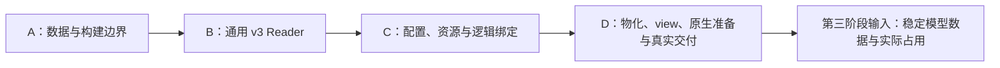

# 重构第二阶段执行计划：v3 加载与稳定模型数据

> 状态：第二阶段实施与阶段验证已完成；完整 Engine 接入留在第三阶段。
> 本文承接[执行总计划](2026-09-13-model-weight-refactor-execution-plan.md)和
> [全局代码组织决策](2026-09-14-engine-code-organization.md)，完成后记录本阶段交接结果，
> 保留至整个重构的最终文档整理。

本阶段将第一阶段生成的真实 v3 接入 C++，交付具有稳定所有权的模型配置、逻辑权重、Use、
必要资源和物理 backing。第三阶段据此接通已有执行、Program、Frontend 与 Engine。
目录重组随这条加载链完成；模型执行和公共控制的其余目录整理在第三阶段随实现接入完成。

## 1. 阶段目标与完成边界

本阶段完成以下结果：

1. C++ Reader 直接读取 v3 单文件与文件集合，正确处理跨文件对象、目录和通用引用。
2. 架构 binder 根据小 config 和启动所选功能展开逻辑需求，从 Binding/Use 取得实际表示；
   相同架构的训练实例名称、对象 ID 和 recipe 不选择完整执行库存。
3. Materializer 按实际需求读取、保留或上传原始数据，正确去重 parent，交付稳定 view 和
   owning Host 数据，加载临时对象可以销毁。
4. 加载可独立完成的原生参数准备接住现有输入形式。依赖 Program 地址、shape/phase 的
   准备保留明确输入，交给第三阶段的实际消费者完成。
5. 通用加载和模型加载具有独立构建与行为检查入口，五份官方 v3 和既有扩展用例提供实际证据。

第二阶段不交付完整生成、评分、Vision/spec 执行、prefix 事务或 CUDA Graph 的运行资格。
这些能力沿[模型运行时](model-runtime.md)和[Program 资源](program-resources.md)接入。
本阶段的直接调用检查用于验证实际修改的参数与寻址，不能替代第三阶段的完整功能验收。

引擎中间不可编译或暂时不可用属于已接受的切换状态。已完成的加载模块仍须可以独立构建和
验证；按最终合同修改接口，移除被替代的代码，不增加 v2 runtime、旧 inventory 转接层或
为尚未接通的消费者伪造结果。Op 支持不足由真实准备、容量查询、warmup 或执行位置报告。

## 2. 输入与执行依据

### 2.1 合同与实现依据

| 依据 | 本阶段使用方式 |
|---|---|
| [v3 容器规范](artifact-container.md) | Framing、目录、对象、文件集合、Binding/Use 和持久名称的权威 |
| [模型公共合同](model-contracts.md)、[Qwen3.5 合同](qwen3_5-model-contracts.md) | 标准架构名、小 config、参数 shape、组件关系、token 域和 Use 语义 |
| [权重加载](weight-loading.md) | 需求、驻留、parent/view、原生参数及所有权的权威 |
| [代码组织决策](2026-09-14-engine-code-organization.md) | 第二、第三阶段共用的最终目录与依赖方向 |
| [第一阶段交付](2026-09-13-model-weight-refactor-phase-1.md)及 [Python Artifact 实现](../../tools/artifact/__init__.py) | 已生产的 v3、互操作依据、精确字节与布局实现 |
| 当前 C++ Artifact、Core 和 Op | 编码几何、I/O、分配、传输、原生输入和数值资格的复用依据 |

第一阶段已经完成格式命名、converter 与升级工具的功能验收。本阶段使用其交付，不重新
生成官方大产物或重复 v2 升级等价验收。规范与实际 v3 若出现实质差异，定位 producer 或
consumer 的合同错误并修正所属实现；不为差异建立并存解释。

### 2.2 实际输入

从仓库根目录使用以下明确路径。它们都是直接生成的 v3，并附有 `.conversion.json`：

| Artifact | 本阶段关注的表示及组件 |
|---|---|
| `out/qwen3_6_27b.ninfer` | Dense、groupwise、Vision、MTP、proposal |
| `out/qwen3_6_27b_nvfp4.ninfer` | Dense、NVFP4 及其辅助值、Vision、MTP、proposal |
| `out/qwen3_8_27b.ninfer` | Dense、groupwise、Vision、MTP、DFlash2、proposal |
| `out/qwen3_8_27b_nvfp4.ninfer` | Dense、NVFP4/FP8 混合、Vision、MTP、DFlash2、proposal |
| `out/qwen3_6_35b_a3b.ninfer` | MoE、expert banks、Vision、MTP、DFlash、proposal |

继续使用第一阶段保留的三个扩展输入：

| 输入 | 用途 |
|---|---|
| `out/refactor-cases/qwen3_6_27b_text_mixed.ninfer` | 真实 Text-only、Q8 embedding/head、第 3 层 BF16 attention，无 Vision/spec/proposal |
| `out/refactor-cases/custom_method/custom.ninfer` 及续卷 | 小型分片、独立 attention parents、资源覆盖和用户方法产物 |
| `out/refactor-cases/dflash2_query_context.ninfer` | 小型 query/context 独立表示及共享区域 |

小合成输入用于通用数据、局部 Binding/Use 和物化检查。它们的 tokenizer 只有最小词表，
缺少完整 BPE/Frontend 资料，几何也没有 Op 资格；不要求它们通过完整模型加载入口。
完整资源语义由官方产物、真实 Text-only 产物及相应行为 fixture 检查。小文件可以完整核对
已知字节，真实大产物按本阶段实际检查范围分块读取。

## 3. 本阶段落地的文件与构建边界

### 3.1 文件责任

下表列出第二阶段实际建立或调整的部分。完整终态文件树继续由代码组织决策拥有。

| 最终位置 | 本阶段职责 | 当前主要来源 |
|---|---|---|
| `core/weight.h`、`core/weight_view.h/.cpp` | 基础权重记录、parent/区域与物理寻址 | `core/tensor.h` 中的权重定义、typed binding 的物理计算 |
| `artifact/framing.h`、`schema.h/.cpp` | v3 文件头、目录、句柄与通用引用 | 按 v3 重写当前 `reader.h/.cpp` 的相关部分 |
| `artifact/formats.h/.cpp`、`layouts.h/.cpp` | 持久名称、已知编码、plane 和布局几何 | `reader.h` 的格式定义、`storage_layouts.cpp` |
| `artifact/file_io.h/.cpp`、`reader.h/.cpp` | 文件集合、结构检查、对象解释及范围读取 | 当前 Reader 的 I/O 基础 |
| `artifact/binder.h/.cpp` | 通用参数查询、覆盖、Use 和需求合并 | 重写当前一次消费式 Binder |
| `artifact/materializer.h/.cpp`、`views.h/.cpp` | 驻留计划、owning backing、上传、地址绑定 | 当前 materializer 与 typed binding |
| `models/registry.h/.cpp`、`load_options.h` | 标准架构选择及加载需要的 purpose/功能选择 | 拆分当前 `targets/registry` 的架构识别责任 |
| `models/qwen3_5/config.h/.cpp` | 实例字段、派生几何和层索引 | 当前静态 Text/Vision/draft config 与数学合同 |
| `models/qwen3_5/model.h/.cpp`、`weights.h` | 冻结后的模型数据、逻辑权重、Use 与存储所有权 | 当前 ModelView、LoadedModelData、加载头中的被动记录 |
| `models/qwen3_5/load.h/.cpp`、`load/bindings.h` | 加载协调及临时构造记录 | 当前 27B/35B 的 package/load 实现 |
| `models/qwen3_5/load/{text,vision,mtp,dflash,dflash2}.cpp` | 按架构/config 展开所选逻辑需求 | 当前各组件绑定及 Qwen3.5 参数合同 |
| `models/qwen3_5/load/{resources,prepare}.cpp` | 资源取得、语义依赖与局部原生准备的调用 | 当前 Frontend 资源绑定、权重参数组装 |
| `models/qwen3_5/frontend/resources.h/.cpp`、`tokenizer.h/.cpp` | 可供加载与 Frontend 共用的 owning 资源解析 | 当前 Frontend resources/tokenizer 及其实际依赖 |
| `runtime/contract/` 与 Runtime 构建目标 | 加载所需的公共描述、Core 中 Runtime 实现的编译所有权 | 当前合同及 `src/CMakeLists.txt` |

物理公式按依赖方向确定唯一实现：Core 的 view 寻址不包含 artifact/schema；Artifact 的
持久名称和几何解释可以调用 Core；Ops 不反向依赖 Artifact。
`weights.h` 引用稳定物理数据和必要原生参数声明，不包含 `load/bindings.h`。

旧模块处理时同时拆内容、移动文件、改 namespace/include/CMake 和相关调用方。被替代
部分从旧位置删除。尚属第三阶段的 execution、state、Program、Frontend 请求逻辑和
Engine 可以暂留原目录，按后续接入直接改造。

### 3.2 构建结果

本阶段确定以下构建责任：

| Target | 内容与依赖 |
|---|---|
| `ninfer_core` | 物理原语；权重基础描述与寻址；移出 Runtime 政策源文件 |
| `ninfer_artifact` | 通用 v3、绑定设施与物化；依赖 Core，不依赖模型或 Engine |
| `ninfer_ops` | 保留现有闭合 Op；承接需要的原生参数准备及 include 调整 |
| `ninfer_runtime_support` | 承接当前编入 Core 的公共 Runtime 实现，保持原算法；供后续 Engine 使用 |
| `ninfer_model_loading` | 当前已支持架构的 config、只读数据、加载、必要资源解析和标准入口；依赖 Artifact、Core、所需 Op 与文本基础 |

`ninfer_model_loading` 不链接完整 Program 或 `ninfer_engine`。共享合同以头文件及实际需要的
公共实现提供，不将 `model_instance` 或 Engine 工厂反向放入加载库。
Registry 只完成标准架构的选择和相应加载入口；运行时实例组装在第三阶段消费选择结果。

CMake 配置须能完成，源文件清单只引用实际文件；构建已闭合的目标不触发完整 Engine 编译。
保留 C++20、CUDA 13.1、`sm_120a` 和现有 NVFP4 non-RDC 编译边界。

## 4. 执行顺序

四个工作块是第二阶段内部的依赖顺序。每块完成其局部行为检查后继续推进，最后一起形成
可交付的加载模块。按职责拆工作，不以全工程中间编译通过划分进度。



### 4.1 A：建立数据与构建边界

**工作内容**

1. 从 `tensor.h` 分出权重专属类型，定义完整 parent、逻辑区域和物理 view 的责任。保留
   现有完整 parent 原生参数所需的信息，明确它与通用逻辑引用的关系。
2. 按最终 Artifact 组织拆出 framing、schema、formats/layouts、I/O 的定义。U64 文件尺寸、
   逻辑元素范围与 Op 较窄的维度分别处理，实际消费者负责其整数范围。
3. 将通用对象句柄放在目录数据层；将驻留计划、放置记录及 owning backing 放在物化层。
   Materializer 不再通过 binder 的内部状态取得计划，解除当前头文件反向依赖。
4. 建立 `ninfer_model_loading`，抽出必要资源解析和只读模型记录；将 Runtime 政策源文件
   从 Core 移到 `ninfer_runtime_support`，同步原有消费者的构建依赖。
5. 修改此次类型拆分直接影响的 include 和构建清单。旧加载函数被替换时删除旧定义，
   原 Engine 尚未接通的调用留作后续修改，不提供兼容重载。
6. 审查本阶段受影响的现有测试，按第 5.1 节判断保留、重写或删除，再随模块接入处理。
   审查覆盖 Artifact、模型加载、必要资源解析及受影响的 Core/Op 检查，不机械搬迁旧用例。

**局部结果**

新数据定义能表达完整对象与区域，Artifact 与模型加载具有正确的单向依赖。已有物理几何
检查可在新位置构建；迁入的实际实现独立编译。后续功能按这些类型实现，不建立空成功实现。

### 4.2 B：实现通用 v3 Reader

**工作内容**

1. 按[容器 framing](artifact-container.md#3-二进制-framing)实现入口与续卷读取。只接受 v3，
   检查 JSON 长度、文件长度、文件集合 ID 和续卷编号，移除 C++ v2 解析路径。
2. 按规范解析字段类型和集合、唯一成员、对象 ID、shape、区间和引用。Config 的数学含义
   留给架构；metadata/provenance 保留其资料用途。JSON 尺寸整数不经过浮点中转。
3. 建立文件 payload 前缀和及逻辑范围映射；支持对象跨文件、plane 内分片、末端零长度
   读取和完整区间读取。按 `files.path` 打开续卷，writer 的统一生成命名模式不作为读取条件。
4. 入口打开时检查通用目录，按实际请求解释 tensor 的 format/layout、encoded size 和对齐。
   未消费的表示名称可以保留，实际读取所需的续卷才打开并核对。
5. 将旧的单一绝对文件 offset、跨整个对象的 mmap span 假设替换为文件集合范围接口。
   连续 span 仅表示真实连续字节；大 payload 通过有界块传给调用方。
6. 复用现有 direct I/O 的设施，正确处理每个文件的 framing、对齐读取及末段。实际复制范围
   始终来自逻辑 payload，不能把相邻对象、header 或对齐区带入目标对象。

**局部检查与结果**

用小型合法/非法文件检查 framing、引用、跨文件范围、延迟打开续卷和短读。至少包含
一个由生产 Python writer 写出的文件集合，由 C++ 读取并与已知字节核对。
现有五份官方 v3 能读取目录和请求对象，且不需要源 checkpoint、转换报告或完整 profile。

Reader 交付明确的通用目录和范围读取能力。它不展开模型参数需求，不建立 Op 支持总表，
正常读取也不扫描全部权重做数值资格验证。

### 4.3 C：实例配置、资源与逻辑绑定

**架构选择与配置**

1. 以 `components.text.config` 中的标准架构名及对应 `model_type` 选择 Qwen3.5 Dense/MoE
   实现，核对两者关系。新增训练名称或修改 metadata/provenance 不改变这一选择。
2. 直接解析[Qwen3.5 实例字段](qwen3_5-model-contracts.md#3-text-实例配置)，计算层数、
   attention/GDN compact 索引、投影/expert 几何及可选组件关系。固定数学留在架构代码。
3. 按实例层数和组件数量构造稳定数据容器。这里验证数学与数据一致性，实际 kernel 的
   shape 专用化由其准备或调用处理，不把当前 27B/35B 的整套常量换成另一张 profile 表。

**组件与资源需求**

Text 及其必要语义数据始终收集。加载选项仅携带实际加载需要的 purpose、Vision、spec 和
proposal 选择；并发、prefill chunk、Graph 和状态容量仍由后续 Program 准备。

| 组件或区域 | 必须接住的数据关系 |
|---|---|
| Text 根、norm 与输出 | Embedding、head、训练共享关系、模型行域 R；实际表示可以不同 |
| Attention | Q/K/gate/V 的逻辑 shape、行对应和 Use；单/双 parent 均由实际 Binding 决定 |
| GDN | Q/K/V/Z、A/B 控制、卷积、norm、A_log/dt_bias；按合同解释轴和数值类别 |
| Dense/MoE | Gate/up/down、router/shared/expert 编号与 bank 行顺序；实际格式逐参数取得 |
| Vision | 选中时绑定 tower/merger、位置资料和 processor 资源，保留其与 Text 的关联 |
| MTP | 选中时绑定私有 stem/decoder/norm，从 target 取得共享事实与实际引用 |
| DFlash/DFlash2 | 私有层、采集位置、mask、query/context 独立角色及共享关系；DFlash2 的卷积、selector 等私有数据 |
| Proposal | 按所选用途绑定 head、映射或其他必要资料，并核对输出 token 域 |

关闭的组件可以完全不在 artifact 中。组件已声明但未启用时，不展开其私有数学需求；
通用目录引用仍由 Reader 检查。选中功能缺少必要数据时在对应组件加载位置报告。
单个启动选择只使用一个 spec 后端，按现有产品范围组织需求。

按资源角色取得 tokenizer、tokenizer config、模板及其他实际需要的资料，抽出可共用的
owning 解析结果。完整 tokenizer 解析给出公共 token 域 V，随后核对 R、proposal 和 selector
输入；draft mask 按其合同的行域核对。Vision 关闭时不要求 processor 私有资源。

本阶段读取并保存最终模板资源，复用既有解析所需部分；完整渲染接入在第三阶段保持现有
行为。资源不按官方精确哈希识别。源名称、训练关联、公开名称和默认行为资料按自身用途保存。

**Binding、Use 与需求合并**

1. 按架构角色推导逻辑 shape，区分整对象 Binding 与有序 Parts。Part 范围是 C-order 逻辑
   元素，不包含 padding/scales；核对源范围、目标覆盖及轴关系，保存原始行序和 parent。
2. 按参数及数学输入位置取得 Use，解析许可与辅助引用。允许同 parent 多角色、多用途，
   query/context 分别保存自己的表示与辅助值，移除一次消费和全 inventory 完成条件。
3. 将需求合并为 device parent、owning Host 数据和小量 owning 值三类。同一 parent 的
   Host/device 需求可以并存；NVFP4 weight divisor 或向量中的单元素按明确范围读取。
4. 取得语义检查所需的 Host 资源和值后完成绑定。Token 域、特殊 token 和必要数值关系
   由真实消费者检查，完整数据形成后再交付。
5. 保存独立于 Reader 的 config、诊断名称、参数和 Use 记录。`A16Only`、`AllowA8`、
   `AllowA4` 分别表示 A16、A16/A8、A16/A8/A4，不为适配旧入口改变持久许可含义。

**局部检查与结果**

绑定检查可以独立于 GPU 和完整 Engine 执行。重点证明：实际配置决定逻辑需求、父对象可
重复引用、Use 互不污染、关闭功能不产生私有需求，以及合法但缺少 Op 能力的表示仍可通过
纯数据绑定检查。修改实例名称或物理 ID 不改变语义结果。

交付稳定数据的构造方案、所选需求和拥有存储的 Host 解析结果。此时状态只包含数学几何
所需的事实，不分配 KV/GDN、round buffers、workspace 或 Graph。

### 4.4 D：物化、view、原生准备与真实交付

**物化与生命周期**

1. 对去重后的 device parents 紧凑安排地址，按 layout 和消费者的明确需求对齐。文件
   offset 与 device offset 分别计算，保留对象内部 padding，不复制文件空洞和 framing。
2. 复用现有 staging slot、完成事件和原始上传循环。跨文件读取写入同一 parent 的相应
   相对位置；复用 slot 前等待前次传输完成，所有来源缓冲活到其最后一次使用。
3. 本阶段 materialization 返回前完成所提交上传的同步。地址稳定与数据完成分别处理，
   后续读取权重的准备可以直接使用完成后的结果。
4. 建立 Host owner 或按值结果。一个 scalar 范围读取不隐含为其整个 parent 增加 GPU
   驻留；若同 parent 另有 device 需求，则同时满足并分别统计。
5. 在拥有存储的容器布局确定后绑定指针和 span，再冻结模型实例。配置、名称、资源和
   原生参数不借用即将销毁的 JSON、加载工作表或 staging。
6. 失败时先结束已提交工作对来源和目标的使用，再释放 backing。部分结果不发布；设备
   上下文覆盖分配及清理。保持显式分配与原始字节上传边界。

**View 与原生参数**

按[完整对象与子区域决策](2026-09-14-engine-code-organization.md#52-完整对象合同与子区域消费)
落实以下路径：

- Direct 和 RowSplit：沿用数学轴解释、parent K_pad、各 plane 和行 stride，正确形成
  实际区域的参数，保留 codes/high bits/scales 的对应。
- FP8/NVFP4 完整 parent：保留完整对象合同。符合既有融合入口的逻辑角色组合，直接准备
  一份或两份完整 parent 参数，维持现有融合计算。
- 真正消费子区域的路径：描述实际 planes、原几何和区域起点，按原生条件准备。FP8 独立
  plane 指针和 NVFP4 对齐 block 区域按实际实现复用；其他切分由对应消费者决定支持。

`load/prepare.cpp` 协调现有 Attention/GDN/Dense/MoE 等局部参数准备；参数匹配规则由
对应 Op 拥有，只接收解析后的逻辑引用、几何、Use 和必要设备事实。它不解析 JSON，也不
选择跨 Op 的融合图。共享一次激活量化的许可及辅助关系在该真实准备位置处理。

可独立完成的完整 parent、已有 RowSplit view、bank grouping 和 per-Use 数值组合在本阶段
接通。原生 Weight-like 参数需要 input divisor 时按用途构造值，不修改共享 parent。
已完成的只读参数可以缓存；依赖 Program 地址、运行范围或 shape 的部分留在实际准备位置。
执行端 policy、workspace 和完整 phase 接入由第三阶段统一完成。

本阶段不为合成小形状或任意切片新增 kernel。若准备发现实际输入形式缺少能力，明确记录
失败消费者和事实；逻辑绑定结果与原生支持分别判断，不伪造准备成功或静默改写物理表示。

**真实交付结果**

依次加载第 2.2 节的官方 v3，完成所选功能的绑定、实际物化、必要原生准备和清理。
再使用真实 Text-only 混合产物及小型文件集合覆盖数据变化。每次只保留一个大模型实例，
沿用原 artifact 路径，完整流程不依赖 `.conversion.json` 或源 checkpoint。

交付只读实例、所选功能、配置/派生几何、逻辑权重与 Use、稳定 backing/资源、已准备的局部
参数及占用摘要。Reader 和临时对象销毁后，这些结果仍能被后续消费者使用。

## 5. 验证安排

### 5.1 先审查，再保留、重写或删除

现有测试本身属于审查对象。迁移前先判断它保护什么行为、依据是否独立有效、能否识别真实
错误，以及该要求在目标合同中是否仍成立，再决定处理方式：

| 处理 | 判断依据 |
|---|---|
| 保留 | 保护仍有效的可观察行为、数学/状态语义或现实回归，例如跨文件字节读取、parent 去重、Use 独立性和生命周期 |
| 重写或合并 | 检查目的有效，但 fixture、调用入口或断言依赖旧内部结构；保留有辨识力的行为与 oracle，去掉重复检查 |
| 删除 | 只复述实现、冻结私有组织、要求旧 profile/inventory，或没有独立保护价值；无需为被删用例逐个补替代测试 |

当前 reader/materialization 中有价值的检查改为 v3，复用精确数据、跨区间读取、上传及
生命周期证据。将官方 artifact 固定对象总数、目录下标或完整 profile 当作合同的断言移除；
用于证明小 fixture 的去重数量、精确布局和文件集合身份的合理断言继续保留。

测试失败时先核对其预期是否合理。有效预期揭示的实现缺陷应修复；过时或不合理的测试应
删除或重写，不为让它通过而改变目标接口、恢复旧约束、增加兼容层或扩展未要求的功能。
测试 fixture 超出真实消费者合同，不构成放宽生产实现要求的理由。

当前 27B/35B 加载测试依赖 `ninfer_engine` 和旧 package 内部结构。本阶段将有效检查接到
`ninfer_model_loading`，统一按架构和输入表达；完整 Engine 功能测试由第三阶段接入。
小 fixture 辅助只服务测试数据构造，不发展成生产 C++ writer。

阶段收尾简要记录主要保留、合并/重写和删除理由，不按保留比例或原有测试数量设目标。

同一公式不能同时充当生产实现和唯一 oracle。优先使用已知字节、可辨识行数据及独立解码，
Python writer 的实际产物提供跨语言证据。一次性升级脚本不增加测试，也不恢复已删除的
临时比较工具。测试数量、文件数量和引用检查不构成功能验收标准。

### 5.2 按真实行为组织检查

| 行为问题 | 选取的证据 |
|---|---|
| 目录与文件集合是否正确解释 | v3 入口/续卷归属、合法非默认续卷名、跨文件对象、范围错误、必要文件缺失与短读；用简短 v2 header 检查运行时拒绝旧版本 |
| 按需读取是否成立 | 未选对象和未知未消费表示可保留；仅服务未选功能的续卷可以缺席，真正请求其范围时失败 |
| 逻辑参数是否绑定到正确值 | 整对象与 Parts、行序/reshape、多个角色共享、同 config 的不同名字与表示；包含可辨识行数据和错误覆盖 |
| Use 是否独立 | 同 parent 的不同 input divisor/许可，交换准备顺序仍保留各自数值；FP32 scalar word 精确核对 |
| View 是否保持原表示 | Direct、Q4/Q5/Q6/Q8 的 planes 与 padding，FP8 分离行 scale，NVFP4 block swizzle/起点和 divisor；独立解码所取区域 |
| 物化与所有权是否正确 | 小对象全字节核对、跨分片写入同一 parent、紧凑分配、Host/device 并存、重复引用只驻留一次、Reader 销毁及传输失败清理 |
| 架构需求是否完整 | Dense/MoE、Vision/MTP/DFlash/DFlash2/proposal 的实际参数与资源；关闭和缺失组件的区别，R/V 与 mask/输出域 |
| 原生衔接是否符合实际入口 | 现有单/双 parent、expert banks、query/context 参数；格式、行对应、辅助值和拥有存储的引用一致 |

用少量能区分错误的用例组合这些行为，不展开格式、shape、功能的笛卡尔积。传输测试使用
有多个块和不同内容的数据检验 slot 复用；若具体生命周期问题需要 sanitizer，再针对该问题使用。

完整 parent 原字节直通可以通过字节和参数关系核对承接已有 Op 资格。若实际修改原生调用、
view 寻址或算术路线，则选择相应既有 Op 资格用例，让输入经过新的准备位置，再直接对独立
数学 oracle 检查。不能仅以两个参数结构相等或另一个 kernel 的输出作为数学证明。

### 5.3 真实 artifact 的检查范围

五份官方产物各完成一次实际加载、读取代表性已驻留数据和释放。功能选择如下，覆盖主要
物理表示及当前两个 draft 后端；每个输入另以 Host 需求检查覆盖它提供的其他所选用途。

| 实际加载输入 | 本次 GPU 加载选择 |
|---|---|
| Qwen3.6 27B groupwise、NVFP4 两份 | Text + Vision + MTP + proposal |
| Qwen3.8 27B groupwise、NVFP4 两份 | Text + Vision + DFlash2 + proposal |
| Qwen3.6 35B-A3B | Text + Vision + DFlash + proposal |
| 真实 Text-only 混合产物 | Text，完整 head；其他功能关闭 |

Host 检查可以重复展开需求，不重复上传整个模型。例如 Qwen3.8 的 MTP 需求、官方文件的
Text-only 驻留集合，以及关闭 proposal 时的 full-head 需求，在该层检查。
共享父对象、格式、Use 和资源按语义关系核对，不固定官方对象数量或 ID 拼写。

大产物的代表性数据覆盖不同格式、模型前后层和所选组件；完整字节复制的公共机制由小文件
和多块传输检查建立。小型 custom-method 与 DFlash2 query/context 产物用于通用读取、局部
Binding/Use 和物化检查。完整资源不满足 Frontend 合同、原生形状缺少 Op 能力，分别由其
真实消费者报告，不为使合成 fixture 通过完整加载而放宽模型合同。

上述检查只证明加载链和所覆盖的原生衔接。Vision/spec 的生成效果、状态事务、评分、batch、
prefix 和 Graph 仍由第三阶段运行验证，不在本阶段报告为已通过。

### 5.4 构建与测试入口

保留两个通用测试 target，并将源码整理到 `tests/artifact/`；建立模型加载的行为和真实输入
入口，源码放在 `tests/models/qwen3_5/`。计划使用：

| Target | 运行范围 |
|---|---|
| `ninfer_artifact_reader_test` | CPU：framing、schema、范围读取、编码几何与文件集合 |
| `ninfer_artifact_materialization_test` | GPU：原始上传、views、驻留、staging 与生命周期 |
| `ninfer_qwen3_5_loading_test` | CPU：架构配置、资源、逻辑绑定、Use、需求与可独立准备的描述 |
| `ninfer_qwen3_5_loading_real_test` | 显式 artifact 路径和功能选择：真实绑定、GPU 物化、稳定数据与清理 |

真实输入测试使用命令行参数显式指定文件与用途，拒绝缺失文件；无输入的普通测试发现可以
标记跳过。本阶段验收必须实际运行第 5.3 节的输入，跳过不计为通过。
这些都是内部行为测试入口，产品 CLI、服务和推理仍通过公开 Engine。

以下入口已建立，可独立于完整 Engine 构建和运行：

```bash
cmake -S . -B build -DBUILD_TESTING=ON \
  -DPython3_EXECUTABLE=/home/neroued/miniconda3/envs/py311/bin/python

cmake --build build -j --target ninfer_artifact ninfer_model_loading \
  ninfer_artifact_reader_test ninfer_artifact_materialization_test \
  ninfer_qwen3_5_loading_test ninfer_qwen3_5_loading_real_test

ctest --test-dir build --output-on-failure \
  -R '^ninfer_(artifact_reader|artifact_materialization|qwen3_5_loading)_test$'

./build/tests/ninfer_qwen3_5_loading_real_test \
  --artifact out/qwen3_6_27b.ninfer --vision --speculative mtp --proposal optimized

./build/tests/ninfer_qwen3_5_loading_real_test \
  --artifact out/refactor-cases/qwen3_6_27b_text_mixed.ninfer \
  --speculative none --proposal full
```

实际测试入口的帮助说明与上述参数一并实现。其他官方文件按第 5.3 节逐个显式运行，GPU
检查串行。使用已选 Python 3.11、现有工具链和测试机制，检查通过后仅因新改动或未决问题补测。

## 6. 第三阶段收到什么

| 交付 | 第三阶段消费者与要求 |
|---|---|
| 架构选择、小 config、派生几何与层索引 | 固定层循环、Dense/MoE 叶子、状态拓扑；不再解析旧 checkpoint profile |
| 每层/组件的逻辑权重、parent/view 与 Use | 固定 execution、局部融合和原生参数准备；无需回查 JSON |
| 完整 backing、Host 资料及稳定地址 | Frontend、Program 和 Graph 在 owner 存活期内借用 |
| 共享 tokenizer 解析结果及 token 域 | Frontend、sampler、proposal/selector；保持同一份语义解释 |
| 已准备的原生参数及仍需 Program 的输入事实 | 直接调用、workspace 查询、shape/phase 的实际准备；使用同源绑定与许可 |
| 实际所选功能与 target 关联 | Vision、MTP、DFlash、DFlash2、proposal 的执行及状态准备 |
| 权重占用摘要 | 文件读取、device 容量、Host 保留、staging 和 H2D 分别计量；Program 结合其资源预算 |
| 加载检查结果及明确能力缺口 | 区分数据错误、原生支持不足和尚未接通的 Engine 部分，确定第三阶段工作 |

阶段收尾记录实际通过的输入/功能、变更后的接口入口、局部 Op 证据、仍属第三阶段的消费者，
以及任何会改变后续设计的问题。保存这些事实，不给后续阶段预设完整逐文件任务。

## 7. 实施纪律与收尾

每个工作块同时完成文件职责、命名、注释、错误上下文、include、构建和相关调用方。
沿用仓库格式规则；迁移类型及目录时区分代码架构名与公开 release、资源内容和训练关联。
源码重组以实际责任为单位，已合适的算法和物理实现直接复用。

阶段进展只记入本计划和必要的简短结果。README、长期格式/模型/Engine 说明、产品命令导航
和项目规则在整体切换完成后统一整理；实质合同错误另行修正所属权威。

官方 artifact 保持原路径并只读使用。小测试临时文件使用自动清理的测试目录，必要产物放在
既有 `out/refactor-cases/` 范围，不在 `out/` 堆放备份、工具副本或大日志。已有升级工具继续
保留供用户使用，本阶段不恢复 v2 产物。

本阶段完成判断是：加载模块处于最终职责与依赖下；所选模型数据完整且具备稳定所有权；
实际 v3、组件需求和表示变化获得上述行为证据；已替代的旧加载路径和测试约束移除；
第三阶段能够直接以这些结果接入。完整 Engine 未接通在交接中明确说明，不用于放宽已完成
加载模块的正确性要求，也不触发临时兼容实现。


## 8. 阶段交接结果（2026-09-14）

### 8.1 实际交付

v3 Reader、Binder、Materializer 和 Qwen3.5 模型加载已按新目录独立构建。
`plan_load(reader, options)` 完成所选 config、资源、逻辑参数与 Use，形成驻留计划；
`materialize_model` 完成原字节上传并返回不可复制、不可移动的只读 Model。
`load_model(path, options, device)` 将两步串起，返回前销毁 Reader。
调用方保持 DeviceContext 活到 Model 销毁之后。

Model 拥有物理 backing、Host 资源、tokenizer 解析结果、实例资料和逻辑记录。
`WeightId` 指向冻结的逻辑参数数组；`WeightUseId` 明确某参数的一次数学使用。
例如 full head 下 Text 与 MTP 共享同一物理输出头，但分别引用自己的 Use；
多 Use 参数不能通过省略用途取得第一份记录。

原生准备的具体入口为 `Model::input` 与 `ops/weight_input.h`，后者只依赖 Core 和 Op。
`load/prepare.cpp` 解析 Use 并建立最终 view；选定实现的调用方再请求相应原生参数。
这一落点使合法但暂缺 kernel 的组合仍能完成纯数据加载，也避免在加载入口执行整模型
支持预检。准备结果可由第三阶段固定 execution/Program 保存，不借用 Reader。

已接通的原生形式包括 Attention/GDN 单、双 parent，SwiGLU/普通 Linear 连续 bank，
GDN A/B、SparseMoe expert banks、draft QKV 和 RowSplit 子区域。
Vision Q/K/V 可以按固定行序准备 packed Linear；27B MTP 保留 packed Q8 Linear 加拆分及
独立 Q/K/gate/V 子区域的原生形式，未强制改用 Text 的专用 Attention Op。

FP8/NVFP4 的完整 parent 合同和现有 kernel 保持；真正的子区域由 Core 暴露 parent planes、
行起点及 swizzle。当前完整矩阵 ABI 拒绝将 FP8/NVFP4 子区域伪装成独立完整对象。
未新增任意切片 kernel，也未在 loader 做 repacking。各 Use 的 divisor 按值进入其原生参数，
共享 parent 不携带可变的激活使用状态。

旧 v2 reader、一次消费式 binder、typed binding、27B/35B 私有加载及旧 Vision/资源绑定已删除。
原 tokenizer 算法迁到 `models/qwen3_5/frontend/`。Core 的权重定义分离后，直接消费者的
include 已同步；Runtime 公共政策实现移到 `ninfer_runtime_support` 构建目标，算法未重写。

### 8.2 验证结果

环境为本机 RTX 5090、CUDA 13.1、`sm_120a`、C++20 Release 和 Python 3.11。
`ninfer_artifact`、`ninfer_model_loading`、`ninfer_runtime_support`、完整 `ninfer_ops` 及所用
测试入口均已成功构建。

| 证据 | 实际结果与边界 |
|---|---|
| Reader、模型加载 CPU 测试 | 通过；包括跨文件范围、延迟打开、未知未消费编码、v2 拒绝、绑定覆盖、config 驱动、共享 parent、Use 独立及 token 域 |
| Materializer GPU 测试 | 通过；小对象全部字节、非对齐分片边界、Host/device 并存、Reader 销毁、失败清理，以及超过一轮 staging 缓冲的全部字节核对 |
| Python writer → C++ | 通过；生产 writer 创建单文件和文件集合，C++ 将已知原始输入逐字节核对并物化；临时文件自动清理 |
| 五份官方 v3 和真实 Text-only 混合产物 | 第 5.3 节的六项 GPU 加载均通过；每个已驻留 parent 的首、中、尾及 high/scale plane 代表区间与源文件一致，Reader 销毁后继续使用 tokenizer 和原生参数 |
| 其他所选用途 | 21 项 Host 加载选择通过，覆盖每份官方产物的 Text-only、评分、MTP full head，以及 Qwen3.8/35B 的其他 MTP、draft/proposal 选择；另实际加载 27B NVFP4 + Vision + MTP full head 检查共享用途 |
| 两份小型扩展产物 | `custom_method/custom.ninfer` 文件集合及 `dflash2_query_context.ninfer` 的局部逻辑绑定、全部被绑定 parent 字节及物化通过；未要求不完整 BPE fixture 通过完整 Frontend |
| 新参数准备 → 现有 Op | `ninfer_attn_input_proj_test --weight-inputs-only` 与 `ninfer_linear_pair_q8_a16_test` 通过；使用既有独立解码/FP64 oracle，覆盖 Q4/Q5、FP8、NVFP4、Q8 及实际 RowSplit K/V 子区域，包含已有 Graph replay 用例 |
| Runtime 构建依赖调整 | admission、context cost、KV capacity、resource manager 和 CLI options 原有行为测试通过 |

大产物检查是各已驻留 parent 的代表性字节和参数关系；完整复制机制由小文件与多块传输
测试核对，不将抽样写成全文件逐字节比较。没有生成新的官方大产物、备份或转换报告，
`out/` 的原有产物路径和内容未变。

测试审查保留了可观察行为与独立数学 oracle。两个旧模型 load-plan 测试及其固定官方对象
数量、目录下标、profile 断言删除；Reader/Materializer 的有效检查改写为 v3，新增模型加载
测试按逻辑需求与共享关系检查。旧 load-plan 中有效的 Vision workspace 上界检查已提取为独立测试；Frontend 请求、prefix、
batch、spec 状态等完整行为测试继续保留，随第三阶段接回对应实现。一次性升级脚本未增加测试。

### 8.3 第三阶段边界

尚未接通的是固定 execution、Program/状态/Graph、Frontend 请求处理和公开 Engine 的完整调用。
这些消费者仍在旧目录和旧入口下，完整引擎暂时不可构建/运行，是本次原子切换的预期中间状态。
本阶段没有加入兼容桥或占位成功路径。

第三阶段需将已有实现接到只读 Model，选择并保存实际使用的原生参数，统一 policy 的许可集合
与 workspace/phase 查询，再核对实际权重占用与 KV/GDN、请求和 Graph 资源。
其中 AllowA4 对 A16/A8/A4 的许可已完整保存在模型数据中；旧执行入口对 policy 的有限分派条件
仍须随第三阶段消费者接入统一。现有完整 parent 路径与 RowSplit 子区域可以直接复用上述准备。

完整生成、评分、Vision/spec 效果、prefix 事务、batch 和 Engine CUDA Graph 尚未在新架构下验收。
本阶段未发现需要改变总体架构的阻塞决策；后续以这些实际接口和已保留的执行能力展开第三阶段计划。


### 8.4 实现审查后的修正

本阶段实施经 Reader、绑定/物化、模型合同、Op 参数及测试/构建五个方向独立审查后，
完成以下修正：

- NVFP4 合并输入先取得 Use 许可交集；确定为 A16Only 时不要求未使用的 activation divisor
  相等，各 Use 原值保留。需要共享低位激活量化的输入继续要求辅助值一致。
- Direct 权重按连续逻辑元素偏移及目标矩阵 shape 准备原生参数，支持合法零拷贝 reshape；
  量化矩阵继续保持 parent K、padding 和各 plane 的合同。
- RoPE 的 partial_rotary_factor 按 PositiveF32 合同先归一化，再推导 rotary_dim。
  原有反向拒绝测试改为验证合法 wire 数字得到一致的 F32 与整数维度。
- Materializer 中的 CUDA 创建、上传、记录和等待错误转为带操作上下文的异常，使用已有
  completion guard 与 RAII 完成清理；Core 运行期的错误政策保持现有边界。
- 将仍有效的 Vision workspace 上界检查从旧 load-plan 中提取到
  `tests/targets/qwen3_6_27b/test_vision_workspace.cpp`，独立 target 为
  `ninfer_qwen3_6_27b_vision_workspace_test`。它检查总 context 从 16K 增至 128K 时单 item
  workspace 不增长，并保持已有容量上界；允许后续实现降低容量。该测试依赖完整 Engine，
  随第三阶段迁移其调用入口并恢复运行，本阶段不将其列为已通过。

针对修正的验证复用现有独立 oracle：NVFP4 Attention 的 A16 输入使用不同的正 divisor；
GDN A/B 通过不同 parent K 的连续 BF16 reshape 进入原有 Op；CPU 用例检查 Direct 的非零
元素偏移、量化矩阵 K 不可随意更改、许可交集和 F32 归一化。
CUDA 失败测试仅在测试可执行文件中通过链接包装注入错误，分别覆盖 staging event 分配失败
和已提交上传后 event record 失败，检查异常返回、Host/device 释放、完成顺序及随后正常加载。
生产实现不包含故障注入接口。

上述回归用例、既有 Reader/物化/模型加载及 GDN/Attention/LinearPair 独立 oracle 检查均通过。
修正后另实际加载 `out/qwen3_6_27b_nvfp4.ninfer`（Vision + MTP full head），
GPU 字节抽样、原生参数及 Reader 销毁后的资源使用继续通过；环境沿用第 8.2 节。
