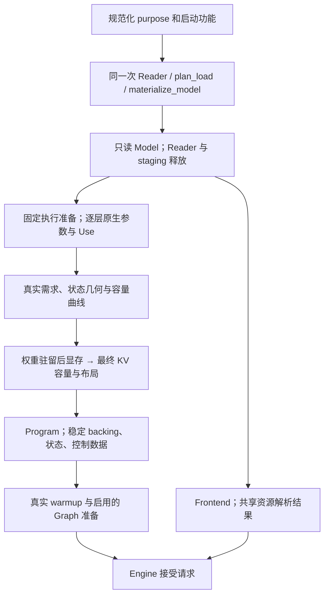

# 重构第三阶段执行计划：固定执行、Program 与 Engine 原子切换

> 状态：主要实施、验证及两轮独立审查已完成。引擎已切换到 v3 与实际 Model 输入。
> 实现起点：第二阶段提交 `4cde7ad0`，加载模块已交付，完整 Engine 尚未接通。
> 本文承接[执行总计划](2026-09-13-model-weight-refactor-execution-plan.md)、
> [第二阶段交接](2026-09-14-model-weight-refactor-phase-2.md#8-阶段交接结果2026-09-14)和
> [全局代码组织决策](2026-09-14-engine-code-organization.md)，保留至最终文档整理。

本阶段让已有固定执行、资源准备、Frontend 和公开 Engine 消费第二阶段的只读 Model。
同一份实例配置、绑定和 Use 同时驱动实际调用与资源需求，恢复现有适用功能，并移除旧的
完整权重 profile 和 checkpoint 专属执行入口。阶段内部按依赖推进，最终完成一次引擎切换。

## 1. 阶段目标与执行纪律

### 1.1 完成结果

1. 标准 architecture 与实际 config 选择数学实现；不同训练实例和已有能力的新混合表示
   进入同一架构实现，各层参数从本次绑定取得。
2. 固定调用与资源查询消费同源的原生参数和 Use，保留已有融合、固定 shape 实现和
   Op 内部的 shape/phase 分派。
3. Program 使用实际模型几何、驻留占用和启动选项，建立状态、workspace、控制数据和
   CUDA Graph；原有事务、prefix、batch 和资源控制继续成立。
4. Frontend、Engine、CLI、服务、评分和现有推理/状态 benchmark 完成接入，五份官方 v3
   及既有真实混合产物获得本阶段要求的执行证据。
5. 受影响代码、构建和测试采用最终接口与目录；有效算法复用，旧 package/profile 入口移除，
   代码质量随实现交付。

### 1.2 原子切换的含义

六个工作块用于明确职责、交接和检查顺序，不构成六次产品发布。中间可以无法编译、接口
不匹配或部分功能不可用。已经闭合的模块及时验证，完整产品在本阶段统一恢复。

替换接口时直接修改其消费者，不增加旧 ModelView 适配壳、profile 转接表、v2 runtime、
占位成功路径或临时兼容重载。已有合法执行分支和 eager 开关可用于定位问题；最终交付
包含全部本阶段承诺的适用功能。

代码质量与功能一起完成：职责、所有权、命名、namespace、include、CMake、错误上下文和
格式随所属工作块整理。测试预期按目标合同审查，有效失败修复实现，过时约束随测试删除。

### 1.3 范围

以当前五份官方产物及其已有功能为执行基线，沿用单 GPU、单 resident、启动固定并发、
直接 C++/CUDA 执行和现有产品协议。固定模型代码维护有限调用写法，Op 提供已实现能力。

第一阶段的 converter、v3 产物和离线升级工具，以及第二阶段的数据合同继续使用。
本阶段重点是消费者接入；发现实质合同错误时修正所属实现，并记录影响。
任意融合搜索、未知架构/codec/kernel、自定义模板渲染、多后端同时运行和运行期外挂权重
仍由各自独立任务处理。现有容器承载自定义模板的能力保留，运行时按已有模板能力消费。

进度和阶段结果只记入本计划及必要的简短证据记录。长期文档在整体切换后统一整理，
代码内接口说明、构建规则、测试数据和可执行 `--help` 随实现更新。

### 1.4 实施与审查分工

主要实施由主 agent 完成，负责 A–F 的代码改造、接口协调、验证、整理以及审查发现的修复。
实施与自身验证完成后，使用较多 subagent 进行两轮独立审查：先全面审查第三阶段任务，
修复并复查通过后，再审查第一至第三阶段组成的整个重构全链路。

主 agent 负责审查分工、逐项核实发现、合并交界问题和汇总最终结论；subagent 主要承担
独立审查与有针对性的复现。具体分工和两轮通过条件见[第 7 节](#7-两轮-subagent-审查)。

## 2. 输入与现状

### 2.1 使用的权威

| 依据 | 本阶段消费的内容 |
|---|---|
| [重构纲领](model-weight-execution.md) | 解耦目标、固定执行、所有权与支持判断边界 |
| [模型公共合同](model-contracts.md)、[Qwen3.5 合同](qwen3_5-model-contracts.md) | 固定数学、小 config、组件交接和状态语义 |
| [权重加载](weight-loading.md)及第二阶段交接 | Binding/Use、稳定 backing、原生参数和有效期 |
| [模型运行时](model-runtime.md) | 配置、固定调用、Frontend、身份及产品接入 |
| [Program 资源](program-resources.md) | 容量、状态、workspace、跨阶段数据与 Graph |
| [Engine 架构](engine-architecture.md)、[资源调度](resource-scheduling-and-context-cache.md)、[Paged KV](paged-kv-cache.md) | 继续保留的调度、事务、恢复与 table publication 算法 |
| [代码组织决策](2026-09-14-engine-code-organization.md) | 本次落地的目录及依赖方向 |

旧 Engine 文档中的 package/identity 选择由目标合同替换；其中请求、状态和发布算法继续
作为行为依据。本文安排实施与证据，字段、数学和容量公式引用所属权威。

### 2.2 第二阶段已经提供的接口

| 实际接口 | 第三阶段使用方式 |
|---|---|
| `models/registry` | 解析标准架构名与 model_type；构造侧消费该选择 |
| `models/qwen3_5/config` | Text/Vision/draft 配置、Attention/GDN 数量和 compact 索引 |
| `plan_load`、`materialize_model`、`load_model` | 所选依赖、原字节驻留与只读 Model；主链使用同一次 Reader/绑定 |
| `Model::weights()`、`weight()`、`input()` | 稳定逻辑权重、parent/view 和明确的 Use |
| `ops/weight_input.h` | 已有 Linear、Attention、GDN、SwiGLU、MoE 原生输入准备 |
| `Model::resources()` | Host 资源及已解析 tokenizer、公共 token 域 |
| `Model::storage_stats()`、`info()` | 实际占用、实例名称及资料 |

当前 Model 保存逻辑记录和稳定 backing，尚未缓存完整执行所用的原生参数。
`load/prepare.cpp` 已完成最终 view/Use 解析；第三阶段的固定执行调用原生准备并持有结果。
多 Use 权重使用 `WeightUseId`，例如 Text 和 MTP 共享 full head 时不能省略用途选择。

完整 FP8/NVFP4 parent 和 RowSplit 子区域已有准备基础。实际需要 FP8/NVFP4 子区域的调用
必须保持原 parent 的 planes、起点及 swizzle 合同；已有完整对象 ABI 不接受伪造的独立矩阵。
本阶段按真实调用需要调整参数接口，loader 继续上传原字节。

### 2.3 改动幅度与复用基础

| 部分 | 当前具体问题 | 实施方式 |
|---|---|---|
| 构造入口 | `targets/registry.cpp` 按 release/weights_id 取得 package、profile，再规划和加载 | 重写为标准架构选择及模型实例组装 |
| 配置接入 | `impl/config.h`、`text_context.h`、`hybrid_topology.h` 固化层数、四层间隔、token 域和 draft taps | 实例配置贯通层循环、状态及 Frontend；保留真实数学常量和专用化 |
| 执行叶子 | 27B `text_policy()` 按 dtype 推导 Use；原参数来自私有 binding payload | 保留有限调用写法，使用已准备的逐层参数 |
| 容量需求 | 27B 使用 profile 分支，35B/MTP/draft 仍有固定格式和预设组合最大值 | 重写查询输入，逐层/逐用途覆盖真实需求 |
| Workspace | `workspace_recipe.h` 已供 sizing 和真实执行共用分配写法 | 保留 scope、存活期和生产 builder |
| 状态 | `StateImageSpec` 已接受运行时几何；相关 pools/stores 已实现 | 改造配置来源，按语义、存储和规划拆归属 |
| Program/Engine | 既有事务、调度、Graph 和上下文管理可复用，但类型仍依赖旧 Variant/package | 接通实例与协作接口，复用算法 |
| Frontend/工具 | 重复创建 tokenizer、无条件 processor、固定身份及报告字段 | 接到加载资源，整理所有实际调用方 |

### 2.4 实际产物

以下路径在本阶段保持，运行时不依赖源 checkpoint 或 `.conversion.json`：

| 路径 | 实例及已有组件 |
|---|---|
| `out/qwen3_6_27b.ninfer` | Dense groupwise；Vision、MTP、proposal |
| `out/qwen3_6_27b_nvfp4.ninfer` | Dense NVFP4；Vision、MTP、proposal |
| `out/qwen3_8_27b.ninfer` | Dense groupwise；Vision、MTP、DFlash2、proposal |
| `out/qwen3_8_27b_nvfp4.ninfer` | Dense NVFP4/FP8；Vision、MTP、DFlash2、proposal |
| `out/qwen3_6_35b_a3b.ninfer` | MoE；Vision、MTP、DFlash、proposal |
| `out/refactor-cases/qwen3_6_27b_text_mixed.ninfer` | Text-only；Q8 embedding/head、第 3 层 BF16 Attention |

已核对两份 groupwise 27B 产物的 Text config 相同；它们提供不同训练实例的接入依据。
真实混合产物的 `metadata.name` 为 `qwen3.6-27b-custom-mix`，同时提供未登记实例名、
混合表示和可选组件缺省的执行输入，无需为这些检查另造大产物。

第二阶段的小型 `custom_method/custom.ninfer` 文件集合和 `dflash2_query_context.ninfer`
继续用于局部数据/绑定检查。它们的 Frontend 资源与几何不具备完整 Engine 运行资格，
不把它们加入真实生成验收。

## 3. 文件职责与构建边界

### 3.1 模型内部

沿用全局目录决策。下表明确第三阶段的主要落点，相邻的小实现按实际消费者合并：

| 最终位置 | 职责与主要来源 |
|---|---|
| `models/qwen3_5/execution/parameters.h/.cpp` | 选定固定写法所需的只读原生参数、逐层/组件记录；调用第二阶段准备接口 |
| `execution/{text,attention,gdn,ffn}.*` | 原 TextContext 的层计算与两个 Variant 的执行叶子 |
| `execution/{vision,mtp,draft}.*` | 各组件数学调用，保留各自融合及输入交接 |
| `execution/workspace.h` | 执行与容量共用的临时分配写法；承接 workspace_recipe |
| `state/topology.h`、`decoder_state.*`、`state_image.*` | 实例状态索引、语义几何、完整可恢复内容、布局及 view |
| `program/program.h`、`program_impl.*` | 提供给 Engine 的接口、实例存储与协调 |
| `program/{prefill,decode,scoring,round_buffers,prefix_identity,graphs}.*` | 阶段推进、轮次缓冲、提交前缀身份与 Graph |
| `program/speculative/{mtp,masked_draft,target_verification}.*` | MTP、DFlash/DFlash2 的轮次、target 验证及接受/提交 |
| `program/planning/{startup,request_plan,pressure_planner}.*` | 启动容量、请求可行性及压力处理 |
| `program/storage/{state_store,kv_store,host_kv_store,continuations,transitions}.*` | 槽/页/副本、continuation 和迁移事务的所有权 |
| `frontend/` | 已有输入、位置、模板、processor、输出会话和媒体复用，使用已解析资源 |

`parameters` 记录来自实际绑定的原生输入及有限写法，不保存完整 recipe 身份、源目录查询、
可执行图或可变请求状态。需要结合实际 shape 的选择仍发生在对应调用。

旧 `program_impl.h` 的大体量通过职责拆分处理：提取已有算法和其依赖，保持事务整体，
不按行数机械分割。`state/` 描述状态的值和几何；`program/storage/` 拥有分配及有效期；
`program/planning/` 使用这些事实计算可行操作。

### 3.2 Runtime 与产品

`runtime/contract/` 按 request、execution、resources、timing、sampling 拆分实际公共合同。
Qwen 的 PreparedPrompt、RequestPlan、状态图像及资源句柄仍由模型解释。
已有 EngineCore/ResourceManager 的静态类型适配可以继续使用。

`runtime/engine/model_instance.h/.cpp` 组装已选模型、执行参数、Frontend 和 Program。
`models/registry` 只维护标准架构到已编译实现的选择，不保留第二份 checkpoint/recipe 表。
公共缓存政策迁入 `runtime/engine/context_cache/`，生成预算归 `runtime/engine/`。

CLI、服务和公开推理 benchmark 使用 Engine；已有状态/轮次 benchmark 保持其实际测量层次，
接到模型 Program 或生产存储入口。其文件归属和报告字段随消费者迁移，服务协议保持原合同。

### 3.3 构建责任

| Target | 最终职责 |
|---|---|
| `ninfer_core`、`ninfer_artifact`、`ninfer_ops` | 保持第二阶段的物理、容器和闭合 Op 边界 |
| `ninfer_model_loading` | 保持 config、只读 Model、加载和必要资源解析的独立构建 |
| `ninfer_runtime_support` | 公共合同实现、容量与政策工具，包括实际公共 sampling 实现 |
| `ninfer_model_runtime` | 当前架构的执行、Frontend、state、Program；依赖加载、Ops、公共支撑及所需媒体基础 |
| `ninfer_engine` | 实例组装、公开 Engine 与请求控制；依赖模型运行时和公共支撑 |
| 产品及 benchmark targets | 按实际消费层链接，清除旧 export/package include root |

源码列表显式维护，模型源码按所属目录组织；保留 C++20、CUDA 13.1、`sm_120a` 及现有
NVFP4 non-RDC 编译边界。Core/Artifact/Ops 不反向依赖具体模型，模型 Program 不包含
Engine 控制器，加载库继续可以独立构建与测试。

测试按 `tests/models/qwen3_5/`、`tests/runtime/` 和既有 Core/Artifact/Op 行为归属整理。
移动测试随被测职责进行，不把无关文件重排或测试数量作为交付目标。

## 4. 构造、参数与有效期

### 4.1 主构造顺序



主路径先完成 Model 物化，再按稳定参数准备 Program。能够由描述取得的提前估算可以保留，
最终容量使用同一次绑定及驻留后的真实显存，不新增平行的参数准备或完整支持预检。

执行参数先于 planner 和 Program 构造，Frontend 可在 Model 可用后独立初始化。所选组件、
proposal 和 purpose 使用同一份规范化结果；评分的功能关闭先于加载需求展开。

### 4.2 所有权

模型实例依次持有只读 Model、稳定执行参数、Frontend 和 Program。执行参数引用 Model
backing；planner 与 Program 共享同一份参数事实。用构造关系保证布局属于该实例，
移除当前 profile 相等校验及其信息来源。

Program 独占 Device/Host 状态、workspace、controls 和 Graph。PreparedPrompt 保持已有
owning 输入语义，每请求的输出会话、预览结果与 pending batch 保持各自生命周期。
正常运行不查询 JSON 或源名称，不重新绑定权重，不移动 Graph 引用的 backing。

销毁及部分构造失败时，先结束在途使用并释放 Program/Graph，再释放 Frontend、执行参数
和 Model；DeviceContext 覆盖全部清理。上传完成和 Reader 释放沿用第二阶段的已验证合同。

### 4.3 支持判断

数据合法性由 config/binder 处理。固定执行的参数准备检查自身原生形式，Op 的容量接口、
warmup 和真实调用检查实际支持。取得稳定 workspace 所必需的查询可以自然失败。

不枚举全模型的格式、shape 和全部功能组合做准入证明。Warmup 只证明其实际经过的路径。
错误由模型调用边界补充组件、层/用途、phase、shape 和实际表示；运行失败沿既有
abort/Engine fault 规则处理，未提交结果不得发布或成为可复用 continuation。

## 5. 工作顺序


这是主联调顺序。A 确立接口后，Frontend 资源接入和独立状态布局可以提前推进；B/C 涉及
同一调用的参数、容量和存活期，必须一起闭合。每个工作块包含目录、构建和相关测试调整。
Text 可先用于验证基本接入，接口从开始就覆盖 Vision、MTP、DFlash/DFlash2 和评分。
上述主要实施由主 agent 执行；两轮 subagent 审查依次进行，第二轮在第一轮通过后启动。

### 5.1 A：贯通 config、数学选择与执行参数

**工作内容**

1. 以现有 Config/Model 为输入定义稳定执行记录，保留各层 mixer/FFN 类型、原生参数、
   各 Use、所选组件和必要几何。参数冻结后由模型实例持有，planner/Program 直接引用。
2. 将层循环、层容器和 Attention/GDN compact 索引接到实际配置。移除每四层 Attention、
   固定层数组及完整旧 ModelConfig 镜像；draft 层类型与有序 taps 也实际进入消费者。
3. 贯通 hidden/head/FFN、norm epsilon、RoPE 和位置参数。数学固定值保留在架构代码；
   派生量使用同源配置计算，Op 较窄整数维度由其入口明确处理。
4. 保留具有编译收益的有限几何专用化和 Dense/MoE 数学区分。层数、逐层表示、Use、
   checkpoint 名及组件分配不成为完整模型模板参数；已有普通模板按真实职责复用。
5. 将旧 Variant 的执行、配置、Graph 和实例职责分到最终位置。局部执行差异由有限的
   显式写法表达，不能把旧 profile 换名后继续作为参数或容量依据。
6. Text/full head、所选 spec head 使用明确 WeightUseId；普通只读 norm/control 使用
   已有 Direct view。保留共享 parent 的地址及辅助值有效期。

**局部结果与检查**

执行和规划能够从同一模型取得所需配置与参数，不回查旧 binding 工作表。
复用第二阶段的绑定/Use 测试；对新增配置消费者用少量不同层序、tap 顺序和 token 域
检查实际索引与输出几何。私有类型改名或字段转发不单独增加测试。

### 5.2 B：成组接入固定调用、policy 与 workspace

每条路径的完成单元包含：原生参数准备、实际调用、容量查询、临时数据存活期和对应证据。
容量接口可以只接收影响分派的必要字段，但这些字段必须从同一份真实参数提取。

| 路径 | 继续保留的调用 | 本阶段必须贯通的输入 |
|---|---|---|
| Text Attention | 双 Q4/Q5 parent、单 FP8/NVFP4/BF16 或已有 Q8 入口；后续 norm/RoPE/attention/gate/residual | 实际 grouping、行序、几何、Use、输出投影和 phase 范围 |
| GDN | Norm/control、prefill 投影/卷积、decode snapshot、verification record 与 recurrent/Fold | 本层 QK/VZ 或 QKVZ、A/B、辅助值、B/W、状态映射及各路径 scratch |
| Dense | SwiGLU 与 down/residual 融合 | gate/up 与 down 各自的表示和 Use，activation 的跨调用存活期 |
| MoE | 既有路由、routed/shared experts、合并 | 实际各 bank、路由几何和 scratch；去掉预设格式组合最大值 |
| MTP | 既有 packed Linear/拆分、K/V pair、Q/gate、共享 embedding/head | 各次调用的原生形式、Use 和范围，不强制改为 Text 投影入口 |
| DFlash/DFlash2 | Query/context、feature projection、proposal；DFlash2 动态卷积与 selector | 两种用途各自参数、target taps、mask、bank/selector 域和 scratch |
| Vision | Patch、QKV、attention、MLP、merger 和 Text handoff | 所选几何、权重、bias、Use 和实际 item 范围 |
| Head/评分 | 既有 head、top-k、remap、sampling 或 logprob 路径 | 主 head 与 proposal 的真实行域、明确 Use 和当前 purpose |

实施同时完成：

1. 删除 dtype 推导 policy 和在调用方写死的全局格式假设。许可统一为 A16Only={A16}、
   AllowA8={A16,A8}、AllowA4={A16,A8,A4}，共享计算使用实际 Use 交集。
2. 修改相关 Op wrapper、内部 resolver、容量函数和合同注释，使其解释一致。BF16/Q4/Q5/Q6/Q8
   的既有 A16 路径可接受包含 A16 的许可；FP8 的 AllowA4 可采用已有 A8；NVFP4 的
   AllowA8 可采用已有 A16。可用路径仍取决于真实格式、shape、辅助条件及已实现能力。
3. 继续保留各 Use 的 divisor；实际共享低位激活量化满足对应辅助约束。许可交集已经
   确定为 A16Only 的合并，不要求未消费的 activation divisor 相等，承接第二阶段修正。
4. 保留完整 parent 的原生 ABI。仅在实际消费者需要且已有实现可承接时调整子区域参数，
   保持 planes/stride/origin；合法数据但缺少调用写法由该消费者报告。
5. 将 35B 的预取地址和长度改为实际可访问物理 span。提示接口只能表达一个 span 时，
   采用有效的一个范围或已有空提示，不改变计算与状态语义。
6. 容量查询与执行共用对应参数分派；相同用途的 kernel 选择不能在两处各维护一套条件。
   只处理本阶段接入所需的 Op 合同和路径，数值 kernel 以现有实现为基础。

**局部结果与检查**

实际参数进入 Attention/GDN/Dense/MoE 和所选组件的生产调用，相关 scratch 可按相同输入查询。
用已有独立解码/FP64 oracle 资格入口覆盖修改过的准备、寻址和许可路线，包括单/双 parent、
BF16 混合 Attention、A16 辅助值差异，以及 FP8 AllowA4、NVFP4 AllowA8 的实际选择。
沿用已有 shape 分界用例，不为许可枚举建立重复的整套数值测试。

### 5.3 C：接通 Program 资源、状态与事务

**工作内容**

1. 用同一执行参数、实际 Config 和规范化启动选项替换 SequencePlanningInputs 中的
   weights_profile。容量曲线、最终布局和 Program 构造沿同一实例关联传递。
2. 保留 LayoutBuilder/WorkspaceLayoutBuilder 和相同 allocation scope 写法。按本次
   各层参数计算实际需求；相同需求可以复用查询，峰值必须覆盖最耗空间的实际层。
3. 覆盖 prefill chunk 及尾块、普通 decode、verification 的 B/W、MTP 子调用、draft
   context/query、proposal、Vision item 和评分 tile。区间查询处理实际 shape 分支，
   不默认最大 T 一定产生最大 scratch。
4. 将 StateImage、Main/backend KV、GDN records、round buffers 接到实际状态拓扑。
   复用已有布局、pools、stores 和复制；逐层索引、draft local/full 映射由实例配置产生。
   原生存储的实际几何限制在其构造/使用处处理。
5. 保持 StateImage 槽、records、KV pools 和 Host 容量的不同计量。权重 backing 按实际
   去重驻留统计；Program 的 persistent、workspace、Graph allowance 各计一次，展开项
   不再重复加入总量。
6. 保留生产 builder 产生最低/相邻/最终布局的容量曲线算法，继续使用公共 explicit/
   automatic resolver。最终可用显存已扣除权重，不能再次减去权重容量；所选 backend
   随 Main KV 的增长关系也进入生产布局。
7. Vision 关闭时不准备其私有状态及 handoff。开启时保留 encode/general workspace
   的既有复用关系，handoff 覆盖全部 Text/MTP 最后消费者。
8. MTP 保留共享 hidden/embedding 的交接与独立后端状态；DFlash/DFlash2 保留 target
   block features、context catch-up、proposal、verification 和接受前缀提交。
   DFlash2 的临时 query/动态卷积不新增跨轮可恢复状态。
9. GDN records 保持到 Fold/commit 或 abort；pending features 保持到对应 context
   catch-up；batch compaction 使用 sequence/slot/frontier 映射读取，不能沿用旧 compact row。
10. 将原有请求规划、压力处理、迁移、continuation 与 checkpoint 代码移到相应
    program 子目录。保留 claim/reservation、resource revision、表发布及提交/回滚算法。
11. CausalScoring 按评分实际调用准备主 head、临时 Main state 和 score staging；
    维持当前串行窗口和 purpose 隔离，清除无消费者的 generation/spec/Graph 需求。
12. 部分资源准备失败时结束在途操作，释放临时 pages/slots、Host/device backing 与引用；
    复用已有 RAII 和事务清理，不扩大为无关的全局 CUDA 错误机制重写。

**局部结果与检查**

实际配置、Use 和所选功能能生成正确的生产布局，Program 在该布局中取得同一组 view。
保留并接回 StateImage/context store/runtime mechanisms、KV capacity 和资源管理测试。
重点验证实际 workspace 不超过规划、后层需求峰值、容量临界值、唯一物理占用和恢复行为。

恢复独立 Vision workspace 测试：总 context 从 16K 增至 128K 时，既定单 item 上限下
workspace 不随总 context 增长，保留当前容量上界并允许实现降低容量。测试通过生产需求
及布局入口表达，不恢复旧 profile；完整 handoff 有效期另由真实 Vision/MTP 用例证明。

### 5.4 D：接通 Frontend、Engine 与产品调用方

**工作内容**

1. 用标准架构选择和新 model_instance 替换 targets registry 的构造流程。保留 Engine
   的 purpose、并发、请求队列及资源选项语义，组装同源 Model、执行参数、Frontend 和 Program。
2. Frontend 使用第二阶段已解析 tokenizer 与公共 token 域，保留资源和输出会话的
   正确有效期。移除重复 tokenizer 构造和 registered_checkpoint 分支；保留实际算法、
   必要 token/模板语义及 resource/config 一致性检查。
3. Text-only 初始化不读取 processor 或建立媒体设施；启用 Vision 时才解析其私有需求。
   Processor、MRoPE、prepared prompt、工具调用解析和增量输出接回已有实现。
4. 维持现有模板识别与 renderer。Sampling defaults 按已确认 Dense/MoE 模式规则提供，
   EOS 等继续由资源解释，请求显式覆盖优先；实例名不选择默认执行实现。
5. 统一公共 token 域 V、模型行域 R、proposal 映射和 selector 的实际用途。内部 mask
   可以使用 R 中的合法行，正常生成/采样结果限制在 V；不沿用全局固定 token-domain 常量。
6. 保留 EngineCore/Scheduler/ResourceManager 的控制算法，替换静态适配和参数来源。
   Prompt、sequence、continuation 与资源计划沿现有类型边界交接。
7. 维持 Frontend preview → Program commit → 必要资源结果及账目更新 →
   OutputSession commit → 发布的顺序。取消、forced control、spec 和普通 decode
   继续采用现有事务与 RNG 规则，不能先发布再补状态。
8. 整理 LoadSummary、内存摘要和日志：架构描述实现，metadata.name 描述公开实例，
   缺省名称按运行时合同处理；表示与驻留统计来自实际数据。同步 CLI、服务 model 名
   匹配、启动日志、请求日志及测试，保留服务的公开名称覆盖能力。
9. 调整 context-cost 资料与匹配：transfer 保留硬件测量语义，prefill 使用本次配置/
   表示及明确的测量适用条件。已有可用估计继续使用，未知组合采用 generic default。
   测量匹配不参与执行准入，不能以公开名称推断完整权重表示。
10. 同步成本 preset 的实际读写方、校准工具、推理报告和相关测试；旧 model_id/weights_id
    的执行身份字段按新语义替换。测量函数及资源搜索算法复用，不为所有 recipe 重做校准。
11. 接通 apps、serve、公开推理 benchmark、context-cost fixture 和原生轮次 benchmark。
    删除旧 export 路径、package 构造及相应 build/include 依赖。

**局部结果与检查**

完整 Engine 能以新 Model 构造并通过现有 eager 选项执行。依次用 Dense Text、MoE Text、
评分及所选组件定位接入问题，再运行实际 prefix/spec/batch 测试。
Frontend、sampling defaults、日志、协议和公共 API 测试按新输入接回。

保持名称用途的区别：代码目录改为架构名，公开 release 名、请求 model ID、资源内容和
历史测量资料按各自语义处理，不做全仓库无差别字符串替换。

### 5.5 E：完成 warmup、CUDA Graph 与启动清理

**工作内容**

1. Eager 与 Graph 调用相同固定阶段函数，使用同一模型参数和 Program 稳定地址。
   保留已有 exact-B、phase、spec 宽度及 frontier 范围的准备组织。
2. 将旧 Variant 的 frontier/envelope 规则放入模型 Program 的 graphs/execution 归属，
   核对实际几何和原生调用影响的 host 分支、launch 与拓扑类。有限规则继续由代码维护。
3. 保留 DecodeGraphDefinition/Executable 的 capture、instantiate、update、upload 和
   replay 机制。多份 definition 与常驻 executable 数量分别计量，验证类内实际 update。
4. 使用最终 pools 的合法临时状态与 controls 进行 warmup/capture。检查代表 replay、
   batch compaction 和 frontier 切换，以及 page/control table publication 的顺序。
5. Graph/library allowance 接到实际调用规模、拓扑类和模块需求。复用有适用范围的
   既有预算；计划 allowance 与初始化后的显存观测分别报告，实际准备失败保留资源上下文。
6. 准备完成后同步并清理临时状态、pending features、计数、controls 和 pages/slots 引用，
   交付没有用户 continuation 或虚假 cache hit 的 Program。
7. 为选中功能完成必要准备后再进入 Engine 可接受请求状态；未选功能不参与 capture。
   Graph update/capture 失败按真实准备错误传播，不静默切换到另一算法掩盖问题。

**局部结果与检查**

普通、MTP、DFlash、DFlash2 的已有 eager/Graph 行为及 representative frontier/batch
切换通过真实执行。用改变过表示的实例检查实际捕获；不把图句柄创建或一次 warmup 视为
全部功能通过。原有 Graph/profile 类型按实际职责保留，与已删除 WeightsProfile 区分。

### 5.6 F：实现验证与代码整理

按第 6 节完成真实产物、解耦、状态、产品和代表性能验证。有效失败修复后重跑受影响项，
检查已通过且未受后续修改影响的结果可以承接。本工作块由主 agent 完成，随后进入
第 7 节的两轮独立审查；自身验证完成不直接标记阶段交付。

同时确认：

- 受影响的源文件、构建和测试已迁入最终职责，旧 targets package/Variant 身份入口、
  WeightsProfile、registry、旧配置镜像和未使用实现已移除。
- 动态 config、逐层参数与所选功能实际进入执行和资源；完整 Engine、产品和 benchmark
  可以构建，独立加载/Op 构建边界仍成立。
- 修改过的命名、include、注释、错误上下文和代码格式一致；公共协议及产品参数保持其合同。
- 临时文件自动清理，官方 artifact 保持原路径；阶段结果记录证据与实际边界。

源码引用搜索用于检查残余消费者，不作为功能验收。长期文档整理留在后续约定步骤，
本阶段的最终状态与交接只更新执行计划。

## 6. 验证安排

### 6.1 先审查测试，再接入

测试随被测模块逐项判断：

| 处理 | 判断依据 |
|---|---|
| 保留 | 可观察行为、独立数学 oracle、状态/提交语义和现实回归仍成立 |
| 重写或合并 | 检查目的有效，fixture/入口/断言依赖旧 package、固定配置或内部组织 |
| 删除 | 重复实现、仅验证转发/类型布局、冻结 profile/inventory，或保护已替换行为 |

不按测试数量或保留比例推进，也不要求每个新文件配套一个测试。临时脚本不添加长期测试。
现有期望若要求改变目标接口来维持旧行为，先核对其合同；合理测试揭示的缺陷必须修复。

### 6.2 现有证据的接回方式

| 现有测试来源 | 本阶段保护的行为 |
|---|---|
| `tests/artifact/`、`tests/models/qwen3_5/test_loading*` | 加载/所有权回归；改到共享接口时运行相关检查 |
| `tests/ops/` 的已有资格 | 新参数和 policy 进入生产路线后仍符合独立 oracle |
| 现有 Frontend、tool parser、sampling defaults 测试 | Token/模板/输出、模式默认值与请求覆盖 |
| 现有 StateImage、context store、runtime mechanisms 测试 | 完整状态、副本、claims、恢复及提交关系 |
| 现有 KV capacity、resource manager、context cost 测试 | 容量、唯一物理占用、公共政策和测量匹配 |
| 27B prefix、35B Engine、DFlash/DFlash2 真实测试 | 请求、批处理、spec、prefix、边界停止与恢复 |
| 现有 score 和 Vision workspace/scatter 测试 | 评分窗口隔离、Vision 容量和列对应 |
| 公共 API、CLI/serve/schema/log/bench 测试 | 对外入口与相关字段行为 |

真实测试按行为迁入 `tests/models/qwen3_5/`，artifact 由显式 `NINFER_TEST_ARTIFACT` 指定。
其余参数仅提供该测试实际需要的 backend、K、Graph、KV、batch、Vision 或场景选择；
保留有效独立用例，可共享少量 fixture，不建立新的测试框架。

普通 Text 与自定义混合产物使用公开 CLI/benchmark 验证。后端与 prefix 专项入口明确
其所需的 MTP/Vision/draft 组合，相关运行选项见第 6.6 节。

原真实测试若包含特定模型的固定数学任务，保留其明确适用条件；跨模型的状态/接口行为
以参数化输入复用。不能把不同量化或不同计算精度的任意输出要求为逐 bit 相等。

### 6.3 真实产物覆盖

五份官方产物分别验证下表的适用功能，复用已有测试场景。一份 Engine 内可完成多个请求
检查，purpose/backend 等启动固定选择分别构造；GPU 大模型检查串行。

| 实际输入 | 必须实际经过的功能 |
|---|---|
| `out/qwen3_6_27b.ninfer` | 普通 Text、Vision、MTP、CausalScoring |
| `out/qwen3_6_27b_nvfp4.ninfer` | 普通 Text、Vision、MTP、CausalScoring |
| `out/qwen3_8_27b.ninfer` | 普通 Text、Vision、MTP、DFlash2、CausalScoring |
| `out/qwen3_8_27b_nvfp4.ninfer` | 普通 Text、Vision、MTP、DFlash2、CausalScoring |
| `out/qwen3_6_35b_a3b.ninfer` | 普通 Text、Vision、MTP、DFlash、CausalScoring |
| `out/refactor-cases/qwen3_6_27b_text_mixed.ninfer` | Text-only、prefill/decode、评分、代表 batch/prefix 和 CUDA Graph |

功能存在、完整输入到输出和基本资源摘要在各适用产物核对。公共机制的边界测试按下列
实际风险分配到代表产物，不对所有文件重复全部选项组合：

- 普通/MTP、DFlash、DFlash2 均有真实 eager 与 Graph 路径；覆盖 B=1、多行及最大并发 8，
  以及部分请求结束后的 compact batch。
- 各 spec 后端覆盖 full/optimized proposal，保留其已有 K 分界场景。MTP 递归及边界，
  DFlash/DFlash2 页边界和前缀接受，DFlash2 大 K、local ring wrap 和 context 尾端继续验证。
- 保留 stop/cancel/forced control、部分接受与 RNG 重放检查；prefix 包含 retained/fresh、
  shared/private、rewrite、Host restore 以及实际迁移事务。
- Main KV 的 BF16、INT8、FP8、NVFP4、FP8-key/NVFP4-value 五种已有存储分别选择适用
  生产场景验证，保留原有数学与状态资格。权重格式名与 KV 存储名分别按其合同使用。
- Vision 覆盖 image/video、跨 chunk、prefix 恢复及 MTP shifted/bridge 最后消费者；
  DFlash/DFlash2 接回已有媒体特征交接。
- 评分覆盖完整 1024 tile、尾块、重叠目标和重复窗口的状态隔离；使用实际 V/R 和主 head。

实际选取的 artifact、选项、场景和结果记入阶段结果。参数缺省导致的 skip 不计为通过，
缺少某项证据时明确保留未完成项。

### 6.4 解耦与资源的针对性检查

1. 用相同 Text config 的 Qwen3.6/Qwen3.8 27B 证明不同训练实例接入相同数学实现；
   用 `qwen3.6-27b-custom-mix` 实际 Engine 构造/执行证明未登记名称可运行。
2. 运行现有混合产物：第 3 层 BF16 Attention 与其余层量化表示并存，Q8 embedding/head
   使用真实参数及容量。结果按对应数学/功能标准解释，不要求等同另一量化产物。
3. 用少量有效配置与真实原生参数检查层序、compact 索引、tap 顺序，以及需求峰值位于
   后层的 workspace 组合。配置消费检查不要求实现或资格化所有模型尺寸。
4. Text-only artifact 在关闭可选功能时运行；显式启用缺失组件由需求消费者报告。
   含可选组件的官方 artifact 在关闭功能时，其私有权重与 Program 资源不参与准备。
5. 共享 head/parent 的不同 Use 分别进入实际调用；保持 A16、A8/A4 的许可交集和辅助值
   合同，改变准备或调用顺序不改变另一用途。
6. 用局部合法 Binding 表达当前固定实现没有的 parent 组合，保留数据加载成功、
   相应原生消费者报错的边界；用真实调用的非法 shape/policy 检查错误上下文。
   不为这种拒绝另生成一份大型 artifact。
7. 检查计划容量与实际高水位、alignment 和跨调用存活期；保留 minima/final 曲线核对、
   explicit/automatic 临界值、启动失败清理和准备完成后的干净状态。

### 6.5 数值、性能与证据边界

未改变的 kernel 及调用语义承接已有资格。修改原生寻址、实际算术路线或公开数值边界时，
让新入口直接对已有独立 FP32/FP64 oracle 检查；packed 权重独立解码并采用各路线的数值标准。
另一个 kernel、普通解码结果或生成文本只能提供其适用的行为证据，不能替代 Op 数学 oracle。

当前分支没有可工作的旧 Engine，不能把运行当前旧产品作为本阶段前置。使用已存在的
功能 fixture、数学资格和历史性能报告；核对硬件、toolchain、权重表示、KV、prompt/gen、
chunk、batch、K、Graph 及统计口径后进行可比测量。

代表性能使用以下有限工作负载，沿用现有 benchmark 与并发测量入口：

| 范围 | 起始工作负载与输入 |
|---|---|
| Prefill/普通 decode | 五份官方输入，PP512 与 TG32，max_context=4096、prefill_chunk=1024、BF16 KV、Graph 开启；warmup=1、重复 3 次 |
| Spec 端到端及轮次 | Dense MTP K=3、35B DFlash K=7、Qwen3.8 DFlash2 K=7；PP2048+TG128、context=4096、BF16 KV、optimized proposal、Graph 开启 |
| 并发与资源 | 复用已有并发 workload，在代表 Dense/MoE 普通或 spec 路径检查 C=1/4/8 的吞吐、阶段时间与实际资源；沿用同一输入和输出预算 |

普通路径已有 `profiles/bench/qwen3_6_27b_groupwise_int_pp512_tg32.json` 可供条件核对；
其他路径选取 `profiles/bench/` 内有对应条件的现有结果。实际复测时记录所用输入、选项和
对应基线；原生轮次数据只说明轮次，不替代端到端统计。
出现有意义且未解释的回退时，再对该路径定向测量或 profiling。历史条件无法对齐的结果
只作背景，并报告本阶段实际值，不能据此宣称精确前后性能变化。

功能/数值证据不要求不同量化结果完全一致。Prefill 长度、batch、普通/speculative 路径可能选择不同数值实现，不以这些路径之间的 logits 或 greedy token 相等作为断言。相同路径重复执行、原样恢复和精确状态/索引变换按各自合同检查；数学正确性由 Op 独立 oracle 证明。
性能不用随机输出文本作判据，不把微基准结果推广成端到端提升。

### 6.6 构建与运行入口

以下是本阶段接入后的实际入口。真实测试从已有用例迁入；普通生成和未注册混合产物使用公开 CLI 与 benchmark 验证：

| 计划入口 | 主要用途 |
|---|---|
| `ninfer_qwen3_5_moe_real_test` | MoE MTP、Vision、prefix、256K 容量和过容量拒绝 |
| `ninfer_qwen3_5_prefix_real_test` | 已有 prefix、请求、batch、迁移与提交场景 |
| `ninfer_qwen3_5_score_real_test` | 公共 Engine 评分及窗口隔离 |
| `ninfer_qwen3_5_dflash_real_test` | 已有 DFlash 后端及恢复/媒体场景 |
| `ninfer_qwen3_5_dflash2_real_test` | 已有 DFlash2、selector、pending/context 与边界场景 |
| `ninfer_qwen3_5_vision_workspace_test` | 独立 Vision workspace 容量行为 |

审查后目的重合的入口可以合并；保留实际行为及必要参数，并在本节同步最终命令。
无显式 artifact 的普通 CTest 发现可标记真实测试跳过，阶段验收按第 6.3 节逐个指定输入。

```bash
cmake -S . -B build -DBUILD_TESTING=ON -DNINFER_BUILD_APPS=ON \
  -DNINFER_BUILD_BENCHMARKS=ON \
  -DPython3_EXECUTABLE=/home/neroued/miniconda3/envs/py311/bin/python

cmake --build build -j --target ninfer_model_loading ninfer_model_runtime ninfer_engine

cmake --build build -j
```

独立模块按闭合顺序构建；全目标构建在接口接通后完成。运行受影响的 Core/Artifact/Op、
模型/状态及 Runtime 测试，再运行产品协议与日志测试。GPU 检查避免同时竞争模型显存。
真实执行命令统一指定输入，例如：

```bash
./build/apps/ninfer out/refactor-cases/qwen3_6_27b_text_mixed.ninfer \
  --prompt 'What is 2 + 2?' --max-context 512 --prefill-chunk 128 \
  --max-new 8 --greedy --no-thinking

NINFER_TEST_ARTIFACT=out/qwen3_6_27b_nvfp4.ninfer \
  ./build/tests/ninfer_qwen3_5_prefix_real_test

NINFER_TEST_ARTIFACT=out/qwen3_8_27b_nvfp4.ninfer \
  ./build/tests/ninfer_qwen3_5_score_real_test

NINFER_TEST_ARTIFACT=out/qwen3_6_35b_a3b.ninfer \
  ./build/tests/ninfer_qwen3_5_dflash_real_test

NINFER_TEST_ARTIFACT=out/qwen3_8_27b_nvfp4.ninfer \
  ./build/tests/ninfer_qwen3_5_dflash2_real_test 15 1 1 8 bf16 1
```

上述短命令提供各入口的基础场景，不代替第 6.3 节的功能与运行选项覆盖。
Spec、Graph、Vision 等专项参数随对应既有场景接入，在阶段结果中记录实际命令。

保留 `ninfer`、`ninfer-serve`、`ninfer-perplexity`、`ninfer_bench`、
`ninfer_context_cost_bench` 的实际用途，按新接口同步其代码与帮助。
使用现有 `tools.smoke.serve_contract` 和 Thinking preservation 场景验证必要的公开协议、
流式输出及恢复行为，Python 明确使用已选 3.11 解释器。

## 7. 两轮 subagent 审查

### 7.1 组织方式与发现处理

主 agent 完成主要实施、必要验证和代码整理后，向每名审查者交付明确的实现状态、所属合同、
相关源文件/调用方、已有证据及待核对问题。每轮采用多个有明确边界的独立任务，覆盖下面
各方向；同一轮内并行审查，GPU 复现由主 agent 统一安排，避免多个大模型或测量同时运行。

Subagent 默认只读审查，主要修改和修复由主 agent 统一完成。每轮初次审查期间保持代码
基线稳定；修复后明确更新了哪些实现和证据，交给相应审查者复查。第二轮优先使用新的
审查上下文，并调整分工为跨阶段数据流和消费者关系。

每项发现应说明真实触发条件、实现位置、违反的合同或可观察影响，并提供已有证据、
最小复现或必要的验证方法。未验证的怀疑与已确认问题分开，改进建议说明其实际收益。
审查覆盖正确性、架构职责、复用程度、代码质量和测试有效性，以已确认目标为依据。

主 agent 逐项核实并汇总：确认的问题修复，重复或相互关联的问题合并；不成立的发现说明
判断依据，证据不足但可能影响交付的疑问继续核对。修复后运行受影响的检查，由相关方向
复查代码与证据，不以转述 subagent 报告代替主 agent 的最终审阅。

### 7.2 第一轮：第三阶段任务全面审查

先按第三阶段职责组织约 9 名 subagent，具体边界随最终文件组织微调，确保以下方向有人负责：

| 审查方向 | 重点 |
|---|---|
| 架构/config 与实例接入 | 标准架构选择、动态层数/分布/taps/token 域、有限专用化、旧 profile 移除、目录和依赖职责 |
| 原生权重与 Op 合同 | Parent/view、单/双参数、Use/divisor、许可解释、执行与容量 resolver 的一致性 |
| 固定 Text/Vision 执行 | Attention/GDN/Dense/MoE、Vision 的数学调用、融合保留、配置和实际权重接入 |
| Spec 后端 | MTP、DFlash、DFlash2 的实际输入、共享参数、feature/context、proposal/selector 与接受前缀 |
| 启动资源与容量 | 逐层 workspace、存活期、KV 曲线、Host/device 计量、所选组件、构造失败清理 |
| 状态、prefix 与 batch 事务 | KV/GDN、records、pending features、状态恢复、claims/reservations、compaction、提交/取消与发布交界 |
| CUDA Graph | 稳定地址、exact-B/frontier、definitions/executables、update/replay、controls/table publication 和准备清理 |
| Frontend、Engine 与产品 | 资源共享、可选 processor、模板/默认值/身份、请求控制、日志、服务及 benchmark 消费者 |
| 测试、构建与验证证据 | 测试取舍、独立 oracle、实际场景覆盖、性能可比性、完整构建和旧入口残余 |

所有方向都审查职责内的代码质量、调用方及测试，跨模块问题同时核对交界两侧。
第一轮以本阶段新增和修改的实现为主体，必要时追到上游合同定位原因。

**通过条件**：第三阶段承诺的功能和证据已完成，各方向审查结束；已确认影响正确性、
目标合同、必要代码质量或验收充分性的问题已经修复并复查，重要疑问有明确结论。
主 agent 汇总第一轮结果后，才启动第二轮。尚未闭合的第三阶段问题不能仅移入下一轮待办。

### 7.3 第二轮：整个重构的全链路审查

第一轮通过后，再组织约 6 名 subagent，从最初解耦目标出发检查第一至第三阶段的最终实现，
范围包含前两阶段已提交代码及其与新 Engine 的实际衔接：

| 审查方向 | 贯通检查的链路 |
|---|---|
| 来源到目标表示 | 源 checkpoint/已量化来源 → 架构映射 → recipe/自定义方法 → 目标表示及辅助值 |
| 容器生产与读取 | Converter/writer → v3 单文件/分片 → Reader；编码、目录、Binding/Use、资源、元数据及离线升级输出合同 |
| 绑定与物化到执行参数 | 逻辑需求 → parent/Parts/Use → 去重与驻留 → Model → Op 原生参数；几何、地址、数值和有效期 |
| 配置、组件与实例构造 | Architecture/config、Text 必需及可选组件、Frontend 资源、身份资料 → 功能选择 → 完整 Engine |
| 实际调用到资源和请求状态 | 固定执行参数 → workspace/状态/Graph → batch/spec/prefix → 提交、输出与释放 |
| 原始目标与全链路证据 | 换训练实例、新名称、新混合组合、可选功能及不支持组合的完整路径；官方功能、测试和性能证据是否足够 |

本轮重点查跨阶段解释是否一致、是否仍有隐含的完整身份/格式假设，以及局部正确的模块
组合后能否完成真实用途。检查 producer 和 consumer 两侧，不能仅凭各阶段报告已通过推断
整个重构通过；同时复用仍适用的既有验证，针对实质缺口补充检查。

V2 升级工具的审查承接第一阶段的等价证据，核对其输出与最终 v3 消费者合同，不为临时脚本
增加长期测试或恢复大量 v2 副本。已有资源与功能仍按本计划范围评估。

**通过条件**：最初解耦目标与现有适用能力均有完整的实现链和相应证据，各方向已确认问题
修复并复查，重要疑问有明确结论。第二轮修复若改变第一轮已审查的执行、资源或事务结论，
补做受影响方向的第三阶段复查，再闭合全链路结论；未受影响的审查与检查结果继续承接。

主 agent 汇总两轮的范围、主要发现、修复、复查和剩余限制后，才判断第三阶段及本次实现
切换完成，并交付后续长期文档整理。

## 8. 实施中的决策与工作记录

目前没有改变总体架构的阻塞。正常的文件拆分、局部参数结构、include 和有限专用化选择
在本计划职责内落实。恢复本阶段功能所必需的接口调整、局部调用接入和缺陷修复直接完成，
缺陷或实际支持缺口先明确归属，按真实 consumer 处理。

出现下列会改变目标的情况时，说明证据、影响和具体选择，再与维护者决策：

- 需要扩大已确认的模型、数学或产品支持范围。
- 必须改变已确认的可观察数值边界、提交顺序、状态恢复或产品行为。
- 必须改变已确认的资源容量政策或固定执行/Graph 架构原则。

实现记录只保留接口交接、已通过的证据、实际缺口及下一工作块所需信息。官版权重只读使用，
不重新生成或恢复 v2；离线升级脚本继续作为已交付工具保留。
临时 fixture 使用自动清理目录，必要长期验收数据沿用 `out/refactor-cases/`，
性能摘要放在既有 `profiles/bench/`。不在 `out/` 堆放备份、工具副本或大日志。


### 8.1 主要实施交接

- `execution::Parameters` 从只读 Model 形成稳定原生输入；实例拥有 const Parameters，
  固定执行与 workspace 查询共用它，Program 保存其借用。模型 backing 最后释放。
- 单个 Qwen3.5 Program 以实际 config 处理 Dense/MoE；旧 targets、完整 profile、Variant
  模板实例化及 checkpoint 执行注册已移除。Program 按 planning/storage/transactions 等职责
  拆分；公共合同按 request/execution/resources/timing 拆分；公共缓存政策位于
  `runtime/engine/context_cache/`，Frontend 增量输出位于 `frontend/output_session.*`。
- `AllowA4` 包含 A8/A16；`AllowA8` 包含 A16。保持现有有限原生路径，未修改 CUDA kernel
  算术。Vision 的借用 scratch 保留最小 backing，final merger 使用启动固定的 handoff 地址。
- Prefill 成本按实际 Text/Vision 配置、parent/view/Use 表示签名选择；旧测量系数已迁入
  实际签名键。签名不包含训练数值、实例名称和本次 spec 后端，符合该成本的 primary
  reconstruction 范围。未知组合继续使用通用连续成本。
- LoadSummary、服务日志及 C++/Python benchmark 消费者使用架构、实例资料和表示签名。
  服务日志 schema 为 21，推理 benchmark 为 15；相关生产者、读取与汇总同步切换。

已通过完整构建、29 组相关容器/模型/Runtime/协议检查及 23 组 Linear/Attention/GDN 原生
数值测试。真实执行已覆盖五份官方产物、未注册混合产物、Dense MTP/完整 prefix、
DFlash2 K15 C8 Graph 与图像/视频、MoE MTP/DFlash/Vision/256K、评分及压力恢复。
两轮独立审查及后续修复、复查见下文。

2026-09-14 的有限性能复测保存在
`profiles/bench/model_weight_refactor_phase3_20260914.json`：RTX 5090、CUDA 13.1、BF16 KV、
Graph、context=4096、chunk=1024、warmup=1、重复 3 次。五份官方产物均完成 PP512/TG32，
并完成 Dense MTP K3、MoE DFlash K7、DFlash2 K7 的 PP2048+TG128。Groupwise 27B 的
PP/TG 为约 3439/87 tok/s；相同工作负载的历史基线约 3306/83 tok/s，未见性能回退。
其他条目的实际结果保留在报告，不把不同历史配置的数字当作精确前后对比。

公开服务合同已通过，覆盖 OpenAI Chat/Responses、流式结果、Responses 存储/继承、
Anthropic Messages 和图像输入。Thinking preservation 在 MTP 与 DFlash 下均通过：
检查模板语义、实际兼容前缀及继承/显式修改；具体缓存路径由当前资源政策决定。
本机 HTTP 检查使用 `NO_PROXY=127.0.0.1,localhost` 绕过环境代理。

并发报告位于 `profiles/bench/model_weight_refactor_phase3_concurrency/summary.md`：
Qwen3.8 NVFP4/FP8、DFlash2 K7、INT8 KV、Graph、auto KV、context=4096、chunk=1024，
同一 AIME fixture 每请求生成 2048 tokens。C=1/4/8 的稳态约为 226/599/1094 tok/s，
稳态 batch 为 1/4/8；这些是本次实际吞吐及资源证据，不与不同历史负载直接求性能差。


### 8.2 第一轮独立审查及修复

9 个方向均完成初审，主 agent 核实并统一修复以下问题，相应方向已经静态复查通过：

| 问题 | 最终处理与证据 |
|---|---|
| NVFP4 AllowA8 合并输入仍强制 divisor 相同 | 仅可能选择 A4 的聚合许可要求相同；扩展实际 Attention oracle 覆盖不同 divisor 和许可交集，完整测试通过 |
| MTP optimized proposal 临时 logits 在 AR 调用间累积 | 在 proposal_argmax 建立局部 scope，输入/输出 backing 仍由调用方拥有；Spec、容量和 Graph 三方向复查通过，K5 optimized Graph 轮次实跑通过 |
| 评分准备无用途的生成资源 | 按 purpose 移除 generation frame、step output、sampling buffers/query 和对应 Host controls；保留 Text prefill controls、独立 score tile，真实评分及布局行为测试通过 |
| Python benchmark 保留旧名称准入 | 任意显式标签进入 Engine；后端支持由实际组件和消费者决定。原 label 保留为报告标签/公开 alias，文件名使用 percent encoding，含斜杠和字面 percent 的标签不碰撞 |
| C++ CSV 缺少训练实例身份 | 添加 model_name/artifact_path，正确转义逗号和引号；既有报告测试扩展并通过 |
| Thinking smoke 冻结缓存选择 | 检查实际语义变更及合法复用 frontier，允许保留兼容 checkpoint；不因 preserve_thinking boolean 变化强制 Root |
| Perplexity 报告结构更新但 schema 未更新 | 报告 schema 升为 2，字段与新实例信息一致 |

任意标签的真实验证也已通过：Text-only 混合产物使用 `org/custom-mix` 标签完成普通服务 benchmark，结果在 `profiles/bench/model_weight_refactor_phase3_custom/`，未使用旧注册身份。

旧计划中的通用真实测试/参数形式说明已按实际专项入口统一。没有为本轮引入新的模型、
通用图/插件、运行时 repack 或临时兼容层，也没有恢复跨不同数值路径的输出相等断言。

### 8.3 第二轮全链路审查及修复

六个方向覆盖来源/转换、容器、绑定/执行、实例/Frontend、资源/状态以及原始目标/证据。
主 agent 核实并修复了以下跨阶段交界问题，相关方向均已复查通过；资源/状态和目标/证据
方向未发现新的确认问题。

| 问题 | 最终处理与证据 |
|---|---|
| 附加来源沿用主来源的拆行几何 | 自动来源映射核对影响该参数解释的维度、层类型及有序 feature taps；支持 flat/nested Text 前缀。仅有编码/provenance 信息的来源继续按 tensor-only 处理。相同总 shape 但 Q/gate head 分组不同的来源会拒绝；不比较整份 config、路由 top-k 或无关 processor 几何 |
| RoPE 别名遗漏及 draft 缺省窗口顺序错误 | 解析 rope_scaling/rope_parameters 及 type/rope_type，保存支持的参数，拒绝未实现的缩放数学；按来源 Qwen3 规则在 i >= max_window_layers 时使用 sliding attention。小型配置用例通过 |
| 最终 Vision processor 与组件几何可不一致 | 覆盖选定后、转换前核对 image/video 的 patch、temporal patch、merge 几何；未选组件不产生资源要求 |
| JSON-only special 未进入 proposal shortlist | 合并 tokenizer 两处 special 定义并检查冲突，派生 shortlist 继续保留最终 special 集合；验证 token IDs 及对应 head 取行 |
| Frontend 接受与固定算法冲突的声明 | 当前 consumer 核对显式 tokenizer 的 NFC/Qwen Split/ByteLevel/BPE 语义及 Vision 像素开关、bicubic；既有官方资源均可消费，未恢复完整资源 hash 限制 |
| 非 A4 NVFP4 仍要求未使用的激活辅助值 | 根据聚合许可允许省略；已有值仍须正有限，A4 仍须提供相同 divisor。缺省只在按值准备的原生参数中填入 ABI 所需值，不修改 Use 或 parent |

修复后的证据：完整构建通过；Python 3.11 的 `tests/convert tests/artifact` 共 47 项通过，
11 个受影响 Python 文件编译通过；C++ Reader、loading、Frontend 检查通过；六份现有真实
v3 的 Host 绑定通过。NVFP4 Attention 以省略辅助值的 A16/AllowA8 调用直接对照独立 oracle，
完整 Attention 测试通过。Qwen3.8 NVFP4/FP8 在 DFlash2 K7、C2、Graph、INT8 KV 下实跑
通过，覆盖图像/视频、停止及状态恢复。此轮未重新生成或修改既有 artifact；第一阶段的
原字节升级等价证据继续适用。

附加来源检查的复查进一步移除了无关字段约束：例如其他来源的 expert top-k、draft mask
或 selector top-k 不同，不改变当前参数的存储解释；patch 权重也不依赖下游 merge 大小。
这些可用情况与会改变 Q/gate 拆行或 feature 列顺序的拒绝情况一起验证。

最终测试复查删除了两类残留的跨路径断言：MTP response checkpoint 恢复会以 T=1 重算
bridge，不能要求其整段输出等于原 prefill 来源；独立的流式/非流式 HTTP 请求也可能选择
不同缓存路径。现在分别验证复用 frontier、输出预算和协议，同一 SSE 的重组及已存 Response
回读仍按精确序列化合同检查。同路径 RNG、评分重复及页边界停止检查经调用链核对后保留。
修正后的 MTP rewrite-checkpoint 真实场景和公开 HTTP smoke 均实跑通过。后者使用
Qwen3.8 NVFP4/FP8、DFlash2 K7、C2、Graph、Vision、context=2048、chunk=512，
覆盖 Chat/Responses 流式与非流式、Responses 存储/继承、Anthropic 和图像输入；验证方向
已复查关闭。

## 9. 阶段交付与后续

六个实施工作块和两轮审查已完成。本阶段交付的主链为：v3 Reader/语义绑定生成只读 Model，
ModelInstance 持有同源的 const Parameters、Frontend 与 Program，公共 Engine 使用现有调度、
状态事务和发布算法。实际调用和资源查询共享绑定结果，权重 backing 存活至全部消费者销毁。

生产代码、构建、工具和相关测试已切到最终接口；旧 targets、完整 profile、checkpoint 执行
注册和 v2 runtime 均已移除。五份官方及未注册混合产物的适用功能与资源证据见第 8 节。
没有未闭合的本阶段确认问题。已测几何之外的配置和未实现的 Op 组合仍由实际消费者决定
支持范围；本阶段不把有限实测推广为任意配置或任意融合能力。

阶段完成后进入独立的长期文档整理：核对最终实现与目标合同、更新产品及维护说明、
命令和导航，整理必要的项目规则，清理本组临时执行计划与目录决策记录。
第三阶段本身以完整可用的实现及其证据交付，长期文档整理不承担补齐功能或代码质量的任务。
