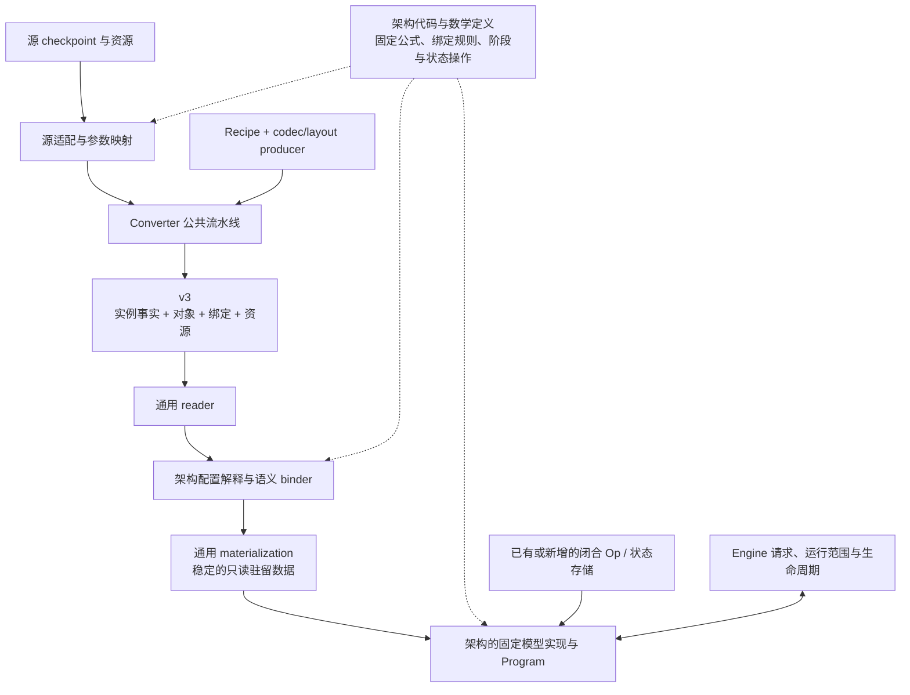

# 模型合同：公共边界与架构扩展

> 状态：目标规范草案，尚未实现。本文落实[重构纲领](model-weight-execution.md)中的模型合同，
> 规定 converter、容器、加载和运行实现如何共同解释一个模型实例。
> 各架构的字段、公式和参数目录由对应架构合同定义；v3 的字节编码由容器规范定义。

目标实现由少量实例配置、明确的权重表示与绑定，以及直接编写的模型代码组成。
大部分数学公式、调用顺序、组件交接与状态规则固化在各架构代码中；config 主要提供层数、
宽度、head/expert 几何等实例维度，以及少量确有需要的数学参数。

公共合同统一事实的归属、数据引用和运行生命周期。架构专属文档说明代码采用的数学规则，
并单独列出需要持久化的实例字段。新增架构增加相应实现；同架构更换训练权重或分配已有格式时，
沿用这些代码，更新数据与 recipe。

本文的扩展检查覆盖三个明显不同的例子：已有 Qwen3.5 Dense/MoE、本地 Qwen4Exp，以及
DeepSeek V4.1。已有实例的详细字段和参数表见[Qwen3.5 架构合同](qwen3_5-model-contracts.md)。
后两个例子用于检验领域边界，其推理支持和完整数学资格验证属于各自未来的模型开发。

## 1. 公共合同稳定什么

给定架构、实例配置和选中的功能，系统需要明确六件事：

| 问题 | 架构代码负责的内容 | 与其他部分的衔接 |
|---|---|---|
| 这是什么模型 | 上游架构标识、配置解释与数学规则 | 选择已编译的配置解释和模型实现 |
| 需要哪些持久数据 | 逻辑参数、语义表、轴、shape、使用位置 | Converter 生产，binder 检查并绑定 |
| 提供哪些功能 | 主模型、可选组件及其输入、参数和资源依赖 | 收集启动所选功能的依赖 |
| 每次计算接受和产生什么 | 输入域、输出域、条件特征及各阶段语义 | Frontend、Program、spec 后端交接 |
| 怎样继续一次请求 | 完整状态、frontier、提交、恢复和重建规则 | Engine 编排生命周期，Program 执行状态操作 |
| 怎样解释这份产物 | 表示值、使用许可、资源和训练关联 | 各消费者取得自己需要的事实 |

这六项说明实现责任。配置解析可直接读取一个小的结构，binder 按模型代码写出逻辑参数需求，
所选组件通过明确的条件代码准备，Program 实现自己的状态操作。
其中只有实例取值、实际数据和引用关系需要进入产物。
例如，Qwen3.5 的层可以执行 GDN，Qwen4Exp 的 block 维护多路 residual，
DeepSeek V4.1 的 attention 按 source 关系共享压缩缓存；它们仍通过同一条产物与运行链相接。

复用发生在公共数据机制、闭合数学实现和生命周期合同上。固定模型代码把这些能力组合起来，
其融合写法和 shape 专用化仍由维护者直接编写。

## 2. 架构、配置和实例身份

### 2.1 名称沿用对应上游

`architectures` 使用上游模型类名，`model_type` 使用对应 config 类型。
源适配按上游的 `text_config`、`vision_config` 等层级解释这些标识及字段，再提取目标组件所需的
实例参数。目标沿用字段名称和数学含义，持久组织采用
[v3 组件记录](artifact-container.md#42-组件记录)：Text、Vision 分别进入
`components.text.config`、`components.vision.config`，target 和资源引用位于各组件记录中。

| 已核对来源 | 根 architectures | 根 / Text model_type |
|---|---|---|
| 当前 Qwen3.5 Dense 包装 | `Qwen3_5ForConditionalGeneration` | `qwen3_5` / `qwen3_5_text` |
| 当前 Qwen3.5 MoE 包装 | `Qwen3_5MoeForConditionalGeneration` | `qwen3_5_moe` / `qwen3_5_moe_text` |
| 本地 Qwen3.8-Flash-Next | `Qwen4ExpForConditionalGeneration` | `qwen4_exp` / `qwen4_exp_text` |
| DeepSeek-V4.1-Flash | `DeepseekV41ForCausalLM` | `deepseek_v41` / `deepseek_v41_text` |

Text 子入口如何对应根架构，由该架构的适配规则规定。例如已有 Qwen3.5 规范化方案可以选择
标准 `Qwen3_5ForCausalLM` 或 `Qwen3_5MoeForCausalLM` 子入口。DeepSeek 的根类名虽以
ForCausalLM 结尾，实际产物仍提供 Vision；组件组成按声明与数据关系解释。

字段和枚举在所属架构内具有含义。Qwen 的 `num_experts` 与 DeepSeek 的 `n_routed_experts`
分别保留；Qwen3.5 与 Qwen4Exp 都出现 `full_attention`，后者还需结合 indexer 配置解释 QSA。
共用实现建立在核对后的数学一致性上。

公开名称、训练来源和 release 信息用于展示、报告、默认行为和训练配对。
架构/config 决定数学实现，实际绑定决定表示输入。三者在实例中分别记录。

### 2.2 Config 的规模与字段选择

每个架构只保存运行所需的少量实例参数。字段进入 config 的依据是：它确实区分实例，
执行需要它，并且已有代码、配置或关联资源尚未唯一确定它。
保留下来的字段沿用对应上游名称，说明类型、单位和实际数学约束即可。

| 内容 | 归属与例子 |
|---|---|
| 实例维度 | Config：num_hidden_layers、hidden_size、head/expert 数、FFN 宽度 |
| 必要的实例数学参数 | Config：实际采用的 norm epsilon、RoPE 参数、路由 top-k、参数共享关系 |
| 必要的实例层分布或位置 | Config：layer_types、训练相关的 target taps、不能由固定规则确定的 source 层号 |
| 固定数学 | 架构代码：norm/激活/gate 公式、残差连接、特征采集位置、阶段和提交顺序 |
| 派生量 | 代码计算：投影宽度、状态 shape、compact 索引、来自 target 的共用维度 |
| 源组织与训练资料 | Converter 解析：源名称、交错、源分片、初始化和训练辅助参数 |
| 实际物理表示 | 对象描述与绑定：codec/layout、group、scales、逻辑行映射 |
| 执行和容量 | 模型实现、Op 与 Program：融合调用、tile、workspace、状态存储和 Graph |

一个值固定在代码中，意味着它属于这份实现的数学合同。Converter 核对源模型符合该合同，
产物中的架构入口直接采用它。例如 Qwen3.5 的 SwiGLU、sigmoid gate、offset RMSNorm，
以及当前 MTP 的特征采集位置，都由固定代码定义。
扩展不同数学时同步增加相应实现，并在确有实例差异的位置补充必要的判别参数。

实例维度即使当前只有一个已测取值，仍可保留为数据。`hidden_size`、`hc_count` 等参数可以
在准备时进入相应的编译期专用化；执行继续使用固定 shape 优化。
字段数量的控制以事实是否必要为准，数学配置和物理绑定分别拥有自己的取值。

### 2.3 源配置怎样缩减为目标配置

源适配先解释上游 config 和代码采用的数学，再完成三项工作：核对固定语义，提取实例参数，
解析源表示与组织。源默认值只对保留的实例参数补出有效值，固定语义直接由架构代码提供。

拓扑保留一份有效依据。例如 Qwen3.5 保存展开的 `layer_types`，`full_attention_interval`
用于 converter 解析来源；Attention/GDN 数量和 compact 索引由代码计算。
`num_hidden_layers` 作为标准维度保留并检查列表长度。组件已有 target 引用时，共用宽度、
词表和其他确定信息从 target 取得。

保留的 source 层号按所属架构解释其索引域。例如本地 Qwen4Exp 的 `ple_layer_ids=[2]`
采用一基索引，对应第二个 block。固定特征采集阶段、参数 shape 公式、状态 producer/consumer
关系与生存期写在代码和数学说明中。

Config 数值按该字段实际需要的精度解释；对象尺寸、元素数和文件偏移按能覆盖数据的范围处理。
具体编码由 v3 定义。Python 与 C++ 共同维护的是这组小的实例字段及其数学关系。

## 3. 逻辑数据合同

### 3.1 从架构和配置展开需求

源适配直接把 checkpoint 对应到逻辑参数，binder 按固定模型写法和实例维度取得所需引用。
代码可以按层、expert 或其他真实维度循环处理；参数 shape 由附近的数学公式计算。
文档中的逻辑目录为两端提供共同依据，产物保存本次参数对应的对象与片段。

对实际使用的参数，说明：

- 数学用途和稳定的逻辑引用；已有上游参数名含义合适时直接沿用。
- 逻辑轴、shape 和元素语义，例如实数系数、整数索引或离散编码。
- 所属功能与使用位置，以及条件存在的规则。
- 训练共享、表示共享和其他数据依赖。
- 用途所需的辅助数据和数值边界。

架构专属名称由源适配与语义 binder 解释；通用 reader、对象定位和 materializer 处理公共描述。
Binder 完成后，固定模型代码持有 typed 引用，执行通过直接的 C++ 参数传递完成。

Qwen3.5 的 Q/K/gate/V、Qwen4Exp 的 residual mixing 参数与 PLE 查找表、DeepSeek 的
`wq_a`/`wq_b`、分组 `wo_a` 和 Engram 都能按这份合同各自描述。
轴定义可以表达向量、矩阵、分组矩阵、卷积、表和更高阶张量；每种实际数学由对应 consumer 实现。

### 3.2 持久数据包含训练参数和语义数据

| 数据 | 含义 | 例子 |
|---|---|---|
| 训练参数 | 学习得到的模型系数 | Projection、norm、expert、PLE/Engram embedding |
| 持久语义数据 | 解释模型输入或参数索引所需的确定数据 | Token 压缩映射、n-gram bucket 划分、固定索引表 |
| 表示辅助数据 | 解码某个物理表示所需的数据 | Block scales、zero points、weight divisor |
| 使用辅助数据 | 某个数学用途的实现所需输入 | Activation input divisor、校准后执行数值 |
| Frontend 资源 | 构造与解释公开输入输出的资料 | Tokenizer、chat template、processor、token 角色 |

这些数据可以复用同一套对象与引用设施，语义归属决定谁解释、校验和消费它们。
例如 Engram 的 token 压缩表决定查哪一行，是主模型输入语义的一部分；其 embedding scale
用于解码那一行，是表示语义的一部分。

对源环境依赖强或生成成本高的确定数据，推荐 converter 生成并持久化精确结果。
每类实际数据选择保存结果或按固定规则派生，并指定唯一的数值权威。
这样 loader 可以继续专注于验证、上传和绑定。来源库版本、校准样本和生成过程作为 provenance
提供追溯依据，执行实际需要的结果进入持久数据。

### 3.3 逻辑参数到物理对象

Artifact 保存实际的对象和逻辑对应，binder 按架构需求核对它们。
逻辑引用可以对应整个对象、一个合法 view，或由规定片段覆盖的逻辑区域。
映射明确轴、范围、行序、grouping、parent 和 scale 等 planes 的关联。

模型需要四个投影时，可以有一个融合 parent，也可以有几个 split parent；
架构定义四个投影的数学用途，物理绑定定义本次产物的组织。Op 的参数准备将这些引用适配到
自己已经实现的原生入口，例如一个融合权重参数或两个不同格式的权重参数。

零拷贝 view 依赖实际 codec/layout 的切片规则。跨编码块、需要改变行序或重新 packing 的变换
由 converter 完成。Materializer 按对象和 owner 去重，并按绑定保持所需的生命周期。

训练参数共享、物理对象共享和运行状态共享分别有自己的关系：

| 关系 | 所有者与意义 |
|---|---|
| Tied 训练参数 | 架构/config 指定多个用途来自同一训练参数；可按用途生成不同量化表示 |
| 物理 alias | 绑定明确引用同一编码对象或合法 view，materializer 复用其 backing |
| 跨层状态共享 | 架构规定某层产生运行数据、其他层读取；Program 管理生产顺序和存活期 |

逻辑参数名标识架构定义的消费角色。同一训练参数的用途需要独立选择表示时，架构目录为它们
定义各自的逻辑名字与 Binding；共用表示时，这些 Binding 引用同一对象或同一区域。
Use 在所引用的逻辑角色上表达输入位置、许可与辅助值；引用同一角色的多个 Use 消费同一份
Binding。源适配按架构/config 的训练共享规则取得源参数，再按各角色的 recipe 生成或共享表示。

共享训练参数的不同量化结果按各自表示值执行。Companion 的训练配对另外记录目标实例关联，
binder 检查结构和输入关系，质量与接受率通过真实产物评估。

## 4. 组件与数学输入

### 4.1 主模型是一个功能角色

Artifact 必须提供完整的 Text 主模型及其依赖。这里的 Text 表示承担文本生成、验证和评分的
主计算，其内部结构由架构定义：可以是 hybrid blocks、多路 residual，或 causal encoder-decoder。
PLE、Engram 等主干数学需要的数据随主模型收集。

Vision 和 speculative 功能按实际提供的组件声明。当前 MTP、DFlash、DFlash2 都能沿这个机制
表达；新增后端补充自己的架构定义、条件输入和运行算法。
组件角色标识用途，具体架构标识解释实现，组件引用标识本产物中的关联对象。

声明提供的组件包含完整的私有配置、数据和必要资源。启动选择 Vision，以及 none 或一个
spec 后端；选择在 Engine 生命周期内固定。加载只收集主模型、所选组件及其共享依赖。
这种依赖收集使用架构定义的固定关系，产物提供本实例的引用与取值。

依赖从逻辑用途展开，驻留以其引用的完整物理对象为单位。Converter 按可独立启用的功能组织
私有对象，并保留真正共享的数据引用；具体的对象合并边界见
[v3 对象规则](artifact-container.md#53-对象范围与共享)。

### 4.2 交接合同由两端共同确定

每条组件交接关系要明确产生位置、输入内容、轴、位置对应、数值边界和有效期。
参数关联与运行时特征传递分别描述。

| 交接 | 已核对实例中的具体内容 |
|---|---|
| Qwen3.5 Text → MTP | 对应位置的 final hidden，以及 MTP stem 需要的 embedding |
| Qwen4Exp Text → MTP | Final mixer 前的完整多路 residual；本地实例为每 token `4×2560` |
| 当前 Text → DFlash / DFlash2 | 合同选定的 target block residual features，按 tap 顺序拼接 |
| DeepSeek V4.1 Text → DSpark | 公开参考实现在 target 层进入 block 前采集分支均值，再按 target 列表拼接 |
| Vision → Text | 该模型的视觉特征、位置/媒体关联和注入规则 |

公共层交接的是所选架构定义的内容；目标特征的采集、临时存储和消费通过固定代码完成。
例如 Qwen4Exp 的 MTP continuation 需要保留多路 residual，而采样 head 可以消费合并后的单路
hidden。这两者有不同用途和生命周期。

Text-only 产物可以保留来源的多模态架构名称，同时仅声明 Text 所需数据。
源 config 中供已省略功能使用的字段，由该架构的规范化规则明确处理。
主干必需信息与可选功能信息的依赖范围是判断是否收集数据的依据。
例如加载代码可以直接在启用 MTP 时绑定其私有参数，在构造 Program 时准备对应状态。
固定的交接内容、输入位置和生命周期写在两端代码中；实例特有的 target 引用或 tap 层号才由数据提供。

### 4.3 Token、Frontend 与输出域

模型合同分别解释公开 token ID、embedding 行、主输出行、proposal 行和物理 padding 的域及映射。
已有 Qwen 实例用连续公共域 `[0,V)`、较大的模型行域 `[0,R)` 和显式 shortlist 映射表达；
其他架构按自己的 token/索引语义定义对应关系。Sampler 使用合法公开输出域，
内部 mask/noise 用途按所属组件的输入规则解释。

Tokenizer 的词汇含义与这些映射一起确定模型输入语义。Engram 一类结构还通过语义表直接消费
token 关系，转换时将其依赖一并解析。Chat template、媒体 processor 和输出解析器分别负责
提示构造、模型要求的媒体输入和生成结果解释，并提供可靠的重建边界。

公开名称、模板资源与训练配对来源保留在相应实例资料中。
Prefix reuse 的身份由实际 resident、prepared input 与可恢复状态共同确定。
V3 负责资源承载；本次 Frontend 保持现有模板识别和渲染行为，范围见
[运行时合同](model-runtime.md#62-frontend-资源和模板范围)。采样模式 preset 与请求覆盖遵循
[默认值合同](model-runtime.md#63-默认值名称和其他身份)。

## 5. 数值使用合同与表示选择

数学定义公式，codec/layout 解释存储，Op 定义实现精度与实际输入边界。
Recipe 选择表示和可用的计算精度，并生成必要的辅助输入。
各用途的数值许可附着在数学使用位置上，融合后的原生参数仍保留这些约束。

目标 projection 激活许可采用：

| 许可 | 允许集合 |
|---|---|
| `A16Only` | A16 |
| `AllowA8` | A16、A8 |
| `AllowA4` | A16、A8、A4 |

一次共享激活量化采用所有使用者许可的交集，并满足其辅助值合同。
例如 gate=AllowA4、up=AllowA8，共享计算的许可为 A16/A8；实际实现选择其中可用的路径。
原生 Op 入口及容量查询统一采用该集合，具体适配见[Use 接入](model-runtime.md#42-use-进入真实调用)。
Embedding lookup、离散索引、norm 和状态更新按各自 consumer 的输入规则处理。

新架构中的参数用途可以复用已有 codec 和 Op。新增格式时，producer、表示规范与 consumer
分别实现自己的责任。例如 E2M1 元素名称相同的两种格式，还需要核对 group、scale 类型、
scale 方向和 packing，才能确定是否复用现有 codec。
数学上的压缩注意力还需要其压缩与索引算法；KV 的数值编码由对应状态实现处理。

## 6. 状态、阶段与 Program

### 6.1 完整状态由架构和启用的算法定义

每个架构在自己的 Program 和状态实现中定义继续请求需要保留什么。文档说明：

- 数学内容、索引域及生产者和使用者。
- 已消费输入的位置、可见范围和有效期。
- Append、提交接受前缀、恢复、清空及 prefix reuse 的语义。
- 可重建状态的输入依据、算法和适用条件。
- 有意义的数值边界，以及与其他状态的一致性关系。

| 架构中的状态需求 | 对 Program 的含义 |
|---|---|
| Qwen3.5 KV、GDN convolution/recurrent state | 维护各自历史和接受前缀提交规则 |
| Qwen4Exp QSA 主 KV、indexer 数据、GDN、PLE 历史 | 为不同历史组织准备实际 backing，并一起处理请求恢复 |
| DeepSeek V4.1 SWA、共享 compressed KV、indexer K | 按数学 owner 保存状态，按来源关系交给读取层 |
| N-gram 输入历史 | 接续、分块、批重排和 rollback 后保持 token 上下文一致 |
| Spec target features / continuation | 按后端要求保存实际内容、位置及提交状态 |

Top-K 结果、跨层候选池、多路 residual 等还需明确属于当前调用内的中间数据，还是跨调用
继续计算所需的内容。这一分类由真实算法决定。
Prefix checkpoint 保存或可恢复的内容共同构成该 frontier 的完整状态。
上述状态规则落实为直接的存储与事务操作。Artifact 提供推导维度所需的参数；状态目录、
更新顺序和跨 Op 存活期由代码组织。

### 6.2 架构实现拥有各阶段的固定程序

Engine 组织请求、批处理和结果发布；模型实现定义 prefill、decode、评分和 target verification
各阶段计算哪些内容，并向 Program 提供所需状态操作。Spec 实现进一步定义 proposal 和接受流程。

各阶段可以使用不同的固定调用序列。具有共享 encoder 结果、有限窗口 replay 或其他阶段特性的
架构，在自己的执行与状态合同中说明这些路径。Engine 消费请求进度、可提交结果和状态生命周期；
阶段内部的张量形状、Op 次序和融合由模型代码组织。

不可变驻留模型包含配置、绑定、组件关联和只读数据。Program 拥有自己的可变状态、workspace、
控制表和 CUDA Graph。物理容量来自实际绑定、固定调用的需求以及启动运行范围。
状态存储实现报告 bytes、对齐和操作需求，模型代码给出跨 Op 存活期与复用关系。

例如跨层复用 compressed KV 时，资源按 producer 与共享范围计算；PLE convolution history
按其实际几何计算；MTP 特征缓冲按交接合同计算。新状态需要实现相应存储与事务操作，
完成后接入公共资源预算和生命周期。

CUDA Graph 捕获这些已编写路径的真实调用。启动准备稳定 backing，执行时更新请求映射、
frontier 和控制数据。失败 round 按事务合同回收或恢复状态，成功提交后交由 Engine 发布。

## 7. Converter、v3 与加载的具体分工

### 7.1 新架构的 converter 做什么

源适配器核对这个架构的固定数学，提取小的实例配置，并解释 tensor 名、轴、共享、已有量化
和必要资源，提供逻辑源访问。源默认值、源分片等约定在这里解析，产物由确定的组件选择生成。

Recipe 在展开的逻辑用途上选择已有 producer、目标 codec/layout、融合或拆分存储及计算许可。
公共转换流水线安排实际作业，流式完成量化、校准、packing、布局变换和语义表生成；
writer 接收确定的对象描述、绑定和字节。

新增架构时主要增加源适配与需求定义，缺少的数学预处理或 producer 另行实现。
已有架构更换训练结果沿用这些代码。用户改变已有格式的分配时修改 recipe；
每个输出对象的实际表示在产物中展开记录，loader 直接读取结果。

### 7.2 v3 携带的领域信息

| v3 中需要能承载的内容 | 内容的语义所有者 |
|---|---|
| 上游架构标识与小的实例配置 | 对应架构的字段定义 |
| 提供的组件、实际 target/资源引用 | 固定组件代码解释这些关联 |
| 逻辑参数和语义数据的实际绑定 | 架构定义用途，公共绑定规则定义对应方式 |
| 对象形状、codec/layout、planes、物理位置与共享 | 容器、codec/layout 合同 |
| 按数学用途关联的许可和持久辅助输入 | 用途与 consumer 数值合同 |
| Tokenizer、template、processor 等资源与关联 | Frontend 和对应模型合同 |
| 公开资料、训练配对和 converter provenance | 实例与转换工作流 |

V3 对外提供统一的目录、配置承载和引用机制；架构代码解释自己的少量字段和逻辑名称。
新增架构使用既有承载机制保存必要实例参数与数据绑定，reader 继续完成 framing、边界和引用检查。
对象增加新 codec/layout 时扩展对应的物理解释能力。

通用目录可以读出架构配置记录，再交由选中的架构解释器消费。
文件格式版本管理公共编码的变化；新增架构名称、架构专属字段和逻辑用途使用既有承载机制。
保留字段的含义在对应架构合同中维护，语义变化同步更新生产者和消费者。

容器保存本实例的数据与关系。固定公式、参数 shape 推导、组件交接阶段、状态操作、执行次序、
原生 Op 调用和 workspace 生命周期属于代码；具体地址、容量与 Graph 属于运行准备的结果。
分片只改变对象的文件定位，遵循 [v3 文件集合合同](artifact-container.md#2-文件集合与地址空间)。
自定义 template 按资源合同保存，运行时保持上述已确定的 Frontend 范围。

### 7.3 从文件到执行对象

1. Generic reader 读取目录、配置记录、对象描述和引用，检查文件自身的结构。
2. 已编译的架构入口读取实例维度和必要参数，按启动选择进入对应组件的准备代码。
3. 语义 binder 按固定模型代码核对逻辑用途、派生 shape、轴和实际引用，取得 typed 参数。
4. Materializer 依实际对象及 view 关系安排 backing，上传所需数据，形成只读驻留实例。
5. 固定模型实现将引用交给实际 Op 参数准备；Program 查询真实需求、准备容量和状态、建立 warmup/Graph。
6. 请求进入后执行既定阶段代码，Op 按实际 shape/phase 分派，Program 完成状态事务。

描述性绑定可以先于上传完成；设备引用在 materialization 后完成。这些是依赖关系，
具体 C++ 对象的拆分由加载和运行时文档规定。

数据检查与支持失败分别由实际消费者处理：

| 情况 | 发现位置 |
|---|---|
| 字节范围、对象引用或 framing 错误 | Generic reader |
| 所选架构缺少已编译实现 | 架构入口解析 |
| 配置关系、逻辑 shape、组件输入或语义表错误 | 对应配置解释器与 binder |
| 源语义、转换方法或 recipe 无法生产指定表示 | Converter 的实际作业 |
| Op 缺少该表示/几何的入口 | 真实参数准备、容量查询、warmup 或执行 |
| 状态实现或可用容量不足 | 实际状态构造与 Program 资源准备 |

支持判断沿实际消费发生，加载流程执行必要的数据验证和运行准备。
Warmup 的结论覆盖它实际执行的路径。错误应携带架构、组件、逻辑用途和失败消费者，
使新增能力的责任位置明确。

## 8. 新增架构的扩展单位

新增架构首先编写它的固定模型、源适配和绑定代码，必要时实现新的 Op 与状态操作。
各部分沿既有职责接入：

| 交付 | 新架构负责的内容 | 复用的设施 |
|---|---|---|
| 架构合同 | 代码中的固定数学、少量实例字段及逻辑参数说明 | 本文的事实归属与数据引用约定 |
| 源适配 | 上游命名/轴/编码/资源到模型事实的对应 | 源读取、转换作业、recipe、writer |
| 配置解释与 binder | 小的配置结构、直接参数绑定和几何检查 | 对象描述、view、上传、owner 管理 |
| 固定模型实现 | 直接计算序列、融合、阶段变体和专用化 | 数学一致的 Op、codec/layout |
| Program / 状态接入 | 新状态和事务、真实容量、Graph 路径 | 公共预算、请求生命周期与发布合同 |
| Frontend / spec 接入 | 实际输入输出及所选后端算法 | 公共 Engine、协议与资源读取 |

通用性体现在公共机制的输入仍然成立。若新架构揭示了公共机制表达不了的真实数据或生命周期，
应在该责任边界补充能力，并让现有架构共同遵循；架构自身的数学仍归它自己的实现。
例如新的 token 语义表可以直接使用对象与引用，新状态需要补状态实现，新的公开输入行为则需要
相应 Frontend/Engine 接入。

源码中保留显式的架构入口选择即可。入口按数学和配置解释选择实现；运行时的内部配置类型、
权重结构和 state 类型由各架构定义。共用算法通过已经明确的数学和执行接口复用。
维护者可以直接写循环、有限分支、融合调用与状态操作，所需的物理差异从实际绑定取得。

扩展是否成功，用变化的归属检验：

| 变化 | 正常落点 |
|---|---|
| 同配置换训练结果 | 输入数据和实例资料 |
| 已有能力的新混合表示 | Recipe、辅助输入和输出对象/绑定 |
| 已有代码覆盖的新配置 | Config、数据规模和派生需求 |
| 新数学或状态 | 架构合同、固定实现、所需 Op/状态接入 |
| 新编码或新文件定位能力 | Codec/layout 或容器对应能力 |

## 9. 全链路例子：已有 Qwen3.5 的新权重组合

取同一份 Dense config，attention 仍需要 Q/K/gate/V。

1. 新训练 checkpoint 使用同一个源适配器，得到相同逻辑目录和新的参数值。
2. Recipe 选择 Q/K 为 Q4、gate/V 为 Q5；converter 按已有 producer 生成两个 parent、对应
   scales、行映射和使用许可。另一个 recipe 可以生成一个 NVFP4 parent。
3. 两份 v3 产物声明相同数学/config，保存各自对象和绑定。
4. 同一个架构 binder 都得到四个逻辑引用，同时保留它们的实际 parent 与表示。
5. 固定 attention 实现调用已有参数适配：前者进入双权重入口，后者进入单权重入口。
6. Program 根据本次真实调用准备 scratch 和 Graph，执行相同数学用途。

若 producer 或该原生入口尚未实现，错误在它实际被使用时报告。
这条链复用了架构定义、binder 和固定模型代码；数值与资源差异由真实表示体现。

## 10. 全链路例子：Qwen4Exp

### 10.1 从实际来源取得哪些事实

本地 `~/models/llm/qwen/Qwen3.8-Flash-Next/config.json` 声明
`Qwen4ExpForConditionalGeneration` / `qwen4_exp`。下面的源事实用于区分实例参数与代码规则：

| 事实 | 本地取值 | 建议归属 |
|---|---|---|
| Block 与宽度 | num_hidden_layers=48、hidden_size=2560 | 展开 block 参数和几何 |
| Gated residual | hc_count=4、hc_lowrank=320 | Config 保存维度，mixing 公式写在代码中 |
| QSA indexer | indexer_n_heads=4、indexer_head_dim=128、indexer_budget=2048、indexer_compress_ratio=4 | 保存所需几何与预算，稀疏选择步骤由固定实现组织 |
| PLE | ple_layer_ids=[2]、ngram_size=3、heads_per_ngram=8、ple_embed_dim=2560 | 保存需要的维度和实例层号，查找/注入算法在代码中实现 |
| MoE | num_experts=512、num_experts_per_tok=10 | 展开路由与专家用途 |
| MTP 输入位置 | Final mixer 前的多路 residual | 在对应 MTP 代码中固定，宽度由 hc_count×hidden_size 派生 |
| 源表分片与 padding | split_ngram_parts=128、make_ngram_vocab_size_divisible_by=128 | Converter 解析，目标对象描述实际行域与存储 |
| 固定公式与训练资料 | output_gate_type=sigmoid、initializer_range、router_aux_loss_coef | Gate 数学由代码实现，初始化与训练参数作为源资料 |

本地 vLLM 的 `Qwen4ExpDecoderLayer` 在 block 内显式组织 PLE、GatedResidual、GDN/QSA 和
MoE；`Qwen4ExpModel.forward` 先展开多路 residual，最终 mixer 分别交付 head 所用的单路
hidden 和 MTP 所用的多路 hidden。这是单独的架构定义，可以复用核对后相同的 GDN/MoE 实现。
正式接入时按同一规则筛选嵌套 mtp 中的少量独立参数，固定的 stem 和交接位置直接编写。

### 10.2 转换、容器和运行

1. **源适配。** Qwen4Exp adapter 解释 config、PLE、mixing、indexer 和现有投影。
   本地 `split_ngram_parts=128` 用于解释源 PLE 表的行分片；adapter 将源分片对应到完整逻辑
   查找域。目标 config 保留实例参数，源分片/padding 由转换结果消解；文件放置由 writer 决定。
2. **逻辑需求。** 除 block 投影外，需求包含 PLE embedding、mixing 参数、indexer 参数和
   实际需要的整数表。本实例 n-gram 有 `(3-1)×8=16` 个 heads，按参考实现每 head 宽度为
   `2560/16=160`；PLE 表的行域按它自己的 bucket 规则定义。
3. **物理生产。** Recipe 为各用途选择已有编码。PLE 查表和普通 projection 可以使用不同
   producer/consumer；融合 grouping 由实际产物记录。Writer 写出配置、绑定、语义表和字节。
4. **功能选择。** 假设产物提供 Text、Vision、MTP，启动只开启 Text。Binder 收集 Text 必需的
   PLE、QSA、GDN、MoE 和 mixing 数据；Vision/MTP 私有数据保持未驻留。
5. **执行准备。** Qwen4Exp 固定实现处理多路 residual。Program 准备 QSA 的主 KV 与 indexer
   需求、GDN 状态、PLE convolution 与 token 上下文；状态结构和生命周期直接写在 Program，
   其维度与 scratch 根据实例参数和真实 Op 调用计算。
6. **继续请求。** Chunk prefill、decode、批重排和 prefix 恢复都保持同一已提交 n-gram 上下文。
   本地参考实现从已消费 token frontier 取前 `ngram_size-1=2` 个 tokens；NInfer 的状态实现
   可以按这一数学需要选择保存或重建方式。
7. **开启 MTP。** 依赖增加 MTP 私有参数与状态。Target 交接每 token `4×2560=10240` 个
   residual 元素，采样 head 使用合并后的 2560 维输入；固定代码选择数学位置，容量按维度计算。

第二份同架构训练产物或新的已有格式 recipe 沿用以上架构接入。这里新增的是 Qwen4Exp 的数学
与状态能力，公共 reader、逻辑到物理引用和 writer 持续复用。

## 11. 全链路例子：DeepSeek V4.1

### 11.1 核对范围与架构差异

用户指定的模型使用 `DeepseekV41ForCausalLM` / `deepseek_v41`。官方说明采用 20 层 causal
encoder 加 20 层 decoder 的 CED，CSA2 通过 Full、Reindex、Reuse 三种静态模式共享 KV 与
索引，并使用 Single-Pass mHC、Engram 和 DSpark；Vision 采用 2D RoPE 与 3×3 下采样。
这些事实来自[官方模型说明](https://huggingface.co/deepseek-ai/DeepSeek-V4.1-Flash)。

公开[配置](https://huggingface.co/deepseek-ai/DeepSeek-V4.1-Flash/blob/main/config.json)中，
Text 的部分原生字段为：

| 字段组 | 实际例值 | 归属 |
|---|---|---|
| 主干 | num_hidden_layers=40、hidden_size=5120、hc_mult=4 | 架构几何与 residual |
| Projection | q_lora_rank=1280、o_lora_rank=1024、o_groups=8 | 低秩与分组投影数学 |
| KV 来源 | kv_source_layer_ids=[2,8,14,20] | 跨层状态生产与读取关系 |
| 索引来源 | index_source_layer_ids=[2,8,14,20,24,28,32,36] | Full/Reindex/Reuse 的固定选择依据 |
| 候选来源 | candidate_source_layer_id=20、candidate_block_size=8 | 分层索引数学 |
| 历史覆盖 | sliding_window=128、compress_ratios | SWA 与压缩历史 |
| Engram | engram_layer_ids=[1,14]、engram_max_ngram_size=4 | 查找与历史语义 |
| Proposal | num_nextn_predict_layers=3、dspark_target_layer_ids=[37,38,39] | DSpark 私有结构与 target 关联 |

表中列出源事实，正式接入时按第 2 节筛选持久字段。例如低秩维度可作为实例参数，
低秩投影之间的 norm 和分组乘法规则直接写在代码中。`kv_source_layer_ids` 可以保留实际层号，
模型代码按既定规则完成共享；完整的状态生产消费关系与存活期由 Program 定义。
`compress_ratios` 的 43 项覆盖 40 个主干层加 3 个 next-n 层，其有效范围由对应架构解释。

公开[参考实现](https://huggingface.co/deepseek-ai/DeepSeek-V4.1-Flash/blob/main/inference/model.py)
展示了低秩投影、分组输出、共享 compressed KV、indexer 与候选复用。
其中普通 forward 逐层执行，DSpark 提供 forward 接口；
[参考实现说明](https://huggingface.co/deepseek-ai/DeepSeek-V4.1-Flash/blob/main/inference/README.md)
明确生成仍采用普通自回归采样。官方描述的 CED prefill 优化、SWA bounded replay 和完整 DSpark
验证调度，需要在正式接入时进一步落实其阶段与状态合同。本节据此检查所需的扩展边界。

### 11.2 持久语义数据是必需输入

[Engram 参考实现](https://huggingface.co/deepseek-ai/DeepSeek-V4.1-Flash/blob/main/inference/engram.py)
从 tokenizer 构造 compressed token map，并依据压缩后的词表大小生成哈希乘数。
输入 token 经过该映射和 n-gram 哈希，决定读取训练表的哪一行；图像位置还形成历史截断边界。

建议 NInfer converter 将精确 token map、所需哈希/bucket 表及其关联持久化，
loader 按普通整数对象绑定这些数据，模型实现直接执行已定义的索引数学。
这让 C++ 执行依赖明确的数据，也让源 tokenizer 的具体生成流程保留在转换端。
普通 chat template 继续决定如何构造提示；token 索引语义的变化则需要与 Engram 数据共同校验。

### 11.3 从产物走到一次请求

1. **识别与映射。** DeepSeek adapter 解释原生 config、参数名、Engram 与 Vision 资源。
   `wq_a` 和 `wq_b` 是带中间 norm 的低秩数学；`wo_a` 具有分组轴，需求目录分别说明。
2. **产生表示。** 源 quantization_config 用于解读已有编码。实际 tensor 的 block、scale
   和 packing 由源适配核对，recipe 决定目标表示；新 codec/producer 在自己的模块实现。
   官方转换脚本也有专门的
   [FP4/FP8 处理](https://huggingface.co/deepseek-ai/DeepSeek-V4.1-Flash/blob/main/inference/convert.py)，
   可作为源编码核对依据。
3. **写入 v3。** 容器保存精简的 DeepSeek 实例 config、参数与语义表绑定、对象表示、组件目录和
   Frontend 资源。`kv_source_layer_ids` 是模型事实，未来请求产生的 KV 数据由 Program 管理。
4. **绑定。** DeepSeek binder 展开本实例的低秩投影、压缩器、indexer、MoE、mHC 和 Engram
   需求。Generic reader 和 materializer 继续按公共对象描述读取与上传。
5. **准备状态与执行。** 固定模型代码按 source 关系组织压缩缓存、索引与候选的生产和消费；
   Program 分别分配共享状态、逐层 SWA、压缩器历史和调用内中间数据。
   Full/Reindex/Reuse 可按实例 source 层号进入代码中的有限分支；调用和状态操作直接编写。
6. **处理阶段。** 普通运行与 CED 优化路径分别由模型实现提供。若实现 bounded replay，
   checkpoint 合同需要规定保留哪些 encoder/全局状态，以及如何重建所需窗口内容。
   评分和 verification 仍需产出各自要求的目标位置结果。
7. **可选功能。** Text-only 收集主干及 Engram。Vision 启用后增加自己的 encoder、projector
   和媒体语义。DSpark 启用后增加专属参数、target 特征交接与验证算法。
   其 confidence 输出如何参与调度，由 DSpark 的完整算法合同落实。
8. **继续扩展实例。** 同一个 DeepSeek 数学/config 更换训练结果或使用已有能力的新 recipe，
   更新数据与绑定，沿用上述架构接入。

本例检验的是表达与接入边界。该完整 checkpoint 的容量是否符合 NInfer 的单 GPU 驻留范围，
以及具体 CUDA 能力和性能，需要按实际表示与硬件评估。

## 12. 各架构详细合同怎样编写

每份架构合同按同一组问题组织，但用该模型自己的数学和术语回答：

| 部分 | 应给出的内容 |
|---|---|
| 标识与证据 | 上游类/config 名、核对的来源、对应数学及证据范围 |
| 配置 | 精简后的实例字段、取值含义和来源；代码固定值、派生值分别说明 |
| 数学与阶段 | 代码采用的拓扑、固定公式、数值边界、各阶段输入输出 |
| 逻辑数据 | 参数与语义表的角色族、轴/shape、条件需求及共享 |
| 功能组合 | 主模型完整性、可选组件、target 输入与资源依赖 |
| 状态 | 数学状态、frontier、事务、prefix 恢复和可重建内容 |
| Frontend | Token/媒体/输出域、资源关联和模型必需的语义数据 |
| 实例核对 | 完整配置、代表性数据对应和能发现遗漏的覆盖证据 |

[Qwen3.5 架构合同](qwen3_5-model-contracts.md)提供现有 Dense/MoE 及其 Vision/MTP/DFlash
组合的详细定义。Qwen4Exp 与 DeepSeek V4.1 的正式合同可按此组织分别编写，复用本文的公共规则。
数学说明以实际实现为单位，字段表只列需要随实例存储的值；实例例子展示代码、配置、对象绑定
如何共同确定一次运行。

本文交给后续模块文档的内容如下：

| 文档 | 依赖的模型合同 | 继续决定的实现事项 |
|---|---|---|
| v3 容器 | 公共记录类别、架构配置承载、逻辑数据/组件引用 | 字段与 framing、对象定位、分片、版本规则 |
| Converter | 架构源解释、需求展开、语义数据与使用许可 | 适配接口、recipe、作业调度、writer、转换验证 |
| 加载与绑定 | 所选需求、几何、关联、typed 引用的含义 | Placement、view/owner、上传与 Op 参数准备 |
| 模型运行时 | 架构阶段、功能交接和数学实现 | 固定写法、融合、专用化、Frontend/Engine 接入 |
| Program 资源 | 完整状态、生产消费关系和生命周期 | 物理状态、容量、scratch、Graph 与事务实现 |

## 13. 本轮核对来源

核对日期为 2026-09-12。Qwen4Exp 使用用户指定的本地模型资料与本地 vLLM 代码，
DeepSeek 使用用户指定仓库的配置、模型说明与公开 inference 源码；核对未读取大模型权重数值。

| 来源 | 具体位置与核对内容 |
|---|---|
| 本地 Qwen4Exp 产物 | `~/models/llm/qwen/Qwen3.8-Flash-Next/config.json`、`README.md`：架构名和实例配置 |
| 本地 vLLM Qwen4Exp | `/home/neroued/vllm/vllm/models/qwen4_exp/nvidia/model.py`：DecoderLayer、forward、MTP handoff |
| PLE 与输入状态 | 同目录 `ple_layer.py`、`model_state.py`：源表分片、哈希/表、已消费 token 上下文 |
| Qwen4Exp MTP | 同目录 `mtp.py`：多路 residual 输入和 continuation |
| DeepSeek V4.1 | 第 11 节所链的官方 config、模型说明、inference README、model、engram 和 convert |

各模型的完整资格验证仍按[Op 开发合同](op-development.md)及对应模型数学参考执行。
