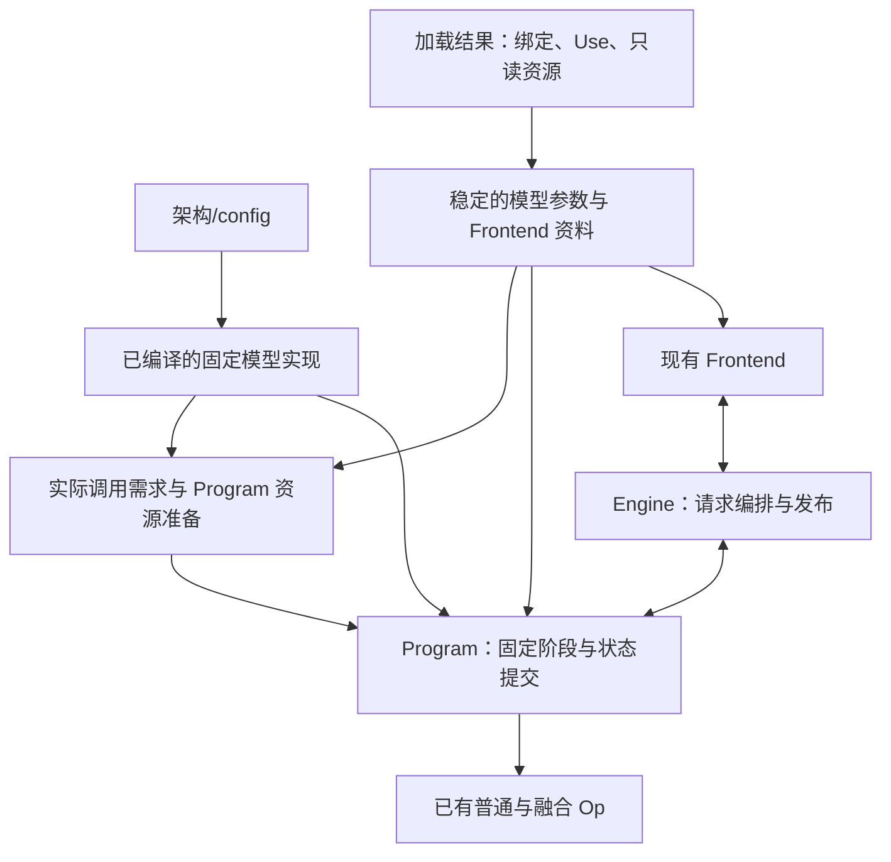

# 固定模型执行与 Engine 接入

本文规定权重解耦后的模型运行时实现合同，属于目标设计，尚未完成代码迁移。现状核对基于
2026-09-13 的实现。代码片段用于说明接口关系，成员名称不是已经落地的 API。

本模块承接[权重加载与 Op 参数准备](weight-loading.md)的结果，让已有固定模型代码使用本次
配置、绑定和 Use。对于已有实现覆盖的架构、配置和物理表示能力，新训练实例或新的混合分配
直接成为实例数据；执行继续保留固定 shape 专用化、已有融合和 Program 生命周期。

[模型合同](model-contracts.md)拥有数学、配置和组件交接；[重构纲领](model-weight-execution.md)
拥有总体边界；[Engine 架构](engine-architecture.md)拥有请求控制面与发布合同。本文细化这些
合同之间的接入，Program 的具体容量、状态存储和 Graph 资源安排由
[资源文档](program-resources.md)展开。

## 1. 现有基础与实际差距

### 1.1 直接复用的机制

| 现有实现 | 已经具备的能力 | 目标中的用途 |
|---|---|---|
| [ModelView](../../src/targets/qwen3_6/export/ninfer/targets/qwen3_6/model_view.h) | 被动权重引用、逐层 payload、可选组件 | 接收新加载结果，继续向执行提供只读参数 |
| [27B 执行叶子](../../src/targets/qwen3_6_27b/impl/variant.cpp) | Attention 单／双权重分支，GDN 投影/control 融合，Dense 融合 | 保留显式调用，调整参数来源 |
| [TextContext](../../src/targets/qwen3_6/impl/runtime/text_context_impl.h) | 固定层循环、mixer/FFN 次序、phase 与状态操作 | 接入实例配置和实际层参数 |
| [35B 执行叶子](../../src/targets/qwen3_6_35b_a3b/impl/variant.cpp) | 原生 SparseMoeWeights，按实际 routed 权重查询调用内 scratch | 保留闭合 MoE 路径 |
| [Workspace 组合](../../src/targets/qwen3_6/impl/runtime/layouts_impl.h) | Scope、临时激活存活期和阶段峰值组合 | 将预设格式输入替换为实际调用需求 |
| [Graph 执行辅助](../../src/targets/qwen3_6/impl/runtime/graph_impl.h) | 对固定 body 进行 eager 执行或 capture/replay | 捕获同一模型实例的真实调用 |
| [启动功能选择](../../src/targets/qwen3_6/export/ninfer/targets/qwen3_6/startup_features.h) | Vision 开关、一个 spec 后端和 proposal 选择 | 消费实际存在且启用的组件 |
| [Program](../../src/targets/qwen3_6/impl/runtime/program.h) | Prefill、decode、评分、状态事务和 continuation | 继续作为 Engine 的物理执行入口 |

这些计算、融合和事务机制构成本模块的实现基础。调整权重与配置输入时，保留其数学、提交
顺序和已有优化。新数学、Op 或状态能力仍按各自合同增加实现。

### 1.2 必须替换的数据来源

| 差距 | 当前具体表现 | 目标要求 |
|---|---|---|
| 入口依赖完整身份 | Registry 由 model_id/weights_id 取得 package 和 WeightsProfile，后者同时进入加载与规划 | 架构/config 取得数学实现，实际绑定进入执行和资源准备 |
| 实例配置尚未贯通 | TextConfig、DFlashConfig 固化维度、层分布、token 域和 target taps | 消费领域合同中的实例值，派生索引；需要专用化的几何进入已编译入口 |
| Use 与原生许可尚未贯通 | 27B 的 text_policy() 由 QType 推导许可；部分原生入口仍使用旧许可条件 | 参数消费真实 Use，原生入口与容量查询统一采用目标许可集合 |
| 容量使用整套配方假设 | 部分查询按 profile 分支，部分直接写死 W8、Q4/Q5 等格式；计划与模型用 profile 相等校验 | 从实际参数查询，计划与执行使用同源模型事实 |
| 辅助消费者隐含物理表示 | 35B 预取提示写死下一投影的 W8 字节数；默认值和诊断接收旧身份 | 物理范围来自实际绑定；产品资料与测量身份分别解释 |

特别需要检查无 profile 分支的消费者。例如当前 35B post-mixer 容量预先取 Q4/Q5 和 Q4/Q6
的最大值，DFlash 的部分查询直接写 W8，均不等于已经消费了实际绑定。

组件可选还涉及消费端初始化：当前 Frontend 构造会无条件解析 processor。Text-only 容器
允许缺少 Vision 私有资源，因此 Frontend 也要按所选功能收集和解析依赖，见第 6.2 节。

当前 family 的共享算法、package 的实例存储与编译期实例化已经分工。目标保留有价值的共享，
将执行选择依据改为数学和配置，将物理差异交给参数记录。源码目录或模板数量本身不是验收目标。

## 2. 从加载结果接入 Program

### 2.1 接收的数据与所有权

加载结果已拥有稳定 backing、逻辑绑定和必要资源。实际执行消费其中的下列内容：

| 输入 | 实际用途 |
|---|---|
| 架构自己的 config 与派生几何 | 层循环、Tensor shape、位置与状态几何 |
| 各层、各组件的只读参数 | 现有执行叶子和 Op 的原生输入 |
| Use 许可及固定辅助数值 | 对应数学输入位置的实际调用 |
| 启用组件、target 与 proposal 关联 | 已有功能分支和共享参数交接 |
| 已解析 Frontend 资料与 token 域 | 输入构造、采样域、输出解释与默认值 |
| 实际驻留占用与诊断资料 | 资源预算和带模型位置的错误 |

权重相关的局部参数准备沿用[加载合同](weight-loading.md#8-op-原生参数与固定模型写法)。
只依赖固定几何、权重和 Use 的结果可以保存在只读层记录中；依赖 Program 地址、运行范围
或当前 shape 的部分，在其真实准备或调用位置完成。



图中是代码与数据的依赖关系。层次和执行次序仍由模型 C++ 函数、循环与有限分支表达。
实例中的稳定执行描述由配置、参数记录和启动选项构成。

### 2.2 构造和有效期

当前 registry 在 plan_load 后构造 SequencePlanner 时，模型权重事实仅由 weights_profile
提供，另有设备和启动选项。目标将同一次绑定得到的描述交给资源准备，再用该模型及准备结果
构造 Program。

能够从 geometry、format、layout 和 Use 确定的需求，可以在权重上传前查询。需要地址的参数
在 backing 稳定后准备；读取 device 数据和实际执行等待上传完成。Frontend 必要的 host 解析
可以提前完成，特别是用于确定 token 域和组件语义的数据。

资源准备与执行保存同源的不可变模型事实。构造链直接传递该模型或其稳定描述引用，Program
采用为它准备的资源；运行范围和几何的一致性由实际数据关系保证。当前
[create_program](../../src/targets/qwen3_6/impl/runtime/api_impl.h)中的 profile 相等判断随之替换。

只读模型拥有权重与资源 backing；Program 独占 KV/GDN、后端状态、workspace、控制数据和
Graph 等可变执行资源。Frontend 借用稳定的只读资料，每请求的 PreparedPrompt、OutputSession
保持各自所有权。Reader、构建临时数据与 staging 的释放遵循加载合同。

只有所选功能参与必要准备。Program 完成自己的资源、warmup 和 Graph 准备后，Engine 才进入
可接受请求的状态。销毁时先结束 Program 和 Graph 对数据的使用，再释放模型 backing。

## 3. 架构、实例配置与专用化

### 3.1 配置怎样进入已有代码

架构入口沿用[标准架构标识](model-contracts.md#21-名称沿用对应上游)，例如
Qwen3_5ForCausalLM、Qwen3_5MoeForCausalLM。已编译代码解释该架构的小型配置结构。
数学一致的不同训练版本可以使用同一入口；公开名称和来源资料独立保留。

当前常量需按其事实归属处理：

| 当前代码中的事实 | 目标处理 |
|---|---|
| Norm、gate、激活、残差公式及特征采集阶段 | 固定在架构代码 |
| Hidden、head、FFN 等维度 | 来自 config；对影响性能的几何保留编译期专用化 |
| 层数、layer_types | 驱动该架构的层容器和固定层循环；派生 mixer 数量与 compact 索引 |
| Norm epsilon、RoPE 参数、位置域 | 按领域合同使用实例值与精度 |
| Draft 的 target_layer_ids、mask_token_id | 来自所选组件；派生特征宽度，核对输入域 |
| Embedding/head 逻辑行数与公开 token 域 | 分别来自模型配置和 Frontend 解析结果 |
| 权重格式、plane、实际 Use | 来自绑定与原生参数 |

例如 Qwen3.5 的 layer_types 是逐层 mixer 分布的唯一依据。执行与绑定使用同一份派生映射，
替换当前每四层一个 full attention 的隐含规则。Draft taps 保留原始 block 索引及列表顺序，
其采集阶段仍为固定数学合同中的 block 输出位置。

被编译期固定的实例维度由入口核对后进入相应专用化；作为运行数据的字段被实际代码消费。
配置可表达的取值范围与具体实现覆盖分别由其消费者解释。本文以当前已实现几何接入为基础，
其他尺寸的执行覆盖按实际模型、Op 和状态能力建立。

### 3.2 专用化和局部表示的边界

整模型专用化围绕具有编译收益的数学几何组织。每层格式、parent grouping 和 Use 保存在
该层参数中，Op 内部仍可使用格式专用的模板和 kernel。

例如同一个 H=5120 的 Dense 实现可以逐层接收双 parent 或单 parent attention 参数。
这两种表示使用同一模型层循环，进入不同的已有投影入口。添加新的已支持格式分配只改变
这些记录，无需实例化一个携带全层格式序列的完整模型类型。

新增架构交付自己的固定模型函数、参数 view 和实际状态操作，并接入公共 Engine 生命周期，
扩展单位遵循[模型合同](model-contracts.md#8-新增架构的扩展单位)。当前 Qwen 的共享层循环
和状态类型属于其数学实现，未来架构按真实数学决定复用范围。

## 4. 已有执行叶子怎样消费新参数

### 4.1 原生参数与当前调用分开

一个执行叶子接收本层已准备的只读参数，以及本次输入、输出、状态 view、workspace 和
stream。正常执行沿稳定引用取数。对象目录、Part 解释和持久标量解码已经由上游完成。

| 数据 | 保存和提供位置 |
|---|---|
| Parent view、plane 信息、weight divisor | 只读模型中的原生参数 |
| 输入位置的 policy、activation divisor | 对应 Use 的参数记录 |
| 输入输出 Tensor、位置、有效列数、batch row 映射 | 当前执行与 Program 控制数据 |
| KV/GDN view、源/目标槽、replay records | Program 的实际状态或暂存资源 |
| Op scratch、跨调用临时激活 | Program 提供的 workspace 范围 |

Attention 单／双 parent 的对应和调用示例已在[加载文档](weight-loading.md#82-attention-单双-parent-的调用)
规定。这里保留现有叶子的显式分支，输出接入现有 Q/K normalization、RoPE、attention、gate
和输出投影。输出实参顺序与 parent 内行序分别遵循原生接口和绑定合同。

### 4.2 Use 进入真实调用

目标计算许可采用 A16Only={A16}、AllowA8={A16,A8}、AllowA4={A16,A8,A4}。
相同 dtype 可以有不同 Use；参数准备按实际共享计算关系处理许可与辅助值，再交给 Op。

当前 [LinearPolicy](../../include/ninfer/ops/linear.h) 的 AllowA4 说明仍为 A16/A4，部分 Q4、FP8
入口还会拒绝该许可。本次直接统一原生 Op 合同、policy 分派条件和容量查询，保留已有 kernel。
该适配属于 Use 接入，实际 C++ 合同和代码在迁移实施时同步更新。

一次调用从“本次格式、layout、shape 和辅助条件下已有的路径”中选择 Use 允许的精度。
共享计算先取相关用途的许可交集，容量查询与执行共用相同解释和分派条件。例如：

| 实际输入条件 | 目标调用行为 |
|---|---|
| Q4、AllowA4，该 shape 已有 A16 | 可以使用已有 A16 |
| FP8、AllowA4，该 shape 已有 A16/A8 | 按既有性能分派规则选择 A16/A8 |
| FP8、A16Only，该 shape 已有 A16 | 使用 A16 |

Dense 示例的目标调用关系如下，activation 是在已有 caller-owned workspace 中取得的输出：

```cpp
ops::linear_swiglu(hidden,
                  params.gate_up.weight, activation,
                  params.gate_up.policy, workspace, stream);
ops::linear_add(activation,
                params.down.weight, residual,
                params.down.policy, workspace, stream);
```

当前两个 Op 的调用顺序和融合保持。params.gate_up 汇集 gate、up 各自的 Binding 和 Use，
params.down 来自 down 的 Binding 和 Use。原生 ABI 需要放进 Weight 的 activation divisor，
也在该用途的参数副本中提供。
Weight 的 codec scale 和使用输入的辅助值分别保留其权威。

该规则覆盖 Text、MTP、Vision、draft query/context 与 proposal 的真实消费者。调用自身只
实现 A16 时，A16 仍属于这三种许可；其可消费权重格式和辅助输入遵循该 Op 的实际合同。
已有闭合融合入口需要的各用途关系也在局部参数准备中满足。

### 4.3 固定融合和阶段继续使用

模型实现直接维护已有调用写法。Op 拥有闭合数学、局部参数要求和 kernel 分派，模型代码
拥有跨 Op 次序、临时值消费和状态操作。具体数值边界遵循
[Op 开发合同](op-development.md)及对应架构数学。

| 路径 | 继续采用的已有写法 |
|---|---|
| Attention | 原生输入投影，后接固定 attention 流程和 residual 输出 |
| GDN prefill | Norm/control 融合、投影、卷积/SiLU、普通递推 |
| GDN 普通 batched decode | Projection/conv snapshot 与 batch update |
| GDN target verification | Projection/conv record、recurrent record，提交时 Fold 接受前缀 |
| Dense | SwiGLU 融合与 down/residual 融合 |
| MoE | 路由、专家、共享分支和合并的既有闭合实现 |

物理组织改变时，叶子可选自己已经实现的另一种固定写法。新增局部写法时同时提供相符的
参数与资源需求。某种组织没有实际入口时，由真实参数准备、容量查询或调用报告不支持。

数学交接结果保持原有含义。例如 MTP 的 target hidden、DFlash 的层特征、GDN FP32
control/recurrent 各有自己的合同。量化表示和 Op 私有算术可以影响数值误差与中间实现，
资格由相应数值标准建立。

## 5. 接入资源准备和辅助消费者

### 5.1 查询与执行使用同一份事实

本模块向资源准备交付：实际配置与几何、所选功能、对应阶段的原生参数、权重驻留占用、
启动运行范围，以及已有固定调用中的存活期关系。

资源查询至少区分各次调用的真实权重、格式、几何和 policy。相同几何的多层可以复用计算，
但查询结果必须覆盖各层实际调用；不能由一个层的表示代表全部层。顺序执行的层按真实阶段
存活期组合峰值，权重 backing 与其他持久状态分别计入预算。

现有 WorkspaceLayoutBuilder、workspace_recipe 和 scope 复用机制继续使用。调整发生在
其需求输入，包括当前写死格式的 MTP、DFlash/proposal 查询；新的 Op 需求进入对应已有阶段。

例如 Dense 的 gate/up 与 down 分别查询 scratch，SwiGLU 输出在 down 完成前保持有效。
当前 post_mixer_workspace_bytes() 使用一个共同 policy 的接口要改为两个实际调用的输入。
GDN record、Vision handoff 和 pending draft features 的原有存活期也参与资源组合。

数学状态的几何来自架构/config，KV 编码、页、槽、容量及 backing 由状态存储和 Program
准备。权重量化不直接决定 KV 编码或 GDN recurrent 精度。具体计算见
[Program 资源文档](program-resources.md#5-状态几何与容量)。

### 5.2 预取提示消费有效物理范围

35B 当前 projection_prefetch_hints() 用固定矩阵大小计算 W8 codes 的字节数。目标由实际
原生参数提供可预取地址与有效长度，所引用 backing 覆盖本次调用使用期。

已有可用预取继续保留，范围由本次物理描述给出。Split/多 plane 参数按提示接口实际能表达的
有效 span 提供。现有 SparseMoeHints 只有一个 span 时，选择固定写法中合适的一个范围；
没有合适范围的写法可以使用现有空提示。预取是纯缓存提示，不影响数值、状态或原生权重参数
的完整性。

### 5.3 CUDA Graph 沿用固定执行

模型实例的权重、Use 和启用后端在启动后固定。Eager 和 Graph 采用同一固定阶段函数；
Graph 捕获该实例真实调用，replay 使用 Program 的稳定地址和更新后的控制数据。

沿用当前 batch、phase 和 frontier 的准备机制，核对实际 Op 的 host 分支、launch 几何和地址
关系需要哪些 capture 区分。局部格式改变了这些关系时，由真实调用需求反映到准备范围。
Graph 资源和控制数据的详细安排见[资源文档](program-resources.md#9-cuda-graph-的范围实例与开销)，
融合选择继续由模型固定代码完成。

## 6. Engine 与 Frontend 接入

### 6.1 实例构造与公开入口

架构/config 选择在构造阶段完成。得到具体模型、Frontend 和 Program 后，Engine 继续使用
现有请求摘要、执行进度和提交结果合同。各架构的 private prepared data 和状态类型由对应
实现解释，公共 Engine 的静态适配可以继续使用显式类型与有限入口。

单 GPU、单 resident、启动固定并发与 purpose 的产品行为沿用现有合同。新的已支持权重实例
进入同一公共 Engine；内部源码类型是否复用取决于数学与执行接口。

### 6.2 Frontend 资源和模板范围

Frontend 从加载结果取得其所需只读资源。Tokenizer、processor、位置构造、输出解析、
PreparedPrompt 和 OutputSession 接入既有执行流程。逻辑 token 域 V、模型行域 R 和 proposal
映射遵循[模型合同](qwen3_5-model-contracts.md#8-frontendtoken-域和产品资料)，相关消费者
使用同一解析结果。已有 tokenizer/processor 语义检查按实际输入及已实现行为执行。

**本阶段保持现有模板加载、识别和渲染行为。** 当前
[CompiledChatTemplate::resolve](../../src/targets/qwen3_6/impl/frontend/chat_template.cpp)
按已知模板内容选择编译好的 renderer，tokenizer_config 与模板内容的对应检查继续由 Frontend
处理。容器可以保存自定义模板，converter 按已确定方案移除官方文件精确哈希要求；运行时遇到
尚未识别的模板，仍按当前行为报不支持。自定义模板语言、覆盖与新渲染能力留给独立功能任务。

Text-only 只取得 Text 所需资源。当前
[Frontend 构造](../../src/targets/qwen3_6/impl/frontend/frontend.cpp)无条件调用 processor_options，
这部分改为在 Vision 启用时解析其 processor、核对几何并初始化媒体设施。Text-only 可以缺少
这些私有资源；Text 自身需要的 token 和模板语义仍正常解析。媒体获取、URL/path 处理和协议
转换继续属于 Gateway。

### 6.3 默认值、名称和其他身份

[v3 实例资料合同](artifact-container.md#10-实例资料与-provenance)区分资源承载与消费语义。
本次保留 NInfer 已有 Thinking/NonThinking 模式规则，Frontend 持有相应 ModelSamplingDefaults，
再交给公共请求选项解析。

generation_config 继续提供当前消费者已经解释的 EOS 等语义。其中 temperature、top_k、
top_p、min_p、presence_penalty、frequency_penalty 等采样数值原样保存，本次不据此覆盖
模式 preset。新转换产物与 v2 升级产物使用同一规则。

当前 package 按 release 名查找的 preset 移到相应 Frontend 默认规则中。已有 Qwen Dense/MoE
分别采用自己的现有 preset；新训练实例沿用对应 Frontend，无需按 checkpoint 名登记默认值。

| 模型与模式 | temperature | top_k | top_p | presence_penalty |
|---|---:|---:|---:|---:|
| Dense Thinking | 1.0 | 20 | 0.95 | 0 |
| MoE Thinking | 1.0 | 20 | 0.95 | 1.5 |
| Dense/MoE NonThinking | 0.7 | 20 | 0.80 | 1.5 |

上述模式的 min_p、frequency_penalty 均为 0。请求未指定的采样字段取对应模式 preset；
请求显式覆盖仍按字段优先，显式零保留现有含义，seed 仍为请求执行选择。
[resolve_sampling](../../src/runtime/contract/sampling.cpp)的范围与解析规则继续使用。
这些默认规则服务产品行为，不参与选择模型叶子、权重表示或 Program 类型。

例如现有 artifact 的 generation_config 含 temperature=1.0、top_k=20、top_p=0.95，且没有
模式字段。资源按原字节升级后，Thinking 仍使用上表的 1.0/0.95，NonThinking 仍为 0.7/0.80；
NonThinking 请求仅覆盖 temperature=0.6 时，top_p 仍为 0.80。EOS 继续从相同资源解析。

| 资料 | 目标用途 |
|---|---|
| metadata.name | 公开请求名称、展示和日志；缺省时使用标准架构名作为展示标识 |
| 架构/config | 数学实现、专用化和实际模型几何 |
| 组件 target 与共享参数关系 | 所选后端的数学交接与绑定 |
| 训练来源和 companion 配对资料 | Converter 来源解释、产物评估与诊断 |
| artifact_id | 分片集合归属检查 |
| Resident 与提交执行身份 | Prefix/continuation 的有效范围 |
| 实际表示与测量资料 | 性能诊断与成本估计的适用性 |

当前 [context-cost resolver](../../src/runtime/engine/context_cost.cpp)已经为缺少专属 preset 的
情况提供 generic default。目标保留这一机制，测量记录的选择和诊断改为反映实际适用条件；
缺少新 recipe 的专属测量记录不阻止已有计算路径运行。缓存保留和成本搜索算法沿用现有合同。

## 7. 现有功能的执行交接

以下是接入时需保持的合同，不新增阶段算法：

| 功能 | 本模块交付给既有执行的内容 | 继续采用的行为 |
|---|---|---|
| Text | 本次层分布、各层原生参数、公共输出域 | Prefill、普通 decode、verification、final head |
| Vision | 所选权重、processor 几何、Text 共享宽度 | Vision 执行、位置与 Text/MTP embedding handoff |
| MTP | 私有绑定、共享 embedding/head、target 几何 | 单层递归预测、独立状态和既有提交 |
| DFlash | Query/context 各自参数和 Use、有序 taps、组件配置 | Context、proposal、target verification |
| DFlash2 | 私有绑定、动态卷积/selector 数据及组件配置 | Local context、临时 query、条件 proposal 与 pending features |

组件存在和启用按[加载需求选择](weight-loading.md#32-按所选功能展开语义需求)落实。Text 必需，
其余组件可缺省；启动可选 Vision 和 none/一个 spec 后端。未启用组件的私有资源不进入本次
Program，选中的组件使用已有算法以及真实 target 关系。

当前 Qwen MTP 消费 target final normalized hidden，DFlash/DFlash2 消费指定 block 完成后的
residual，具体交接见[组件合同](qwen3_5-model-contracts.md#4-可选组件与关联配置)。更换绑定
不改变这些采集位置。

Vision 输出的最后消费者遵循[模型合同](qwen3_5-model-contracts.md#55-vision)，包括所选 MTP
的 shifted embedding/bridge 和同一 item 的后续 chunk。现有 handoff 存储继续覆盖这些读取。

Batch compaction 更新 row、sequence、位置和状态映射，各层继续使用同一 resident 的权重。
Prefix reuse 保留与 frontier 一致的完整执行状态和输入身份；其资源保留、恢复和回收继续遵循
[上下文缓存合同](resource-scheduling-and-context-cache.md)与[Paged KV 合同](paged-kv-cache.md)。

Program 产生 PendingBatch 后，Frontend preview、Program commit、账目更新、OutputSession
commit 和发布沿用[现有顺序](engine-architecture.md#63-输出发布顺序)。Spec 验证得到的候选
前缀还要服从最终 Frontend decision；取消和失败沿用既有事务清理。

CausalScoring 使用同一数学和绑定，通过启动固定的评分 purpose 与临时状态执行。主 head
及其 Use 进入实际评分调用，评分继续遵守现有串行窗口和资源隔离行为。

## 8. 完整接入例子

### 8.1 相同配置，更换训练结果

Converter 用现有源适配和方法生成一份新训练实例，v3 保存同一架构/config、该实例对象与绑定。
加载生成新的稳定参数和 Frontend 资料，架构入口取得原有专用化。Program 用实际绑定准备
资源后，运行现有 prefill、decode 和提交代码。

公开名称与输出数值可以不同。新实例有自己的 resident 状态；执行入口、层循环和事务代码
无需增加 checkpoint 分支。默认值按第 6 节取得，旧实例的 continuation 不进入新 resident。

### 8.2 Attention 与 Dense 的新混合分配

使用现有 27B 几何 H=5120、Q=6144、K=V=1024、FFN I=17408：

| 区域 | 实际绑定或 Use | 固定执行中的变化 |
|---|---|---|
| 某 attention 层 | QK 为 Q4，gate/V 为 Q5，两个 parent 各为 [7168,5120] | 取得双权重参数 |
| 另一 attention 层 | FP8 单 parent [14336,5120]，按 Q/K/gate/V 排列 | 取得单权重参数 |
| 某 Dense gate/up | FP8 [34816,5120]，两个用途均 AllowA8 | 原有 SwiGLU 融合使用该参数和许可 |
| 同层 Dense down | Q5 [5120,17408]，A16Only | 原有 down/residual 融合使用自己的参数和许可 |

Converter 完成以上量化与组织。加载按[对应例子](weight-loading.md#101-attention两个-parent-或一个-parent)
准备投影参数；Program 仍运行已有模型层次，各叶子读取当前层的数据。

资源准备逐一使用实际投影和 Dense 调用参数。SwiGLU 输出仍跨越 gate/up 与 down 的调用边界，
两次 Op scratch 按现有 scope 复用。Graph 捕获这些真实调用。这个组合没有新增整模型身份或
整套格式表，既有 Op 的实际资格仍适用于各自调用。

### 8.3 Text-only 与 Text + DFlash2

一份 artifact 可以只提供 Text；另一份还提供 Vision、MTP 和 DFlash2。两者在相同 Text-only
启动选项下，均只准备 Text 依赖。对后者启用 DFlash2 后，加载交付其私有绑定和组件配置，
Program 使用现有后端代码建立 local context、query/selector 和特征交接。

用当前 DFlash2 K=3、W=4 的合法启动配置检查一次提交。轮次开始时 target 已消费位置 0..99，
execution frontier F=100，DFlash2 context 已补齐到 100；anchor a 尚未被 target forward 消费。

```text
Draft query:    [a, MASK, MASK, MASK]
Draft outputs:      d1    d2    d3
Target verify:  [a, d1,   d2,   d3]
```

若接受 d1、d2，拒绝 d3，并产生 correction z，Frontend 接受本轮三个输出，则：

| 内容 | 结果 |
|---|---|
| 新输出 | d1、d2、z |
| 提交的 target 输入行 | a、d1、d2 |
| Target execution frontier | 103 |
| 下一轮未消费的 anchor | z |
| Pending target features | 前三行，对应位置 [100,103) |
| DFlash2 context frontier | 暂为 100，下次 proposal 前补齐到 103 |

保留 checkpoint 时先完成必要 context 补齐；Frontend 缩短接受前缀时按实际提交数采用对应行。
这是[已有 DFlash2 事务](qwen3.8-27b-dflash2.md#83-state-transaction)在新绑定下的原样接入，
主干权重表示变化不改变该对齐规则。

### 8.4 数据合法但没有实际调用入口

四个独立 FP8 parent 分别提供 Q/K/gate/V，可以满足对象、逻辑 shape 和 Use 合同。现有单 parent
投影入口仍要求合法的合并组织，双 parent 入口也有自己的原生约束。如果固定实现未提供这四个
parent 的写法，相应实际准备或调用报告不支持，并带出层号、用途、表示和 consumer。

该问题可以通过 converter 生成已有入口需要的组织，或增加对应局部实现解决。相应方法或
代码补齐后，仍通过同一架构入口接入。实例名称和完整 recipe 注册不参与解决这个问题。
实际错误保留架构、组件、逻辑用途、phase/shape 及失败 consumer 所需的表示信息。

配置关系错误由配置/binder 处理；缺少编译专用化由实际入口处理；Op、状态、容量或 Graph
问题由真实消费者处理。Warmup 说明它执行过的路径，不充当整模型格式组合的额外准入表。

## 9. 实现证据与相邻模块

实现验证围绕这些可观察关系选择已有测试和必要补充：

- 相同配置的新实例通过同一执行入口；当前官方产物的默认行为和现有功能保持。
- 混合表示的执行与容量查询使用同一组实际参数，包含不同 Use 和没有 profile 分支的消费者。
- 配置的层映射、组件 taps、token 域被实际消费；固定维度进入对应专用化。
- 预取范围来自真实 backing，开启提示与关闭提示遵循原有数值合同。
- 选中功能的现有 prefill/decode/spec、batch、prefix 和评分测试继续经过公共 Engine。
- 同一实例的 eager 与 Graph 使用相同权重、Use 和阶段语义；提交与恢复保持既有行为。

绑定重接沿用已有 Op 的数值资格。若实际算术路线或数值边界发生变化，补充相应独立 oracle
验证；性能声明在相应执行范围测量。本设计文档不代表已经完成这些代码或执行验证。

| 相邻模块 | 本文与其交接 |
|---|---|
| 模型合同 | 消费架构/config、逻辑用途和状态数学；规定它们怎样进入已有执行代码 |
| 权重加载 | 消费稳定 binding、Use、原生参数与资源；沿用其所有权和实际消费者错误边界 |
| Program 资源 | 提供实际调用参数、固定次序和存活期；由其展开容量、状态存储与 Graph 准备 |
| Engine 架构 | 沿用调度、事务与发布合同；调整实例构造和资料来源 |
| 迁移执行计划 | 后续安排跨模块实施和验证顺序；本文作为实现目标 |
