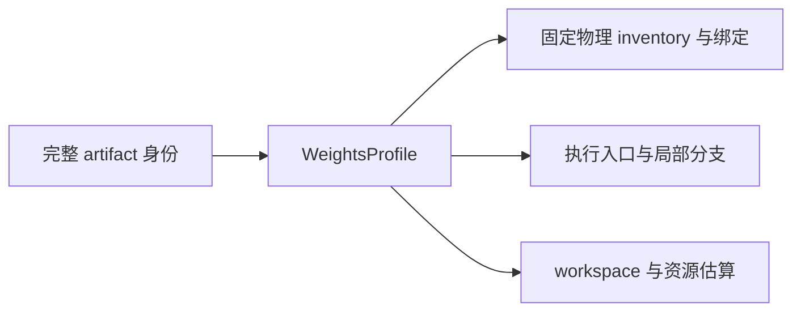
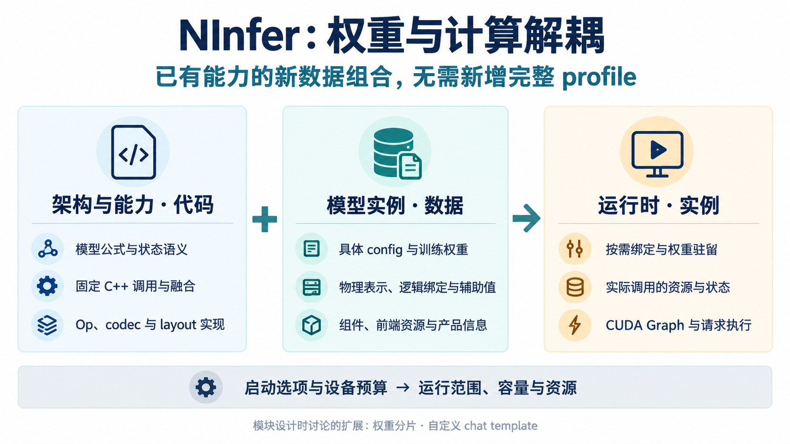
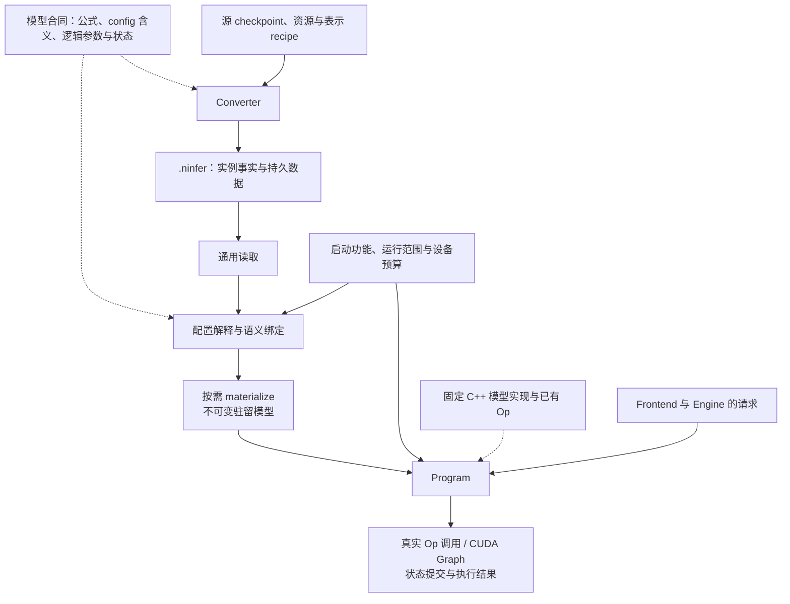
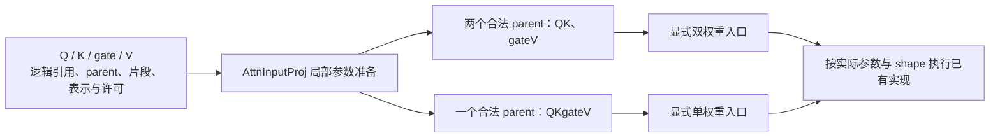
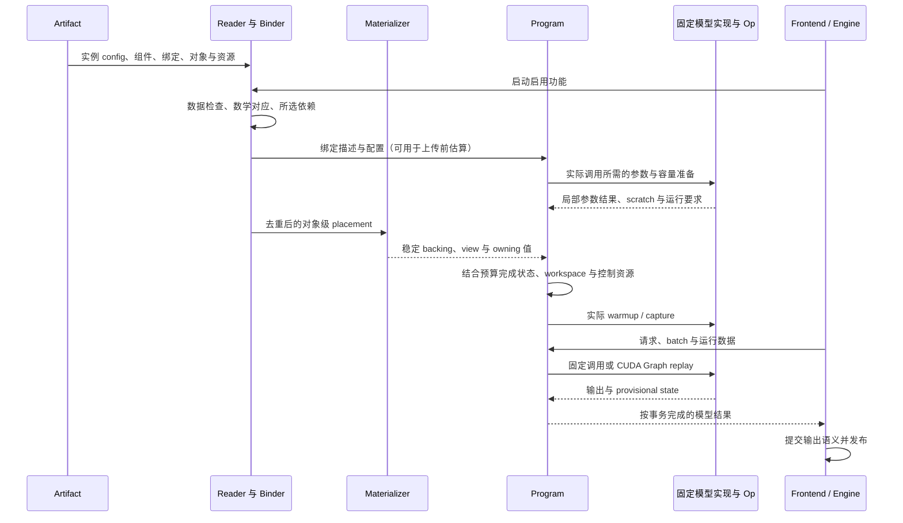
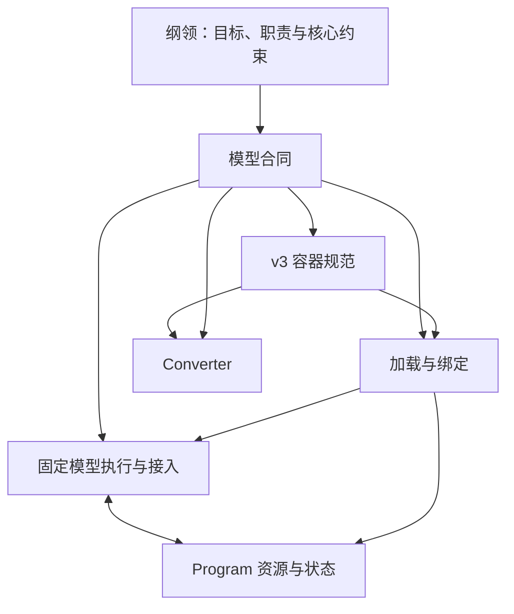

# 模型与权重解耦重构纲领

> 状态：目标架构，尚未实现。模块目标文档已建立；本文统一目标、职责和改造尺度，供实施计划遵循。
> 已确认的核心约束继续有效；本文不冻结 v3 字段、C++ 类型、目录结构或迁移工作包。

本次重构始于一个具体问题：NInfer 已有的计算能力，仍然需要通过完整 artifact 身份才能组合使用。
目标是让模型实现消费本次实例的实际配置与权重绑定，使新增数据组合的成本主要留在数据生产端。
v3 容器是承接这些事实的载体；converter、加载、执行和资源准备需要一起贯通，才能完成解耦。

实现尺度是：**大部分模型数学与执行规则固化在代码中，config 处理少量实例维度和必要参数，
权重表示与绑定承载 recipe 带来的变化。** 新架构以直接编写的模型代码接入，公共设施复用
对象读取、物理绑定、资源准备和运行生命周期。

本文是整个重构的纲领入口。[Engine 架构](engine-architecture.md)继续拥有请求控制面与提交合同；
现有模型、Op、codec/layout 文档继续提供数学和物理依据。它们描述当前实现中的 checkpoint
注册、完整 inventory 和 profile 的部分，是本次需要改变的对象，不构成目标设计的限制。

## 1. 从原始需求确定成功标准

### 1.1 真正需要消除的耦合

最初，一个 artifact 身份对应一套固定权重存储合同，并据此绑定执行和资源准备。
这种方式适合少量固定产物，也帮助形成了很有价值的专用实现。现在的问题出现在组合能力上：

> 某个投影已经支持 Q4/Q5，另一个投影已经支持 FP8，但将它们放进同一个模型实例，
> 仍可能需要登记完整 profile、修改 binder 或补一套容量分支。

目标不是减少必要的数学和 kernel 开发，而是消除“已有能力换一种分配，还必须跨多处登记”的工作。



当前实现中，少量位置就能说明这个问题及可保留的基础：

| 位置 | 当前关系 | 对重构的启示 |
|---|---|---|
| [启动入口](../../src/targets/registry.cpp) | `resolve_weights` 的结果同时进入加载和 sequence planning | 启动需要把真实 config、绑定和运行输入分别交给消费者 |
| [27B 绑定](../../src/targets/qwen3_6_27b/impl/load/bindings.cpp) | 按 profile 选择整套物理名字、格式及 split/fused 关系 | C++ 应要求逻辑参数完整，由 artifact 给出实际存储对应 |
| [27B execution leaves](../../src/targets/qwen3_6_27b/impl/variant.cpp) | 实际 attention/Dense 调用已有局部权重分派，容量查询仍按 profile 分支 | 执行与容量应共同消费实际绑定，局部能力可以保留 |
| [通用 binder](../../src/artifact/binder.cpp) | 对象匹配和 materialization 已分开，但一个对象只能被绑定一次 | 保留物理设施，区分逻辑覆盖与物理去重 |
| [GDN 调用](../../src/targets/qwen3_6/impl/runtime/text_context_impl.h)与[已有 Op](../../include/ninfer/ops/attn_input_proj.h) | 固定阶段写法、融合、状态操作和不同原生参数入口已经存在 | 保留这些直接实现，改变其事实来源和参数衔接 |

这不是从零建立推理引擎。通用文件读取、codec/layout、闭合 Op、共享执行算法、Engine 事务和
CUDA Graph 都有可保留的基础；需要重新贯通的是它们之间的合同。

### 1.2 核心验收目标

**对于已实现的架构、可处理的配置和实际可消费的物理表示组合，新增训练权重实例或重新分配
已有格式，不需要新增完整模型 profile、复制计算图，或注册 checkpoint 专属执行身份。**

“已支持”指相关的真实能力已经存在：源表示能够被转换，实际 consumer 能处理绑定、格式、
layout、shape、使用约束和状态方式。它不等于“这些 dtype 分别出现在某个 Linear 的支持列表里”。

| 变化 | 目标系统中的正常改动 |
|---|---|
| 相同数学/config、相同源命名合同，换一份训练结果 | 输入权重和必要的实例资源；沿用源适配、recipe 与运行实现 |
| 在已有 consumer 支持范围内，重新分配各层/逻辑区域的格式 | Recipe、必要的校准输入和生成产物 |
| 换用代码已能处理的配置 | Artifact config 与相应参数；不登记完整配置签名 |
| 新的上游命名或源编码 | 相应源适配代码；不引入运行时 checkpoint 身份 |
| 新公式、新 codec/layout、新量化生成能力或新 Op 路径 | 在拥有该能力的模块增加代码和验证 |
| 新的跨 Op 融合优化 | 显式改进模型固定写法、相关 Op 和资源关系 |

默认 recipe 可以有名称，可以针对常用模型调优；测量也可以记录配置或绑定摘要。
这些名称和摘要都不能成为“组合必须先注册才能执行”的准入条件。

### 1.3 核心、配套和扩展的区别

| 范围 | 本次定位 |
|---|---|
| 配置、训练实例、物理表示、执行及资源的解耦 | 核心目标；所有模块的改动都要能够追溯到这里 |
| 专用 shape、融合、CUDA Graph、数值与状态正确性 | 核心目标必须保留的执行价值 |
| Text、Vision、MTP、DFlash、DFlash2、prefix reuse、批处理、评分与产品入口 | 现有功能需要由同一套边界表达；DFlash2 按已落地后端处理 |
| Text 必需、其他组件可以缺省，启动只准备所选功能 | 已确认的组成和加载要求 |
| v2 artifact 的一次性离线升级、新运行时拒绝 v2 | 已确认的交付配套，降低已有用户的使用成本 |
| v3 文件分片 | 已确认按文件大小分片，默认上限 32 GB，较小产物保持单文件 |
| 自定义 chat template | 容器允许保存；运行时保持现有识别与渲染行为，新增运行时能力为独立功能任务 |

分片与模板承载按 [v3 规范](artifact-container.md)落实，Frontend 范围遵循
[运行时合同](model-runtime.md#62-frontend-资源和模板范围)。它们沿上述职责接入，以权重与计算
解耦为核心的验收目标保持不变。

产品仍是一张 GPU、一个常驻实例、启动固定一至八个 active requests、有界 FIFO、无请求抢占、
每轮紧凑 decode batch，以及 RTX 5090 / `sm_120a` 上的直接 C++/CUDA 执行。
CLI、serving 和离线评分都使用公共 Engine。可信本地工作流、多媒体获取与协议边界继续保持。

本次不建立任意模型图解释器、通用插件框架、跨平台抽象、运行中切换权重或 loader 权重重排。
可以处理更多配置，不构成本次实现和验证所有模型尺寸的要求。

## 2. 先区分事实，再划分模块

### 2.1 五种概念，不对应五层框架

| 概念 | 回答的问题 | 权威来源 |
|---|---|---|
| 数学架构 | 计算什么，按哪些拓扑和状态规则计算 | 固定模型代码及其数学参考 |
| 模型配置 | 本实例有多少层、什么几何、哪些必要的独立参数 | Artifact 中精简的实例字段 |
| 训练权重实例 | 使用哪一份训练所得参数、与哪个 companion 配对 | 输入数据、实例关联和来源信息 |
| 权重物理表示 | 文件字节代表什么参数值，如何分组、布局和共享 | 对象描述、逻辑绑定、辅助关联，以及代码中的 codec/layout 合同 |
| 执行实现与运行准备 | 如何调用已有实现，需要什么资源，何时提交状态 | 固定模型代码、Op、Program 和启动/请求输入 |

代码拥有固定公式、调用关系和状态操作，artifact 提供必要实例值与实际权重表示。
字段按实际用途筛选：独立维度与数学参数作为数据，固定规则直接实现，已有输入唯一确定的值
由代码推导。相同架构更换训练 release 或物理表示继续使用同一套数学解释。

例如 config 声明 Q heads、KV heads、head dimension 和 hidden，代码据此推导投影逻辑 shape；
对象的 stored shape 与片段关系说明这些参数怎样存储。Binder 检查两者对应，不从物理对象反推
数学配置。模型位置范围、逻辑词表、存储 padding 和 Engine 分配容量也分别解释。

### 2.2 解耦不要求不同量化结果一致

数学语义规定公式，表示语义规定字节所代表的数值，实现精度规定如何近似执行公式。

改变量化可能改变逻辑权重值和输出质量；纯 layout 变换则应精确保留既有表示值。
架构相同不要求不同量化产物得到相同 logits、token 或接受率。融合内部曾经物化的中间值，
也不会自动成为必须重现的舍入边界；公开激活、FP32 GDN control/state 等已有数值合同继续有效。

浮点 Op 按[Op 开发合同](op-development.md)从表示后的公共输入和独立解码的权重建立 FP32/FP64
oracle；codec 和精确变换用 exact oracle。质量与速度依据真实产物测量，不能由“使用同一架构”
推导。

### 2.3 三个独立的绑定粒度

**逻辑参数用于数学解释，物理对象用于存储与所有权，闭合 Op 用于计算。三者不要求一一对应。**

一个对象可以存 Q/K/gate/V；一个 Op 可以消费两个 parent；同一对象可以被多个逻辑使用者引用。
逻辑参数也包括 norm、卷积核、router、位置表、selector codebook 和 scalar。
Token 压缩映射、n-gram bucket 表等持久语义数据同样通过明确用途与物理对象绑定。

参数到对象片段的映射是 grouping 和逻辑行序的唯一权威。若映射已经说明行序，不再独立保存
另一份可能冲突的 fused-form 标签。绑定只表达规定的数据对应，不开放任意变换表达式。

## 3. 全局图景：数据与实现怎样相接

目标系统把实例数据送到已有实现，而不是从数据中编译出新的模型算法。



上图概括事实归属；下面的数据流展开这些事实怎样进入同一个运行实例。



实线表示主要数据流，虚线表示代码合同或实现依据。Codec/layout 是 converter、reader、绑定与
Op 共同遵循的物理基础，未在图中逐条连线。图中的 Program 使用已有固定实现，没有生成基础 Op
图、搜索融合或图编译步骤。

这条链必须闭合：仅把更多描述写入 v3，而 binder、workspace 或执行仍读取完整 profile，
不能完成重构。反过来，仅让 Op 接受更多格式，而 converter 和容器无法表达对应关系，也不能
把能力交给用户。

## 4. 按职责拆分的七个部分

这些是设计和维护责任，不是必须新建的七个类、目录或串行层。每个部分都以核心验收目标衡量。

| 部分 | 为解耦承担的目标 | 交给其他部分的结果 |
|---|---|---|
| A. 模型合同 | 固定数学与少量实例参数共同确定需求 | 精简 config、代码中的逻辑参数规则、组件与状态含义 |
| B. Converter | 让已有能力的新分配主要通过 recipe 完成 | 规范化实例事实、实际物理对象、绑定与转换证据 |
| C. v3 容器 | 保存运行所需的实际事实，替代隐藏在完整 inventory 中的信息 | 可被独立 reader 确定解释的持久数据 |
| D. 加载、绑定与驻留 | 把文件事实对应到逻辑参数和稳定 backing | 不可变模型、typed 引用与对象级驻留需求 |
| E. 固定模型执行与 Op | 保留直接实现和融合，按真实局部参数调用 | 各阶段的实际执行、Op 原生参数和 scratch 需求 |
| F. Program 资源与状态 | 用实际调用需求准备资源，摆脱 profile 容量表 | 稳定 allocation、状态事务、workspace 与 CUDA Graph |
| G. Engine、Frontend 与产品接入 | 去掉执行身份耦合，同时保留输入输出、配对和产品语义 | 同一公共 Engine 下完整可用的模型实例 |

需要替换的合同按目标重写并移除旧路径，复用以具体已有能力为单位。各部分的改造尺度为：

| 部分 | 重写或必要适配 | 复用基础 |
|---|---|---|
| 容器 | 按 v3 实现 framing、目录、引用与文件集合；新运行时移除 v2 | 文件 I/O、codec/layout 几何 |
| Converter | 重写入口、源协调、recipe、作业和 writer 组织 | 已有源读取、量化、数值转换和 packing 算法 |
| 语义绑定 | 重写旧 inventory、一次消费式协调和 profile 接口，接入 Binding/Use | 对象需求分离、plane/view、staging、事件和原始上传 |
| 固定模型执行 | 接入 config、实际参数与 Use，统一原生 policy 语义 | 层循环、阶段、闭合融合及已有 kernel |
| Program 资源 | 用实际调用生成需求、几何与容量 | LayoutBuilder、scope、状态池、KV resolver 和 Graph 机制 |
| Engine/Frontend | 调整实例构造、资源选择和资料来源 | 调度、状态事务、发布、现有输入输出与模板行为 |

### 4.1 A：模型合同定义“需要什么”

模型合同包含[公共协作边界](model-contracts.md)和各架构的具体定义。
公共部分统一配置承载、数据绑定和运行生命周期，各架构直接编写自己的模型、binder 和状态操作。
新增架构沿这些职责接入，复用通用容器与物理设施。
[Qwen3.5 合同](qwen3_5-model-contracts.md)提供当前架构的固定规则与精简实例字段；
公共合同以 Qwen4Exp 和 DeepSeek V4.1 检验更不同的计算结构。

模型代码拥有数学公式、调用顺序、逻辑角色、组件交接和状态更新。
例如 sigmoid gate、offset RMSNorm、SwiGLU、GDN 递推，以及 MTP 的 hidden 采集位置和
target verification 顺序，均在对应实现中固定。

Config 主要提供层数、hidden/intermediate、head/expert 几何，保留必要的 norm/RoPE 参数、
层分布或训练相关 tap 层号。保留字段应当确实区分实例，且尚未由代码或已有输入唯一确定。
投影 shape、state 维度、compact 索引由代码推导；组件共用的维度从 target 取得。

架构名、config 字段名与枚举值沿用 Transformers/vLLM 或源模型已有的同义约定。
Converter 核对源模型符合固定数学，并提取少量实例字段。例如保留 vocab_size、rms_norm_eps
和展开的 layer_types；源 full_attention_interval 用于转换时展开，固定 hidden_act/bias/RoPE
模式由代码解释。源分片、初始化与训练辅助资料在 converter 处理。实例字段的源默认值在转换时
解析，artifact 提供明确的有效值。

架构等价必须检查数学和配置，不能按 Qwen 名称或尺寸标签推断。Dense 与 MoE 保留明确的数学
区别，共同的 hybrid decoder 和执行机制可以复用。相同公式/config 的新训练结果使用同一实现。

配置驱动可以是固定 C++ 循环读取不可变层表。真正依赖 hidden/head 几何或算法变体的实现仍可
编译期专用化；专用化只覆盖实际依赖，不要求为每种层数、release 或完整格式分配实例化一套图。
数学配置合法、存在相应实现、显存足够，是三个独立判断。

Python 源适配和 C++ binder 可直接用函数与循环完成参数对应；可选组件由明确条件代码准备，
Program 实现固定的状态事务。文档说明这些代码责任，实际持久化的数据只有必要的实例值、对象、
绑定与资源。Recipe 改变的是物理分配，binder 从实际绑定取得对应表示。

### 4.2 B：Converter 定义“怎样生产这份实例”

Converter 将四项工作明确分开：

| 工作 | 输入与责任 | 输出 |
|---|---|---|
| 源语义适配 | 核对固定数学，提取实例参数，解释源名称、轴、交错、共享及已量化源 | 精简 config 和逻辑源访问 |
| 表示分配 | 展开组件选择、recipe 默认值与区域覆盖，处理冲突 | 各逻辑区域确定的 codec/layout、grouping、使用许可与辅助要求 |
| 实际转换 | 量化/校准、融合/拆分存储、packing、layout 转换或保值提取 | 输出对象、逻辑绑定、辅助数值和编码字节 |
| 容器写入 | 序列化结果、安排位置、流式写 payload | 完整 artifact |

用户调整已有能力的分配时，改 recipe 和必要的生成输入，不改模型公式、C++ binder、完整 profile
或 kernel 名单。Recipe 可按层、逻辑参数或 expert 范围表达；文件保存展开后的结果，不让 loader
再解释正则、继承和 selector。

逻辑源访问可以是延迟句柄或 converter 内部表达式，保留源 codes/scales/divisors。
不强制先将整个 checkpoint 反量化为 BF16，再重新量化。转换作业可先声明输出 shape、字节数和
绑定，再逐对象生成与写入，避免整个模型同时驻留主存。

“能执行某 codec”和“能从指定源生成该 codec”必须区分。现有 NVFP4 路径主要保留量化源；
这不等于已经存在任意 BF16-to-NVFP4 校准能力。生成方式缺失时由 converter 报错，不能伪造
格式标签或静默改变 recipe。

Converter 的 fuse/split 组织持久权重，不选择运行时跨 Op 融合。它需要验证源角色和转换结果：
Q 与 gate 即使 shape 相同，交换数值仍是转换错误，binder 几何检查通过不能证明转换正确。

### 4.3 C：v3 容器定义“本次实际提供什么”

容器承接领域事实。应先收敛这些事实，再设计字段和 framing。

| 内容 | 必须能够取得的信息 |
|---|---|
| 模型实例 | 已知 architecture、少量实例参数、实际提供的组件与引用 |
| 逻辑绑定 | 参数到对象/片段的对应、行序、共享和必要的逻辑关系 |
| 物理对象 | 对象句柄、kind、stored shape、codec/layout、必要参数、字节位置和长度 |
| 使用输入 | 逻辑使用位置的计算许可、执行所需辅助值及其明确关联 |
| Frontend 与产品资料 | 所提供功能需要的 tokenizer/template/processor、token 语义、公开名称与默认值 |
| Payload | 已转换的权重、辅助 scalar/tensor 和资源字节 |

代码拥有固定模型数学、参数 shape 推导、组件交接和状态操作，也拥有 config 字段的含义、
codec 数值解码与 layout 的 encoded size/planes/view 规则。
Artifact 拥有实例值和实际表示；确定的 codec 参数不再重复声明为可独立变化的字段。
模型逻辑 shape 与对象 stored shape 分工明确，通过绑定校验对应。

模型和执行所需的信息必须自洽；来源说明另有用途。源 tensor 名、工具版本、校准样本、recipe
标签与测量结果属于 provenance，可放转换报告或非执行 metadata。校准生成且执行要读取的
input divisor 等数值则必须成为持久输入，不能只留在报告里。

容器不携带基础 Op 图、算术节点、融合规则、kernel DAG、CUDA launch、device 地址、workspace
offset、KV page 数或请求状态。Feature taps 是已知算法的实例输入关系，不是任意 callback 图。

一个逻辑 artifact 完整描述 Text 和其声明提供的组件，不依赖运行时拼装外部 checkpoint。
V3 采用一个入口与总目录，按文件大小生成单文件或入口加续卷。对象引用使用统一逻辑 payload
地址空间，文件分片通过 files 表定位，逻辑参数与原生 Op 参数关系保持。

### 4.4 D：加载定义“把数据接到数学参数上”

Generic reader 解释 framing、目录、资源、范围和通用引用，使用 codec/layout 设施检查编码几何。
它不依赖 Qwen、Op 或 Engine，也不回调 checkpoint binder 才能解释字节。

语义 binder 按固定模型代码和实例参数取得 Text、启用组件及共享数据的引用，检查 shape、
覆盖和关联，构造 typed 参数引用。代码仍知道 attention 需要 Q/K/gate/V，但不再规定某个 release
的第几层必须有某个名字和 dtype 的物理对象。

Materializer 接受对象级 placement，完成必要的读取、上传与 owning storage。共享对象只计费、
上传一次；逻辑覆盖检查与物理去重分开。上传前可以用对象描述计算容量，上传后补齐稳定地址。

绑定保留 parent、片段、codec/layout、code/high-bit/scale planes、stride 和使用约束。
可用 view 必须满足真实 layout 合同；某些逻辑片段只能交给消费完整 parent 的 Op。
零拷贝 view 是共享上传后的 backing，磁盘到 GPU 仍然需要传输。

数学上的参数共享与物理去重分别解释：前者说明多个公式使用同一个逻辑参数，后者说明对象
如何存储和上传。不同量化结果不能伪装成同一表示的 alias；共享参数的不同使用位置仍有各自约束。

Loader 不量化、反量化、拼接权重、transpose、swizzle 或 repack。Host scalar 可以读取并保存为
owning 值；Program 使用的数值、资源和引用不能依赖 reader 临时缓冲的生命周期。

一个逻辑参数可由多个规定片段表示，不自动意味着可执行。K 轴拆分需要求和、任意行序需要
gather，或异构 expert banks 需要特殊消费方式时，必须已有相应执行代码。

### 4.5 E：固定模型实现与 Op 定义“怎样计算”

跨 Op 调用结构属于模型计算图的具体实现，以手写 C++ 调用、循环与有限分支表达。
它可以直接调用已有融合 Op，不先生成基础 Op 图再搜索、替换或缩短图。

静态维护不意味着所有请求的 kernel DAG 相同。模型可按已知数学变体、phase、shape 和局部绑定
事实选择几种写法；Op 内部可按 shape、format、layout、policy 选择已有 kernel 或多 kernel 实现。
这些是代码明确提供的能力，不由 checkpoint 名或整模型 recipe 选择完整图。

Op 拥有闭合数学/状态合同、局部参数适配、支持判定、数值标准和 scratch。它不读取 artifact 名称、
JSON 或源 tensor 名。模型实现拥有跨 Op 数据依赖、中间值存活期、融合调用与状态操作顺序。
不将多种模型写法塞进一个协调所有分支的巨型 Op；现有闭合融合 Op 继续保留。

Attention 的原生参数个数说明了这个边界。Binder 提供 Q/K/gate/V 的逻辑引用，Op 的局部准备
识别它实际能消费的 parent 关系，再走明确编译的调用：



两个 Q4/Q5 parent 和一个 NVFP4/FP8 parent 可以分别进入已有形式。四个独立 FP8 parent 不能
因为 dtype 相同就自动进入单权重入口；Q4/FP8 也不因有两个 parent 就自动满足 Q4/Q5 实现。
匹配要检查分组、行序、范围、几何及辅助约束，地址连续或 parent 相同并不充分。
Metadata 不会自动选择 C++ 重载，实际分支和调用语句仍需明确实现。

这种稳定参数准备可以缓存，随请求 shape 改变的 dispatch 保留在 Op 中。
它不是 binder 的全模型能力解析器，也不是跨 Op 规划器。

GDN 继续保留已有固定阶段写法：

| 阶段 | 投影与卷积 | 递推与提交关系 |
|---|---|---|
| Prefill | 输入投影，再执行卷积/SiLU | 普通递推 |
| 普通 batched decode | Projection/conv snapshot 融合，单请求 width 为 1 | Batch update |
| 需要 replay 的 target verification | Projection/conv record 融合 | Replay record，接受前缀确定后 Fold/commit |

上述路径均可直接调用已有 norm/control 融合。QK/VZ 或 QKVZ 的物理组织由对应 Op 局部适配；
Z/A/B 不参与卷积等数学事实、record 与提交顺序不随格式变化。
Dense 的 SwiGLU 和 residual 输出、MoE 的路由/专家/合并也保留各自已有融合边界。

### 4.6 F：Program 资源与状态定义“以什么运行条件执行”

不可变模型拥有本次的 config、组件关系、权重 backing、typed 绑定、辅助输入和必要资源。
Program 独占请求执行需要的可变状态、资源 backing、workspace、控制表和 CUDA Graph。
共享只读参数不允许跨 Program 共享可变状态或 device allocation。

资源准备的输入必须与真实执行一致：

```text
实际绑定 + 固定调用结构 + 启动运行范围
    → 各 Op 的参数准备和 scratch 需求
    → 模型规定的跨 Op 存活期与复用
    → 结合状态存储、权重占用和设备预算
    → Program 的容量、稳定 allocation 与 capture 准备
```

例如 Dense 中 gate/up 与 down 的格式和 policy 独立提供；其 scratch 可按顺序复用，但两者之间
仍存活的 activation 要计入峰值。不能用一个“整层格式”，也不能只取所有 Op scratch 的最大值。

| 事实 | 归属 |
|---|---|
| KV、递推、压缩索引、n-gram 历史、draft context 等实际状态的数学含义与维度 | 架构/config 和算法状态合同 |
| KV 编码、页与状态槽位的具体存储 | 已实现的 state storage 与 Program |
| 并发、prefill chunk、draft window、媒体上限和实际容量 | 启动选项、实现要求与预算 |
| Pending records、current/checkpoint、handoff 的生存期 | 固定执行与状态事务 |
| 请求顺序、逻辑缓存保留与 admission 编排 | Engine 控制面 |
| Scratch 与私有临时激活量化缓冲 | Op 需求及 caller-owned workspace |

权重的 Q4、W8 等 codec 不决定 KV 格式。GDN FP32 recurrent/control 边界不因权重变化而改变。
不同架构可以有跨层状态来源、多路 residual 和专属的阶段程序；其 producer、consumer、
frontier 与可恢复内容由架构定义，Program 按真实关系准备资源并实现公共生命周期。
Device StateImage 容量按 `C+C_cache` 计算，`2C` 仅是默认 `C_cache=C` 的情况；replay records
按并发与 verification 范围另行准备。Vision handoff 保留到该 item 的全部所选 Text/MTP
消费者完成，包括 shifted embedding、bridge 和后续 chunk；pending target features 在提交后
继续保留到 context catch-up 完成。具体存活期见[资源合同](program-resources.md)。

只有启用功能及共享依赖参与权重、状态、workspace 和 graph 准备。启动完成前建立稳定的
weights、KV/state、workspace 和控制 backing，预留 graph/library 开销；运行期更新 page/slot
ownership、frontier 与控制数据，不在 Op 内隐式分配或重排权重。

CUDA Graph 捕获固定模型写法在具体参数下的真实调用，不选择融合。改变 host dispatch、launch
几何或地址关系的变量需要相应 capture 区分或已有 device-side 参数化。
Frontier 来自真实模型分支和 Op 实现；不为整套格式分配登记专属 graph 身份。Eager 与 graph
消费同一模型实现，replay 不重新解析 metadata。

现有[上下文资源调度](resource-scheduling-and-context-cache.md)和[Paged KV](paged-kv-cache.md)
继续拥有各自合同。缓存 materialization 的搜索与代价估计不是模型图的融合搜索；本次不重写这些
算法，只替换其需要的模型事实与资源输入，避免继续依赖完整权重身份。

### 4.7 G：接入定义“如何成为完整可用的模型实例”

Engine 启动以已知架构/config 取得实现，按所选功能建立驻留模型和 Program。
产品入口不再凭 `weights_id` 选择 binder、Op 或 workspace。数学架构的闭合入口仍可注册，
但相同架构/config 的新训练实例不登记 checkpoint 专属入口。

删除执行身份耦合，不删除其他身份语义：

| 信息 | 正常用途 |
|---|---|
| 公开 model 名称 | 请求匹配、产品展示、日志和报告 |
| Tokenizer、template、token/位置语义 | 实例输入输出及 prepared prompt |
| Sampling defaults | Frontend 现有模式 preset 与请求字段覆盖，见[默认值合同](model-runtime.md#63-默认值名称和其他身份) |
| 训练来源与 companion 配对 | 确认 draft 与 target 的训练关联 |
| 实际配置、表示或性能测量摘要 | 诊断、成本估计与测量解释 |
| Resident 与提交执行身份 | 限定 prefix/continuation 的复用范围 |

这些信息不能重新合并成一个执行准入标签。Context-cost 等估计使用适用的运行事实或明确测量，
不能因为新 recipe 没有一条 release 专属记录，就阻止其已有计算能力运行。

Gateway 继续拥有媒体获取与协议适配；Frontend 拥有 tokenizer/template、媒体预处理、位置、
输出解释和可靠的重建边界；Engine 拥有请求和发布顺序；Program 拥有物理执行与模型提交。
Serving 的外部协议不因内部表示解耦而另开路径。

Prefix reuse 复用同一 resident、同一 frontier 的完整执行状态，包含必要的 KV、GDN、hidden、
所选 backend 和媒体/位置语义。仅 token 相同或主 KV 相同不充分。
Batch compaction 改变请求到 row/state 的映射，不改变该 Program 的权重、recipe 或后端。
评分使用同一数学与绑定，在评分 purpose 的临时状态上执行，不进入 generation 缓存与 spec 发布流程。

## 5. 贯穿模块的三条合同

### 5.1 组件存在、功能启用和代码能力分别表达

Artifact 必须提供完整 Text 主模型及其绑定和基础 frontend。Text 是承担文本生成、验证与评分
的主计算角色，内部结构按架构定义，可以具有多路 residual、条件查找或 causal encoder-decoder。
Vision、MTP、DFlash、DFlash2 可以任意省略，包括其私有 config、参数和资源。

启动独立选择 Vision，以及 `none` 或一个 spec 后端；选择在 Engine 生命周期内固定。
文件包含某组件不会自动启用它。组件声明必须完整有意义，启动只绑定和准备 Text、所选功能及
共享依赖，不先要求所有组件齐全再标为“不上传”。

| Artifact 提供 | 启动选择 | 需要准备 |
|---|---|---|
| Text | 无 Vision/spec | Text；不要求 Vision processor 或任何 draft 参数 |
| Text + Vision + MTP | 无 Vision/spec | 仅 Text 依赖 |
| Text + DFlash2 | DFlash2 | Text、DFlash2 及共享对象 |
| Text + Vision + MTP + DFlash2 | Vision、DFlash2 | Text、Vision、DFlash2；不准备 MTP 私有资源 |
| Text + MTP | Vision | 启动报告缺少所选组件 |

`text/draft_head` 和 `text/draft_head_token_ids` 等对象是否必要由 proposal 路径决定，
不由名字前缀决定；使用完整主 head 不要求优化 proposal 对象。

已知 companion 的 target feature 位置、tap 索引、私有参数与共享 embedding/head 有明确关联。
结构/config 相容不证明训练配对正确；可信 converter 负责来源配对，binder 检查结构关系。
可以保留配对来源与转换证据，不要求每次加载重新计算全模型内容哈希。
不要求多 spec 同时运行、任意 module registry、动态外挂或独立组件发布。

### 5.2 辅助数值与计算许可不能藏在 dtype 中

Weight scale、zero point、weight divisor 属于 codec 解码；activation calibration、input
divisor 或补偿值属于逻辑使用位置的持久输入。它们都可能存入 artifact，但必须明确种类、
作用输入和数值引用，不能凭名字或 dtype 猜测，也不能保留两份可独立变化的同义值。

作用位置由数学合同命名，例如某次 norm 后的 projection 输入，不要求该中间值实际物化。
共享一个 parent 不保证不同使用者的 calibration 或 policy 相同。

| 使用许可 | 允许的私有激活计算 |
|---|---|
| `A16Only` | A16 |
| `AllowA8` | A16、A8 |
| `AllowA4` | A16、A8、A4 |

许可逐级包含，AllowA4 也允许 A8；许可不创造路径，也不强制最低精度。
若融合路径共享一次激活量化，就要满足相应使用者的许可交集及 calibration 合同。
Gate 允许 A4、up 仅允许 A8 时，共享计算最多选择 A16/A8。分别计算的已有实现可各自满足约束。

Op 不能静默放宽许可，loader 不维护全组合精度矩阵。临时量化缓冲属于 scratch，运行时 KV
编码属于 state storage，均不混入持久权重 codec。
原生 Op 入口和容量查询统一采用目标许可集合，复用已有 kernel，具体适配见
[Use 接入合同](model-runtime.md#42-use-进入真实调用)。

### 5.3 数据检查与 Op 支持判定各在真实边界发生

已确认不建立加载期的全模型 Op 能力解析器，不枚举 prefill、decode、所有 spec、shape 和
format/layout 的笛卡尔积。Op 在真实参数准备、容量查询、warmup 或执行时检查自身支持。

| 问题 | 发现它的边界 |
|---|---|
| Framing、范围、长度、引用或编码几何错误 | Reader / codec/layout 解释 |
| 没有代码解释的 architecture、codec 或 layout | 构造相应语义对象时 |
| Config 矛盾、逻辑参数缺失、错误关联、启用组件缺失 | 配置解释与 binder |
| 无法上传、预算不足、无法构造所需 state storage | Materializer / Program 准备 |
| 实际格式、parent 结构、shape、policy 或状态调用不支持 | 相应 Op 的准备、容量查询、warmup 或执行 |

取消全局支持证明不取消真实资源准备。启动要分配稳定 workspace，就必须取得所需容量；
容量接口无法处理参数时可以自然失败，不为延后错误而虚报字节数。
容量与执行使用相同的局部准备事实，不再分别从 profile 猜测。

Warmup 成功只说明执行过的 workload 成功，不能证明未覆盖 shape。
错误应包含实际表示、shape、policy 及模型层/角色/phase。
执行中失败沿既有 abort/Engine fault 规则传播，未完成 round 不提交、不发布，也不成为可复用
continuation；无法恢复稳定状态时使 Engine 失败，不静默改算法重试。

## 6. 从容器到请求的决定顺序

同一份事实从持久数据变成运行输入，不断补充具体解释与地址，不反复改变权威。



这是依赖关系示意，不强制所有初始化函数按一条串行顺序执行。尺寸/容量准备可使用未上传的
描述；最终地址绑定、实际显存余量和 graph 开销在相应准备阶段落实。Generic reader 不调用 Op。

| 时机 | 决定的内容 |
|---|---|
| 实现编写与编译 | 数学合同、支持能力、固定阶段写法、融合与专用化 |
| Converter 生成 | 组件、精简 config、训练参数、物理表示、绑定、辅助值与许可 |
| 读取与语义绑定 | 逻辑几何、必要依赖、共享关系与 typed 引用 |
| Program 启动与准备 | Purpose、功能、并发/运行范围、状态存储、容量、稳定 allocation |
| Op 准备与实际调用 | 原生参数形式，以及本次 shape 下的内部路径和 launch |
| CUDA Graph 捕获 | 具体调用、地址与允许的参数变化范围 |
| 每轮请求 | 成员、有效列、position/frontier、page/slot 映射和提交结果 |

加载后固定的是数学实例、权重、使用约束、组件选择和 owning backing。
请求状态与 Op 内部 shape 分派仍可变化；token hot path 不查询 JSON、源名称或重新绑定权重。

## 7. 用全链路变化检验设计

以下是基于现有数学和局部 Op 的目标架构推演，验证职责能否闭合。
新容器和全链路组合尚未实现；这些例子不是数值、速度或全部 shape 已经验证的声明。

### 7.1 同一配置，更换训练权重

输入是一份新的 Dense 训练结果，数学/config 和源命名合同与已有 27B 实例相同。
本次只输出 Text，使用已有可生成 recipe。

1. 源适配读取新参数，输出同一类 normalized config 和逻辑角色；不因 release 改名选择新实现。
2. Converter 量化新数值，写出实际对象、绑定、Text 资源和来源信息；没有新的执行 profile。
3. Binder 按 config 完成逻辑对应，materializer 上传这些对象。
4. Program 运行原有固定算法；相同几何和表示沿用同一套容量计算方法，容量值仍考虑启动选项。
5. Frontend 使用本实例的资源与对应模式 preset；输出可以不同。它的 prefix 状态只在本 resident 中有效。

变化落在输入和产物。训练结果不会被当作模型代码身份，新实例也不会误用旧实例的 KV/GDN。
若改为携带 draft，必须重新确认训练配对，不能仅凭相同配置沿用 companion。

### 7.2 新混合格式，保留 attention 原生参数与 Dense 融合

27B 几何为 hidden 5120、Q heads 24、KV heads 4、head dimension 256。
Q/gate 各为 `[6144,5120]`，K/V 各为 `[1024,5120]`。Recipe 在不同 attention 层选择：

| 逻辑参数 | Split：A 为 Q4，B 为 Q5，均为 `[7168,5120]` | Fused：P 为 FP8，`[14336,5120]` |
|---|---|---|
| Q | A rows `[0,6144)` | P rows `[0,6144)` |
| K | A rows `[6144,7168)` | P rows `[6144,7168)` |
| Gate | B rows `[0,6144)` | P rows `[7168,13312)` |
| V | B rows `[6144,7168)` | P rows `[13312,14336)` |

Q4/Q5 使用已有 G64/FP16-scale 编码，FP8 使用已有 row-scale 编码。
另外一层 Dense 的 gate/up 使用 NVFP4 `[34816,5120]`，down 使用 FP8 `[5120,17408]`；
NVFP4 从同一训练实例的可用量化源取得，保留正确的 codes、scales 和 divisors。

1. Recipe 指定分配；converter 处理源 Q/gate 交错，生成正确行序、对象和绑定。
   Gate/up 的 weight divisor 遵循 codec，input divisor 另关联到 MLP 数学输入。
2. 容器保存这些事实，不保存“混合方案 3”执行标签，也不保存 concat 指令。
3. Binder 对各层取得相同逻辑角色，保留实际 parent 和使用许可。
4. Attention Op 显式使用双权重或单权重入口；同一模型继续其 norm/RoPE/attention 写法。
   Dense 继续调用 SwiGLU 和 residual 输出 Op，分别消费两个格式与 policy。
5. Workspace 从本层真实调用需求组合，保留 intermediate activation；graph 捕获真实执行路径。

若启用 Vision 和 MTP，仍使用同一模型绑定：Vision handoff 持续有效到该 item 的全部所选
Text/MTP 消费者完成；MTP 移位位置落在媒体区域时使用组合 embedding。Target verification 使用实际混合主权重，
GDN record/Fold、KV 和 MTP continuation 只提交接受前缀，然后发布输出。
批处理和 prefix reuse 延续相同事务，不增加“混合 recipe”专属状态路径。

这正是核心验收例子。局部依据是
[AttnInputProj](../../include/ninfer/ops/attn_input_proj.h)、
[LinearSwiGLU](../../include/ninfer/ops/linear_swiglu.h)和[LinearAdd](../../include/ninfer/ops/linear_add.h)。
需要贯通的是事实传递，不是创造这些局部计算能力。

### 7.3 Text-only 与 Text + DFlash2

先生成只含 Text 的 artifact。Converter 不要求 Vision/MTP/DFlash/DFlash2 私有源资源。
启动关闭这些功能，binder 只检查 Text 需求；Program 不分配 Vision handoff、draft state、
proposal scratch 或对应 graph，文本批处理和 prefix reuse 正常使用完整 Text 状态。

另一份产物增加匹配的 DFlash2，继续省略 Vision、MTP 和 DFlash：

1. 容器提供 DFlash2 自身 config、动态卷积/selector 等参数、target taps 和共享 embedding/head。
2. 启动选 DFlash2、并发 4、proposal 数 K=7；K 是运行选择，不从权重 shape 或源推荐值强制得出。
3. Binder 解析主干与 companion 关联；共享对象只上传一次。
4. Program 按[正式 DFlash2 数学与状态合同](qwen3.8-27b-dflash2.md)准备五层 local context、
   pending features、verification records 和临时 query/selector 资源；不凭名字准备另一套 backend。
5. Target 提供规定位置的 features，DFlash2 提出候选，target verification 决定接受前缀。
   提交后的完整状态才可以成为 continuation 或 prefix checkpoint。

同一个文件未启用 DFlash2 时不加载其私有权重。Text-only 文件被显式要求启用 DFlash2 时，
启动报告缺少组件；这是输入完整性检查，不是 Op 能力扫描。

### 7.4 MoE bank 分配与 DFlash 的共享 view

在已有 35B-A3B 配置中，某层 routed gate/up、down 从已有 Q4/Q5 改为已有 Q4/Q6，
shared banks 保持原表示，产物包含匹配 DFlash。

Converter 按专家编号和行范围生成 bank 与绑定。Binder 按 MoE 的角色和几何解释，
不再在 C++ 中规定“只有这些层号允许 Q6”。`SparseMoe` 消费本层实际 banks，保留路由、
专家计算、合并与 residual 的闭合实现；资源查询使用同一参数事实。

DFlash 的 `[6144,2048]` W8 QKV parent 可以由 draft projection 整体消费，
也可以用 RowSplit 合法的 K/V view 准备 target feature context。
Code/scale planes 对应同一 backing，不因为有两个 consumer 就复制一份权重。

DFlash 的 target feature taps 和条件上下文保持自身语义，target 的 KV/GDN 保持主模型语义。
Verification 后只有已提交 features 进入 draft context，prefix reuse 保存完整 continuation。
这一组合不需要 MoE+DFlash 专属格式身份。依据见[SparseMoe](../../include/ninfer/ops/sparse_moe.h)
和[35B-A3B 模型合同](qwen3.6-35b-a3b-model.md)。

### 7.5 数据合法，实际 consumer 不支持

假设 converter 能生成合法表示，但用户将一个 attention 层存成四个独立 FP8 parent，
或将同一 MoE 层拆成现有 `SparseMoe` 不接受的 Q4/FP8 异构专家组。

Reader 能解释对象，binder 能检查逻辑覆盖，上传也可以完成。
到相应 Op 原生参数准备、容量查询或真实调用时，缺少 consumer 的事实导致失败。
系统不自动拼接、gather/repack、拆成通用 Linear 或放宽精度许可。

同样，一个数学上合法的新 head dimension 可以通过 config 检查，但在没有相应 state storage
或 Op 实现时失败。一次小 shape warmup 成功，也不允许随后不支持的 prefill 绕过合同。
真正增加对应能力后使用同一数据接口，无须注册这份 checkpoint 或整套配置。

相反，若只是把合法 parent 的行序改成 `[Q,gate,K,V]` 并正确写出绑定，属于 consumer 能力问题；
若 converter 把 Q/gate 数值误换却仍宣称原绑定，则是转换错误。两者不能由“加载通过”一并证明。

### 7.6 已量化源重组与 v2 升级的不同责任

两个 NVFP4 源 parent 分别用 `d1`、`d2` 解码：

```text
W1 = decode(C1) * decode(S1) / d1
W2 = decode(C2) * decode(S2) / d2
```

目标 codec 若只允许一个 weight divisor，而 `d1 != d2`，直接连接 codes/scales 并任选一个
divisor 通常不能保值。即使 divisor 相同，也要按目标 layout 正确组织 planes 与 padding。

Converter 必须选择成立的保值重组、合适源上的重新量化、保留多个对象，或报告生成能力不足。
结果只保存实际对象和绑定，runtime 不接收“加载后统一 divisor”的转换作业。
Input divisor 是另一类使用输入，不随 weight divisor 自动推导。

已有 v2 的一次性升级则明确不改变任何对象的格式、layout、shape 或 payload 字节。
临时 Python 标准库脚本根据已知 v2 合同和实际组件组成，用附带的硬编码元数据补齐新描述，
流式改写 framing、metadata 与文件位置；无需源 checkpoint、PyTorch 或 GPU。

新运行时拒绝 v2，只读取新容器。旧身份解释只属于临时离线工具，不形成 C++ 兼容加载或新的
profile registry。正常新产物由 converter 原生生成。
这是对已有下载用户的必要交付配套，不要求把正常 converter 设计成长期格式迁移框架。

## 8. 后续详细设计如何受这份纲领指导

### 8.1 先证明责任衔接，再冻结接口

后续每个模块先回答四个问题：为了允许哪一种数据变化而改；需要哪些事实；谁提供并拥有这些
事实；它的输出由谁消费。回答清楚后，再展开字段、类、接口和局部算法。

选用第 7 节的少量贯通例子作为共同讨论材料：新训练实例、混合格式、可选组件、共享/融合，
以及真实能力缺失。对于一个提议，沿 converter → container → binding → Op → resources →
state/publication 追踪同一组事实，检查是否在某处重新出现完整 profile。

完成判断分别落在真实责任上：源映射与精确变换正确、持久数据可确定解释、逻辑绑定完整、
实际 Op 满足数值合同、容量和生命周期一致、状态与输出提交正确。
不能用其中一项替代另一项，也不要求先建立全部格式组合的验收矩阵。

实施工作包、切换顺序和逐文件任务属于随后迁移计划。全局方向与模块边界已确认，详细设计按
这些边界展开；不在相关合同尚未明确时提前固定实施任务。

### 8.2 详细文档的分工

七个职责部分不要求七份详细文档；固定模型执行和 Engine 接入可以在同一份说明中贯通。
以下目标模块文档已经建立，分别拥有其详细合同。

| 文档 | 接住的职责 | 需要详细规定的内容 |
|---|---|---|
| [model-contracts.md](model-contracts.md) 及其架构专属定义 | A，以及跨模块模型语义 | 公共协作边界；各架构的 config、逻辑数据、组件输入与数学状态 |
| [artifact-container.md](artifact-container.md) | C | v3 字段、引用、framing、存储及 reader/writer 一致性 |
| [weight-conversion.md](weight-conversion.md) | B | 源适配、recipe、转换作业、writer 衔接和临时 v2 升级 |
| [weight-loading.md](weight-loading.md) | D，以及与 E 的参数衔接 | Reader 到绑定、依赖收集、backing/view/host 值与 Op 局部准备 |
| [model-runtime.md](model-runtime.md) | E、G | 固定调用、融合、专用化、Program/Frontend/Engine 接入与身份用途 |
| [program-resources.md](program-resources.md) | F | 实际绑定到容量、存活期、状态、稳定 allocation 和 CUDA Graph |

[数值格式](tensor-formats.md)、[存储布局](storage-layouts.md)、模型数学、Op、Engine 与 KV
文档继续拥有其狭窄合同；详细文档引用这些权威，不再复制平行版本。
模型合同分别说明代码固定规则、派生值和少量持久字段；容器定义这些字段及绑定如何存储。

编写依赖如下。箭头表示详细设计所需的合同，不是运行时调用：



联合设计时可以让 producer/consumer 的真实要求反馈到字段定义，但不得因此把 kernel、
完整 inventory 或某份 recipe 塞回模型合同。
每份详细文档仍明确标注目标与实现状态；v2 读取合同保留在 v3 规范附录中，供现存产物的
一次性离线升级使用。新运行时完成切换后仅接受 v3。

### 8.3 已确定的配套范围

| 配套能力 | 接入的责任边界 | 已确定范围 |
|---|---|---|
| 权重分片 | Writer 放置、v3 文件集合、reader/materializer 读取 | 默认 32,000,000,000 bytes 上限，包含 framing/metadata；对象可以跨文件；writer 使用规范文件名，reader 按记录路径读取 |
| 自定义 chat template | Converter 资源输入、容器承载、Frontend 消费 | 保存最终选定的模板资源；运行时保持现有识别、渲染和输入输出行为 |

文件分片、一个对象分成多个字节段、一个逻辑矩阵拆成多个计算输入，是三件不同的事。
前两者首先是物理存储问题；第三者可能需要新的 Op 能力。
加载只打开实际读取所需的续卷，功能私有对象按组件依赖组织。具体规则分别由
[v3 规范](artifact-container.md#2-文件集合与地址空间)和[加载合同](weight-loading.md#3-reader功能选择与需求收集)定义。
自定义模板的新增运行时能力属于独立功能任务。本次配套范围不包含跨 artifact 动态外挂、
多 module 独立发布或远端迁移。

### 8.4 已确认的全局基准

已确认的核心目标与约束，是第 1 节的成功标准，以及固定 C++ 执行、保留融合/Graph、
Op 在实际消费处判定支持、Text 必需且其他组件可选、v2 离线升级等边界。

全局组织方式是：以七个职责部分贯通同一条数据链，每一部分都服务于“已有能力的新
实例和新组合不再跨层登记”；以少量全链路变化检查设计；使用已建立的模块规范统筹迁移。
详细规范据此给出可审阅的字段与接口选择，不把文档长度或扩展功能数量作为完善程度的标准。
