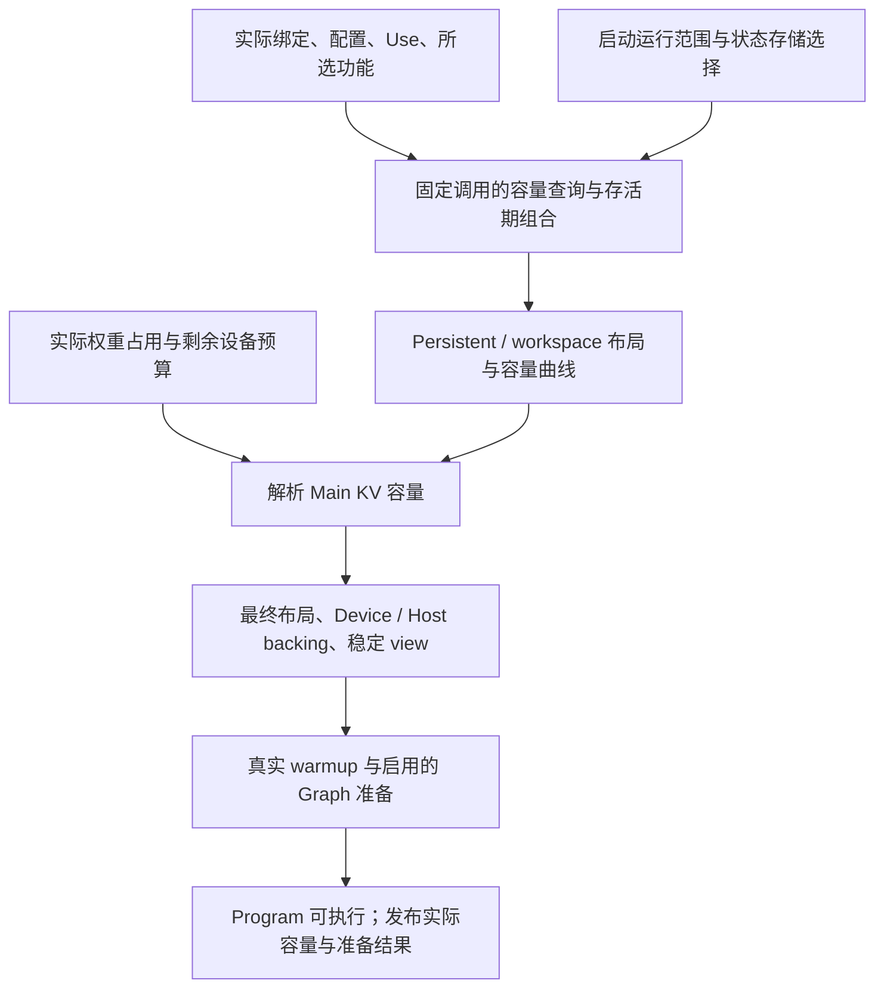

# Program 资源准备与 CUDA Graph

本文规定权重解耦后的 Program 资源实现合同，属于目标设计，尚未完成代码迁移。现状核对基于
2026-09-13 的实现，数值例子区分布局算术与假设的预算变化。KiB、MiB 分别表示 2^10、2^20 字节。

本模块消费[加载结果](weight-loading.md)和[固定模型实现](model-runtime.md)，将实际配置、绑定、
Use 与启动范围接入现有资源准备。目标是使已有能力的新权重组合自然得到相应容量、布局和
Graph，保留现有 allocator、固定执行和状态事务。

[Engine 架构](engine-architecture.md)继续拥有请求生命周期和发布规则，
[资源调度与上下文缓存](resource-scheduling-and-context-cache.md)拥有运行期可行性与保留策略，
[Paged KV](paged-kv-cache.md)拥有页、replica、地址空间和 table publication。本文规定它们
消费的物理容量怎样由本次模型生成。

## 1. 现有基础与需要调整的输入

| 现有实现 | 可以保留的机制 | 本次接入要求 |
|---|---|---|
| [LayoutBuilder / WorkspaceLayoutBuilder](../../src/core/layout.h) | 对齐、区域、scope 和峰值计算 | 使用实际几何与真实调用需求 |
| [workspace_recipe](../../src/targets/qwen3_6/impl/runtime/workspace_recipe.h) | 布局计算与真实执行共享临时数据分配辅助函数 | 接入实例几何，保持同一分配和存活期关系 |
| [SequencePlanner](../../src/targets/qwen3_6/impl/runtime/layouts_impl.h) | Persistent/workspace 组合、容量曲线和最终布局核对 | 用实际绑定替换 weights_profile 和写死格式 |
| [KV capacity resolver](../../src/runtime/engine/kv_capacity.cpp) | Explicit/automatic 解析与 headroom | 消费本次模型产生的容量曲线 |
| [StateImage](../../src/targets/qwen3_6/impl/state/state_image.cpp) | Device/Host 完整状态布局与复制 | 使用实际层数、几何及所选后端 |
| [GDN records](../../src/core/gdn_replay_records.cpp) | All-layer records 的布局与 view | 按实际 GDN 几何、并发和 verification width 准备 |
| [Vision workspace](../../src/targets/qwen3_6/impl/runtime/vision_context_impl.h) | Encode 峰值、别名和跨阶段 handoff | 加入实际调用需求，保留 handoff 存活期 |
| [Program Graph 准备](../../src/targets/qwen3_6/impl/runtime/program_impl.h) | Exact-B、frontier definitions、拓扑类与 executable 复用 | 使用真实调用范围，核对 allowance 的适用性 |

当前部分 Text 查询按 WeightsProfile 分支；35B、MTP、DFlash/proposal 中还有直接写死格式或
预先取几个固定组合最大值的查询。这些消费者都要改为接收实际原生参数。现有 scope、状态池、
容量解析和 capture 算法是本模块的基础。

数学状态的含义继续由架构和算法定义。物理 layout、容量和执行阶段的存活期由这些已经实现的
代码组合，容器不保存 workspace 数量、allocator 区域或 Graph 节点。

## 2. 输入、输出与准备依赖

### 2.1 输入来自三处

| 来源 | 需要的事实 |
|---|---|
| 只读模型 | Config、派生几何、各层实际参数与 Use、组件关系、公开 token 域、实际权重驻留占用 |
| 固定执行代码 | 各阶段调用、原生参数形式、中间数据、存活期和已实现的 Graph 分支 |
| 启动输入 | Purpose、最大并发、max_context、prefill chunk、spec 后端和宽度、proposal、Vision 上限、KV 存储、缓存容量与 headroom |

本次模型的数值参数、格式、layout 与 Use 在准备后固定。资源输入保存同源模型事实或稳定
引用，实际执行采用为这份模型准备的结果。模型与计划的一致性沿用
[运行时构造合同](model-runtime.md#22-构造和有效期)，替换当前 profile 相等判断。

能够从绑定描述确定的需求，可以在上传前计算。需要 device 地址的参数在 backing 稳定后准备，
实际运行等待上传完成。必要的 host 解析先交付 token 域等模型事实。准备顺序按这些依赖组织。



### 2.2 准备结果

准备结果包含：最终状态与控制布局、统一 workspace 容量、各 typed KV pool 的容量、Host
State/KV 容量、启用 Graph 时的 definitions 与 executable、必要的实际占用和诊断摘要。

布局记录保存 offset、bytes、alignment 和需要的 shape。绑定使用同一记录生成 view。
Program 持有实际 allocation 与可变状态；模型权重 backing 继续由只读模型拥有。

启动固定的内容与运行期变化分开：

| 启动固定 | 运行期在既有容量内变化 |
|---|---|
| 模型、Use、组件、purpose、并发上限和 spec 宽度 | 本轮活跃 batch 大小和每行有效长度 |
| KV plane、StateImage、workspace 和控制 backing | Page/slot ownership、引用、reservation 与 frontier |
| Graph 定义和可执行实例 | 控制数据、已准备 definition 的安装与 replay |
| Host cache 容量及其布局 | 完整 StateImage 和 KV extent 的分配、复制与释放 |

## 3. 三种不同的资源计量

### 3.1 Allocation、池内占用和有效数据

| 计量 | 含义 | 例子 |
|---|---|---|
| Backing 分配 | 为整个 Program 或模型保留的实际内存 | 权重 arena、State/KV pool、workspace、pinned buffers |
| 池内占用与 reservation | 这些池中已归属或已保证给执行的容量 | KV replicas、尚未 materialize 的增长、Fork destination |
| 有效数据范围 | 当前内容对应哪些逻辑输入和执行进度 | Valid KV prefix、records 的有效列、pending features |

释放一个 KV page 的逻辑归属会增加池内余量，通常不改变其 Device backing 分配。多个
checkpoint 引用同一 replica 时，物理占用按唯一 allocation 计算。现有
[占用与 reservation 规则](resource-scheduling-and-context-cache.md#32-唯一物理占用)继续适用。

分配所在 arena 的名字也不决定数据语义。当前 PersistentLayout 中包含 replay records、
prefill hidden 和 pending features：地址长期保留，内容按阶段失效。它们的有效期需要由
producer、consumer 和 commit 边界解释。

### 3.2 Device、Host 与启动峰值

Device 预算记录权重 backing、Program persistent/workspace、Graph/library allowance。
KV payload、GDN 和 handoff 是这些 backing 的组成项，诊断可以展开它们，汇总时计一次。

Host 侧分别记录：只读 Frontend 资料、Host StateImage、Host KV arena、pinned 控制/结果缓冲
和加载 staging。当前 HostStatePool 与 HostKVArena 按配置在启动建立固定 pinned backing；
池内的 slots/extents 由 Program stores 管理。

启动临时空间按真实重叠计算峰值。已结束使用的上传 staging 可以释放后再建立后续 Host
资源；若准备流程重叠，就计入重叠时段。Host 容量、extent 几何和分配失败分别在真实设施
处理，Device 余量不代替 Host 的可用性。

## 4. 实际 Op 需求与 workspace 组合

### 4.1 容量查询消费什么

每次查询使用实际原生参数中影响资源的部分：格式、layout/view 几何、输入输出尺寸、Use
许可及相关辅助条件，并结合 phase、shape 范围、状态存储和必要的设备信息。

Attention 的单／双 parent、GDN 的普通/snapshot/record、Dense gate/up 与 down、MoE 各 bank、
MTP、draft query/context、proposal 和 Vision，均使用其真实调用事实。一个 shared parent
可以产生多个用途的调用参数，各自查询对应需求。

原生 policy 解释按[Use 接入合同](model-runtime.md#42-use-进入真实调用)统一到目标许可集合。
容量与执行采用相同分派条件，包括 AllowA4 下使用已有 A16/A8 的情况。

相同需求可以合并查询，但合并条件覆盖该 Op 的资源依赖。跨层取峰值时覆盖实际出现的每种
调用，不能用首层或一个预设配方代表全部层。容量函数对不支持的输入沿其实际合同报错；
这属于真实消费者准备，沿用已确定的支持判定边界。

### 4.2 沿用分配辅助函数和 scope

现有 workspace_recipe 同时供布局计算与真实 schedule 使用。保留这种共享：模型代码直接
组织各阶段的 allocation scope，Op 提供内部 scratch 需求，WorkspaceLayoutBuilder 计算峰值，
WorkspaceArena 在预分配 backing 中取得相同范围。

干运行只计算区域和调用需求，不执行数值 kernel。已有融合继续由固定模型代码调用，其
scratch 按该融合入口查询。叶子的原生参数选择、容量查询和真实调用使用相同参数事实。

父 scope 中仍存活的 residual、hidden 或 handoff 与子 Op scratch 一起计入峰值。子 scope
结束后复用区域时，设备操作通过既有 stream/event 顺序保证前一个消费者已经完成。
CPU scope 退出只回收内部 cursor，不为每次 Op 插入同步；设备侧复用遵循上述执行顺序。

当前通用 workspace 按 text_prefill、ordinary_round、mtp_prefill/round、dflash_context/round
和 causal_score 等阶段组合。顺序互斥的阶段取峰值；跨阶段继续有效的内容保留独立区域或
进入相应外层存活期。Vision handoff 的处理见第 6.3 节。

### 4.3 Shape 与运行范围

| 路径 | 需要覆盖的范围 |
|---|---|
| Text prefill | 启动 chunk 上限以内的实际块及尾块 |
| 普通 decode | B=1..C，单请求 width=1 |
| Target verification | 已选 K，W=K+1，B=1..C，以及各行有效 extent |
| MTP proposal/bridge | 现有批量与单步路径分别使用自己的实际列数和状态范围 |
| DFlash/DFlash2 proposal | Query、proposal head、selector 分别使用对应调用的物理列数 |
| Draft context catch-up | Prefill chunk 或 pending span 对应的实际 context 范围 |
| Vision | 实际 item 上限、patch/merged-token 几何及 Text handoff |
| CausalScoring | 当前评分 tile 和尾块，采用其独立 staging |

调用的 aggregate columns、单请求 width 和 batch 分别传递。例如 verification 的 T=B*W，
有效列数小于 W 时仍使用该物理 envelope。需要区间容量的 Op 使用其区间接口；不能仅凭
“最大 T”推定 scratch 对 shape 单调。已实现的有限分支按实际范围组合。

### 4.4 Dense 混合表示例子

当前 27B 的 I=17408、T=128，SwiGLU 输出为 BF16，大小为：

```text
A = 17408 * 128 * 2 = 4,456,448 bytes = 4.25 MiB
```

假设 recipe 选择 FP8 gate/up、AllowA8，以及 Q5 down、A16Only。加载交付两次调用的实际
参数。令 S_gu、S_down 为各自容量查询结果，固定叶子采用：

```text
进入 Dense scope
  保留 activation A
  gate/up + SwiGLU 的子 scope：使用 S_gu
  down + residual 的子 scope：使用 S_down，读取 activation
结束 Dense scope
```

忽略对齐时局部峰值为 A+max(S_gu,S_down)，实际 builder 计入对齐和父 scope 占用。更换 down
格式会重新查询 S_down，SwiGLU 输出的数学含义与既有存活期保持。这一组合沿现有固定调用
完成，无需为新配方维护完整 workspace 表。

## 5. 状态几何与容量

### 5.1 从配置和启动选项构造 StateImage

状态数学由架构/config 决定，具体编码、plane 和操作由已实现的存储决定。当前 Qwen 的
StateImage 包含 GDN convolution/recurrent、continuation hidden，以及所选 draft 的 local
context；Main 和相应 full backend KV 使用独立 paged pools。

设 C 为最大并发，C_cache 为额外 Device cache StateImage 容量，则：

```text
Device StateImage slots = C + C_cache
Host StateImage slots   = 配置的独立 Host 容量
```

默认 C_cache=C 时是 2C，关闭缓存或显式配置时按实际值计算。全部 slots 属于同一个池，
不会与 lane 永久配对。当前 batch row、StateImage slot、record row 和 pending 数据的位置
通过 Program 的控制映射关联。

已解析的 layer_types 产生实际 GDN/full-attention 数量与索引，所选组件提供 target taps、
后端几何和共享关系。这些事实交给现有 state layout builder。新的状态数学按
[模型合同](model-contracts.md#6-状态阶段与-program)实现自己的布局与操作，再接入容量和事务。

### 5.2 GDN 状态与 verification records

当前 convolution history 使用 BF16，recurrent 使用 FP32。Record 存储与完整 StateImage
分开，后者的槽数由 C+C_cache 决定；前者按并发 C 和本次 verification width W 准备。

设 Lg 为 GDN 层数，Cg 为卷积通道数，Nk/Nv 为 key/value head 数，Dk/Dv 为对应 head 维度。
现有原生 records 的形状如下，采用 C++ Tensor 的轴顺序：

| Plane | Dtype | Shape |
|---|---|---|
| conv | BF16 | [Cg,W,Lg*C] |
| key | BF16 | [Dk,Nk,W,Lg*C] |
| value | BF16 | [Dv,Nv,W,Lg*C] |
| gate | FP32 | [2,Nv,W,Lg*C]，首轴依次为 g、beta |

各 plane 的层/row 外索引为 layer*C+row。布局总量由 builder 给出；payload 算术为：

```text
Lg * C * W * (2*Cg + 2*Dk*Nk + 2*Dv*Nv + 8*Nv)
```

当前 27B 的 Lg=48、Cg=10240、Nk=16、Nv=48、Dk=Dv=128，C=1、K=3、W=4 时，
四个 plane 的 payload 合计 7,151,616 bytes。它记录本轮候选轨迹；完整 recurrent state
仍由 StateImage 保存，不为每个 verification column 复制一份完整状态。

从 record producer 到接受前缀 Fold/commit 或 abort，相关有效列保持可访问。提交后按本轮
处理结果失效，backing 继续供后续轮次使用。权重从 Q4/Q5 改成 FP8/NVFP4 不直接改变这些
状态精度和 record 数学；实际投影/递推入口可能改变自身 scratch。

### 5.3 Main、MTP 与 DFlash typed KV

当前 Main page size P=64 token，由[实际 KV 存储](../../src/core/paged_kv_cache.h)提供。
每个 page group 的 plane 集合、padding、scale 和对齐来自对应 KV geometry 与 storage。
计算总量时采用 layout 返回的区域和 stride。

令 M 为 Main physical page-group count，K 为已选 spec proposal 数。沿用
[后端容量合同](paged-kv-cache.md#34-backend-capacity)：

| 所选后端 | 与 Main M 关联的 growing pool |
|---|---|
| None | Main=M |
| MTP | Main=M；MTP=M+C*ceil((K-1)/P) |
| 当前 DFlash | Main=M；其 full-context pool=M，local context 另计入 StateImage |
| 当前 DFlash2 | Main=M；五层 context 均为 StateImage 中的 local ring |

各 pool 的 plane bases、实际字节和可用容量分别计算。增加一个 Main page group 时，相应
backend pool 也可能增长，因此预算增量必须来自完整生产布局。

### 5.4 Host 布局与恢复

Host StateImage 按完整 image stride 和 slots 计费。Host KV 使用实际 typed page layout 和
extent geometry；复制量与 Device backing 容量分别报告。Device 和 Host 可以同时保留同一
逻辑内容的 replica，各物理副本分别计入对应池。

恢复仍使用相同布局解释、有效 frontier 和 Program stores 的 ownership。Host 余量、页数量
和 slot 数是不同资源轴，具体可分配性由现有 stores/allocators 判断。

## 6. 跨阶段数据与可选功能

### 6.1 所选功能决定资源存在

Text 始终准备。Vision、MTP、DFlash、DFlash2 和 proposal 私有依赖只在本次启用时参与。
同一 artifact 可以包含多个可选组件，Program 仍采用启动选择的 none/一个 spec 后端。

启用后端的权重、状态、controls、workspace 和 Graph 来自同一功能选择。Shared embedding/head
仍按加载后的唯一权重 backing 计入，不因多个消费者重复计算。

### 6.2 DFlash2 local context 与 pending features

当前 [cyclic KV 实现](../../src/core/cyclic_kv_cache.cpp)为 K 使用 BF16、V 使用 FP16，物理
capacity 向上对齐到 128。后端窗口和逻辑可见范围仍由模型数学和 frontier 解释。

现有 DFlash2 的五层 local context，每个 StateImage 的 K/V payload 为：

```text
5 layers * 2048 positions * 8 KV heads * 128 head_dim * (2+2) bytes
= 41,943,040 bytes = 40 MiB
```

这部分随 StateImage slot 数扩展。Draft-query K/V、dynamic-conv 中间量和 selector scratch
按当前轮次使用；没有可提交的跨轮 query KV 或 dynamic-conv history。

Pending features 单独按 target feature 宽度 Fh、物理 W 和 C 准备 BF16 [Fh,W,C]。
当前 Fh=5*5120=25600，C=1、K=3、W=4 时预留 204,800 bytes=200 KiB。若本轮最终提交
N=3，则有效 features 为 153,600 bytes=150 KiB，保留到对应 context catch-up 完成。

生命周期为：

```text
target verification 产生候选 features
  → commit 选定前 N 行并关联 sequence / frontier
  → pending span 跨调用保持有效
  → 下一次 proposal 前 materialize 到 local context
  → 相应 pending span 失效
```

保留完整 checkpoint 前也完成必要 catch-up。Batch compaction 后仍按 sequence 的真实映射
取得 pending span，不能用新的 compact row 解释上一轮数据。Prefill feature staging 按实际
chunk 及消费关系准备。提交对齐沿用[现有 DFlash2 事务](qwen3.8-27b-dflash2.md#83-state-transaction)。

### 6.3 Vision handoff 与共享 workspace

Vision 编码的临时激活与 Text/MTP 的通用 workspace 可以按现有顺序复用。输出 handoff 保留
到该媒体 item 的全部所选消费者完成，包括后续 chunk、MTP shifted embedding 和 bridge，
遵循[模型合同](qwen3_5-model-contracts.md#55-vision)。现有 general workspace 已包含所选
MTP prefill，handoff 位于它之外；继续使用 VisionContext::plan_workspace 的布局关系。

令 G 为 general workspace，E 为 Vision encode peak，Mh 为 merger hidden bytes，Vout 为
item 输出 handoff bytes。当前布局采用：

```text
handoff_offset = align_up(max(G,Mh),256)
workspace_capacity = max(E,handoff_offset+Vout)
```

保留该布局关系，G 和 E 改为本次真实调用需求。Vision 的各投影使用实际参数；当前入口无
scratch 的部分按其真实合同计零，需要 scratch 的已有入口加入相应阶段 scope。权重表示
改变不会使尚未消费的 handoff 提前失效。

例如一个媒体 item 跨两个 chunk，且两者的 Text/MTP 都读取其视觉列：

```text
Vision 编码一次，保留 item handoff
  → chunk 0：Text scatter / 主干计算 → MTP shifted scatter / MTP 计算
  → chunk 1：Text scatter / 主干计算 → MTP shifted scatter / MTP 计算
  → 该 item 的全部所选消费者完成后，复用 handoff 区域
```

Prefix 恢复中的媒体 bridge 也遵循相同最后消费者规则。CPU 控制根据现有 item/chunk 状态
管理有效期，设备读取与区域复用遵循已有 stream/event 顺序。

例如 G=32 MiB、E=48 MiB、Mh=8 MiB、Vout=4 MiB 时，容量为 48 MiB；若新的实际 Text
调用使 G=56 MiB，其余不变，则容量为 60 MiB。这里的数值仅演示布局算术；实际值由本次
模型和 item 上限计算。

### 6.4 CausalScoring

评分继续使用当前启动固定 purpose：串行窗口、临时 Main KV/State，关闭 Vision、spec、
Graph 和 generation context cache。当前 score hidden/logprob tile 为 1024，按实际模型
hidden、公开输出域与主 head 参数准备相应 staging 和 scratch。

当前共用 planner 还会计算 ordinary_round 和采样需求。目标按评分实际调用收集需求，保留
确实共用的 root/control，避免查询评分不会调用的 generation 路径。窗口结束后按评分流程
清理有效状态，稳定 backing 继续使用。

## 7. Device 预算与自动 KV 容量

### 7.1 权重只计一次

加载模块交付去重、对齐后的实际权重驻留占用 W_weights。文件长度、分片个数、未启用组件
和 host-only 资源不直接成为 Device 权重占用。

当前 Program 的 Device 预算表达可以保留：

```text
B(M) = persistent_bytes(M) + workspace_capacity + graph_library_allowance
```

persistent_bytes 已包含所选 Main/backend KV、StateImage、records 和稳定控制区。
workspace_capacity 已包含其内部复用与 Vision handoff。展开显示的 kv_payload_bytes 等
指标是组成项，不再额外加入 B(M)。

上传前可用 F_before-W_weights 对确定部分做初步预算；最终解析使用权重驻留后的实际可用
显存 F。F 已反映已分配的权重及此前设备开销，此时直接与 B(M) 比较。

### 7.2 沿用生产布局生成容量曲线

设 S=max_context，C=max_concurrency，P 为 Main page size，L=ceil(S/P)。当前可用范围为：

```text
M_min = max(L,C)
M_max = C*L
```

当前 SequenceCapacityCurve 表示：

```text
B(M) = B_min + (M-M_min)*B_step
```

SequencePlanner 使用同一生产 builder 生成 M_min 的布局和相邻布局，得到 B_min、B_step；
解析 M 后再次生成最终布局并核对曲线。实际绑定改变后重新计算这组输入，公共 resolver
继续消费曲线，不复制模型维度或格式表。

S、C、所选功能与调用范围固定后，当前资源模型在 Main capacity 上满足这一仿射关系。
最终布局核对继续保留。新增架构若需要不同的容量关系，在其实际资源实现与公共接口处补充
所需能力，不能把不成立的关系包装为一个固定步长。

### 7.3 Explicit 与 automatic

Explicit policy 使用请求的 Main token capacity 向上取整得到 M，并核对逻辑与物理范围。
Automatic 使用权重驻留后可用显存 F 和配置的 headroom R：

```text
要求 F >= R+B_min

M = min(M_max, M_min + floor((F-R-B_min)/B_step))
```

M_min=M_max 时直接处理单点，不使用除法。Headroom 只在 automatic policy 的预算中扣除，
实际规则沿用 [KV resolver](../../src/runtime/engine/kv_capacity.cpp)。

返回的 Main capacity 为 M*P token-equivalents，单请求 max_context 仍为 S。最终 Program
采用同一个 M 构造 typed pools、布局与控制数据，运行期不重新求解整个 Device backing。

### 7.4 新混合权重怎样影响 KV 容量

以当前 27B Text-only 和 BFloat16 Main KV 选项为例，
[实际存储](../../src/core/paged_kv_storage.h)为 K BF16、V FP16。16 个 full-attention 层、
4 个 KV head、head_dim=256、P=64，每个 Main page group 的 K/V payload 增量为：

```text
16 * 64 * 4 * 256 * (2+2) = 4,194,304 bytes = 4 MiB
```

在当前这一布局下，其他固定项不随 M 改变，生产 builder 给出的 B_step 为 4 MiB。所选
backend 或存储改变后，以相应完整布局的实际步长为准。

假设某次 recipe 改变让权重少占 128 MiB，而实际查询得到的固定 runtime 预算增加 32 MiB，
其他条件相同。可用于扩展页的净变化为 96 MiB；若未被 M_max 截断，可增加 24 个 Main page
group，即 1536 token-equivalents。128/32 MiB 是预算变化的算术假设，不是性能或显存实测。

这条链由 converter 输出、实际驻留、Op 查询和既有容量解析共同完成。改变表示不需要新增
完整资源 profile。

## 8. 稳定地址与运行期资源操作

### 8.1 布局落实到 backing

Program 按最终布局建立 Device persistent/workspace 与必要的 Host backing。LayoutRegion
和 TensorRegion 从同一 owner 绑定，view 的区域、对齐和 shape 保持一致。已构造的 Op 原生
参数与控制 view 引用这些稳定地址。

正常执行在预留 workspace 内取得 Tensor 和 DeviceSpan，结束 scope 只回收内部可复用范围。
权重的物理组织已经由 converter 与加载确定，资源准备不重排或重新量化权重。

### 8.2 控制数据与复制顺序

Page plane bases、block-table matrix、状态池、host/device ingress/egress 和捕获使用的
地址在相应 Program 生命周期内保持稳定。每轮变化的是 row selectors、位置、有效长度、
采样控制、frontier 和 table 内容。

运行期沿[已有 table publication](paged-kv-cache.md#11-cuda-graph-与-table-publication)顺序：

```text
取得所需 pages/slots
  → 更新 membership 与控制数据
  → 发布本执行单元所需 table/control
  → launch 或 replay
  → 到达稳定边界后提交、改映射或复用输入缓冲
```

被异步复制或 Graph 引用的 Host 缓冲拥有稳定地址，更新和释放等待其消费者完成。可按值
复制的临时参数结构不要求永久保留，真正被捕获的地址及其 backing 则覆盖全部使用期。

### 8.3 容量向量与运行期可行性

Program stores/allocators 继续拥有物理事实，向现有 ResourceManager 发布实际容量与结果。
State slots、各 typed KV pages、Host extents 和逻辑 catalog 容量保持各自含义。

模型改变了 image size 或 page geometry 时，相应资源占用与传输成本使用本次布局。Move、
Fork、恢复、回收和 active completion guarantee 沿用既有资源事务；它们在固定 backing
内部操作，不能把模型的容量摘要当作一份可独立修改的 allocator 状态。

## 9. CUDA Graph 的范围、实例与开销

### 9.1 捕获固定模型的真实调用

Graph 使用本次稳定模型、实际参数、状态 view 和 workspace。阶段 body 与 eager 相同，
融合和跨 Op 次序继续由[固定模型实现](model-runtime.md#43-固定融合和阶段继续使用)决定。

| 变化 | 现有准备方式中的位置 |
|---|---|
| Request 身份、page ID、state slot、有效列数 | 稳定控制输入或 table 内容 |
| Exact batch B、已选 K、phase | 对应固定执行和 capture 范围 |
| Frontier 影响 host 分支、envelope 或 launch | 对应已捕获 definition 的范围 |
| Definition 之间无法采用同一 update 关系 | 分配相应拓扑类的 executable |

Frontier 分段来自真实模型分支和 Op 实现。维护者继续显式维护有限规则，输入接到本次实际
几何、参数和运行范围。相同 resident 内的权重和 Use 固定；更换 artifact 时创建自己的
Graph，不以 checkpoint 名或完整 recipe 注册 Graph 执行身份。

### 9.2 Definition 与 executable 分开

当前 DecodeGraphDefinition 保存 capture 结果，DecodeGraphExecutable 负责 instantiate、
update、upload 和 launch。Program 按 exact-B 与拓扑类建立 executable，同类 frontier
definitions 通过 update 安装。

保留这一组织。一个 class 的多份 definition 不等于同样数量的 resident executable。
GraphExecutionProfile 继续描述 frontier 范围与拓扑类，其用途独立于旧 WeightsProfile。
拓扑类由固定代码给出，能否在类内 update 由真实准备验证。Update 失败按准备错误处理；
实际拓扑有差异时，修正相应固定分组及其预算。

### 9.3 准备顺序与临时状态

现有 Program 的准备过程继续作为基础：

1. 从最终 pools 取得 capture 用状态、地址空间和稳定控制 row，准备合法的代表输入。
2. 执行相应代码 warmup，再按启用后端、B 和 frontier 范围 capture definitions。
3. 每个拓扑类 instantiate executable，检查其 definitions 的 update/upload，执行代表 replay。
4. 完成同步，清理准备产生的状态、pending features、计数与 controls，释放临时 pages/slots 和引用。
5. 交付不带用户 continuation 或缓存命中的可执行 Program。

实际实现可复用已准备的同源记录。当前准备会检查一组 definition 的安装关系，但不等于执行
了每个数学输入或所有 shape。Warmup 的证据覆盖它实际运行的路径，其他调用仍在其真实
消费者处处理能力和错误。

批重排继续通过 controls/table 表达。例如 B 从 3 变为 2 时，选择已有 exact-B 执行实例并
更新两行映射，权重与 workspace 基地址保持稳定。Frontier 越过已定义边界时安装对应的
已捕获 definition；映射和 executable 的更新发生在已有稳定执行边界。

### 9.4 Graph/library allowance

Tensor、plane 和 arena 区域的容量由生产布局精确计算。Graph executable、driver/module
等额外占用使用有适用范围的 allowance，实际结果通过真实初始化、capture、update/upload
和运行准备落实。

当前实现已按后端、exact-B、frontier 和拓扑类组合 allowance。同一拓扑类取其适用预算的
最大值，再组合常驻类的占用；还包含准备过程需要的相关运行开销。保留可用的估算和复用
机制，预算输入接到真实调用规模、kernel/模块种类与 class 构成。

当前以 MiB 常量表示的界限有自己的执行范围，不能仅因新组合具有相同公开名称就沿用其
适用性。已有分支的保守预算可以复用；新增实际调用需求时补充对应开销依据，实际构造失败
仍按资源准备失败处理。新 recipe 不要求先建立 checkpoint 专属测量或执行登记。

F 的观测已经包含此前驻留的设备开销，allowance 计入后续尚需准备的部分。诊断分别显示
计划 allowance 与实际可用显存变化；后者可能还含 module 初始化等开销，不标成精确的
Graph 独占字节数。Automatic headroom 仍按用户配置进入容量解析，准备后另外报告实际剩余
显存；计划 slack 与实际剩余分别显示。

## 10. 准备结果、失败与验证

### 10.1 交付与错误边界

Engine 进入可接受请求状态前，Program 完成所选功能的布局绑定、稳定 allocation 和实际
执行准备。报告保留实际权重占用、persistent/workspace 容量、KV capacity、Host 容量、
Graph allowance 与必要的实际观测，各项说明是总量还是组成项。

| 失败 | 实际消费者 |
|---|---|
| 实例几何或功能关系不成立 | 配置、绑定或 Program 构造 |
| 原生形式、policy 或 shape 没有对应能力 | 相应 Op 准备、容量查询、warmup 或实际执行 |
| 最低容量、explicit capacity 或 headroom 无法满足 | 既有 KV resolver 与实际资源准备 |
| Layout 不一致、越界或整数范围不足 | 实际 layout builder / view binding |
| Host/Device allocation、capture、update 或 upload 失败 | 相应 allocator 或 Graph 准备 |

错误保留组件、层/用途、phase、shape、实际格式和相关容量信息。部分准备失败时结束在途
操作，释放临时 claim、状态、Graph 和 backing；销毁顺序保持所有引用和传输有效。
请求执行中的提交与失败清理继续遵循 Engine 事务合同。

### 10.2 实现所需证据

实现时复用已有测试，针对新的输入关系补充有意义的检查：

- 不同层、不同用途和不同阶段的真实需求被容量覆盖，包括最耗空间的层不是首层的组合。
- 相同分配序列的布局计算与真实寻址一致，实际高水位不超过容量；覆盖对齐、尾块和 shape 分支。
- GDN records、pending features 和 Vision handoff 跨越其真实消费者边界后再复用。
- 关闭组件时其私有资源不进入准备；启用时 backing、几何与实际执行一致。
- 同一生产 builder 的最低、最终容量与曲线相符，检查预算临界值和 M 的上下界。
- Host/Device replicas、views 与共享引用按唯一物理占用记账，状态恢复仍满足现有合同。
- Graph 的代表执行、definition update、batch/frontier 切换和控制数据发布经过真实路径。
- 准备失败能够结束在途使用并回收部分结果，不留下用户可见缓存或活跃请求状态。

新表示的 Op 数值资格按[Op 开发合同](op-development.md)建立；资源验证关注实际寻址、容量
和生命周期。本文的布局算术检查不替代 CUDA 执行、Graph 或性能验证。

| 相邻模块 | 本文的交接 |
|---|---|
| 模型合同 | 消费数学几何、组件和状态语义 |
| 权重加载 | 消费实际绑定、Use、稳定 backing 与真实驻留占用 |
| 模型运行时 | 消费固定调用及存活期，交付它使用的布局、容量和稳定资源 |
| 资源调度与 Paged KV | 交付实际 capacity/geometry，沿用既有占用、事务和 publication |
| 迁移执行计划 | 后续安排这些输入接入现有实现与验证的顺序 |
