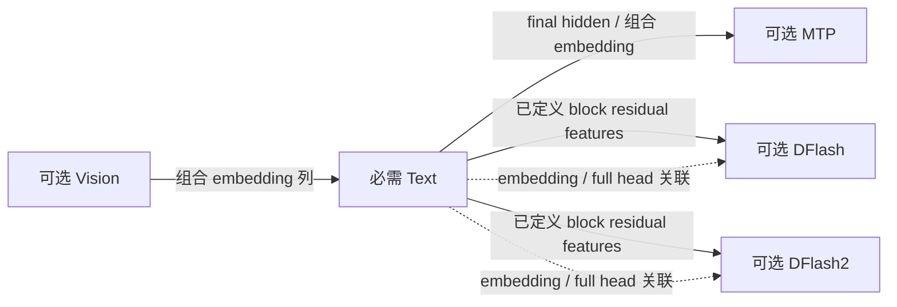

# Qwen3.5 架构合同

> 状态：目标规范草案，尚未实现。本文是[模型公共合同](model-contracts.md)的架构专属定义，
> 规定 Qwen3_5ForCausalLM、Qwen3_5MoeForCausalLM 及现有 Vision/MTP/DFlash/DFlash2 组合
> 的配置、逻辑数据、数学输入和状态。具体容器编码由 v3 规范规定。

本文以固定模型代码为主体：attention/GDN、norm、FFN、Vision 和 MTP 的公式与调用关系由代码
定义，config 保留实例维度与少量必要参数。字段表列持久化数据，数学和状态章节说明实现规则。
其他架构拥有自己的固定实现，通过相同数据绑定与运行生命周期接入。
[公共合同中的 Qwen4Exp 与 DeepSeek V4.1 例子](model-contracts.md)说明这类扩展。

## 1. 范围、权威与记法

### 1.1 本文负责的合同

给定本文定义的模型实例，converter 和 runtime 应能独立确定：

- 它遵循哪一种已知数学结构；
- 实际提供哪些组件，以及组件之间的数学输入和共享关系；
- 必须有哪些逻辑参数、参数的轴和 shape；
- 每个参数在哪些数学位置使用，哪些位置可能需要持久辅助输入；
- 完整模型状态的含义，以及它与物理表示、运行容量的关系。

这些判断依据本架构的数学/config；相同数学/config 的不同训练结果遵循同一合同。
实际 Op 支持与资源准备遵循[公共检查边界](model-contracts.md#73-从文件到执行对象)。

| 权威 | 拥有的内容 |
|---|---|
| 本文 | 固定数学、小的实例 config、逻辑参数与组件关联 |
| [27B 数学参考](qwen3.6-27b-model.md)、[35B-A3B 数学参考](qwen3.6-35b-a3b-model.md)、[DFlash2](qwen3.8-27b-dflash2.md) | 已交付实例的完整公式及状态语义；目标绑定依据本文的逻辑需求 |
| [容器规范](artifact-container.md) | 目标 v3 规定本文记录如何嵌入、对象与片段如何引用、文件字节如何定位 |
| [数值格式](tensor-formats.md)、[布局](storage-layouts.md) | 权重字节的数值解释、planes、encoded size、padding 和合法 view |
| [Op 合同](op-development.md)与各 Op 接口 | 实际输入和状态边界、支持范围、数值标准与调用需求 |
| [Engine 架构](engine-architecture.md)及[资源合同](resource-scheduling-and-context-cache.md) | 请求、物理资源、状态事务和结果发布 |

本文定义逻辑参数需求，实际对象与 view 由绑定描述。文件放置归容器，device allocation、
kernel dispatch 和 workspace 归运行实现。源 checkpoint 的名称和轴转换属于源适配。

### 1.2 类型、索引和 shape

| 记法 | 定义 |
|---|---|
| `PositiveInt` | 精确正整数；字段自身的范围在对应定义中规定 |
| `Index` | 精确非负整数；具体合法上界由它引用的域决定 |
| `F32` | 规范化后的有限 IEEE binary32 值；转换到该值采用 round-to-nearest-even |
| `PositiveF32` | 有限且严格大于零的 F32 |
| `bool` | true 或 false |
| `List<T>` | 有序序列；是否允许为空由具体字段定义 |

本架构的逻辑目录索引从零开始，区间为半开区间。Shape 乘积和偏移检查消费者整数范围。
本合同标为 F32 的值按同一 binary32 值解释；具体整数和浮点 wire 编码由 v3 定义。

本文使用数学轴顺序：

- 矩阵为 `[output,input]`，embedding 为 `[row,hidden]`；
- head 内特征连续，flatten 后的逻辑序号为 `head * head_dim + feature`；
- expert 编号属于逻辑轴，必须与 router 输出编号一致；
- 卷积核、Vision patch 和 dynamic convolution 的轴在各参数表中单独定义。

参数表使用逻辑 shape。C++ `Tensor.ne`、文件 layout、融合和 padding 通过绑定对应到这些轴。

持久字段表中未标为可选的字段均必需。Converter 解析保留字段的源默认值，并核对固定数学。
参数沿用对应上游名称，例如 num_hidden_layers 与 layer_types 长度一致。
代码固定值、来自 target 的共用值、内部索引与轴映射分别按本文规则取得。

### 1.3 实例记录与物理表示分别组织

本架构的现有组合包含唯一的 `text`，以及可选的 `vision`、`mtp`、`dflash`、`dflash2`。
可选 proposal 输出表示作为 proposal 用途的数据单独描述。
组件的一般关系与新增后端的接入遵循[公共组件合同](model-contracts.md#4-组件与数学输入)。

以下“记录”描述领域数据。V3 中，架构标识和实例参数进入 `components.<id>.config`，
`target` 是组件记录的同级字段，proposal 进入 `components.text.proposal`。
第 11 节示例集中展示这些领域字段，序列化时按上述位置组织。

| 记录 | 出现条件 | 内容 |
|---|---|---|
| Text | 必需 | 第 3 节配置及 Text 逻辑参数 |
| Vision | 文件提供 Vision 时 | 第 4.1 节配置、参数及与 Text 的关联 |
| MTP | 文件提供 MTP 时 | 第 4.2 节关联及私有参数 |
| DFlash / DFlash2 | 文件提供相应后端时 | 第 4.3 节配置、关联及私有参数 |
| Proposal 输出表示 | 文件另行提供可选 proposal head 时 | 第 4.4 节输出域、参数和可选映射 |
| Frontend / 产品资料 | 按 Text 与实际提供组件的需要 | 第 8 节资源角色、token 关系和实例资料 |
| 表示绑定与使用输入 | 对实际提供的参数和用途 | 物理对应由 v3 定义，逻辑使用语义见第 6、7 节 |

组件存在与启动启用分别记录。省略组件时可以一并省略其私有 config、参数和资源；
声明提供的组件应完整。Converter 对全部产物负责，启动 binder 按所选功能收集需求并准备资源。



图说明代码中的数学输入与参数关联。产物提供实际组件与 target 引用，准备代码按所选功能绑定。

## 2. 已知数学架构

### 2.1 沿用上游架构与配置名称

命名与配置层级遵循[公共命名规则](model-contracts.md#21-名称沿用对应上游)。
本架构的标准类名、config 类型与已核对路径如下：

| 组件 / 上游模型类 | 对应 config 类型或来源 | 本文解释的数学路径 |
|---|---|---|
| `Qwen3_5ForCausalLM` | `Qwen3_5TextConfig` / `qwen3_5_text` | Dense hybrid Text |
| `Qwen3_5MoeForCausalLM` | `Qwen3_5MoeTextConfig` / `qwen3_5_moe_text` | MoE hybrid Text |
| `Qwen3_5ForConditionalGeneration` | `Qwen3_5Config` / `qwen3_5` | 上游 Text + Vision 包装与资源关联 |
| `Qwen3_5MoeForConditionalGeneration` | `Qwen3_5MoeConfig` / `qwen3_5_moe` | 对应 MoE 的多模态包装 |
| `Qwen3_5VisionModel`、`Qwen3_5MoeVisionModel` | `Qwen3_5VisionConfig` / `qwen3_5_vision`、`Qwen3_5MoeVisionConfig` / `qwen3_5_moe_vision` | 同类 Vision tower 与 merger，可共用 NInfer 实现 |
| `Qwen3_5MTP`、`Qwen3_5MoeMTP` | vLLM 已有 MTP 入口，读取对应 Text config | Target-conditioned MTP |
| `DFlashDraftModel` | Companion 的 `architectures` 值；`model_type=qwen3` | 本文的非因果 masked-block DFlash 路径 |
| `DFlash2DraftModel` | Companion 的 `architectures` 值；`model_type=qwen3` | Dynamic convolution 与 coherent selector 路径 |

Text 子模型与多模态包装有不同的标准名称。源 `architectures` 是
`Qwen3_5ForConditionalGeneration` 时，converter 从其 `text_config` 取得 Text 事实，并使用对应的
`Qwen3_5ForCausalLM` 入口；源 `vision_config` 按实际保留的功能生成独立 Vision 组件。
Text-only 产物声明 Text 及其依赖，并省略 Vision。
规范化后的字段分别进入 `components.text.config` 与 `components.vision.config`，
Vision 的 `target="text"` 位于其组件记录中。

Vision 使用标准子 config。
当前 Transformers 使用上述 `*_vision` model_type；较早本地 vLLM/source config 曾使用包装类型名，
这种来源差异由 converter 解析到本文定义的目标字段。
DFlash 的源架构名和 vLLM 实现类名也要区分：vLLM 将 `DFlashDraftModel` 注册到
`DFlashQwen3ForCausalLM`，将 `DFlash2DraftModel` 注册到 `DFlash2Qwen3ForCausalLM`；文件沿用源架构名。

本次命名核对依据是本地 Transformers 5.12.1 的配置/模型定义、本地 vLLM 的模型注册与实现，
以及本仓库 converter 已核对的实际 source config。可查阅
[Transformers Qwen3.5](https://huggingface.co/docs/transformers/model_doc/qwen3_5)、
[MoE 配置定义](https://github.com/huggingface/transformers/blob/main/src/transformers/models/qwen3_5_moe/configuration_qwen3_5_moe.py)和
[vLLM 注册表](https://github.com/vllm-project/vllm/blob/main/vllm/model_executor/models/registry.py)。
这些来源用于确定名称、数学含义与配置关系。

已核对的 Qwen3.6-27B 和 Qwen3.8-27B 共用上述 Dense Text 类与配置解释。
新的 release 按其实际数学/config 判断归属。

### 2.2 代码中的规则与实例中的数值

Text 与 MTP 的 input、post-attention、final、Q/K 和 stem norms 都是：

```text
offset_rmsnorm(x,w,eps) = (1+w) * x / sqrt(mean(x*x)+eps)
```

GDN 内部 output norm 与 DFlash/DFlash2 norms 使用乘法权重 `w`，没有 unit offset。
Vision 使用具有 weight/bias 的普通 LayerNorm。
Norm 公式由架构定义，epsilon 是配置，权重表示由绑定提供。

Text attention 有逐 Q-head 的输出 gate、无投影 bias，Q/K 在完整 head 上归一化后做 partial
MRoPE，再对 causal GQA 输出乘 `sigmoid(gate)`。
Attention scale 为 `1/sqrt(head_dim)`，不额外保存一份可矛盾的 scale。

GDN 对 Q/K/V 做 depthwise causal convolution 和 SiLU，Z/A/B 不参与该卷积。
Q/K 的 L2 normalization 固定为 `x/sqrt(sum(x*x)+1e-6)`；
该 `1e-6` 是此处 L2 normalization 的独立常数。
衰减与更新为 `g=-exp(A_log)*softplus(a+dt_bias)`、`beta=sigmoid(b)`。
V-head `j` 使用 Q/K-head `floor(j/(value_heads/key_heads))`，
递推输出 scale 为 `1/sqrt(key_head_dim)`。

Dense FFN 使用 SwiGLU。MoE 对 router logits 做 softmax、选 top-k 后重新归一化，并加上
始终执行的 gated shared FFN；shared 分支不占 routed expert 编号。
这些固定公式由本架构实现。

层数和几何由配置参数化，真实调用检查当前 consumer 的支持范围。

### 2.3 固定语义、派生值与源字段

以下内容由代码或已有输入确定。Converter 核对来源与实际采用的数学，并从源配置提取第 3、4 节
所列实例字段。源资料可以随转换报告保留，运行时直接采用本文的固定规则。

| 内容 | 有效依据 | 源适配负责的事项 |
|---|---|---|
| Text/draft 的 SwiGLU、投影 bias 规则、inference dropout 关闭 | 第 2.2、4.3 节固定实现 | 核对 hidden_act、attention_bias 和源推理数学；训练 dropout 参数留在源资料 |
| Text/MTP 的 default interleaved MRoPE；draft 的 default 一维 RoPE | 第 3.2、4.3 节公式 | 核对源 rope_type、mrope_interleaved 与数学模式 |
| GDN FP32 recurrent/control | 对应 Op 与状态数值合同 | 解释源 mamba_ssm_dtype 与实际状态语义 |
| Vision RGB、GELU-tanh、merger exact GELU 和无 deep-stack 注入 | 第 4.1 节固定实现，Cin=3 | 核对 in_channels、hidden_act、deepstack_visual_indexes 与源路径 |
| Vision 输出宽度 | target.hidden_size | 核对源 out_hidden_size 与 target 的关系 |
| 当前 MTP 单层递归、共享 target embedding/head、固定 hidden 采集位置 | 第 4.2 节固定实现 | 核对 mtp_num_hidden_layers=1、mtp_use_dedicated_embeddings=false 与源数学 |
| 当前 draft 的 hidden、词表和 target 层数 | target 引用 | 核对源 hidden_size、vocab_size、num_target_layers |
| Attention/GDN 数量、compact 索引、投影和状态 shape | 实例维度与 layer_types | 源 interval 等辅助描述在转换时展开 |
| 公共 token 域 V | 完整 Frontend tokenizer 资源 | 合并实际词表和 added tokens，见第 8 节 |

Norm 公式、gate 类型、特征采集阶段和状态操作在对应代码中直接实现。第 5、7、9 节的表用于
说明这些数学关系，binder、固定执行和 Program 按它们编写普通函数、循环与条件分支。
后续实际增加数学变体时，在所需位置补充实现与必要参数。

## 3. Text 实例配置

令 `H` 为 hidden，`R` 为词表矩阵逻辑行数，`V` 为公共 token 域大小。

### 3.1 本架构共用字段

本节从 `Qwen3_5TextConfig` / `Qwen3_5MoeTextConfig` 提取实例参数，沿用字段名。
Attention、linear attention 与 FFN 参数保持上游的扁平组织。
GDN 是正文中的数学简称，layer_types 中的标准值为 linear_attention。

| 字段 | 类型 / 必需性 | 含义、约束与消费者 |
|---|---|---|
| `architectures` | 一个已知类名的列表 | Text 为 `Qwen3_5ForCausalLM` 或 `Qwen3_5MoeForCausalLM` |
| `model_type` | 对应的标准 config 类型 | `qwen3_5_text` 或 `qwen3_5_moe_text`，与 architectures 一致 |
| `hidden_size` | PositiveInt | 所有 Text residual/embedding/head 的 hidden 宽度 H |
| `vocab_size` | PositiveInt | Embedding 和完整主输出矩阵的逻辑行数 R，包含保留模型行 |
| `tie_word_embeddings` | bool | Embedding/head 是否共享训练参数；表示与 alias 规则见第 6 节 |
| `num_hidden_layers` | PositiveInt | Text block 数 L，必须等于 layer_types 长度 |
| `layer_types` | 长度 L 的列表 | 每项为 `full_attention` 或 `linear_attention`；唯一的逐层 mixer 分布 |
| `max_position_embeddings` | PositiveInt | 声明的位置域 `[0,M)`；运行容量由 Program 准备 |
| `rms_norm_eps` | PositiveF32 | Text offset RMSNorm 和 GDN output RMSNorm 的 epsilon |

公共 token 域由完整 Frontend 资源解析，检查其上界 V<=vocab_size。
`target`、proposal 输出域、逻辑绑定和使用输入作为各自用途的数据单独描述。

源 config 若没有 `layer_types`，converter 按上游 `full_attention_interval` 和 num_hidden_layers
展开它。目标由明确的 layer_types 决定逐层拓扑。
Attention/GDN 数量和 compact 索引从序列计算，num_hidden_layers 作为标准字段保持并校验。

各 mixer 类型内共用其对应几何，所有层共用 FFN 配置；格式和使用许可仍可逐层/逐参数变化。
数学变体由相应实现解释。源 `dtype` 和量化信息由源适配解读，目标对象表示由 recipe 选择。

### 3.2 Attention 与位置

| 字段 | 类型 / 条件 | 约束与用途 |
|---|---|---|
| `num_attention_heads` | PositiveInt | Nq；Q 和 gate 各有 Nq 个 head |
| `num_key_value_heads` | PositiveInt | Nkv；`Nq % Nkv == 0` |
| `head_dim` | PositiveInt | D；Q/K/V/gate 每 head 的特征数 |
| `rope_parameters.rope_theta` | PositiveF32 | 频率基数 |
| `rope_parameters.partial_rotary_factor` | PositiveF32，且不大于 1 | 按上游计算 `Drot=int(head_dim*partial_rotary_factor)` |
| `rope_parameters.mrope_section` | 三个非负整数 | Temporal/height/width 的 section 参数；和等于 Drot/2 |

有 Text full_attention 层或提供 MTP 时，上述字段必需；否则可以省略不被使用的 attention 字段。
Drot 必须是正偶数且不大于 D；Q/K norm 的宽度为 D。
旧来源把 partial_rotary_factor 放在外层时，converter 按已知配置版本解析到 rope_parameters；
源省略的实例参数在转换时解析。Default interleaved 模式由代码固定。

按本合同核对的 interleaved 规则：令 `P=Drot/2`，pair r 旋转 features r 与 r+P。
其位置轴在解释配置时派生：

```text
axis(r) = height, if r % 3 == 1 and r < 3*mrope_section[1]
          width,  if r % 3 == 2 and r < 3*mrope_section[2]
          temporal, otherwise
phi_r = position[axis(r)] * rope_theta^(-2*r/Drot)
```

此外检查 section 所声明的轴计数能由这些范围实现，防止把越界后被截断的 section 当作完整分配。
K 使用同一规则，features `[Drot,D)` 不变。纯 Text 令三个位置轴相同，Vision 输入提供三轴位置。
当前实例为 head_dim=256、partial_rotary_factor=0.25、mrope_section=[11,11,10]，因此 Drot=64。

加载后可缓存派生的 pair→axis 向量和频率表。
其他 rope_type 或 MRoPE 模式按相应数学/Op 能力接入。

派生投影宽度：

```text
Q = num_attention_heads * head_dim
K = num_key_value_heads * head_dim
gate_width = Q
Q heads per KV head = num_attention_heads / num_key_value_heads
```

Q 与 H 分别推导，例如现有 27B 为 Q=6144、H=5120。

### 3.3 Linear attention / GDN

| 字段 | 类型 | 约束与用途 |
|---|---|---|
| `linear_num_key_heads` | PositiveInt | Nk；Q/K head 数 |
| `linear_key_head_dim` | PositiveInt | Dk；Q/K 每 head 特征数 |
| `linear_num_value_heads` | PositiveInt | Nv；要求 `Nv % Nk == 0` |
| `linear_value_head_dim` | PositiveInt | Dv；V/Z 每 head 特征数 |
| `linear_conv_kernel_dim` | PositiveInt | Ck；depthwise causal convolution 的 tap 数 |

存在 linear_attention 层时这些字段必需，否则可以省略。
派生 `K_g=Nk*Dk`、`V_g=Nv*Dv`、`C_g=2*K_g+V_g`，conv 历史宽度为 `Ck-1`，
A/B 各输出 Nv 个值，输出 norm 的参数宽度为 Dv。
递推矩阵的数学 shape 为 `[Nv,Dv,Dk]`，当前 Op 的 Dk=Dv=128 是实际支持范围。

当前 FP32 recurrent/control 精度由 Op 与状态合同固定。源 mamba_ssm_dtype 的解析见第 2.3 节。

### 3.4 Dense 与 MoE FFN

Dense config 使用上游字段：

| 字段 | 类型 | 用途 |
|---|---|---|
| `intermediate_size` | PositiveInt | I；gate/up 输出宽度、down 输入宽度 |

MoE config 使用上游字段：

| 字段 | 类型 | 用途 |
|---|---|---|
| `num_experts` | PositiveInt | E；router 的逻辑 expert 域 `[0,E)` |
| `num_experts_per_tok` | PositiveInt | Ktop；要求 Ktop<=E |
| `moe_intermediate_size` | PositiveInt | Ir；每个 routed expert 的 SwiGLU 宽度 |
| `shared_expert_intermediate_size` | PositiveInt | Is；shared SwiGLU 宽度 |

本文的 Qwen3.5 MoE 数学具有一条 gated shared 分支。
`router_aux_loss_coef`、`output_router_logits` 等源字段不增加推理 FFN 项。
更换 Ir、Is、E 或 Ktop 是配置变化，实际支持由消费者决定。

## 4. 可选组件与关联配置

### 4.1 Vision

采用上游 `Qwen3_5VisionConfig` / `Qwen3_5MoeVisionConfig` 字段。
`target` 是 NInfer 的组件引用，当前必须是本实例的 text。
输出宽度由 target.hidden_size 取得；当前图像路径固定采用 RGB 三通道。

| 字段 | 类型 | 含义与约束 |
|---|---|---|
| `model_type` | `qwen3_5_vision` 或 `qwen3_5_moe_vision` | 标准 Vision config 类型，两者可复用相同数学实现 |
| `target` | 组件引用；当前为 text | NInfer 的输出接入关系 |
| `depth` | PositiveInt | Transformer block 数 Lv |
| `hidden_size` | PositiveInt | Hv |
| `intermediate_size` | PositiveInt | Iv；每 block MLP 宽度 |
| `num_heads` | PositiveInt | Nh；Hv%Nh==0，派生 Dv=Hv/Nh |
| `patch_size` | PositiveInt | Ps；本文解释方形空间 patch 的边长，单位 pixel |
| `temporal_patch_size` | PositiveInt | Pt；patch 覆盖的采样帧数 |
| `spatial_merge_size` | PositiveInt | Ms；每个输出 token 合并 Ms×Ms 个 patch |
| `num_position_embeddings` | PositiveInt，完全平方数 | Learned square position grid 的总位置数 |

沿用已核对的上游 Vision 实现：`Cin=3`、`Cp=Cin*Pt*Ps*Ps`、`Hm=Ms*Ms*Hv`，
merger 的 linear_fc1 为 `[Hm,Hm]`，linear_fc2 为 `[target.hidden_size,Hm]`。
Merger 宽度和 square grid 边长 sqrt(num_position_embeddings) 均按上述规则派生。

Vision LayerNorm epsilon=1e-6、二维 RoPE theta=10000 是对应架构实现中的固定规则。
Full-head 二维 RoPE 将 Dv 均分给 height/width，每部分使用 split-half pairs，
因此 Dv%4==0。若以后实际模型改变这些规则，应根据真实上游定义和实现能力扩展合同。

每 block 为 LayerNorm → 带 bias 的 Q/K/V → 分段非因果 attention → output/residual，
再 LayerNorm → GELU-tanh MLP → residual。
Merger 在每个 patch 的 Hv 轴先归一化，再按空间块合并，通过 exact GELU MLP。
当前实例的 deepstack_visual_indexes=[]。包含 deep-stack injection 的配置需要在对应
架构合同中补充参数、注入位置和执行关系。

每个 media/frame 的 segment、输入归一化、patch 顺序和三轴位置由 Frontend 合同落实。
本节定义整数 patch_size 所表示的方形 patch；其他 patch 几何按明确的轴和处理规则扩展。

### 4.2 MTP

沿用 vLLM 的 `Qwen3_5MTP` / `Qwen3_5MoeMTP`。本节实现固定为单层递归预测，
共享 target embedding/head；组件记录只需标识及 target 关联：

| 字段 | 类型 / 约束 | 含义 |
|---|---|---|
| `architectures` | 一个标准 MTP 类名 | 与 target 的 Dense/MoE 数学对应 |
| `target` | 当前为 text | NInfer 的条件输入和共享参数关联 |

Converter 按第 2.3 节核对源 MTP 数学，所选组件的准备代码绑定其私有参数。
H、gated attention 几何、RoPE、rms_norm_eps 和 FFN 配置引用 target Text。

当前一层递归预测路径为：

```text
e = offset_rmsnorm(composed_embedding(x_(t+1)), w_e)
h = offset_rmsnorm(target_final_normalized_hidden(t), w_h)
u = W_stem concat(e,h)             # embedding 在前，hidden 在后
u = one_gated_attention_block(u)   # 包含与 target 同类的 Dense 或 MoE FFN
draft_hidden = offset_rmsnorm(u, w_final)
```

Decoder/stem/final norm 和投影参数是 MTP 私有参数。
组合 embedding 在媒体位置使用 Vision merger 列，完整输出关联 target lm_head；可选 proposal
表示不替换 target 验证。移位 token、独立 KV 和不移位的位置规则引用[数学参考](qwen3.6-35b-a3b-model.md)。

启动的 proposal 数决定递归预测的运行范围。多层 MTP 或 dedicated embedding 按相应数学
增加参数、执行和关联定义。

### 4.3 DFlash 与 DFlash2

采用 companion 的 `architectures=["DFlashDraftModel"]` / `["DFlash2DraftModel"]`，
并沿用其 `model_type="qwen3"`、Qwen3 config 字段和 `dflash_config` 扩展。
这两个 draft 的数学由各自 architectures 及 draft 配置共同确定。
当前实现固定采用非因果 query/context attention、无投影 bias 和 SwiGLU。
Shared embedding/head 决定 `Hd=target.hidden_size`、`R=target.vocab_size`；
target 层号的上界由 target.num_hidden_layers 取得。

| 字段 | 类型 / 条件 | 含义与约束 |
|---|---|---|
| `architectures`、`model_type` | 上述标准组合 | 选取相应 draft 数学 |
| `target` | 当前为 text | NInfer 的 target 关联，不引用外部 artifact |
| `intermediate_size` | PositiveInt | Id；私有 Dense SwiGLU 宽度 |
| `num_attention_heads`、`num_key_value_heads` | PositiveInt | Nqd、Nkd；Nqd%Nkd==0 |
| `head_dim` | PositiveInt，偶数 | Dd；完整一维 split-half RoPE 维度 |
| `num_hidden_layers` | PositiveInt | 私有 block 数；与 layer_types 长度一致 |
| `rms_norm_eps` | PositiveF32 | 私有 plain RMSNorm 和 Q/K norm epsilon |
| `rope_parameters.rope_theta` | PositiveF32 | Draft 自己的频率基数 |
| `max_position_embeddings` | PositiveInt | Draft 自身的绝对位置域 |
| `layer_types` | 长度 num_hidden_layers 的列表 | `sliding_attention` 或 `full_attention` |
| `sliding_window` | PositiveInt；存在 sliding_attention 时必需 | S；位置距离严格小于 S |
| `dflash_config.target_layer_ids` | 非空 List<Index> | 有序、互不重复，均小于 target.num_hidden_layers |
| `dflash_config.mask_token_id` | Index | 必须落在 target embedding 的逻辑行域 `[0,R)` |

Converter 核对源模型的非因果 query/context 数学，固定实现直接采用上述掩码。
源 use_sliding_window、max_window_layers 等描述在转换时展开为 layer_types。
源 dflash_config.block_size 是推荐运行宽度，可以保留在实例运行默认值或转换资料中；
实际 query 宽度由启动的 proposal 数决定。

Feature 位置固定为 target block 完成 mixer 与 FFN residual 之后、下一 norm 或 final norm 之前，
target_layer_ids 使用原始 block 索引，其顺序定义 feature concat；
调整此顺序时同步变换 fc 输入列。派生 `F=len(target_layer_ids)*target.hidden_size`。

同一 feature projection + context norm 输出直接进入各层 K/V projection。
Context 不经过 draft input norm、Q projection、backbone MLP 或 dynamic convolution；
query block 使用 anchor 加 mask 的 embedding，经 draft backbone。两种使用共享 K/V 训练参数，
各自的逻辑角色、表示绑定和 calibration 位置见第 5.7、6、7 节。

Full attention 可见全部已提交 context 与本轮 query K/V；sliding attention 只允许
`abs(key_position-query_position)<sliding_window`。当前 4096/2048 都是对称窗口参数，
实际可见 key 按 query/context 的位置计算。各层数/分布由真实 state store、Program 和 Op 消费。
Draft 使用绝对 Text cache position，不使用 target 三轴位置或 rope_delta；rope_theta 与 target
的值分别解释，实际运行满足所选组件各自的位置域。

DFlash2 在 dflash_config 中另有以下必需字段，名称和层级沿用源模型：

| 字段 | 类型 | 含义与约束 |
|---|---|---|
| `dflash_config.conv_kernel_size` | PositiveInt | Cd；每 side 的因果 tap 数 |
| `dflash_config.conv_group_size` | PositiveInt | Gs；共享动态增量的 channel 数，Hd%Gs==0 |
| `dflash_config.selector_rank` | PositiveInt | Rs；hidden projection 和两个 codebook 宽度 |
| `dflash_config.selector_top_k` | PositiveInt | M；每 mask 位置候选数，M<=V |

派生 G=Hd/Gs、dynamic projection rows=2*Cd*G。两个 side 是 prepare 和 finish；
tap 0 为当前位置，tap j 为之前 j 个 query 位置；超出本 block 左边界的值为零。
Finish 复用同一子层 prepare 得到的 output-side delta，不从输出重算，没有跨轮卷积历史。
当前 Cd=2、Gs=16、Rs=256、M=16；实际 Op 可以只处理这些值。
Selector 是条件 predecessor walk；FP32 proposal q、随机变量和事务沿用[DFlash2](qwen3.8-27b-dflash2.md)。

DFlash2 source 的 `sample_from_anchor`、`input_embedding_scale`、`output_multiplier`、
`final_logit_softcapping` 继续沿用原名，在已知 source scope 解析为 false、1、1、关闭。
其他取值按实际数学变体补充定义与实现。
上述固定值由源适配核对，运行实现直接采用对应公式。

### 4.4 可选 proposal 输出表示

Text 的完整输出 head 始终必需。MTP/DFlash/DFlash2 的 full proposal 用途默认引用它。
Artifact 还可以提供一份供这些既有 proposal 路径选择的输出表示：

| 字段 | 类型 / 条件 | 含义 |
|---|---|---|
| `domain` | `full\|indexed`，必需 | 输出行如何解释为 target token |
| `rows` | PositiveInt；仅 indexed 必需 | Ns；索引表与 head 的逻辑行数，`Ns<=V` |

Full 表示的行数从 Text 的 R 派生，row i 就是 token i；仅 `[0,V)` 可作为候选。
Indexed 表示具有独立的 I32 映射 `token_ids[Ns]`，值在 `[0,V)` 且互不重复，
第 i 行 logit 对应 `token_ids[i]`。不从物理 padding、数组长度或特殊命名猜测 token 域。

逻辑参数为 `proposal/head [R,H]` 或 `[Ns,H]`；indexed 另需
`proposal/token_ids [Ns]`。它可以和 Text head 共享对象，也可以是独立的量化结果；
不同表示不强行冒充同一个物理 alias。其来源及质量由 converter/测量解释。

这条合同覆盖现有 shortlist 与全行域的独立 proposal 表示。
启动选择可选 head 时收集其驻留依赖。DFlash2 的 indexed rows 必须先映射为
global token IDs，才能查 selector codebook。所选域小于 M 是选择与配置不一致。
主模型验证使用其完整输出分布。

## 5. 逻辑参数目录

逻辑路径属于本架构的语义接口，物理对象通过绑定与之对应。
`i` 表示该组件的原始 block 索引，compact mixer 索引由它派生。
表中矩阵/向量默认表示实数参数，其持久 codec 和 consumer 支持不在这里指定。
`token_ids` 则明确是整数索引数据。
本节参数 shape 和条件需求由 binder 的直接代码实现；artifact 保存这些逻辑用途的实际绑定。

### 5.1 Text 根与 block 公共参数

| 逻辑角色 | Shape | 数学含义 |
|---|---|---|
| `text/token_embedding` | `[R,H]` | Token/内部明确 mask 行到 hidden |
| `text/final_norm` | `[H]` | 完整 decoder residual 的 offset RMSNorm |
| `text/output_head` | `[R,H]` | 主模型完整输出行域，供普通生成、验证和评分 |
| `text/layers/{i}/input_norm` | `[H]` | Mixer 前 offset RMSNorm |
| `text/layers/{i}/post_attention_norm` | `[H]` | Mixer residual 完成后的 FFN 输入 norm |

每层再按 layer_types 选择 full_attention 或 linear_attention 对应参数，并按 Text architecture 选择 Dense 或 MoE 参数。
Norm/projection 融合仍消费同一组逻辑参数。

### 5.2 Gated attention

前缀为 `text/layers/{i}/attention/`，仅 attention 层需要：

| 后缀 | Shape | 轴/使用语义 |
|---|---|---|
| `query`、`gate` | 各 `[Q,H]` | Q-head-major 的投影；gate 与 query 的 head/feature 一一对应 |
| `key`、`value` | 各 `[K,H]` | KV-head-major |
| `query_norm`、`key_norm` | 各 `[D]` | Head-feature 权重，分别广播到所有 Q 或 K head |
| `output` | `[H,Q]` | 消费 attention 结果乘 sigmoid(gate) 后的 Q 维向量 |

本路径 attention_bias=false。Converter 按源 q_proj 的 head 内 Q/gate 交错提取逻辑角色。
物理上可以由一个 parent 提供多个角色，引用保留实际的行映射。

### 5.3 GDN

前缀为 `text/layers/{i}/gdn/`，仅 GDN 层需要：

| 后缀 | Shape | 轴/使用语义 |
|---|---|---|
| `query`、`key` | 各 `[K_g,H]` | Q/K-head-major 投影 |
| `value`、`z` | 各 `[V_g,H]` | V-head-major 投影；Z 不进入卷积 |
| `a_projection`、`b_projection` | 各 `[Nv,H]` | 每 V-head 的 control 投影 |
| `a_log`、`dt_bias` | 各 `[Nv]` | decay/update 公式的学习参数，与 V-head 对齐 |
| `convolution` | `[Ck,C_g]` | 第一个轴从最早 tap 到当前 tap，第二轴依次 Q/K/V channel |
| `norm` | `[Dv]` | 每 V-head 输出的 plain RMSNorm，head 间广播 |
| `output` | `[H,V_g]` | 消费 gated normalized recurrent 输出 |

卷积的精确逻辑索引为：

```text
conv(c,t) = SiLU(sum(j=0..Ck-1, W_conv[j,c] * u[c,t-(Ck-1)+j]))
channels = Q[0,K_g) followed by K[0,K_g) followed by V[0,V_g)
```

规范逻辑 shape `[tap,channel]` 与现有 converter 生成的 `[4,C_g]` 对应。
源 `[channel,1,tap]` 的 squeeze/transpose 是转换责任；loader 不因源形状不同而 transpose。

A_log/dt_bias 的现有 Op 数值输入为 FP32，norm/conv 等现有入口也有自己的输入表示合同。
绑定适配和实际 Op 消费检查各自的输入表示要求。

### 5.4 Dense 与 MoE

Dense 前缀为 `text/layers/{i}/mlp/`：

| 后缀 | Shape | 含义 |
|---|---|---|
| `gate`、`up` | 各 `[I,H]` | SiLU 分支和乘法分支 |
| `down` | `[H,I]` | 消费 `SiLU(gate)*up` |

MoE 前缀为 `text/layers/{i}/moe/`：

| 后缀 | Shape | 含义 |
|---|---|---|
| `router` | `[E,H]` | 第 e 行对应逻辑 expert e |
| `experts/{e}/gate`、`experts/{e}/up` | 各 `[Ir,H]` | e in `[0,E)`，分别提供 SwiGLU 两支 |
| `experts/{e}/down` | `[H,Ir]` | 同一 expert 的 down |
| `shared/gate`、`shared/up` | 各 `[Is,H]` | 独立 shared SwiGLU |
| `shared/down` | `[H,Is]` | Shared 输出 |
| `shared_score` | `[1,H]` | Sigmoid scalar gate |

物理 banks 可合并 experts 和 gate/up；映射保持 router row、expert 参数与输出合并的逻辑编号。
SparseMoe 的实际入口消费相应 banks，并检查其格式与组织。

### 5.5 Vision

令 `Gh=Gw=sqrt(num_position_embeddings)`、`Im=Hm`。根角色：

| 路径 | Shape | 含义 |
|---|---|---|
| `vision/patch_embedding` | `[Hv,Cp]` | Patch 线性投影 |
| `vision/patch_embedding_bias` | `[Hv]` | Patch bias |
| `vision/position_embedding` | `[Gh*Gw,Hv]` | Row `y*Gw+x` 为 learned grid 的对应位置 |

Patch 输入列顺序固定为：

```text
column(c,t,y,x) = ((c*Pt+t)*Ps+y)*Ps+x
```

Processor 必须按同一顺序提供 Cp 维 patch；源 rank-5 权重到该矩阵的对应由 converter 完成。
Position table 的插值公式与空间位置语义沿用模型数学，不由 table shape 猜 grid 的长宽。

每个 `vision/layers/{i}/`：

| 后缀 | Shape |
|---|---|
| `norm1_weight`、`norm1_bias`、`norm2_weight`、`norm2_bias` | 各 `[Hv]` |
| `attention/query`、`attention/key`、`attention/value` | 各 `[Hv,Hv]` |
| `attention/query_bias`、`attention/key_bias`、`attention/value_bias` | 各 `[Hv]` |
| `attention/output`、`attention/output_bias` | `[Hv,Hv]`、`[Hv]` |
| `mlp/fc1`、`mlp/fc1_bias` | `[Iv,Hv]`、`[Iv]` |
| `mlp/fc2`、`mlp/fc2_bias` | `[Hv,Iv]`、`[Hv]` |

Merger：

| 路径 | Shape |
|---|---|
| `vision/merger/norm_weight`、`vision/merger/norm_bias` | 各 `[Hv]`，在空间合并前归一化 |
| `vision/merger/fc1`、`vision/merger/fc1_bias` | `[Im,Hm]`、`[Im]` |
| `vision/merger/fc2`、`vision/merger/fc2_bias` | `[H,Im]`、`[H]` |

合并时的空间块内顺序为 `(dy*Ms+dx)*Hv+feature`。
这项对应与 Processor 的 patch 排列、Vision RoPE positions 和 Text scatter 同时保持一致。
Vision 没有跨 token decode 的可变模型状态。一个媒体 item 的输出持续有效到全部所选
Text/MTP 消费者完成，包括后续 chunk、MTP shifted embedding 和媒体 bridge。Text scatter
完成后，同一输出仍可能供这些消费者读取；具体存储沿用[现有 handoff 布局](program-resources.md#63-vision-handoff-与共享-workspace)。

### 5.6 MTP

| 路径 | Shape / 参数来源 |
|---|---|
| `mtp/embedding_norm`、`mtp/hidden_norm` | 各 `[H]`，offset RMSNorm |
| `mtp/input_projection` | `[H,2H]`；输入 columns 先 embedding，再 target hidden |
| `mtp/layers/0/input_norm`、`mtp/layers/0/post_attention_norm` | 各 `[H]` |
| `mtp/layers/0/attention/*` | 与第 5.2 节角色/shape 相同，使用 Text 的标准 attention 字段 |
| `mtp/layers/0/mlp/*` 或 `moe/*` | 由 target FFN 类型和第 3.4 节配置确定 |
| `mtp/final_norm` | `[H]`，专用 offset RMSNorm |

Embedding/head 使用第 4.2 节声明的 target 关联。
这些共享输入与 MTP 私有 decoder 参数必须区分。

### 5.7 DFlash / DFlash2

以下以 `draft` 代表固定角色 `dflash` 或 `dflash2`；
`Qd=Nqd*Dd`、`Kd=Nkd*Dd`。

| 路径 | Shape |
|---|---|
| `draft/feature_projection` | `[Hd,F]`；columns 按 dflash_config.target_layer_ids 的顺序分段 |
| `draft/context_norm`、`draft/final_norm` | 各 `[Hd]` |
| `draft/layers/{i}/input_norm`、`post_attention_norm` | 各 `[Hd]` |
| `draft/layers/{i}/attention/query` | `[Qd,Hd]` |
| `draft/layers/{i}/attention/key`、`value` | 各 `[Kd,Hd]`；query 输入的 K/V 用途 |
| `draft/layers/{i}/attention/context_key`、`context_value` | 各 `[Kd,Hd]`；target context 输入的 K/V 用途 |
| `draft/layers/{i}/attention/query_norm`、`key_norm` | 各 `[Dd]` |
| `draft/layers/{i}/attention/output` | `[Hd,Qd]` |
| `draft/layers/{i}/mlp/gate`、`up` | 各 `[Id,Hd]` |
| `draft/layers/{i}/mlp/down` | `[Hd,Id]` |

以上 projection 均无 bias，attention 无输出 gate。架构固定 `key` 与 `context_key` 来自同一
训练参数，`value` 与 `context_value` 同理。每层同时提供这四个角色的 Binding；源适配读取
对应的两份训练矩阵，recipe 分别选择各角色的表示。共用表示时，成对的 Binding 引用同一
parent 的同一区域；独立表示时分别引用各自的 parent 或 view。

DFlash2 每层再有：

| 路径 | Shape / 对应 |
|---|---|
| `dflash2/layers/{i}/attention_conv/base_kernel` | `[2,Cd,Hd]`：side、tap、channel |
| `dflash2/layers/{i}/attention_conv/kernel_projection` | `[2*Cd*G,Hd]`；row `(side*Cd+tap)*G+group` |
| `dflash2/layers/{i}/mlp_conv/base_kernel` | `[2,Cd,Hd]`，独立参数 |
| `dflash2/layers/{i}/mlp_conv/kernel_projection` | `[2*Cd*G,Hd]`，独立参数 |
| `dflash2/candidate_selector/hidden_projection` | `[Rs,Hd]` |
| `dflash2/candidate_selector/predecessor_codebook` | `[R,Rs]`，由 global predecessor token 索引 |
| `dflash2/candidate_selector/successor_codebook` | `[R,Rs]`，由 global current candidate token 索引 |

Dynamic convolution 的 tap 顺序是“当前、向过去”，与 GDN 卷积表的“最早、向当前”不同；
两者的 tap 轴分别遵循各自的行序定义。
Selector codebooks 的 row 域是完整 R，候选 token 域仍由 Text 的 V 及所选 proposal 表示决定。

## 6. 参数共享、表示绑定与训练配对

共享与绑定遵循[公共逻辑数据合同](model-contracts.md#3-逻辑数据合同)。
本架构的 tie_word_embeddings 声明 embedding/head 的训练关系；按用途分别量化时，
绑定分别指向各自表示。Text 与 draft 引用同一编码对象时，materializer 只上传一次。

Draft 的 `key/value` 与 `context_key/context_value` 分别绑定 query/context 用途。固定 query
执行使用前一组，context materialization 使用后一组；两组可共享 parent，也可独立量化。
Calibration 和许可分别关联到各自的逻辑角色及输入位置。训练参数计数对每对共享角色只计一份。
Companion 的 target 训练来源由转换记录和实例关联提供，结构检查与产物质量评估分别完成其责任。

## 7. 数学使用位置、辅助输入和精度许可

### 7.1 使用位置目录

使用位置由“哪个组件/block、哪个数学输入、哪个参数用途”确定。
以下语义位置在融合时仍然成立，实际物化与调用由固定实现决定。

| 数学输入位置 | 消费参数 / 用途 |
|---|---|
| `text/layers/{i}/mixer_input` | Attention 的 query/key/gate/value，或 GDN 的 query/key/value/z/a_projection/b_projection；来自该层 input offset norm |
| `text/layers/{i}/attention/gated_output` | Attention output projection |
| `text/layers/{i}/gdn/gated_output` | GDN output projection；经过 plain norm 与 SiLU(z) gate |
| `text/layers/{i}/ffn_input` | Dense gate/up；或 MoE router、shared_score、routed/shared gate/up |
| `text/layers/{i}/mlp/product` | Dense down；输入为 SiLU(gate)*up |
| `text/layers/{i}/moe/experts/{e}/product`、`moe/shared/product` | 各自 down |
| `text/final_hidden` | 主 head 的生成、验证和评分用途 |
| `mtp/stem_input` | Stem projection 的 concat(e,h) 输入；两个 norm 的顺序见第 4.2 节 |
| `mtp/layers/0/*`、`mtp/final_hidden` | 对应 Text block 的使用位置和 MTP proposal head 输入 |
| `vision/patch_input`、每层 `attention_input`、`attention_output`、`mlp_input`、`mlp_activation` | Patch、Q/K/V、output、fc1、fc2 的既定输入 |
| `vision/merger/input`、`vision/merger/activation` | 合并的 normalized patches，以及 exact GELU 后的 fc2 输入 |
| `draft/target_features` | Feature projection，按有序 target block outputs concatenation |
| `draft/context_input` | Context norm 输出；所有 layer 的 `attention/context_key`、`attention/context_value` |
| `draft/layers/{i}/query_projection_input` | 各层 `attention/query`、`attention/key`、`attention/value`；DFlash 的 input plain norm 输出或 DFlash2 的 attention prepare 输出 |
| `draft/layers/{i}/attention_output` | Attention output projection 的输入 |
| `draft/layers/{i}/mlp_input`、`mlp_product` | DFlash 的 post-attention norm 或 DFlash2 的 MLP prepare 输出；SwiGLU product |
| `dflash2/layers/{i}/attention_conv_input`、`mlp_conv_input` | 对应 plain norm 输出，供 dynamic coefficient projection |
| `draft/final_hidden` | 各后端 proposal head；DFlash2 还供 selector hidden projection |

表中 `draft` 按组件展开，所有相对后缀继承所在组件/block 的完整前缀。
同一个位置供几个参数消费时，完整使用键仍包含参数角色。例如 draft layer 的 `attention/key`
关联该层 `query_projection_input`，`attention/context_key` 关联组件的 `context_input`；
即使两个 Binding 引用同一 parent 区域，也分别记录这两个 Use。

Embedding lookup、norm 权重、conv base、codebook 查表和 I32 token map 也有明确数学用途，
其输入与精度限制由相应 consumer 合同规定。
新增持久辅助输入时，在本架构的用途定义中补充它的关系与精确数值含义。

### 7.2 计算许可

Projection 使用键遵循[公共数值使用合同](model-contracts.md#5-数值使用合同与表示选择)：
A16Only 允许 A16，AllowA8 允许 A16/A8，AllowA4 允许 A16/A8/A4。
例如 gate/up 共用 parent，gate AllowA4、up AllowA8，则共享计算允许 A16/A8。
原生 Op 参数保留各用途的许可与辅助值关系。

### 7.3 辅助输入

本次已知的典型持久使用输入是 NVFP4 projection 的 `activation_input_divisor`：
它是严格正且有限的 FP32 scalar，关联到一个明确的 projection 使用键。
它表示该 consumer 激活编码约定中的 divisor，独立于 weight divisor 和 norm 参数。
精确量化公式与读取约束遵循相应 NVFP4/Linear Op 合同。

使用输入的必要性来自实际表示和 consumer 合同，在 resident 生命周期内保留。
同一 scalar 对象可以由不同使用位置显式共享。

Weight block/row scales、zero points、weight divisor 属于 codec。
校准样本、算法版本和来源属于 provenance；生成的执行数值必须成为持久输入。
Scalar 放对象、编码 plane 或规定字段由 v3/codec 决定，只保留一个数值权威。
临时 activation scales 属于 Op scratch，KV 编码属于状态存储。

## 8. Frontend、token 域和产品资料

### 8.1 三种行域

必须分别解释：

1. **模型逻辑行域 R**：训练矩阵实际提供的行，包括有值的保留行。
2. **公共 token 域 V**：Frontend 可解释的 token IDs，以及正常生成/验证允许输出的 token 域。
3. **物理 padding**：为 codec/layout/kernel 增加的存储位置，不增加数学参数或可输出 token。

现有实例的 R=248320、V=248077。保留行 `[248077,248320)` 不应一律删除或清零：
DFlash 的 mask_token_id=248077 正在使用其中一行。
DFlash2 使用 248070，该 ID 在当前 tokenizer 中名为 `<|audio_start|>`，
但在 draft 内充当 mask；这不声明 NInfer 具有 audio 功能。

逻辑 R 由 config 声明，物理 padding 由绑定与 layout 解释。Frontend 合并 tokenizer.json 的
vocabulary/added tokens 与 tokenizer_config.json 的完整 added_tokens_decoder，解析有效 token
域；本节实例得到连续 `[0,248077)`，故 V=248077。这一结果在运行准备时交给 sampler 和
proposal 检查使用。Proposal shortlist 通过显式映射取得 global token ID。

部分源 tokenizer.json 只覆盖到 248069，额外的 248070..248076 由 tokenizer_config.json
补齐，见[现有 artifact 资源合同](qwen3.6-35b-a3b-artifact.md#2-fixed-target-facts)。
V 的权威是完整资源解析结果，模型 config 只保存权重的 vocab_size。

### 8.2 资源与语义关联

| 资源角色 / 事实 | 要求 |
|---|---|
| Tokenizer | 提供受支持算法所需词表、merges、added-token 行为和规范化信息；解释域与 V 一致 |
| Token 语义 | Stop/pad、message 边界、thinking 边界，以及提供 Vision 时的 start/end/image/video 角色 |
| Chat template | 提供基础对话行为所需资源；有效模板、选项和输出初态由 Frontend 合同解释 |
| Vision processor | 提供 Vision 时包含需要的图像/视频处理参数；输出 geometry/axis 与第 4.1、5.5 节一致 |
| Sampling defaults | Frontend 持有现有模式 preset，按请求字段覆盖；具体规则见[运行时合同](model-runtime.md#63-默认值名称和其他身份) |
| 公开名称与来源 | 用于产品、诊断、报告及训练配对；不选择完整执行 profile |

资源的承载与引用遵循 [v3 规范](artifact-container.md)，消费语义遵循
[Frontend 接入合同](model-runtime.md#62-frontend-资源和模板范围)。
资源内容与其声明的语义相符，来源记录提供追溯依据。新的 tokenizer 算法或模板行为在
对应消费者实现。

Text-only 只收集 Text Frontend 资源。Vision 启用与资源需求按组件选择处理；
字面文本中的媒体标记与结构化媒体输入保留来源区别。

当前资源的部分语义值为：

| 角色 | 当前 token ID |
|---|---:|
| End-of-text / pad | 248044 |
| Message start / end | 248045 / 248046 |
| Thinking open / close | 248068 / 248069 |
| Vision start / end | 248053 / 248054 |
| Image / video placeholder | 248056 / 248057 |

这些实例资料的拼写、ID、特殊 token 属性与实际 tokenizer 保持一致。
当前 generation_config 声明 bos_token_id，tokenizer 的 add_bos_token=false 决定编码时的插入行为。

Template 渲染需能交付必要的 token/literal/media 来源、输出初态与可靠的重建边界。
本次容器允许保存自定义模板，运行时保持现有模板识别和渲染行为。Prepared input 的语义身份
依据实际 token、媒体与位置关系建立。

## 9. 数学状态及运行时边界

本节说明 Program 与状态代码需要实现的数学关系。维度由实例参数推导，事务、生命周期和
状态操作顺序在代码中固定。

| 状态或中间结果 | 数学形状 / 内容 | 语义边界 |
|---|---|---|
| Text attention 历史 | 每 attention 层 K/V，按位置、Nkv、D 解释 | 已提交前缀；KV 编码/分页/容量另定 |
| GDN conv 历史 | 每 GDN 层 `[Ck-1,C_g]`，最早到最新 | 有限历史，当前公共存储边界由 GDN/ReplaySSM 合同规定 |
| GDN recurrent | 每 GDN 层 `[Nv,Dv,Dk]` | FP32 committed state；不因权重 codec 改变 |
| Text continuation | 位置/frontier、必要的 H 维 hidden、尚未消费的 anchor、位置上下文 | 只有这些事实配对一致才可继续计算 |
| MTP | 独立 attention K/V、aligned frontier 与 continuation hidden | 几何引用 Text，MTP 拥有私有 KV |
| DFlash / DFlash2 context | 各私有层从已提交 target features 生成的 K/V、对应 frontier | Sliding/full 的数学覆盖由 mask 决定，记录已提交 target context |
| Verification records | 本轮候选轨迹、GDN record、实际 proposal q 和接受信息 | 提交前的候选记录，按接受结果 Fold/commit |
| Pending target features | 已提交输入对应、但尚未 materialize 到 draft context 的 features | 可跨 round；建立可复用 checkpoint 前补齐相应 context |
| Vision handoff | Merger 输出的 `[H,media_tokens]` 和 scatter 关联 | 持续到该 item 的全部所选 Text/MTP 消费者完成，包括后续 chunk、shifted embedding 和 bridge |

DFlash2 没有跨轮 dynamic-conv history、持久 candidate lattice 或可提交的 query KV。
当前 draft context 的 BF16 K 与 `FP16_RNE(BF16(V))` 数值存储边界遵循现有 state/Op 合同。

Frontier 统计模型已消费的输入位置，输出发布进度由 Engine 分别记录。
例如 verification 输入是 anchor 加 drafts；提交 N 个输出时，实际提交的是对应的前 N 个输入行，
最后一个已发布 token 仍可能是未消费的下一 anchor。具体 accept、Frontend preview、Fold、
context catch-up 和 publish 顺序引用既有[Engine](engine-architecture.md)与[DFlash2](qwen3.8-27b-dflash2.md)。

StateImage 池容量、ReplaySSM arena、KV page 数、draft K、prefill chunk、batch 上限、
Vision item 上限和 Graph frontier 都不属于模型 config。Program 根据实际绑定与启动范围准备它们。
Device StateImage 容量为 `C+C_cache`；`2C` 仅是默认 `C_cache=C` 的情况，槽位不与 lane
永久成对绑定，见[资源合同](program-resources.md#51-从配置和启动选项构造-stateimage)。
Prefix 状态归属生成它的 resident 实例。

## 10. 一致性与错误边界

### 10.1 可在领域层判断的规则

| 检查 | 依据 |
|---|---|
| 持久字段完整、类型合法、数值有限、数学约束成立 | 第 3、4 节；第 2.3 节固定值和关联派生分别解释 |
| 逻辑角色及 shape 完整 | 第 5 节按配置展开，组件未提供时不展开其私有参数 |
| Target 引用、共享宽度和输入语义一致 | 第 4、6 节 |
| Feature 层索引与 projection 列对应一致 | 有序 dflash_config.target_layer_ids 和 `F=taps*H` |
| Token、mask、proposal map/codebook 域一致 | R、V、组件 mask 与第 4.4、8 节 |
| 使用输入位置和辅助值类别明确 | 第 7 节；不把 weight/input divisor 混为一个值 |
| 所选功能需要的数据存在 | Text 加启动启用组件及共享依赖 |

逻辑绑定应无缺口、冲突或错误引用，映射几何应与预期 shape 一致。
相同 shape 的 Q/gate 交换仍可通过 geometry 检查，因此 converter 另行验证源角色
与实际数值变换的对应。

组件选择与实际支持失败遵循[公共加载边界](model-contracts.md#73-从文件到执行对象)。

### 10.2 几个明确的拒绝例

| 输入 | 处理 |
|---|---|
| Q heads 不是 KV heads 的整数倍；MoE top-k 大于专家数 | Config 数学不一致 |
| Feature 层号越界，或同一列表重复同一层 | 组件关联不一致 |
| DFlash mask=248077，却只有 248077 个 embedding 逻辑行 | Mask 超出 embedding 逻辑行域 |
| 正确声明的 27B Q 绑定只有 5120 行 | 逻辑 shape 不匹配，预期 6144 行 |
| Indexed proposal map 出现重复/越界 global token ID | Proposal 输出域不一致 |
| 启用不存在的 Vision / spec | 缺少所选组件，启动拒绝 |
| 四个合法独立 FP8 parent，但 Op 只支持某种单 parent | 数据可合法，实际 Op 参数准备/调用拒绝 |
| 数学上合法的新几何，缺少相应 state store 或 Op | 在实际构造/消费该能力时报告缺少的 state store 或 Op |

运行错误仍遵守现有状态事务，不提交或发布失败 round。
模型数据合法、warmup 已执行范围成功、后续所有请求可执行是不同事实。

## 11. 完整配置实例与覆盖核对

下列 JSON 展示经过精简的完整实例配置，固定数学按第 2.3 节代码规则解释。
v3 另行定义完整文件结构。
对象目录、物理绑定、使用许可/辅助值和 Frontend 资源按各自合同另行提供。
实例名字仅作阅读标签；字段中没有 checkpoint/release 执行身份。

两个 Text 记录完整给出各自 config。可选组件记录可按第 1.3 节组合：
仅 Text；Dense Text + Vision + MTP；MoE Text + Vision + DFlash；
Dense Text + DFlash2；或同时提供若干 spec、启动时只选一个。

### 11.1 Dense Text：现有 27B 几何

这里是沿用 Qwen3_5TextConfig 字段的小的 Text 记录。激活、bias 和 RoPE 模式由代码固定，
公共 token 域由随产物提供的完整 tokenizer 资源解析。
该几何适用于已核对的两个 27B release，不说明训练数值、表示、Frontend 默认值或 companion 相同。

```json
{
  "architectures": ["Qwen3_5ForCausalLM"],
  "model_type": "qwen3_5_text",
  "hidden_size": 5120,
  "intermediate_size": 17408,
  "num_hidden_layers": 64,
  "num_attention_heads": 24,
  "num_key_value_heads": 4,
  "vocab_size": 248320,
  "max_position_embeddings": 262144,
  "rms_norm_eps": 1e-06,
  "tie_word_embeddings": false,
  "head_dim": 256,
  "linear_conv_kernel_dim": 4,
  "linear_key_head_dim": 128,
  "linear_value_head_dim": 128,
  "linear_num_key_heads": 16,
  "linear_num_value_heads": 48,
  "layer_types": [
    "linear_attention", "linear_attention", "linear_attention", "full_attention",
    "linear_attention", "linear_attention", "linear_attention", "full_attention",
    "linear_attention", "linear_attention", "linear_attention", "full_attention",
    "linear_attention", "linear_attention", "linear_attention", "full_attention",
    "linear_attention", "linear_attention", "linear_attention", "full_attention",
    "linear_attention", "linear_attention", "linear_attention", "full_attention",
    "linear_attention", "linear_attention", "linear_attention", "full_attention",
    "linear_attention", "linear_attention", "linear_attention", "full_attention",
    "linear_attention", "linear_attention", "linear_attention", "full_attention",
    "linear_attention", "linear_attention", "linear_attention", "full_attention",
    "linear_attention", "linear_attention", "linear_attention", "full_attention",
    "linear_attention", "linear_attention", "linear_attention", "full_attention",
    "linear_attention", "linear_attention", "linear_attention", "full_attention",
    "linear_attention", "linear_attention", "linear_attention", "full_attention",
    "linear_attention", "linear_attention", "linear_attention", "full_attention",
    "linear_attention", "linear_attention", "linear_attention", "full_attention"
  ],
  "rope_parameters": {
    "rope_theta": 10000000,
    "partial_rotary_factor": 0.25,
    "mrope_section": [11, 11, 10]
  }
}
```

num_hidden_layers=64 与 layer_types 长度一致，其中 16 full_attention、48 linear_attention。
Q/K 宽度为 6144/1024；GDN K_g=2048、V_g=6144、C_g=10240，
卷积角色为 `[4,10240]`，每层 recurrent state 为 `[48,128,128]`。
Dense gate/up 各为 `[17408,5120]`，融合存储不改变 intermediate_size=17408。

### 11.2 MoE Text：现有 35B-A3B 几何

```json
{
  "architectures": ["Qwen3_5MoeForCausalLM"],
  "model_type": "qwen3_5_moe_text",
  "hidden_size": 2048,
  "num_hidden_layers": 40,
  "num_attention_heads": 16,
  "num_key_value_heads": 2,
  "vocab_size": 248320,
  "max_position_embeddings": 262144,
  "rms_norm_eps": 1e-06,
  "tie_word_embeddings": false,
  "head_dim": 256,
  "linear_conv_kernel_dim": 4,
  "linear_key_head_dim": 128,
  "linear_value_head_dim": 128,
  "linear_num_key_heads": 16,
  "linear_num_value_heads": 32,
  "num_experts": 256,
  "num_experts_per_tok": 8,
  "moe_intermediate_size": 512,
  "shared_expert_intermediate_size": 512,
  "layer_types": [
    "linear_attention", "linear_attention", "linear_attention", "full_attention",
    "linear_attention", "linear_attention", "linear_attention", "full_attention",
    "linear_attention", "linear_attention", "linear_attention", "full_attention",
    "linear_attention", "linear_attention", "linear_attention", "full_attention",
    "linear_attention", "linear_attention", "linear_attention", "full_attention",
    "linear_attention", "linear_attention", "linear_attention", "full_attention",
    "linear_attention", "linear_attention", "linear_attention", "full_attention",
    "linear_attention", "linear_attention", "linear_attention", "full_attention",
    "linear_attention", "linear_attention", "linear_attention", "full_attention",
    "linear_attention", "linear_attention", "linear_attention", "full_attention"
  ],
  "rope_parameters": {
    "rope_theta": 10000000,
    "partial_rotary_factor": 0.25,
    "mrope_section": [11, 11, 10]
  }
}
```

40 个 block 中有 10 full_attention、30 linear_attention；Q/K 宽度为 4096/512。
每个 routed expert 的 gate/up 为 `[512,2048]`、down 为 `[2048,512]`。
物理 gate/up bank 可为 `[256*1024,2048]`，down bank 可为 `[256*2048,512]`；
这些物理选择不改变 num_experts 或逻辑 expert 编号。

### 11.3 可选 Vision 与 MTP

Dense Text 对应的 Vision 实例配置和 target 关联：

```json
{
  "model_type": "qwen3_5_vision",
  "target": "text",
  "depth": 27,
  "hidden_size": 1152,
  "intermediate_size": 4304,
  "num_heads": 16,
  "patch_size": 16,
  "temporal_patch_size": 2,
  "spatial_merge_size": 2,
  "num_position_embeddings": 2304
}
```

MoE Text 的对应记录：

```json
{
  "model_type": "qwen3_5_moe_vision",
  "target": "text",
  "depth": 27,
  "hidden_size": 1152,
  "intermediate_size": 4304,
  "num_heads": 16,
  "patch_size": 16,
  "temporal_patch_size": 2,
  "spatial_merge_size": 2,
  "num_position_embeddings": 2304
}
```

两者分别使用上游 Dense/MoE Vision config 名称；相同的数学实现可以复用。
输出宽度从各自 target.hidden_size 取得，因此 merger fc2 分别为
`[5120,4608]`、`[2048,4608]`。这不说明其数值相同。
派生 Dv=72、Cp=1536、Hm=Im=4608、learned position table 为 `[2304,1152]`，square grid 为 48×48。

Dense MTP：

```json
{
  "architectures": ["Qwen3_5MTP"],
  "target": "text"
}
```

MoE MTP：

```json
{
  "architectures": ["Qwen3_5MoeMTP"],
  "target": "text"
}
```

两者沿用各自标准类名，代码执行单层递归和既定 stem。H、attention/RoPE、FFN 几何通过 target 取得；
stem 分别为 `[5120,10240]`、`[2048,4096]`，所有 MTP 私有参数仍独立。
Text-only 产物省略这些组件和私有数据，不依据源配置的默认组件推断产物必须包含它们。

### 11.4 MoE Text 的 DFlash

```json
{
  "architectures": ["DFlashDraftModel"],
  "model_type": "qwen3",
  "target": "text",
  "num_attention_heads": 32,
  "num_key_value_heads": 8,
  "head_dim": 128,
  "max_position_embeddings": 262144,
  "rms_norm_eps": 1e-06,
  "rope_parameters": {
    "rope_theta": 10000000
  },
  "intermediate_size": 6144,
  "num_hidden_layers": 6,
  "layer_types": [
    "sliding_attention", "sliding_attention", "sliding_attention", "sliding_attention",
    "sliding_attention", "full_attention"
  ],
  "sliding_window": 4096,
  "dflash_config": {
    "mask_token_id": 248077,
    "target_layer_ids": [1, 6, 11, 16, 22, 27, 32, 37]
  }
}
```

由 MoE target 得 Hd=2048、R=248320、target 层数 40。Feature projection 为 `[2048,16384]`；
每层 query/key/value 为
`[4096,2048]`、`[1024,2048]`、`[1024,2048]`。
`context_key/context_value` 的 shape 同为 `[1024,2048]`；它们的 Binding 可与 key/value
分别引用同一 QKV parent 的合法 view，也可引用独立生成的表示。
Mask 248077 超出公共 token 域，但在 vocab_size 行域内，是有效内部行。
源推荐 block_size=16 作为运行默认资料单独保留。

### 11.5 Dense Text 的 DFlash2

```json
{
  "architectures": ["DFlash2DraftModel"],
  "model_type": "qwen3",
  "target": "text",
  "num_attention_heads": 32,
  "num_key_value_heads": 8,
  "head_dim": 128,
  "max_position_embeddings": 262144,
  "rms_norm_eps": 1e-06,
  "rope_parameters": {
    "rope_theta": 10000000
  },
  "intermediate_size": 17408,
  "num_hidden_layers": 5,
  "layer_types": [
    "sliding_attention", "sliding_attention", "sliding_attention", "sliding_attention",
    "sliding_attention"
  ],
  "sliding_window": 2048,
  "dflash_config": {
    "mask_token_id": 248070,
    "target_layer_ids": [5, 19, 33, 47, 61],
    "conv_kernel_size": 2,
    "conv_group_size": 16,
    "selector_rank": 256,
    "selector_top_k": 16
  }
}
```

由 Dense target 得 Hd=5120、R=248320、target 层数 64。Feature projection 为 `[5120,25600]`；
G=320，每个 dynamic projection 为 `[1280,5120]`，
base 为 `[2,2,5120]`。Selector hidden projection 为 `[256,5120]`，
两份 codebook 各为 `[248320,256]`。
源推荐 block_size=8 可保留为运行默认资料。启动选择 K=7 或其他已支持 K 时使用实际 W=K+1，
卷积和 selector 的参数 shape 由上述维度确定。

### 11.6 Proposal 表示与绑定变化

现有 indexed proposal 的完整数学域记录：

```json
{
  "domain": "indexed",
  "rows": 131072
}
```

需要 `proposal/head [131072,H]` 和 `proposal/token_ids [131072]`，
并验证映射域。Full 的独立表示仅需：

```json
{
  "domain": "full"
}
```

它需要 `proposal/head [R,H]`，不需要 remap。
两个记录分别展示同一可选 proposal 位置的两种配置。
没有该可选记录时，各后端的 full 用途仍可引用 Text head。

例如第 11.1 节的一个 attention block，物理上可有：

| 参数 | 两个 parent 的绑定 | 一个 parent 的绑定 |
|---|---|---|
| Query | Q4 A 的 rows `[0,6144)` | FP8 P 的 rows `[0,6144)` |
| Key | A 的 rows `[6144,7168)` | P 的 rows `[6144,7168)` |
| Gate | Q5 B 的 rows `[0,6144)` | P 的 rows `[7168,13312)` |
| Value | B 的 rows `[6144,7168)` | P 的 rows `[13312,14336)` |

两列使用完全相同的 Text config 和逻辑参数需求。
它们改变的是表示绑定、辅助输入/许可，以及 Op 实际使用的原生参数形式；
不在本文件中增加新的 architecture、配置签名或完整 profile。

### 11.7 参数覆盖的独立核对

按第 5 节对独立训练参数求和，共享来源的用途只计一次；使用第 11.2、11.3 节的 untied、
无额外 proposal head 实例，得到：

| 组成 | 参数元素数 |
|---|---:|
| Text，包含 embedding、独立主 head、所有 decoder 与 final norm | 34,660,610,688 |
| MTP 私有参数 | 844,640,768 |
| Vision | 446,571,248 |
| Base checkpoint 合计 | 35,951,822,704 |
| 第 11.4 节 DFlash 私有参数 | 385,906,176 |
| 第 11.5 节 DFlash2 私有参数 | 1,924,404,480 |

Base 和 DFlash 的总数分别与[35B-A3B 数学参考](qwen3.6-35b-a3b-model.md)的源 checkpoint
清点一致。DFlash2 与本地现有 `out/qwen3_8_27b.ninfer` 目录中 66 个私有参数对象的逻辑元素
总数一致。该核对统计训练参数的逻辑元素，用于发现角色遗漏或错误共享。
量化 scale、校准值、derived shortlist 等数据按各自合同另行核对。

当前示例的字段/几何还与
[27B config](../../src/targets/qwen3_6_27b/impl/config.h)、
[35B-A3B config](../../src/targets/qwen3_6_35b_a3b/impl/config.h)、
[Vision 定义](../../src/targets/qwen3_6/export/ninfer/targets/qwen3_6/vision.h)、
[DFlash2 源合同](../../tools/convert/qwen3_8_27b/dflash2_recipe.py)及实际 v2 前端资源核对。
这些位置提供当前实例核对依据，目标 binder 按本文的配置与逻辑需求解释实际绑定。

## 12. 与公共合同和模块文档的关系

本文件规定 Qwen3.5 及上述组件组合的固定数学、小的实例字段和派生参数形状。
输入交接与状态章节说明直接代码的实现责任。
[公共模型合同](model-contracts.md)拥有架构扩展、数据类别、共享、数值使用与生命周期的共同规则。
V3 按公共机制承载本文件的配置和逻辑绑定；converter、binder 与固定模型实现分别按这些
具体定义生产、核对和消费数据。各模块的完整分工见公共合同第 12 节。
