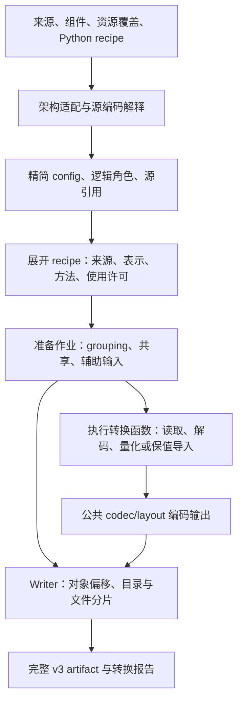

# 权重转换与 v3 Writer

> 状态：目标实现设计，尚未实现。本文落实已确认的 converter 重写方案。
> 当前工具继续使用现行转换路径；本文中的 Python 名称和代码片段是目标接口草案。

Converter 从选定来源、组件和 Python recipe 生成完整 v3 artifact。它负责正确解释源数据、
生成合法的目标表示，并建立模型合同要求的配置、逻辑绑定、使用输入和资源关联。
实际引擎是否具有相应 Op 入口，由真实消费者处理。

目标格式由 NInfer 的 codec/layout 合同定义，生产这些格式的方法由内置或用户函数提供。
相同架构/config 更换训练权重或调整已有表示组合时，变化落在输入、recipe 和转换方法中。
官方方案与用户方案共用源访问、转换作业、编码输出和 writer。

## 1. 所有权与整体流程

| 内容 | 所有者 |
|---|---|
| 固定数学、精简 config、逻辑角色、shape、训练共享与组件关联 | [模型公共合同](model-contracts.md)及对应架构定义 |
| 源名称、轴、分片、源量化配置与编码解释 | 架构源适配与源编码解释函数 |
| 目标来源、format/layout、方法、grouping、使用许可 | Recipe |
| 统计、校准、数值转换及保值导入 | 转换方法 |
| Codes/scales 数值规则、packing、planes、对象内部 padding | [数值格式](tensor-formats.md)与[存储布局](storage-layouts.md)的公共工具 |
| 对象位置、目录、framing、文件分片、字节写入 | Writer；持久字段以 [v3 规范](artifact-container.md)为准 |
| 对象上传、Op 原生参数、实际执行和状态资源 | 加载、模型实现与 Program |



这些职责用普通 Python 模块、函数和小的数据记录组织。架构源适配按配置展开逻辑需求，
recipe 给出具体转换选择，作业按明确的准备与生成顺序执行。

## 2. 转换输入、组件与资源

### 2.1 一次转换的输入

| 输入 | 含义 |
|---|---|
| 主来源 | 提供架构和实例 config；可以是原始权重，也可以是量化来源 |
| 其他具名来源 | 原始 BF16、其他量化结果、spec 私有权重、辅助统计等实际输入 |
| 产物组件 | 必需 Text，以及显式选择写入的 Vision/MTP/DFlash/DFlash2 等组件 |
| Recipe | 内置 Python 函数或用户文件中的函数，以及显式方法参数 |
| 资源覆盖 | 指定组件、资源角色与替换文件，例如 Text 的 chat_template.jinja |
| 输出 | 入口文件路径；分片上限默认采用 v3 的 32 GB 规则 |
| 执行设置 | 转换设备、分块或内存设置；供实际转换方法消费 |

入口选择内置 recipe，或显式加载用户 Python 文件中的配置函数。自定义方法通过普通 import
交给 recipe。内置名称用于选择转换方案和记录 provenance；产物中的执行事实仍按 v3 展开。

主来源提供模型数学/config 的有效依据。各参数的数值来源则由 recipe 明确选择。例如 embedding
来自 base、MLP 来自 quantized、DFlash2 私有参数来自 draft。量化来源已提供所需全部数据时，
转换直接使用它；额外 BF16 来源仅由实际选择的方法和角色产生需求。

多个来源按相关架构/config 和逻辑 shape 检查结构关系。用户选择的训练来源与组件配对记录在
转换报告中。源参数读取遵循明确的来源分配，同形状的另一来源不会成为隐式补齐依据。
只提供 tensor 的附加来源按逻辑映射和几何核对；实际带有模型 config 的来源再核对相关数学事实。

### 2.2 组件选择与逻辑需求

产物可以提供多个 spec 组件；Engine 启动时选择其中 none 或一个，是运行阶段的独立选择。
Converter 对本次声明提供的全部组件生成完整数据。未选择写入的组件，其私有 config、源权重
和资源不进入转换需求。各角色及 target 关系遵循[组件合同](model-contracts.md#4-组件与数学输入)。

需求由架构直接代码按精简配置展开，包括训练参数、必需语义表、使用位置和资源角色。
例如 source adapter 把 DFlash2 的一个源 K 参数映射到 key 与 context_key 两个逻辑角色，
这两个角色随后可以独立选择表示，也可以显式共享同一 parent 区域。

共享源参数只表示训练关系。物理共享由最终绑定决定，训练参数计数按独立来源关系去重。

### 2.3 Frontend 资源的选择与检查

资源按组件和角色处理：先由源适配确定默认资源位置，再应用用户的显式文件覆盖，最后读取
选中的文件。实际读入与检查只针对最终文件。覆盖先于资源依赖的语义表生成、token 域解析
和相关验证。

新 converter 移除固定官方 SHA256、固定官方文件内容及不随组件选择变化的完整资源清单要求。
资源的内容依据是用户最终选择的文件；验证复制正确性时，也以这份文件为依据。

保留与实际消费直接相关的检查：

- 需要解析的 JSON、文本编码和资源引用有效。
- 完整 tokenizer 资源能够解释所需 token 域，相关 ID 与 embedding/output 行域匹配。
- 提供 Vision 时，所需 processor 参数与模型输入几何一致。
- 依赖资源生成的持久语义数据，与最终资源的解释一致。

Chat template 作为选定的资源保存，运行时保持[现有 Frontend 行为](model-runtime.md#62-frontend-资源和模板范围)。
普通模板替换不增加权重转换需求。若某种校准方法使用渲染后的提示，它显式消费
本次选定的资源，并把实际校准输入记入自己的来源说明。

资源字节按其消费者已经定义的语义使用。generation_config 中的采样数值继续原样保存，
本次模式默认值遵循[运行时合同](model-runtime.md#63-默认值名称和其他身份)。

资源可以和权重对象放在同一文件中。所选组件的资源引用、私有对象与共享对象分别按实际需求
组织，writer 处理它们的字节位置。

## 3. 源访问与逻辑映射

### 3.1 文件、源编码与架构映射

文件读取提供 tensor 目录、shape、dtype、文件定位和所需区域。现有 safetensors 的单文件和
索引分片都接入这一层；增加其他来源时提供对应的读取函数。

源编码解释按实际量化配置与数据字段取得 codes、scales、group、packing、对象级数值和辅助
输入。它对本次被使用的数据建立确切解释，读取所需字段并检查数值和几何关系。
源 config 中 group 的名称、成员排列和其他未使用 tensor 的分配，不构成完整产物身份。

架构适配解释源数学、提取精简 config，并映射角色和轴。例如 Qwen 的 q_proj 内 Q/gate 行序、
GDN 卷积轴和 expert 编号由对应适配代码处理。目标实例字段沿用架构合同；source quantization
信息用于解释来源，目标表示由 recipe 决定。

如果源方法还要求输入缩放、置换或其他数值变换，源适配必须把这些关系落实到已支持的逻辑
数据、表示或使用输入合同中。需要新数学或新转换能力的部分在对应实现中补齐。

### 3.2 逻辑源引用

逻辑源引用保存来源句柄、tensor/区域、源表示与轴映射。它描述如何取得一个角色的输入，
不持有完整模型的浮点副本。共享角色可以引用同一个源数据区域。

源映射可以先建立惰性引用。Recipe 完成来源覆盖后，再对最终选中的引用展开文件、tensor
和访问能力需求；被覆盖的默认来源无需提供那些数据。

| 源访问 | 结果及用途 |
|---|---|
| Describe | 取得逻辑 shape、源编码、轴关系和方法所需的 metadata |
| Read values | 按源数值合同解码指定区域，供数值转换使用 |
| Read encoded | 提供带完整解释的 codes/scales、范围及对象级数值，供保值导入使用 |

Read encoded 保留实际源 parent 和编码块关系。源切片跨越编码块时，由源解释器提供完整所需
编码单元及其逻辑映射。Read values 则按约定中间精度交付数值，方法可以明确选择 BF16、
FP32 等实际需要的边界。

新增来源可以只实现当前方法需要的访问能力。例如一个自定义来源先提供数值读取，就能复用
已有量化方法；增加精确编码访问后，可进一步提供保值导入。

### 3.3 读取粒度与源生命周期

先读 metadata 和必要的小量数值，随后按作业读取区域。源引用可以描述整张矩阵，真正访问
时仍按行块、编码组或方法所需的区域读取。共享读取可在一个有界作业组内复用。

文件句柄由读取上下文管理；数值块、编码块和设备临时数据在完成对应输出后释放。内置方法
应按自己的数值归约域提供分块方案。用户方法也可一次处理较小 tensor，或声明其需要的
额外工作内存、重读和临时存储。

## 4. Recipe 的表达与确定规则

### 4.1 以逻辑角色指定转换

Recipe 接收架构解释后的只读模型事实、可选来源与配置构建工具。普通函数、循环和条件负责
选择逻辑角色。默认 recipe 提供完整分配，用户可复用后覆盖局部选择。

一次分配可以指定来源、目标 format/layout、转换方法和方法参数。使用许可与辅助输入策略
关联到模型合同定义的 `(parameter,input)`。绑定名字来自逻辑目录，对象 ID 和 Part 范围由
转换准备按最终组织生成。

以下片段展示 Qwen Dense 默认方案上的格式覆盖：

```python
def configure(model, recipe, sources):
    configure_defaults(model, recipe, sources)

    for i in model.attention_layer_ids:
        p = f"text/layers/{i}/attention"
        recipe.assign(
            [f"{p}/query", f"{p}/key"],
            format="q4_g64_fp16",
            method=grouped_absmax,
        )
        recipe.assign(
            [f"{p}/gate", f"{p}/value"],
            format="q5_g64_fp16",
            method=grouped_absmax,
        )

    recipe.assign(
        "text/output_head",
        source=sources["vendor"],
        format="q4_g64_fp16",
        method=prepare_vendor_q4,
    )
```

grouped_absmax 是已有分组整数算法的目标方法名；它接受相应 format 的确定参数。
方法与目标格式共同构成数值选择。只覆盖 format 时保留已经选择的方法，并检查两者兼容；
需要更换数值行为时同时指定 method。内置 helper 可以一次完成这组分配。

### 4.2 覆盖、范围和完整性

规则按显式书写顺序展开；后续分配覆盖选中区域的对应设置。未覆盖的设置保留已有值，最终
形成唯一的来源、表示和方法选择。必要角色应完整覆盖，最终 Binding 的覆盖与 shape 按
[v3 绑定规则](artifact-container.md#7-逻辑参数绑定)检查。

选择范围包括整个逻辑参数、层、expert，以及工具支持的明确子区域。范围变换保持逻辑轴、
行顺序和训练共享关系；物理变换由实际方法实现。子区域的最终 parent 几何须满足 codec/layout。

选择器匹配为空、区域越界、必要角色缺失或最终绑定冲突时，报告对应规则及角色。需要按实例
条件执行的规则由 Python 条件表达。已经展开的结果可以展示为角色、来源、方法、表示、
使用许可和对象 grouping，便于检查实际选择。

### 4.3 默认 packing 在覆盖后执行

先完成角色的来源、格式和方法覆盖，再执行默认 packing 函数。默认函数根据最终选择，
使用方法已经实现的组合操作构造 parent；已编码来源所需的 divisor 等小量信息在此时取得。

例如默认 Qwen attention packing 可尝试按 Q/K 与 gate/V 的实际选择形成两个 parent，
或按相容的表示形成一个 parent。无法保值合并的默认候选保留为独立对象。实际调用是否接受
这些对象，随后由对应 Op 处理。

默认合并需满足以下事实：逻辑轴与目标行序明确，数值格式及对象级编码数值相容，方法具备
该组合能力，且对象合并符合功能依赖。对应判断是普通转换代码中的有限写法。

用户可显式指定 grouping、行顺序和共享。显式 grouping 是必须满足的输出要求；无法生产
时直接报告失败。显式分组先占用其逻辑区域，默认 packing 处理其余区域。

普通自定义方法默认准备独立输出。复用标准转换适配器的方法可以使用适配器已有的组合操作；
自定义多输入融合由 recipe 明确指定分组和对应方法，准备请求同时携带这些输入。

### 4.4 物理共享与可选功能

真正共享的表示通过同一个对象和区域绑定，生成一次、写入一次。共享训练来源而独立转换的
角色分别生成结果。来源相同、shape 相同本身不足以建立物理 alias。

完整 parent 是物化单位。Text、独立启用组件的私有数据，以及独立选择的 proposal 表示的
私有数据按 [v3 对象边界](artifact-container.md#53-对象范围与共享)分别组织。共享 embedding/head
或 proposal 引用现有 head 表示继续使用实际共享引用。

DFlash/DFlash2 的 key/value 与 context_key/context_value 始终具有各自 Binding 与 Use，
共享 parent 时也保留这些逻辑角色。生成训练参数统计时，共享来源只计一次。

## 5. 转换方法与用户函数

### 5.1 方法的数值意图

| 方法行为 | 责任 |
|---|---|
| 保值导入 | 保持声明的源 words 或表示值，完成所需的轴、行序和存储变换 |
| 从浮点值量化 | 按选定算法生成新的 codes/scales |
| 解码后重新量化 | 按源合同解码，再按目标方法生成新表示 |
| 直接数值转换 | 完成明确的 dtype cast、语义表或辅助数值生成 |

兼容的已量化来源默认优先保值导入。重新量化由 recipe 选择对应方法；同格式重新计算 scales
也属于新的量化结果。不同方法可以写出同一个目标 format，方法名称和参数记录在 provenance。

保值导入说明具体保持什么。移动 words 到新布局时，可保持 codes/scales words；某些明确的
精确数值变换保持表示值，但内部 words 改变。方法及验证按这一实际承诺组织。

### 5.2 准备请求与生成结果

方法入口采用 `prepare(request)`，返回已准备作业及其 `produce(output)` 生成函数。
简单方法只需封装生成函数，统计、校准或数据依赖较多的方法在准备阶段完成必要工作。

| 准备请求提供什么 | 用途 |
|---|---|
| 输入角色、逻辑区域及源引用 | 取得数学对应明确的实际来源 |
| 目标 format/layout、parent 几何与行映射 | 确定要生成的结果及编码范围 |
| 方法参数和各 Use 的要求 | 确定数值算法、许可及辅助输入关系 |
| 读取、encoder、layout 输出工具 | 复用公共能力 |
| 设备、分块与作业上下文 | 管理实际计算、缓冲和临时数据 |

准备作业声明主要结果、需要生成的辅助结果、生成函数及其清理责任。辅助结果须对应已知
用途或 codec 的要求，例如某个 Use 的 FP32 scalar。对象句柄由构建工具统一分配，方法
通过句柄交付结果，绑定由准备流程统一生成。

影响 grouping、输出数量或 shape 的事实须在目录确定前落实。改变候选 grouping 时，由
准备流程重新组织受影响的作业，再固定最终描述。目录确定后，生成函数按已声明的范围写入。

对象级 divisor 或校准值若只影响固定大小 payload 的内容，可以在方法规定的阶段计算；
其准备依赖和数值归约范围仍须明确。需要全矩阵统计的算法可以先统计，再流式生成。

### 5.3 三种输出方式

生成函数使用统一输出工具，选择适合自己的接口：

| 输出方式 | 行为 |
|---|---|
| 数值区域 | 调用明确选定的 encoder，再交给 layout 输出 |
| 编码单元 | 提交符合目标 codec 的 codes/scales 及对象级数值，由 layout 计算字节位置 |
| 已编码字节区间 | 在已知格式与布局下提交对象内范围，供保值复制等方法使用 |

编码单元接口保留实际 parent 几何。Layout 工具处理 swizzle、plane 地址、字节序和内部
padding；块的行/组边界按该布局要求组织。用户方法可以复用这些工具而专注于来源和数值算法。
提交已编码字节的函数负责履行相同的 codec/layout 合同，并可复用目标解码与验证工具；
writer 检查其声明的字节范围与完整性。

Weight divisor 随其权重对象生成。Activation divisor 通过对应 Use 的辅助输出句柄生成；
多个 Use 可以显式引用同一个 scalar，也可以分别生成。其 shape、类型和数值约束来自用途合同。

### 5.4 自定义来源到内部 Q4 的示例

假设用户来源采用 unsigned INT4、G128、逐组 zero point 和 FP32 multiplier，源矩阵 K 可被
128 整除。其解码为 `value=(code-zero_point)*scale`。目标选择 q4_g64_fp16，调用已有分组
量化方法即可。下面省略自定义文件格式本身的解析，展示公开接入点：

```python
def prepare_vendor_q4(request):
    info = read_vendor_metadata(request.source)
    request.require_input_shape(info.logical_shape)

    def produce(output):
        with open_vendor(request.source) as reader:
            for begin, codes, zero_points, scales in reader.iter_groups():
                # codes: [rows, K/128, 128]
                # zero_points/scales: [rows, K/128]
                values = (
                    codes.to(torch.float32)
                    - zero_points.to(torch.float32)[..., None]
                ) * scales.to(torch.float32)[..., None]
                values = values.reshape(values.shape[0], info.logical_shape[1])
                encoded = quantize_matrix(
                    values,
                    request.target.format,
                    device=request.device,
                )
                output.weight.write_codes(begin, encoded.codes, encoded.scales)

    return request.job(produce=produce)
```

该方法消费一个输入；多输入请求用有序输入集合描述。Source metadata、zero point、scale
及文件范围的解释属于用户读取函数，公共输出检查目标编码。这里 quantize_matrix 表示新接口
下复用的分组量化算法，其 format 参数使用 v3 名称。

若用户已经能够直接生成正确的目标 codes/scales，可直接提交编码单元。若只需增加字段命名
或轴映射，则通过源适配复用整条既有转换方法。官方函数采用相同请求、输出与作业生命周期。

### 5.5 准备与生成的生命周期

准备结果包含小量 metadata、标量、必要统计或临时数据引用。大规模准备结果使用方法管理的
临时存储，生成函数按需读取；普通方法不保留整模型副本。

读取上下文拥有文件句柄，作业上下文拥有临时 host/device 数据。数值块在其编码和写入完成后
可以复用。方法抛出错误时，协调器补充组件、角色、方法和来源位置，关闭上下文并清理本次临时数据。

## 6. 数值边界与校准

### 6.1 分块保持算法的数值含义

方法声明源解码精度、统计域、scale 舍入、code 选择和必要 cast 边界。I/O 块大小与数值算法
分别处理。逐行或逐组方法可以按独立单元分块；全矩阵归约先取得规定统计，再生成各块。

布局 padding 按 codec/layout 定义产生。逻辑行域中的有值保留行、expert 编号和 token 映射
继续具有模型含义，不能在量化或分块时当作物理 padding 处理。

### 6.2 许可、校准与持久辅助输入

使用许可采用模型合同中的 A16Only、AllowA8、AllowA4；AllowA4 的允许集合包含 A16/A8/A4。
许可约束可用计算精度，具体校准输入由方法与用途合同确定。

只依赖权重的方法直接取得权重；需要激活统计的方法显式读取适用的来源统计、用户提供的
结果或已接入校准流程的输出。缺少方法的必要输入时，准备失败并指出缺少的使用位置或数据。

校准结果关联到具体逻辑角色和数学输入。Query/context、不同 norm 后输入等位置分别解释。
同 shape 或同一训练权重不会自动建立校准共享；recipe 可以明确选择沿用或重新生成相关值。

执行所需结果写入 v3 对象和 Use。样本选择、算法参数、来源与质量测量作为 provenance/报告，
按 [v3 使用输入](artifact-container.md#8-使用许可与辅助输入)保持单一数值权威。

### 6.3 NVFP4 合并的两类条件

现有 NVFP4 对象的权重解释是 `code_value * block_scale / weight_divisor`，完整对象含一个
weight divisor。Gate 与 up 的 weight divisor 不同时，直接连接原 codes/scales 并只保留一个
divisor 会改变表示值。可选择保留两个对象、使用已实现且验证过的精确保值变换，或显式重新量化。

默认保值 packing 在无法合并时保留独立对象；显式要求单 parent 且没有相应转换方法时失败。
这些限制来自所选表示与 producer 的实际能力。

Weight divisor 相容而 activation divisor 不同时，权重仍可合并为一个 parent，激活辅助值
分别绑定到各自 Use。某个融合 Op 是否能消费这组 Use，由其实际参数准备和执行决定。

## 7. 准备、布局与生成的协调

### 7.1 六个阶段

| 阶段 | 完成的结果 |
|---|---|
| 解析 | 选定组件、精简 config、最终资源、逻辑目录与初始源引用 |
| 配置 | 按顺序展开 recipe，确定各角色的来源、目标表示、方法和使用选择 |
| 准备 | 完成默认/显式 grouping、方法准备、必要统计及数据依赖，取得最终对象和绑定说明 |
| 布局 | 根据 encoded size 安排对象位置、JSON 空间和 files 表，固定写入描述 |
| 生成 | 调用 produce，分块读取与编码，通过 writer 写入各对象 |
| 完成 | 核对全部输出、文件长度和转换结果，交付产物与报告，释放临时资源 |

准备可能读取实际数据，例如融合要求的 weight divisor、shortlist IDs 或方法所需的全局
统计。因此它是实际转换的一部分。可以先展示已解析的选择和尚需完成的准备工作；展示这些
内容不构成对尚未执行作业的数值或执行资格判断。

准备到布局的交接包含：组件记录、确定的对象几何及 codec/layout、Binding、Use、资源引用、
已知 provenance，以及生成每份数据的已准备作业。Writer 返回带 offset/bytes/files 的最终
写入描述。JSON 成员的实际编码以 v3 为准。

确定目录后，shape、对象数量、绑定和文件分段保持稳定。值相关的目录事实在此前完成，固定
大小的 payload 数值可以由已准备方法随后生成。耗时、峰值内存和执行后的检查结果进入报告。

### 7.2 作业依赖与有界执行

初始实现采用单个协调器与有界作业组，按确定的顺序调度读取、转换和写入。共享来源可在局部
作业组内复用读取；大对象通过区域接口处理，host/device 缓冲在完成一批后复用。

全局统计、校准、语义表、proposal token IDs 等真实依赖直接由准备代码安排。例如 shortlist
先确定行映射，再生成 head；使用共同 divisor 的重新量化先确定这个数值，再编码各投影。
跨阶段保留的数据放在作业拥有的统计、缓冲或临时文件中。

方法的分块与工作内存要求交给实际执行设置。某方法需要超过可用资源的临时数据时，由该方法
准备或执行报告资源错误。GPU 编码结果通过有界 host 缓冲交给文件 writer；字节写入完成后，
生产者可以释放或复用相应缓冲。

## 8. Writer 实现合同

### 8.1 轻量文件核心与数值工具

Writer 的 framing、JSON/引用结构、范围映射、长度检查和文件操作使用标准库。
Codec/layout 的描述、几何和 encoded-size 计算也保留为可独立导入的轻量能力。
PyTorch、NumPy、设备计算和具体 encoder 由数值转换模块按需使用。

普通对象输出通过 codec/layout 工具连接 writer。Writer 验证目录和写入范围，encoder/layout
负责 codes/scales、字节解释和内部 padding。架构的角色完整性、组件关系与功能合并边界由
converter 在布局前检查。

### 8.2 目录与文件布局

Writer 接收确定的对象描述，取得各对象 encoded size，安排逻辑 payload 中的对齐和顺序。
随后按 [v3 framing](artifact-container.md#3-二进制-framing)计算 JSON 空间与 files 表。
预留不足时，在 payload 写入前扩大空间并重新计算，固定目录后开始接收生成结果。

默认文件上限为 32,000,000,000 字节，计入 header、JSON、对齐区与 payload。
入口加完整 payload 的文件大小不超过上限时只生成入口；其余规则按
[v3 文件集合](artifact-container.md#2-文件集合与地址空间)执行。
Writer 从入口完整文件名生成 `.part-0001` 起的续卷后缀，不足四位补零至四位，四位以上完整
输出。续卷名自动写入 files 表。Reader 继续按记录的文件名定位，不校验该生成命名模式。

每个输出对象在逻辑 payload 中有完整区间，分片可以穿过对象和 plane。File header、JSON
及文件对齐区属于 framing，编码对象内部偏移始终按完整 parent 计算。

### 8.3 对象内区间写入

文件核心提供以下概念操作：

```text
write_region(object, relative_offset, bytes)
```

对象句柄对应布局阶段确定的完整 parent。对于长度 L 的写入：

```text
logical_begin = object.offset + relative_offset
logical_end   = logical_begin + L
```

写入须处于对象的声明区间内。Writer 将逻辑区间与 files 的 payload 区间求交，按 v3 的范围
映射公式写入相应文件。一次调用可以跨文件，逻辑字节顺序和 parent 内容保持一致。

接口可以由 seek/write 或定位写入实现。Writer 接收 host 字节；一次同步写入返回时已消费
该字节缓冲。后续如果引入异步重叠，需要由具体接口明确缓冲释放时机。

普通方法优先通过编码单元工具调用此接口。工具已知整个对象几何，可以同时接收一个行块的
codes/high bits/scales，再分别写入对应 planes。完整的小 tensor 也可以一次性写入。

例如 q5_g64_fp16 / row_split_k128_v1 的 `[2,130]` 对象，K_pad=256，总长为 528 字节。
每行生成结果对应以下对象内区间：

| 数据 | 第 0 行 | 第 1 行 |
|---|---|---|
| Base plane | `[0,128)` | `[128,256)` |
| High-bit plane | `[256,288)` | `[288,320)` |
| Scale plane | `[512,520)` | `[520,528)` |

`[320,512)` 是 layout 定义的零 padding。第 0 行生成后即可写出它的三个区间，再处理第 1 行。
这个组织保持最终编码，并把分块大小与 plane 排列分开。

### 8.4 覆盖、padding 与完成

Writer 跟踪对象的已写范围，拒绝越界和重复覆盖；finish 时检查全部声明字节已被提供。
完整的零区间也作为明确的写入/初始化范围计入覆盖，文件长度本身不代表数据已完成。
规则写入可用合并区间或 plane 游标维护覆盖，避免按每个字节记录状态。

Layout 工具负责对象内部 padding，writer 负责普通输出的对象间对齐区和文件 framing 对齐区。
常规产物在最后对象结束处截断。对象输出失败时关闭句柄并清理本次临时文件，完成检查通过后
交付正式文件集合及报告。输出路径冲突由转换入口在生成前处理。

布局与范围写入核心也提供逻辑 payload 区间复制，供第 11 节离线升级使用。这个入口保留已有
对象偏移及间隙，按原字节复制完整 payload；普通对象生成仍使用对象范围接口。

## 9. 错误、报告与验证

### 9.1 错误归属

| 情况 | 处理位置 |
|---|---|
| 源数学不符合所选架构、精简 config 关系错误 | 架构源适配 |
| 所选角色所需源数据缺失或编码无法解释 | 源读取与源编码解释 |
| Recipe 空匹配、覆盖缺失、方法与目标不兼容 | Recipe 展开与准备 |
| 显式 grouping 无法生产、校准或必要统计缺失 | 实际方法准备 |
| 目标 codec/layout 或 parent 几何不成立 | 公共格式工具与准备 |
| 生成数值、编码 words、padding 不符合方法/格式合同 | 对应方法、codec/layout 与转换验证 |
| 文件写入越界、重复、缺失或实际长度错误 | Writer |
| 合法表示组合缺少实际 Op、状态或资源能力 | 引擎的真实消费者 |

错误提供组件、逻辑角色或使用位置、方法、来源 tensor/区域以及实际失败原因。
声明完整且可正确编码的组合可以生成，即使当前 Op 还没有相应入口。
Converter 的检查不依赖完整的 runtime 支持表或引擎 warmup。

### 9.2 转换报告

报告记录实际发生的转换：

- 架构/config 摘要、所声明组件、资源与具名来源的选择。
- 展开的数值方法、参数、目标表示及保值/重新量化行为。
- 对象、格式、共享和文件大小统计，以及实际方法的环境信息。
- 完成的结构或数值验证、耗时与有解释价值的资源使用。

执行所需事实全部写入 v3 的 config、对象、Binding、Use 和资源。报告提供诊断与复现资料；
recipe 文件本身和方法名称不会成为引擎解释权重的前提。

### 9.3 方法与全链路证据

| 变化 | 所需证据 |
|---|---|
| 源映射、行重排、reshape、拆分与保值导入 | 独立源解释与目标解码，核对正确的角色和元素对应 |
| 既有 codec/layout 的重新组织 | 精确 words、planes、padding 和 encoded-size 检查 |
| 新量化或重新量化方法 | 按目标存储的 scales 独立解码，与指定数值来源比较，采用方法定义的标准 |
| 使用辅助输入 | 核对作用位置、数值合同、共享或独立引用关系 |
| Writer | 真实小文件上的跨 plane/跨文件写入、覆盖与长度检查、reader 往返读取 |
| 官方 recipe | 转换正确性，加对应产物实际执行与质量证据 |

用户方法复用结构检查、目标解码和误差测量工具，方法作者定义自己的数值质量标准。
相同 shape 的 Q/gate 交换无法仅由尺寸发现，因此源映射验证需要独立的索引或数值对应。

分块验证应改变实际 I/O 块大小，确认它保持方法声明的归约与舍入边界。Exact 变换进行精确
比较，有明确浮点误差的算法使用相应标准。32 GB 分片边界可用小文件重现范围行为，并用
尺寸计算验证生产默认上限。

文档中的接口和例子为实现依据；实际验证结果由对应方法与 reader/writer 实施时建立。

## 10. 首批内置方法与现有能力复用

### 10.1 首批覆盖

| 能力 | 目标范围 |
|---|---|
| 直接数值数据 | BF16 及必要 FP32/I32 的读取、明确 cast 与目标编码 |
| 分组整数量化 | 复用 Q4/Q5/Q6/Q8 的已有算法，目标使用 v3 的精确格式名称 |
| 逐行 FP8 | 复用现有逐行 FP8 算法，明确接受的源数值边界 |
| 已量化 FP8/NVFP4 | 当前来源的保值导入、轴/布局变换和按源合同解码 |
| 架构源适配 | 当前 Qwen3.5 Dense/MoE 及已有 Vision/MTP/DFlash/DFlash2 组合，按所选功能展开 |
| 其他持久输入 | 现有 proposal/shortlist、token 映射、codec 与 Use 辅助数值 |
| 自定义方法 | 源映射、数值/编码读取、自定义转换及多输入方法接入 |
| 文件输出 | 完整 v3 writer、资源承载、单文件与分片输出 |

BF16 新生成 NVFP4 及所需校准作为独立数值能力。首批先保证现有 NVFP4 来源的导入与解码，
并允许用户函数接入新的生成方法。内置完整 BF16→NVFP4 量化与校准算法需单独实现和验证。

新增来源或算法通常扩展 Python 转换方法，继续输出既有目标格式。新增实际 codec/layout
时，补充相应数值/字节定义、生产和消费能力。引擎实际支持不足按第 9.1 节处理。

### 10.2 按职责复用现有代码

目标入口、源适配组织、recipe、作业协调和 writer 接口重新编写。复用以具体算法及其验证
证据为单位，接口与持久名称遵循目标合同。

| 已有能力 | 复用内容 |
|---|---|
| [数值描述](../../tools/artifact/numeric.py)、[布局工具](../../tools/artifact/layouts.py) | 数值与字节规则，整理轻量几何、编码单元和区域输出 |
| [分组量化](../../tools/convert/common/quantize.py) | 既有 scale 舍入、code 选择、padding 规则与数值证据 |
| [Safetensors 读取](../../tools/convert/common/safetensors.py) | 单文件/索引分片的延迟读取基础，完善区域访问 |
| [逐行 FP8 算法](../../tools/convert/qwen3_8_27b/fp8_embedding.py) | 既有数值算法及流式处理经验，按接受的源数值边界复用 |
| [FP8/NVFP4 来源处理](../../tools/convert/qwen3_8_27b/recipe_nvfp4.py) | Codes/scales 提取、逻辑行映射与保值条件 |
| [源表达工具](../../tools/convert/qwen3_6/common/recipe.py) | 已核对的轴变换、切片、concat 和 source 对应，按架构/config 参数化 |

按 checkpoint 组织的顶层转换程序、固定完整 inventory、固定 Frontend 哈希和整套量化分配
约束不进入新组织。官方方案保留为使用公共能力的默认 recipe、适配与方法集合。

## 11. V2 一次性离线升级

升级按 [v3 的离线输入合同](artifact-container.md#a3-一次性升级)执行，使用标准库脚本及附带的
已知元数据。它与常规数值转换分别调用轻量 framing、几何与范围复制能力。

脚本从 v2 identity 与实际对象目录选择适用的已知映射，补齐精简 config、实际存在的组件、
逻辑绑定、Use、资源关联和 v3 持久名称。现有 K/V 区域可以同时建立 key/context_key 等
逻辑绑定，已有 scalar 直接建立对应辅助引用。

原对象 shape、数值格式含义、layout 解释、对象相对 offset 与每个 payload byte 保持。
整个旧 payload 连同间隙按原字节复制，重新生成入口目录、文件 header、files 表与 artifact_id。
需要分片时由相同逻辑范围映射继续复制。旧 Frontend 资源字节也按原样保留。

升级依赖已知映射和本地 v2 文件，运行时最终仅接受 v3。验证包括 metadata 映射、源与目标
逻辑 payload 的精确比较、必要视图/scalar 对应，以及新 reader 的读取结果。

Frontend 行为也按原样资源核对。例如旧 generation_config 中的 temperature=1.0、top_p=0.95
不覆盖 NonThinking 的既有 0.7/0.80 preset；升级后 EOS 解析和两套模式默认值遵循同一
[运行时规则](model-runtime.md#63-默认值名称和其他身份)，无需改写资源字节或增加兼容标记。

## 12. 全链路例子

### 12.1 BF16 来源、混合 attention 与自定义模板

选择 Qwen Dense Text，沿用默认 recipe，覆盖某 attention 层为 Q/K 使用 q4_g64_fp16、
gate/V 使用 q5_g64_fp16，方法均为已有 grouped_absmax，同时提供新的 chat_template.jinja。

1. 源适配从标准 config 取得实例维度，从 q_proj 的交错行得到 query/gate 逻辑源引用。
2. 最终模板覆盖源默认资源；所选 Text 资源通过必要解析，实际字节进入资源对象。
3. Recipe 展开后，默认 packing 按最终表示形成 Q/K 与 gate/V 两个 parent。
4. 两个方法分块生成 codes/scales，layout 工具安排各自 planes，writer 写入对象区间。
5. Writer 序列化已准备的 config、四个逻辑 Binding、相应 Use 和资源引用，小产物保持单文件。
6. 产物交给加载；Frontend 资源符合当前消费者合同时，可继续由实际 Op 消费这两个 parent。
   尚未支持的模板仍可以被保存，运行时按现有 Frontend 行为处理；转换完成的含义按第 9 节解释。

对于现有 H=5120、Q=6144、K=1024，两份 parent 均为 `[7168,5120]`，完整编码分别为
19,496,960 与 24,084,480 字节。具体逻辑 ranges 见 [v3 attention 例子](artifact-container.md#123-attention-单-parent-与双-parent)。

### 12.2 已有 FP8/NVFP4 混合来源

主来源已经包含 FP8、NVFP4 和直接存储参数，recipe 选择保值导入，并明确从另一 BF16 来源
取得需要独立生成的 embedding。Source adapter 按角色解析实际字段和源编码。

FP8 的 codes 与 row scales 同步选行、重排和连接；NVFP4 保留相应 codes、block scales 与
weight divisor。Use 关联实际的 activation divisor。默认 packing 对相容对象合并，对无法
保值合并的候选保留独立 parent。

准备后，目录保存最终混合格式与完整绑定。不同来源的物理文件组织在读取侧消解，writer
按自己的文件布局输出。产物沿用同一模型数学/config，数值转换行为及来源在报告中展开。

### 12.3 用户来源转成内部 Q4

用户来源的 output head 采用第 5.4 节的 G128 INT4。用户 recipe 沿用默认分配，仅把
text/output_head 的来源和方法替换为自定义函数。

准备核对 `[R,H]` 逻辑输入和目标几何，建立 q4_g64_fp16 对象及 text/output_head 的 Binding。
生成函数分块执行源解码与目标 Q4 量化，再提交 codes/scales；公共工具编码，writer 按目录写入。
其余权重继续使用默认方法。新来源的读取和转换函数成为唯一新增的来源能力。

### 12.4 DFlash2 的两组 K/V 表示

产物声明 Text 与 DFlash2。Query 的 Q/K/V 选择 q8_g32_fp16，context_key/context_value
选择从同一 BF16 训练来源保留的 BF16 表示。它们具有不同 Binding 与 Use，训练来源保持共享。

Converter 生成 query parent 和独立的 context 参数对象，按 DFlash2 私有依赖组织。
固定 query 路径取得 key/value，context 路径取得 context_key/context_value。某个当前 Op
入口若不能消费该表示，实际调用报告支持不足，数据仍具有完整解释。

若 recipe 改为共享相同编码表示，两组 Binding 引用同一 parent 区域，只生成一次该数据。
关闭 DFlash2 的引擎启动只收集 Text 及其必要共享依赖；DFlash2 私有对象保持未驻留。

### 12.5 大对象与分片

一个 embedding parent 跨文件时，数值方法继续按其完整 `[R,H]` 几何处理行块。
Layout 工具计算 codes/scales 的对象内偏移，writer 把每个字节区间映射到入口或续卷。
跨文件发生在普通范围写入中，源分片、生成块和目标文件边界分别处理。

可使用 [v3 分片示例](examples/artifact-v3-mixed-sharded.json)的显式小文件上限重现这条路径。
换回默认 32 GB 上限时只改变文件放置；对象的编码、Binding 和 Use 保持相同含义。

## 13. 交给后续模块的结果

本文交付 converter 和 writer 的目标实现合同：统一输入、源访问、Python recipe、准备/生成
方法、对象与使用关系、数值边界、流式写入、错误和证据。

加载模块接收按 v3 完整展开的 config、对象、Binding、Use 和资源，解释稳定驻留及原生
Op 参数。模型运行时与 Program 接收这些实际绑定，组织既定计算、状态和资源。
Frontend 按[运行时合同](model-runtime.md#6-engine-与-frontend-接入)接入资源，保留现有模板、
采样模式与公开输入输出行为。

文档中的源位置用于说明可复用能力；当前工具切换、新数值方法和运行资格分别在实施任务中
建立相应结果。现有产品说明与命令文档在实现完成后统一整理。
