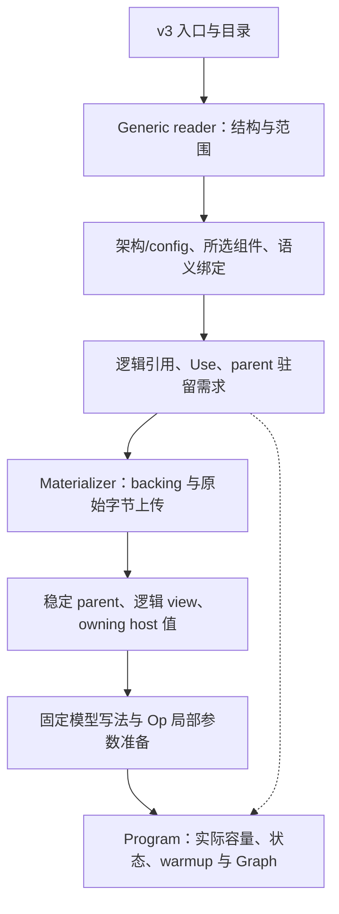

# 权重加载、语义绑定与 Op 参数准备

> 状态：目标实现设计，尚未实现。本文承接模型合同、v3 容器规范和 converter 设计。
> C++ 片段用于说明目标接口和调用关系；当前实现位置用于核对已有能力。

加载把 v3 中的实例事实与实际权重对应到固定模型代码，交付稳定的只读模型实例。
这个实例拥有配置、所选组件关系、必要的 host/device 数据、逻辑引用、使用输入和可以提前
准备的原生参数。Program 据此组织实际执行、可变状态、workspace 和 CUDA Graph。

同一数学/config 的不同训练权重或已有表示组合沿用这条加载路径。实际格式、parent grouping
和 Use 决定交给 Op 的参数；架构代码继续拥有公式、阶段和跨 Op 调用顺序。

## 1. 三种绑定与所有权

### 1.1 从逻辑对应到原生参数

| 工作 | 输入 | 结果 |
|---|---|---|
| 语义绑定 | 架构/config、所选功能、v3 Binding 与 Use | 逻辑角色、期望 shape、parent/Part 描述、使用约束 |
| 地址绑定 | 对象驻留描述与实际 backing | 保留完整 parent 解释的稳定只读 view |
| 原生参数准备 | 局部数学几何、逻辑 view、对应 Use | 某个实际 Op 入口能够消费的参数 |

描述性绑定可以先于 GPU 上传完成。地址在实际分配后补齐；依赖权重的原生参数可以提前准备，
依赖请求 shape、phase 或状态地址的内容在对应运行准备时完成。



虚线表示描述可以用于上传前的尺寸计算。

### 1.2 职责分工

| 内容 | 所有者 |
|---|---|
| Framing、目录、通用引用、文件范围与跨文件读取 | Generic reader，遵循 [v3 规范](artifact-container.md) |
| 模型数学、精简配置、逻辑需求、组件与输入关系 | 架构代码，遵循[模型合同](model-contracts.md) |
| 逻辑覆盖、parent/Part 对应、Use 与需求收集 | 架构语义 binder 和公共绑定工具 |
| Codec/layout 几何、planes、stride、编码内数值位置 | 公共[数值](tensor-formats.md)/[布局](storage-layouts.md)设施 |
| Host/device backing、分块读取、原始字节传输 | Artifact materializer，复用 Core 的分配与传输原语 |
| 局部原生参数、真实输入限制、数值与 scratch | 对应 Op |
| 跨 Op 写法、融合、阶段与中间结果关系 | 固定模型实现 |
| 可变状态、运行容量、控制数据、workspace、CUDA Graph | Program，接入既有 [Engine 生命周期](engine-architecture.md) |

Generic reader 与 materializer 消费公共对象和范围描述。架构 binder 从逻辑目录取得需求，
Op 接收已经解析的局部参数。JSON、源 checkpoint 名称和 recipe 名称留在冷加载与诊断中。

## 2. 输入与只读模型实例

### 2.1 加载入口

一次加载取得入口路径、实际设备上下文，以及启动选择的 purpose、Vision、spec 和 proposal
用途。运行范围由 Program 的启动准备消费，例如并发、prefill chunk 和 speculative width。
Reader 只需要文件输入；其余信息由对应加载与运行协调代码传递。

架构入口按 artifact 中标准 architectures/model_type 及对应 config 解释选择已编译实现。
公开名称和转换 recipe 用于产品资料与诊断。实例维度进入对应的直接绑定与专用化准备；
具体模型写法由该架构实现提供。

运行时使用 v3 路径。V2 由[离线升级](weight-conversion.md#11-v2-一次性离线升级)事先转换。

### 2.2 只读结果拥有的内容

| 内容 | 保存方式与作用 |
|---|---|
| 精简 config 与派生几何 | 架构自己的只读记录，供绑定、执行和状态尺寸计算 |
| 组件与用途选择 | 本次固定的关联和启用结果 |
| 物理 parent 表与 backing | 完整对象几何、codec/layout、驻留地址及唯一存储所有权 |
| 逻辑参数与 Use | 有序 Part 对应、逻辑 shape、精度许可和辅助输入 |
| 只读 Frontend 资料 | 必要的 owning 资源或已解析资料，供 Frontend 取得稳定引用 |
| 权重相关的原生参数 | 已准备的局部参数或固定模型叶子的只读 payload |
| 诊断与占用摘要 | 必要的逻辑名称、parent ID、表示与本次真实驻留字节数 |

这些记录由架构的 owning 模型对象及公共 backing 容器组织。构建期间使用句柄或索引，
存储位置确定后再生成 span、引用或内部指针；实例交付后，相应容器和地址保持稳定。

Frontend 借用这个加载结果中的只读资料。原始资源若已完整解析为 owning 数据，可释放不再
需要的字节副本；使用 string_view 等引用的解析结果须保留对应字节 owner。每请求的输入、
输出解析状态与缓存不属于这些只读资料。

Program 拥有 KV/GDN、draft context、replay records、控制表、workspace 与 Graph 等可变
执行资源。加载结果中的权重引用保持只读，Program 的容量和状态不会写回共享 parent 描述。

### 2.3 冷加载对象与长期对象

Reader 的 JSON、文件映射、文件句柄、上传 staging 和构建器均可以在完成交接后销毁。
长期使用的 config、名称、标量、资源和 view 需要拥有自己的存储或引用仍存活的 owner。

原生参数可以按值保存小的视图与数值，backing 的所有权由模型集中持有。它们借用的 device
数据、host 表和常量存储须覆盖其全部使用期。Program 和捕获的 Graph 结束使用后，再释放
权重 backing；设备上下文的生命周期覆盖这些资源的清理。

## 3. Reader、功能选择与需求收集

### 3.1 目录检查与实际对象解释

Reader 首先完成 v3 的结构检查：framing、字段类型与集合、文件表、对象区间、唯一 ID、
引用类别及 Part 范围。根目录的通用结构对整份文件成立，架构 config 的数学解释交给 binder。

需要消费一个 tensor 时，公共 codec/layout 设施解析其表示，核对 encoded size 与对齐。
尚未消费的表示名称可以保留为 inspection 数据。所选对象的未知编码在其实际解释位置报告，
错误边界按 [v3 reader 合同](artifact-container.md#111-generic-reader)处理。

文件通过 files 表定位；reader 不以 writer 的续卷命名模式校验文件名。续卷打开时检查
header、编号、artifact_id 和实际长度。读取必须取得所请求的完整区间，提前 EOF 是读取错误。

### 3.2 按所选功能展开语义需求

Text 主干及其必需语义数据始终展开。Vision、MTP、DFlash、DFlash2 和可选 proposal 仅在
相应启动用途需要时展开私有需求；其 target、共享参数和资源依赖按固定组件代码取得。
文件中声明组件与本次启用组件分别解释。

关闭组件时，binder 不要求其私有参数参与绑定或驻留。其余续卷可按 v3 规则保持未打开；
实际所需读取区间涉及的文件成为本次读取需求。建立 parent backing 时读取完整对象，
按值取得小量数据时使用第 5.1 节的范围读取规则。

例如启用 MTP 时，准备其私有 stem、decoder 与 norm，并引用 Text 的共享 embedding/head。
启用 DFlash2 时收集其私有投影、dynamic convolution、selector 与 target 关联；Text 的共享
数据按同一对象表去重。其状态与 target feature 缓冲在 Program 准备。

### 3.3 逻辑完整性与物理去重分别检查

语义完整性按选中功能的逻辑目录检查，每个必需角色和 Use 都有确定对应。
物理表允许同一对象被多个角色、Part 或 Use 引用。累计读取与驻留需求时合并这些引用，
建立一次 parent backing。

同一逻辑角色也可被多个固定调用使用，取得的是同一解析结果。Binder 完成条件是所选需求
完整，不要求整个对象目录逐项被唯一消费。未选组件或未引用对象保留在目录中。

多个 GPU view 引用同一 parent 时合并 device 需求；同一个对象还需要 host 值时，另外收集
相应读取/保留需求。Host 与 device 需求可以同时成立，各自只有明确的一份所有权。

### 3.4 必要的 host 数据可以先读取

描述性绑定先确定资源和辅助对象引用，再通过公共范围读取取得语义检查所需的 host 数据。
例如完整 tokenizer 资源解析得到公共 token 域 V，供公开输出、proposal token map 与 selector
候选检查。内部 mask 按组件合同的 embedding 行域 R 核对；DFlash 的 mask 可以在 V 以外、
R 以内。Weight/input divisor 取得 owning 值后交给对应数值消费者。

这些读取可以先于 GPU 分配。资源字节和解析结果在加载会话中已有 owner，完成后转交只读
模型实例。其余对象继续按选中需求物化；binder 的描述收集、必要 host 解释与最终校验按这组
依赖组织，形成完整结果后再交付。

## 4. 语义绑定与 Use

### 4.1 参数引用保存什么

架构代码按 config 推导每个角色的 shape，并从根 bindings 解析对应。描述性参数引用保存：

- 逻辑角色、期望 shape、轴和所属功能。
- 有序 Part 的 parent 句柄、源逻辑区间及目标元素对应。
- Parent 原始 shape、codec/layout 和可用于诊断的对象 ID。
- 对应 Use 的引用；原生调用所需的使用数值另行准备。

整对象 Binding 要求 object.shape 与逻辑 shape 相同。有序 Part 按 v3 的 C-order 元素顺序
覆盖目标；区间单位是逻辑元素，排除 layout padding 和 codec scales。元素数、加法与范围
先按容器尺寸域检查，实际原生参数采用较窄整数类型时再检查该消费者的表示范围。

描述可以表达多个 parent、连续 reshape 或行块重排。其覆盖成立后仍保留原始对应，具体
consumer 再判断能否消费为合法 view、多个参数或完整 parent。

### 4.2 按模型数学直接绑定

下面以 Qwen attention 展示接口意图。Q、K、H 与输入位置由架构/config 取得，p 是该层
attention 的逻辑前缀：

```cpp
auto query = binder.parameter(p + "/query", {Q, H});
auto key   = binder.parameter(p + "/key", {K, H});
auto gate  = binder.parameter(p + "/gate", {Q, H});
auto value = binder.parameter(p + "/value", {K, H});

auto query_use = binder.use(query, mixer_input);
auto key_use   = binder.use(key, mixer_input);
auto gate_use  = binder.use(gate, mixer_input);
auto value_use = binder.use(value, mixer_input);
```

Parameter 从实际 Binding 取得 parent 和 Part。返回结果可能引用同一个 parent，也可能
引用不同格式的多个 parent。
Norm、卷积、语义表和其他参数按各自逻辑 shape 与数值类别取得。

### 4.3 Use 与参数表示的组合

每个 Use 解析其 parameter、数学输入位置、activation_policy 和 auxiliaries。
它消费该逻辑角色的 Binding。Query/context 等独立角色可以分别绑定不同表示；共享表示时
仍保留各自 Use，遵循 [Qwen 使用目录](qwen3_5-model-contracts.md#7-数学使用位置辅助输入和精度许可)。

模型的持久参数与某次数学用途的信息分别保存：

| 内容 | 归属 |
|---|---|
| Codes、weight scales、weight divisor、parent 几何 | 权重的物理表示 |
| 逻辑区域、轴与 shape | 逻辑参数引用 |
| 激活许可、activation divisor 及其他使用辅助值 | Use |
| 实际输入输出张量、状态地址、scratch | Program 或当前调用 |

因此，同一个共享 parent 的不同用途可以有不同 activation divisor。准备原生参数时，
分别组合权重 view 与对应 Use。若原生 ABI 将 input divisor 放在 Weight-like 参数中，
为该用途按值构造参数，原 parent 和其他 Use 保持不变。

### 4.4 许可与辅助数值

A16Only、AllowA8、AllowA4 分别允许 A16、A16/A8、A16/A8/A4。实际入口在允许集合内选择
自己的已实现路径。共享一次激活量化时取相关用途许可的交集，并满足该路径使用的辅助值关系。
这是目标许可语义，原生入口与容量查询的统一接入见
[模型运行时](model-runtime.md#42-use-进入真实调用)。

Auxiliary Binding 的 shape、类型和数值要求由用途合同给出。FP32 scalar 可以是整对象，
也可以是 FP32 parent 向量的单元素 Part。加载按 little-endian 读取该 word，保存对应的
binary32 位值；需要正且有限的 divisor 时核对这一约束。

Weight divisor 从 codec 规定的 parent 内位置取得，activation divisor 从 Use 取得。
准备某个入口时，按它实际需要的辅助数据完成检查。仅因两份 Use 的 divisor 不同，不把
共享权重 parent 判断为编码错误；不使用该辅助值的路径按自身合同处理。

## 5. Parent 驻留描述与物理分配

### 5.1 三类需求

| 需求 | 实现与生命周期 |
|---|---|
| Device backing | 上传完整编码 parent；模型拥有只读 device 存储，多个 view 共享 |
| Owning host 数据 | 保留所需资源或张量字节，或解析为 owning 只读资料 |
| Owning 小量值 | 读取明确范围并复制为标量/小记录；长期使用不借用 reader 缓冲 |

小量值读取可以只取得对应范围，例如 NVFP4 parent 末尾的四字节 weight divisor，或某个
FP32 向量中的单个元素。这是读取为 owning 值；建立 device/host 字节 backing 时仍以完整
parent 为单位。单独读取 scalar 不会为它的全部 parent 增加一次 GPU 驻留。

同一对象已有 device 需求时，小量 host 读取可以与该上传并存。资源通常留在 host，实际作为
数学输入的整数表等数据按其 consumer 的需求驻留。Placement 来自真实用途，文件位置只用于 I/O。

### 5.2 文件位置与 device 位置

物理对象在文件中的 offset，与它在 device arena 中的偏移分别计算。对去重后的所选 parent，
一种直接实现是按确定顺序紧凑分配：

```text
device_offset(j) = align_up(previous_device_end, required_alignment(j))
device_end(j)    = device_offset(j) + object_bytes(j)
```

当前布局的对象对齐从 codec/layout 取得；明确消费者提出的额外分配对齐也由实际需求传入。
Plane 和 view 的内部偏移仍依据原 parent。消费者对 view 的具体寻址或对齐限制在参数准备时检查。

Device 分配保留完整对象内部的 padding，省去文件 framing、对象间文件空洞和未选对象。
一个逻辑参数的四个 views 不重复计费；独立编码的两个 parent 各自计费，即使它们来自同一训练参数。

所选对象表的文件 bytes、device 实际容量、host 保留量、临时 staging 及 H2D 字节数分别统计。
权重占用按本次对象和对齐计算，Program 用它结合自己的资源预算。

### 5.3 分配与引用的稳定性

Materializer 使用调用方提供的设备上下文和显式分配原语建立 backing，记录每个 parent 的
基地址。一次加载会话拥有构造期间的全部分配；完成后转交模型 owner。

按当前需求可以采用一个紧凑权重 arena，加独立 host 所有者。其他实际分配组织也须给出相同的
对象引用接口，报告各自的基地址与实际容量，并保持上述生命周期合同。Op 参数准备只借用
这些地址，不在内部追加权重分配或改变表示。

Runtime 长期记录引用稳定的模型存储，而非构建器的可增长临时容器。所有内部指针在相应容器
布局确定后生成；只读实例交付后，其 backing、逻辑对应与 Use 数值固定。

## 6. 读取、上传与交付

### 6.1 跨文件读取保持一个 parent

Materializer 对完整 parent 的逻辑 payload 区间分块读取。某块与多个文件相交时，按
[v3 范围映射](artifact-container.md#112-范围读取与-materialization)取得各段：

```text
destination = parent_device_base + (logical_copy_begin - object.offset)
```

File header、JSON 和文件对齐区不进入上传。无论边界位于 code plane、scale plane 还是 scalar
中间，复制结束后都得到同一个原始编码 parent。文件分片不会增加逻辑 Part 或 Op 权重参数数目。

同一文件中的未选对象不会因此获得 device backing。底层 I/O 为对齐读取相邻字节时，仅将所需
区间复制到目标对象。Mapped span 只用于真实连续的文件区间，跨文件对象通过范围读取处理。

### 6.2 Staging 与异步传输

采用有界 staging 缓冲循环读取并上传，每个正在传输的缓冲有明确的完成事件或等价完成条件。
复用缓冲前先确认前一次传输已完成；对实际文件读取和目标范围分别核对完整性。

预先分配的 device 地址在传输期间已经稳定，但数据准备完成是独立条件。首批实现可以在
materialization 返回前完成上传同步，再准备需要读取权重的调用。若具体实现重叠准备与传输，
执行流必须等待对应完成条件，临时映射和 staging 必须活到最后一个消费者结束。

上传按字节保留 codes、scales、对象级数值及布局。Loader 不执行权重量化、反量化、重排或
重新 packing；逻辑 view 通过引用与寻址适配取得。

### 6.3 失败与交付边界

读取、分配、上传、Frontend 必要解析或参数准备失败时，加载会话停止继续构建，结束已提交
传输对临时数据的使用，再释放本次资源。部分构造结果不会交给请求执行。

只读模型实例可以先构建完成，再由 Program 准备状态、workspace、warmup 和 Graph。
模型数据完成与 Engine 可以接受请求是两个完成点；后者由整体启动准备确定。

Program 启动失败时，按所有权顺序清理 Program 资源和模型引用，最后释放 backing 与设备
上下文相关资源。运行阶段的错误遵循既有状态事务和 Engine 失败合同，生命周期见
[Engine 资源与状态边界](engine-architecture.md#6-两类提交事务)。

## 7. 逻辑 view 与实际布局

### 7.1 View 保留完整 parent 的解释

一个 view 包含逻辑 shape、到 parent 的元素对应，以及实际消费者需要的 plane 地址、stride
和原始几何。它借用 parent backing。完整对象的 encoded-size 公式用于 parent，view 的消费
按实际 layout 寻址及 Op 合同判断。

Part 指向一段扁平逻辑元素。对 `[N,K]` 的完整连续行，范围 `[r0*K,r1*K)` 可描述行区间
`[r0,r1)`。其他范围仍保留明确的元素对应；列拆分、交错或多个 Part 是否有可消费的原生形式，
由相应实现决定。

连续且同 parent 的描述可在保持逻辑顺序时合并为更简洁的 view。改变字节排列、建立新的
量化 parent 或执行 gather/repack 属于 converter 的工作。

### 7.2 直接数值与轴解释

BF16/FP32/I32 的连续区域可以用字节起点和 stride 表达。架构定义的数学轴与 C++ 原生 Tensor
轴在参数准备中明确对应，改变视图描述不改变字节顺序。

例如 GDN 卷积在模型合同中是 BF16 `[Ck,C_g]`，文件中元素 `(tap,channel)` 的字节偏移为：

```text
(tap * C_g + channel) * 2
```

现有原生 Tensor 用连续的 channel 轴在前表示为 `[C_g,Ck]`。准备相应维度与 stride 即可，
源 `[channel,1,tap]` 到该字节序的转换已经由 converter 完成。

### 7.3 RowSplit 的多个 plane

RowSplit 行 view 保留 parent 的 K_pad、groups_per_row 和各 plane 原始偏移。
行区间 `[r0,r1)` 的地址分别是：

```text
base  = parent_base + base_offset  + r0 * base_row_bytes
high  = parent_base + high_offset  + r0 * high_row_bytes
scale = parent_base + scale_offset + r0 * scale_row_bytes
```

没有 high-bit plane 的格式省去 high。各 plane 的有效 span 长度分别按行数计算，完整分配
范围仍由 parent owner 保存。

例如 q5_g64_fp16 / row_split_k128_v1 的 `[2,130]` parent 共 528 字节。
逻辑第 1 行的 Part 是 `[130,260)`，对应：

| Plane | 对象内字节区间 | 长度 |
|---|---|---:|
| Base | `[128,256)` | 128 |
| High bits | `[288,320)` | 32 |
| Scales | `[520,528)` | 8 |

这三个 span 共享原 parent。它们共 168 字节；若另外编码一个独立 `[1,130]` 对象，其完整
编码是 520 字节。加载使用已有 span，不把该 view 当成一段新的连续编码 payload。

### 7.4 FP8 与 NVFP4

逐行 FP8 view 分别指向 code 行和对应 BF16 scale 行，保留完整 parent 的 scale plane 起点。
Codes 与 scales 原字节不变，Op 按所选数值合同消费。

NVFP4 view 还须保留完整 parent 的 scale swizzle、K_tiles、行起点和 weight divisor。
仅移动 code 指针并按较小 view 重算 scale 几何，会改变对应关系。

以 NVFP4 `[128,64]` parent 为例，scale plane 的起点为 4096，weight divisor 起点为 4608，
完整对象长 4612 字节。按[布局 swizzle](storage-layouts.md#4-blockscale-k16-m128x4-v1)，
group 0 在逻辑第 31、32 行的 scale-plane 内偏移分别是 496 和 4。
因此相邻逻辑行的 scales 可能并不相邻。

逻辑行 view 的 shape 可以与完整编码对象的几何不同。具备相应 parent/起点寻址能力的 consumer
可以直接使用它；要求独立完整矩阵形式的入口则按自己的参数合同判断。

### 7.5 多 Part 与原生输入个数

一个逻辑参数可以来自多个 Part，一个 Op 也可以同时消费多个逻辑参数。适配保留两个方向
的对应：哪些逻辑值来自哪个 parent，哪些已编译入口实际需要哪些原生参数。

在符合实际入口的格式、几何和寻址条件时，四个投影引用同一 parent 的对应行段，可以准备
一个融合权重参数；Q/K 与 gate/V 来自两个相应 parent 时，可以准备两个权重参数。
四个独立 parent 即使格式相同，仍按四个 parent 描述，由具备该输入形式的代码消费。

## 8. Op 原生参数与固定模型写法

### 8.1 局部参数准备的输入输出

Op 参数准备接收局部数学几何、已解析的逻辑权重 view、对应 Use 及实际需要的设备事实。
它检查自己的原生参数要求，例如 parent grouping、行序、plane 关系、数值输入和寻址条件。
结果是已实现入口的参数，或在该准备位置报告不支持。

参数保留本次 Use 的许可。现有原生 Op 的 policy 条件直接统一到目标集合，容量查询与执行
使用同一解释；已具备的 A16/A8 路径可以在 AllowA4 下被选择，实际 kernel 继续复用。

准备函数不读取 artifact JSON、物理对象名称或 source checkpoint 信息。错误的模型位置由
调用它的模型代码补充。只读参数中保存实际需要的引用和数值，诊断记录保留在模型拥有的资料中。

可以只用描述完成的 geometry/参数摘要，允许在上传前准备；要求实际地址的部分在分配后
完成。任何读取 device 权重的工作等待上传完成。Op 的 device backing 需求由调用方明确提供。

### 8.2 Attention 单／双 parent 的调用

示意的准备入口取得四个用途：

```cpp
auto params = ops::prepare_attn_input_proj(
    geometry,
    resolve_use(query_use, backing),
    resolve_use(key_use, backing),
    resolve_use(gate_use, backing),
    resolve_use(value_use, backing));
```

它可以返回现有单 parent 或双 parent 原生形式的有限参数记录。固定模型叶子包含明确的
C++ 调用，例如：

```cpp
if (const auto* pair = std::get_if<TwoParentArgs>(&params)) {
    ops::attn_input_proj(x, pair->query_key, pair->gate_value,
                        q, gate, k, v, stream);
} else {
    const auto& single = std::get<SingleParentArgs>(params);
    ops::attn_input_proj(x, single.weight, q, gate, k, v,
                        single.policy, workspace, stream);
}
```

记录名称是接口草案。参数形式、实际 policy 与 workspace 需求遵循该 Op 的真实合同。
上例的输出实参顺序是 q、gate、k、v，parent 中的行序可以是 Q、K、gate、V，二者分别解释。

匹配依据包含实际格式、几何、逻辑范围和 grouping。地址相邻、parent 相同或 dtype 相同
不足以代替这些对应。参数准备可缓存已经确定的结果；请求 shape 的 kernel 分派继续由 Op 处理。

### 8.3 复合融合属于固定模型实现

模型实现按 phase、实例几何和本次局部绑定，选择维护者写好的有限调用结构。
Norm/control 融合、projection/conv、SwiGLU、residual add 和 SparseMoe 等已有闭合 Op
可以继续直接调用。

Binder 提供其中需要的逻辑参数，Op 只准备自己消费的原生输入。选择跨 Op 次序、组织临时结果
和状态提交的是模型实现。

如果某个现有入口需要的 grouping 未成立，模型只能使用自己实际提供的另一种写法，或由真实
准备/调用报告不支持。新增这种写法时同时说明实际资源需求，保持容量查询和执行一致。

### 8.4 哪些内容可以缓存

| 内容 | 保存位置与时机 |
|---|---|
| Parent 基地址、view、codec 参数、Use 数值 | 只读模型实例，数据绑定后稳定 |
| 只依赖权重与固定几何的原生参数 | 只读模型叶子或局部参数记录 |
| 依赖 Program 地址、运行范围的描述或控制表 | Program 准备并拥有 |
| 依赖实际 shape/phase 的私有 kernel 选择 | 相应 Op 调用或 Program 已实现的缓存机制 |
| 输入输出、状态 selector、frontier 和请求映射 | 当前调用/Program 控制数据 |

Shape 相关的可变缓存与控制数据放在 Program 或调用方的实际缓存中。权重参数对象保持只读，
其引用不会因某次请求的形状改变。CUDA Graph 捕获与 replay 使用 Program 的稳定地址和控制数据。

## 9. 与 Program 资源准备的交接

### 9.1 容量输入与真实调用一致

加载交付 config、几何、所选功能、实际绑定和权重占用。Program 根据固定调用结构和启动
运行范围，查询实际 Op 的需求，再结合状态存储与跨 Op 存活期安排容量。

可以在上传前用描述计算确定的部分；需要真实原生参数时，在物化后查询。
权重 arena 的分配与 Program 其他 backing 分别管理；预算同时考虑它们，实际权重占用只计一次。
Graph 与其他启动开销按 Program 资源准备落实。

同一份原生参数事实用于容量查询和执行。例如 gate/up 与 down 可以有不同格式和 policy，
scratch 查询分别使用各自的真实参数，再由模型的存活期关系组合。单纯取所有 Op scratch 的
最大值不能代表完整 Program 的资源峰值。

### 9.2 状态与运行范围

| 数据或选择 | 所有者 |
|---|---|
| KV/GDN、draft context、continuation 的数学几何与含义 | 架构/config 和算法合同 |
| KV 编码、page/slot、replay records、checkpoint 与容量 | Program 及实际状态存储 |
| 并发、prefill chunk、proposal width、Vision 运行上限 | 启动输入与 Program 准备 |
| 状态地址、block tables、selector、scratch 与 Graph | Program |
| 物理权重、固定辅助输入及逻辑对应 | 只读模型实例 |

权重的 Q4、FP8、NVFP4 等格式不决定 KV 编码或 GDN recurrent 精度。新的表示可能改变调用
路径、临时激活量化和 scratch；状态的数学语义仍由对应算法解释。

### 9.3 实例身份与请求生命周期

加载完成后，数学/config、权重、Use 和启用功能在该实例中固定。Prefix reuse 与 continuation
归属于产生它们的 resident 和实际状态语义，使用既有 Program/Frontend 身份机制。

Artifact_id 用于文件集合核对，公开名称用于产品语义，训练来源用于配对和诊断。它们分别
保留其用途。执行通过稳定的参数与直接调用完成，正常 token 路径不重新查询 JSON 或文件目录。

## 10. 具体加载与参数例子

本节用现有数学几何检查数据流。具体入口及数值资格范围以引用的 Op 合同为准。

### 10.1 Attention：两个 parent 或一个 parent

取 Qwen Dense 的 H=5120、Q=6144、K=1024。Binder 对四个角色得到相同逻辑 shape，
容器中的 parent 与行范围可以是：

| 角色 | 双 parent | 单 parent P |
|---|---|---|
| Query | Q4 A rows `[0,6144)` | rows `[0,6144)` |
| Key | A rows `[6144,7168)` | rows `[6144,7168)` |
| Gate | Q5 B rows `[0,6144)` | rows `[7168,13312)` |
| Value | B rows `[6144,7168)` | rows `[13312,14336)` |

A/B 均为 `[7168,5120]`，P 为 FP8 或 NVFP4 `[14336,5120]`。
文件中的 Part range 仍是上述行范围乘 H 后的逻辑元素范围。

1. Binder 检查四个角色及 mixer_input Uses，保留 parent 和行对应。
2. 双 parent 产生两份 device 驻留，单 parent 只产生一份；所需标量按用途读取。
3. 上传后，局部参数准备分别形成双权重或单权重入口所需的参数。
4. Program 用同一组参数事实准备实际 scratch，并由固定叶子调用
   [AttnInputProj](../../include/ninfer/ops/attn_input_proj.h)。

NVFP4 parent 的 weight divisor 属于 P，各用途的 activation divisor 独立取得。
若当前单入口需要共享激活量化，准备其实际数值路径时检查相关 Use 的交集和辅助关系。

### 10.2 GDN：投影、控制与状态输入

取现有 27B 的 K_g=2048、V_g=6144、Nv=48、C_g=10240、Ck=4。逻辑投影 Q/K 各为
`[2048,5120]`，V/Z 各为 `[6144,5120]`。它们可以来自 Q4 QK `[4096,5120]` 和 Q5 VZ
`[12288,5120]`，或来自一个 `[16384,5120]` 的 FP8/NVFP4 QKVZ parent。

A/B 控制投影各为 `[48,5120]`，可以分别存储，也可以来自 BF16 `[96,5120]` parent。
A_log、dt_bias 是 FP32 `[48]`，卷积是 BF16 `[4,10240]`。Binder 将它们分别绑定，
[GDN control](../../include/ninfer/ops/gdn_gating_proj.h)准备接收自己的权重、norm 和标量参数。

模型按阶段使用这些只读结果：

| 阶段 | 固定调用的参数组织 |
|---|---|
| Prefill | 输入投影与卷积/SiLU 的既定写法，随后递推 |
| Decode | 已有 projection/conv snapshot 入口，加本次状态槽位与 selector |
| Target verification | 已有 projection/conv record 入口，加 caller-owned records；接受后再提交状态 |

这些入口见 [GdnInputProj](../../include/ninfer/ops/gdn_input_proj.h)。卷积和控制权重由模型持有，
conv history、recurrent、snapshot/record 与提交进度由 Program 持有。
选择哪一个阶段写法及其存活期由模型代码决定，权重形式进入局部参数适配和真实容量查询。

### 10.3 MoE：逻辑 experts 到五个原生权重

取现有 MoE 的 E=256、H=2048、Ir=512、Is=512、top-k=8。对应物理 banks 可以是：

| Parent | Shape | 逻辑对应 |
|---|---|---|
| router/shared score | `[257,2048]` | 前 256 行是 router，最后一行是 shared_score |
| routed gate/up | `[262144,2048]` | Expert-major；每 expert 的 gate 在前，up 在后 |
| routed down | `[524288,512]` | 每 expert 的 H 行 down |
| shared gate/up | `[1024,2048]` | Gate 的 512 行，再 up 的 512 行 |
| shared down | `[2048,512]` | Shared down |

对于 expert e，gate/up 的行范围为 `[e*2*Ir,e*2*Ir+Ir)` 和
`[e*2*Ir+Ir,(e+1)*2*Ir)`；down 的行范围为 `[e*H,(e+1)*H)`。
各 Part range 使用相应 parent 的 K 维换算为元素区间。

Binder 按逻辑 expert 编号核对 router、gate/up/down 与 shared 角色。
局部准备验证这些引用能构成对应 bank 或合法 bank view，再形成
[SparseMoeWeights](../../include/ninfer/ops/sparse_moe.h)的五个原生权重参数。
大量逻辑角色共享少量完整 parent，其计费与上传仍按 parent 去重。

Routed down 从 Q5 改为 Q6 时，准备取得实际 Q6 的 high bits、scales 与 bank 几何，容量查询
和调用使用实际格式。若 artifact 使用当前入口无法消费的异构 experts，真实准备或调用报告
该限制，binder 的逻辑覆盖判断仍然独立成立。

### 10.4 DFlash：共享权重与独立用途

DFlash/DFlash2 的 key 与 context_key 可以引用同一个 parent 区域，value 与 context_value
同理。Query 使用本层 query_projection_input，context 使用组件 context_input。
它们的格式绑定、许可及辅助值按各自 Use 解析。

以需要 activation divisor 的表示说明：两个用途分别引用 FP32 向量 `[2.0,3.0]` 的单元素
Part，生成的 owning scalar 位值分别为 0x40000000、0x40400000。Parent 本身保持不变；
两个原生用途参数各自携带自己的值。

Context 参数交给实际 context materialization 写法，query 参数交给实际 draft query 写法。
当前 [ContextKVMaterialize](../../include/ninfer/ops/context_kv_materialize.h)是一个已有闭合入口；
其他表示的消费按相应真实入口处理。准备任一用途都不会改变另一个用途的数值选择。

独立表示时，两个逻辑角色引用各自 parent，驻留按这些实际 parent 计算。训练参数关系与
数学输入位置继续由同一模型合同解释。

### 10.5 可选组件、Frontend 与紧凑驻留

产物声明 Text、Vision、MTP、DFlash 和 DFlash2，启动只选择 Text。Binder 展开 Text，
取得其 tokenizer、模板等实际需要的资源及数学参数。其他组件的私有对象保持未驻留，
仅服务于它们的续卷可保持未打开。

启用 Vision 时增加 patch、位置表、各 block 与 merger 及 processor 资料；视觉输出和
scatter 临时数据由 Program 准备。启用 MTP 时增加其私有参数，embedding/head 继续引用
Text 的实际共享对象。DFlash/DFlash2 按各自 target 与私有需求展开。

Frontend 资源按内容与消费语义解释，不以官方文件哈希作为身份要求。Tokenizer 解析得到的
有效 token 域用于 proposal map/codebook 等必要检查。模板的实际行为由 Frontend 模块落实。

用小对象说明分配位置：所选 A 是 528-byte 的 Q5 parent，所选 B 是 8-byte 的 BF16 向量。
即使 B 的文件 payload offset 为 1,048,576，采用 256-byte 对齐时，它们的紧凑 device
offset 可以分别是 0、768，arena 结束于 776。文件中间的数据不会形成对应的显存空洞。

## 11. 错误与验证

### 11.1 真实消费者上的错误

| 情况 | 发现位置 |
|---|---|
| 目录字段、ID、通用引用或 Part 源范围错误 | Generic reader |
| 所选架构没有已编译解释实现 | 架构入口 |
| 数学配置、逻辑 shape/覆盖、组件关联或所选数据缺失 | 语义 binder |
| 对象 codec/layout 无法解释、编码几何错误 | 公共格式解释与对象读取 |
| 必需标量/语义表的数据不符合使用合同 | 对应 host 消费与绑定 |
| 所需续卷缺失、归属错误、截断或上传失败 | Reader/materializer |
| 无法形成实际原生参数，或 shape/phase 不受支持 | Op 准备、容量查询、warmup 或调用 |
| 状态存储、运行容量或 Graph 准备失败 | Program 与对应实际设施 |

加载执行必要的数据检查和真实准备，不增加独立的全模型 Op 能力预检。
Warmup 的结论覆盖它实际执行的路径。后续请求的支持失败仍在真实调用处报告，并由既有
状态事务处理。

常规上传依赖 converter 建立的 codes/scales/padding 合同。完整数值资格验证按方法与 Op
的独立 oracle 建立。正确 shape 不能证明 Q/gate 的实际源数值没有交换；这由转换与绑定证据核对。

错误保留架构、组件、逻辑用途、parent ID/表示与失败消费者。模型拥有必要诊断资料，因此
reader 销毁后发生的错误仍可定位，正常执行无需访问这些符号索引。

### 11.2 实现需要的证据

| 行为 | 相关证据 |
|---|---|
| 逻辑绑定与 parent 去重 | 多角色共享、同角色多次使用、独立量化表示、错误 shape 与覆盖 |
| 量化 view | 独立解码 parent/view，核对 RowSplit 多 plane、FP8 row scales、NVFP4 swizzle/origin |
| Use 独立性 | 同 parent 的不同 policy/scalar，交换准备顺序仍保持各用途值 |
| 功能选择 | Text-only 与所选组件；未选私有对象和续卷不产生驻留/读取需求 |
| 物理读取与上传 | 小文件跨分片读取、精确字节比较、布局 padding 与紧凑 device 分配 |
| 生命周期 | 延迟传输、staging 复用、reader 销毁后使用、部分失败的清理 |
| 原生参数接入 | 直接调用相应生产 Op，与独立数学 oracle 比较有代表性的实际几何 |
| 容量一致性 | 相同绑定与运行范围下，实际调用的 scratch/状态需求与准备结果相符 |

小几何例子可以验证目录和地址关系；CUDA 数值与行为验证采用实际 Op 支持的代表性形状。
可选功能和分片验证按真实依赖选择案例，执行和资源的完整资格在对应实现中建立。

## 12. 现有基础与后续交接

### 12.1 重写范围与可复用能力

本模块按目标合同重写 v3 reader 的 framing/目录组织、语义 binder 及其协调接口，移除旧
inventory、一次消费式绑定、完整 profile 接口和运行时 v2 路径。复用以具体能力为单位：

| 当前实现 | 复用的能力 | 目标整理 |
|---|---|---|
| [Reader](../../src/artifact/reader.h) | 文件访问与范围检查的基础 | 按 v3 重写 framing、目录、通用引用和文件集合定位 |
| [Binder](../../src/artifact/binder.cpp) | 对象定位与物化需求分离的基础 | 重写旧协调和接口，按逻辑 Binding/Use 检查覆盖，物理引用去重 |
| [Materializer](../../src/artifact/materializer.cpp) | 有界 staging、完成事件、紧凑 arena 和原始字节上传 | 接入 v3 范围读取和实际对象需求 |
| [Layout 几何](../../src/artifact/storage_layouts.cpp)与[typed binding](../../src/artifact/typed_binding.cpp) | 编码几何、plane、stride 和原生视图构造 | 从完整 parent 与逻辑 view 准备参数，独立提供 Use |
| [模型 view](../../src/targets/qwen3_6/export/ninfer/targets/qwen3_6/model_view.h) | 按数学角色组织的被动参数记录 | 接收实际 config、逐层绑定与稳定引用 |
| [Attention](../../include/ninfer/ops/attn_input_proj.h)、[GDN](../../include/ninfer/ops/gdn_input_proj.h)、[MoE](../../include/ninfer/ops/sparse_moe.h) | 原生输入形式、闭合融合与 kernel | 接入真实参数，并统一目标 policy 的调用与容量解释 |

这些基础能力承接新的数据合同。物理名字与完整 profile 不再作为架构逻辑需求；旧 v2 的读取
仅属于[一次性离线升级](weight-conversion.md#11-v2-一次性离线升级)。

### 12.2 相邻模块的输入输出

[Converter](weight-conversion.md)与 v3 提供已转换的原始对象、逻辑对应、使用输入和资源。
本模块交付具备稳定所有权的只读模型实例，以及真实绑定和权重占用。

模型运行时文档继续规定固定调用、融合、专用化和 Engine/Frontend 接入。
Program 资源文档继续规定状态存储、生命周期、容量、控制数据与 Graph。
这两个模块直接消费本次实际绑定；加载成功的结构与数据事实、Op 的执行资格和 Program 的
运行准备分别由其真实责任边界建立。
